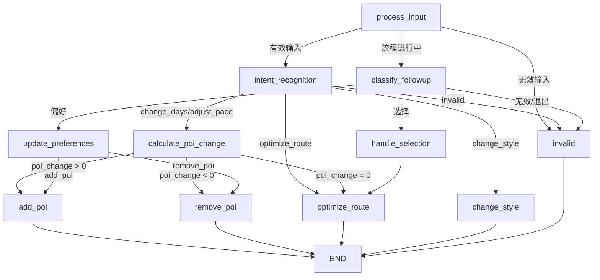
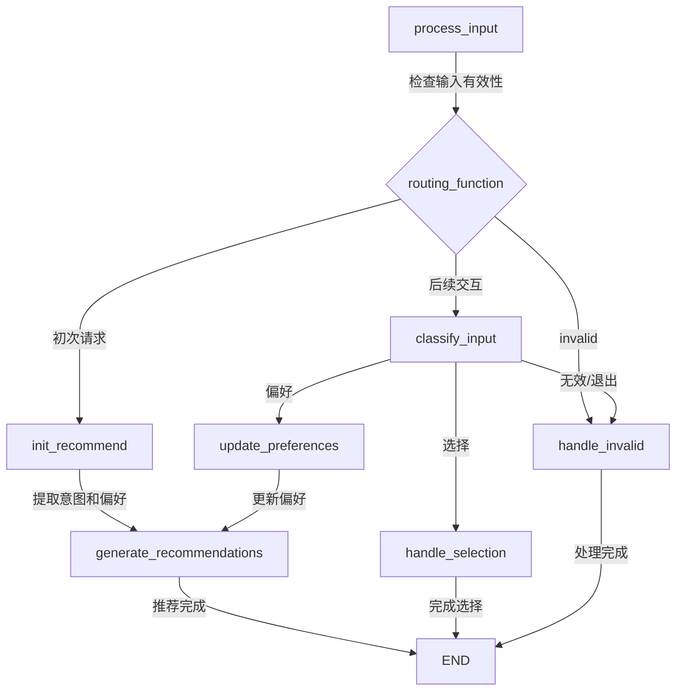

# 第3章 基于LLM的旅行规划系统设计

本系统的核心功能，在于基于用户已有的行程单，通过自然语言对话的方式理解用户的动态旅行需求，并自动生成个性化、合理且可执行的旅行行程。为实现此目标，系统设计应达成以下要求：
1.  支持安卓前端调用，能够接收从前端（如 `AIChatActivity`）传递的数据，包括用户消息、当前行程的完整信息（如行程ID、标题、地点、天数、已包含的景点/餐厅及其顺序和类型等）。
2.  能够解析和理解用户的自然语言输入，准确识别其意图，例如请求推荐、修改行程、查询信息等。
3.  集成大语言模型（LLM）作为核心处理单元，利用其强大的自然语言理解和生成能力。
4.  结合外部工具（如高德地图API）获取实时数据，确保规划的实用性和准确性。
5.  能够将处理和规划后的结果以结构化数据（如JSON）和自然语言结合的形式返回给前端，便于展示和后续操作。
6.  支持多轮对话，能够记忆对话上下文，进行连贯的交互式规划。

## 3.1 模型与方法选择

为了构建一个能够有效理解用户需求、进行规划并调用工具的智能代理（Agent），我们从大语言模型（LLM）、记忆（Memory）、规划技能（Planning Skills）和工具使用（Tool Use）四个关键方面进行了技术选型。

**大语言模型 (LLM)**：
LLM是这个智能体的大脑，其自然语言解析能力赋予了智能体进行计划、记忆以及调用外部工具的能力。考虑到系统主要服务于中文用户，对中文语境的理解至关重要。因此，本系统选择国产大模型 **千问Qwen** 系列。Qwen模型在中文理解方面表现出色，能够生成自然流畅的回复，并且具备良好的多轮对话记忆能力，非常适合构建交互式旅行规划助手。

**开发框架 (LangChain)**：
为了高效地开发和集成LLM应用，本系统采用 **LangChain** 作为主要的开发框架。LangChain提供了一套模块化的工具和抽象，极大地简化了与大模型的交互、记忆管理（如对话历史记录）、Prompt模板化、输出解析以及外部工具（如API、数据库）的接入和调用。这使得开发者可以更专注于业务逻辑的实现，而不是底层的技术细节。

**Agent构建与流程控制 (LangGraph)**：
在具体的Agent实现上，特别是在处理复杂交互和多步骤任务时，本系统选用 **LangGraph** 进行开发。LangGraph是LangChain的一个扩展库，它允许以图（Graph）的形式定义Agent的执行流程。相比于传统的链式（Chain）结构，LangGraph提供了更清晰、更灵活的任务路径定义和条件跳转支持。
主要优势包括：
1.  **可视化编排**：对话流程和任务逻辑更易于可视化和理解。
2.  **复杂流程控制**：非常适合旅行规划中涉及的多种功能组合，如推荐请求、信息查询、行程调整等。可以将每一类核心请求（如推荐景点、查询餐厅、调整出行顺序、修改交通方式）组织为图中的一个节点（Node）。
3.  **条件跳转**：可以根据用户对话状态、LLM的判断或工具的返回结果，灵活地在不同节点间跳转，实现更智能的交互逻辑。
4.  **状态管理**：LangGraph内置了对状态（State）的管理，便于在图的执行过程中传递和更新信息，如当前的行程数据、用户偏好、对话历史等。

### 3.1.1 Agent构建

使用LangGraph构建Agent的核心在于定义图的节点（Nodes）和边（Edges），以及管理整个图的状态（State）。
图的流程设计思路如下：
1.  **状态定义 (State)**：首先定义一个全局状态对象，该对象将贯穿整个图的执行过程。状态中应包含如用户当前消息、完整的行程数据（从安卓端传来）、对话历史、LLM处理后的中间结果（如识别出的意图和槽位）、工具调用结果等。
2.  **入口节点 (Entry Point)**：图的起点，通常负责接收用户输入和当前行程状态，并决定下一个处理节点。
3.  **功能节点 (Functional Nodes)**：将项目的核心AI功能（如餐厅推荐、景点推荐、行程修改、信息查询等）分别实现为独立的节点。每个节点接收当前状态，执行特定任务（可能包括调用LLM进行理解或生成、调用工具API等），并更新状态。
    *   例如，可以设计 `recommend_restaurant_node`、`recommend_poi_node`、`modify_itinerary_node`、`qa_node` 等。
    *   **子图思想**：对于一些复杂的功能，比如"行程优化"，其本身可能包含多个步骤（如分析现有行程、识别可优化点、生成优化方案、用户确认），可以考虑将其设计为一个子图（Subgraph），主图调用子图来完成特定任务。这样可以提高模块化程度和复用性。
4.  **条件边 (Conditional Edges)**：在节点之间定义条件跳转逻辑。例如，在LLM解析用户意图后，根据意图类型（如"推荐餐厅"或"修改行程"），图会跳转到相应的处理节点。如果需要调用工具，则会有一个节点负责准备工具输入并调用工具，然后根据工具返回结果决定下一个节点（如展示给用户或进一步处理）。
5.  **工具调用节点 (Tool Invocation Nodes)**：专门用于执行外部工具（如调用高德地图API获取POI信息，或调用数据库接口查询/更新行程数据）的节点。
6.  **响应生成节点 (Response Generation Node)**：负责整合LLM的生成内容、工具的查询结果等，形成最终的回复（包括自然语言文本和可能的结构化数据），并更新状态，准备返回给前端。
7.  **循环与结束**：支持多轮对话，图的执行可以回到等待用户输入的节点，或者在任务完成后结束。

通过这种方式，可以将复杂的旅行规划对话流程拆解为一系列可管理、可组合的节点和清晰的流转路径。

### 3.1.2 自然语言解析与意图理解

用户通过自然语言与系统交互，准确理解用户的意图并提取关键信息是系统有效运作的前提。这主要依赖于大语言模型（LLM）的理解能力和精心设计的提示工程（Prompt Engineering）。

**1. 基于Prompt的意图识别与槽位提取**：
当用户发送消息时（例如："帮我在故宫附近找家评分高的人均100元左右的川菜馆"），系统会将该消息连同必要的上下文信息（如当前正在规划的城市、已有的行程信息）一起通过Prompt传递给LLM（千问Qwen）。
Prompt的设计目标是引导LLM：
    *   **识别核心意图**：判断用户是想"推荐餐厅"、"推荐景点"、"修改行程"、"查询信息"还是其他。
    *   **提取关键槽位 (Slots)**：从用户输入中提取与意图相关的具体参数。例如，对于餐厅推荐，槽位可能包括菜系（川菜）、价格范围（人均100元左右）、评分要求（评分高）、特定地点（故宫附近）等。
    *   **输出JSON格式**：要求LLM将识别出的意图和提取出的槽位以结构化的JSON对象形式返回。这样做的好处是，后续的程序逻辑（如LangGraph中的条件边、工具调用节点）可以直接解析这个JSON对象，而无需再次进行复杂的文本处理。

    一个简化的Prompt示例可能如下：
    ```
    用户输入: "{user_message}"
    当前行程信息: "{itinerary_context}" // 例如，城市、日期等
    请识别用户的核心意图，并提取相关的参数。将结果以JSON格式返回，包含 "intent" 字段和 "parameters" 对象。
    可选的意图包括: "recommend_restaurant", "recommend_poi", "modify_itinerary_item", "general_qa".
    ```
    LLM的输出可能为：
    ```json
    {
      "intent": "recommend_restaurant",
      "parameters": {
        "cuisine": "川菜",
        "price_range": "100元左右",
        "rating_preference": "高",
        "location_context": "故宫附近"
      }
    }
    ```

**2. 解析用户提供的行程单的Prompt设计**：
在对话开始或用户明确提供行程信息时，系统需要能够解析用户以自然语言描述的或从前端结构化传递过来的行程单。
    *   **对于前端结构化数据**：如项目中的 `AIService.java` 所示，前端可以将行程ID、标题、天数、以及每日的景点/餐厅列表（包含名称、类型、顺序等）直接传递给后端。后端 `app.py` 的 `/chat` 接口接收这些 `itinerary_data`。这种情况下，主要任务是确保数据被正确解析并融入到LLM的上下文中，以便AI理解当前的规划基础。
    *   **对于用户自然语言描述的行程**：如果用户用文本描述"我第一天去天安门和故宫，第二天去颐和园"，也需要设计Prompt让LLM提取出结构化的行程信息（日期、顺序、地点名称、地点类型等），以便后续的精确规划和修改。

通过有效的Prompt设计，LLM能够充当一个强大的自然语言接口，将用户的模糊需求和多样化表达转化为机器可处理的结构化信息，为后续的规划和工具调用奠定基础。

## 3.2 系统整体架构

本系统基于LLM的旅行规划功能，其整体架构旨在实现高效的人机交互、智能的规划决策以及与外部服务的无缝集成。核心是采用LangGraph构建的对话任务图（Conversational Task Graph），辅以LLM的强大能力和外部API的实时数据。

**系统架构图示**：

```
+---------------------+     +----------------------+     +---------------------+
|   安卓前端          | --> |   后端Flask API      | --> |  LangGraph Agent    |
| (AIChatActivity)    |     | (app.py - /chat)     |     | (主要业务逻辑)      |
+---------------------+     +----------------------+     +----------+----------+
        ^                                                        |
        |  (JSON Response:                                       | (LLM, Memory, Tools)
        |   Text + Structured Data)                              |
        +--------------------------------------------------------+
                                                                 |
                                     +---------------------------+---------------------------+
                                     |                                                       |
                         +-----------v-----------+                               +-----------v-----------+
                         | LLM (千问Qwen)        |                               |  工具集 (Tools)       |
                         | - 意图识别            |                               |  - 高德地图API        |
                         | - 槽位提取            |                               |  - 数据库接口         |
                         | - 对话生成            |                               |  - (其他自定义工具)   |
                         | - 规划建议            |                               +-----------------------+
                         +-----------------------+

```

### 3.2.1 核心组件结构

在我们的实现中，系统架构分为以下几个关键组件：

#### 1. 全局状态管理

采用 TypedDict 类型的 `TripState` 类来表示系统的全局状态，包含以下关键信息：
- `user_input`：用户当前输入的文本
- `conversation_history`：对话历史记录
- `response`：当前系统响应
- `flow_state`：控制流状态，包含当前激活的子流程、流程进度状态、后续动作等
- `error`、`should_continue`、`completed`、`awaiting_selection` 等控制标志

这种设计允许各节点间高效地传递和更新状态，而不必重复计算或查询外部存储。状态对象在图执行过程中被传递并根据需要进行更新，确保了整个Agent的状态一致性。

#### 2. 应用上下文管理

`AppContext` 类作为单例模式实现，提供了对系统共享资源的集中管理：
- LLM 实例：已配置好的千问Qwen模型接口
- 上下文管理器：存储和管理行程数据、用户偏好、城市信息等
- 工具集合：封装的各种外部API和功能函数

这种设计允许系统中的任何组件快速访问这些共享资源，而不必担心资源重复创建或状态不一致的问题。

#### 3. 主图与路由机制

核心是 `main_graph.py` 中定义的主图结构，它实现了基于用户意图的路由机制：
- **入口节点**：所有请求首先进入路由节点
- **路由节点**：使用LLM分析用户意图，将请求路由到相应的子图
- **子图节点**：包括景点替换、餐厅替换、行程整体调整等专门处理特定任务的子图
- **条件边**：根据用户意图、处理状态等动态决定执行路径

路由功能通过 `route_to_subgraph` 和 `routing_function` 函数实现，它们分析用户输入，判断用户想要执行的操作（如查看行程、替换景点、替换餐厅等），并将请求路由到相应的子图进行处理。

当主图无法处理某些请求时（如一般性问题），系统会使用LLM直接生成回复，避免不必要的复杂处理路径。

### 3.2.2 子图设计与实现

系统的核心功能通过一系列专门的子图来实现，每个子图专注于解决特定类型的用户需求：

#### 1. 餐厅推荐子图 (restaurant.py)

餐厅推荐子图专门处理用户替换或添加餐厅的需求，其设计如下：


主要节点功能：
- **process_input**: 处理初始用户输入，确认是否有效
- **init_recommend**: 分析用户需求，提取用户想要替换的餐厅信息和偏好
- **classify_input**: 分类用户的后续输入（如选择推荐、提供新偏好、退出流程）
- **generate_recommendations**: 调用高德API获取餐厅数据并生成推荐列表
- **handle_selection**: 处理用户选择特定餐厅的操作
- **update_preferences**: 根据用户新提供的偏好更新推荐参数
- **handle_invalid**: 处理无效或不相关的用户输入

这个子图支持多轮交互，允许用户通过自然对话逐步精确化自己的餐厅需求，比如先表达想找一家中餐厅，然后进一步说明想要价格适中的川菜。

#### 2. 景点替换子图 (attraction.py)

景点替换子图与餐厅推荐子图结构类似，但专注于处理景点更换需求：

主要功能：
- 分析用户想要替换的景点（如"第二天的故宫"）
- 理解用户的偏好要求（如"想换一个历史类的景点"）
- 调用高德API获取周边景点数据
- 生成个性化的景点推荐列表
- 处理用户选择，更新行程中的景点信息

#### 3. 行程整体调整子图 (schedule_adjustment.py)

这是一个更复杂的子图，负责处理对整个行程的结构性调整：

主要功能：
- 分析调整类型（如延长行程、缩短行程、调整行程密度、变更主题风格）
- 理解用户的具体调整需求（如"将3天行程缩短为2天"）
- 分析现有行程结构和景点重要性
- 生成优化方案（如合并、删除、重新安排景点）
- 提供调整后的行程预览
- 处理用户确认或修改请求

这个子图实现了复杂的行程规划算法，能够考虑景点间的距离、游览时间、主题相关性等因素，生成最优的行程结构。

### 3.2.3 上下文管理机制

系统通过 `TripContextManager` 类实现了强大的上下文管理机制，确保对话过程中信息的连贯性和一致性：

核心功能：
- **行程数据管理**：存储和更新当前行程的详细信息
- **用户偏好跟踪**：记录用户在对话中表达的各种偏好
- **目标POI管理**：跟踪用户当前想要替换或添加的景点/餐厅
- **推荐列表管理**：存储系统生成的推荐列表，支持后续引用
- **对话历史维护**：保存多轮对话历史，为LLM提供上下文
- **城市和地理信息**：维护当前规划的城市和相关地理信息

上下文管理器支持子流程状态的隔离，每个专门的子流程（如景点替换、餐厅替换）都有自己的状态对象，避免了不同功能之间的状态混淆。

## 3.3 与外部系统的集成

### 3.3.1 安卓前端集成

系统通过 Flask API 与安卓前端进行无缝集成：

1. **数据接收**：
   - 通过 `/chat` 接口接收前端发送的用户消息和行程数据
   - 行程数据包含完整的行程结构，如行程ID、标题、天数、景点列表等

2. **数据返回**：
   - 返回包含两部分的JSON响应：
     - 文本响应（如"我为您找到了几家不错的餐厅..."）
     - 结构化数据（如包含推荐餐厅详情的JSON对象）
   - 前端根据返回的 `data_type` 字段（如 "restaurant_recommendations"）决定如何渲染结果

3. **用户交互处理**：
   - 前端将用户选择（如点击了某个推荐餐厅的"添加"按钮）通过API发送回后端
   - 后端处理选择并返回成功/失败状态

这种集成方式使得前端可以专注于UI渲染和用户交互，而将复杂的AI逻辑和规划算法交给后端处理。

### 3.3.2 高德地图API集成

系统与高德地图API深度集成，获取高质量的POI数据：

1. **POI搜索**：
   - 根据用户偏好和当前行程位置，搜索周边景点和餐厅
   - 支持关键词搜索、周边搜索、多边形区域搜索等

2. **POI详情获取**：
   - 获取景点/餐厅的详细信息，如营业时间、评分、价格水平、标签等
   - 使用这些数据为用户提供更精准的推荐

3. **路线规划**：
   - 计算景点间的行走/驾车时间
   - 优化每日行程路线，减少不必要的来回奔波

通过高德地图API的集成，系统能够基于真实、最新的地理和POI数据进行推荐和规划，大大提高了行程的实用性和准确性。

## 3.4 LLM与规划算法集成

在这个架构中，LLM并不仅仅是用于聊天。它深度参与到规划过程中：
*   **需求理解**：LLM将用户的自然语言需求转化为结构化的规划任务。
*   **初步方案生成**：对于一些规划任务（如"帮我安排一下明天的行程"），LLM可以根据上下文信息生成一个初步的行程框架或建议序列。
*   **工具参数生成**：LLM可以帮助决定调用哪些工具以及如何设置工具的参数。
*   **结果评估与解释**：LLM可以评估工具返回结果的适用性，并用自然语言向用户解释推荐的理由或规划的逻辑。
*   **迭代优化**：在多轮对话中，LLM根据用户的反馈不断调整和优化规划方案。

而更偏向确定性计算或需要实时外部数据的部分（如精确的POI搜索、距离计算、数据库操作）则由专门的工具和算法完成。LangGraph负责协调LLM和这些工具的协作，使得整个系统既有LLM的灵活性和智能性，又有传统算法和API的精确性和可靠性。

通过这样的设计，系统能够以一种灵活、可扩展的方式处理复杂的旅行规划任务，为用户提供真正个性化和智能的旅行助手服务。

## 3.5 基于LangGraph的Agent子流程设计

本系统使用LangGraph框架构建了多个专业子流程，用于处理不同类型的旅行规划需求。每个子流程都被组织为独立的图结构，具有明确的节点定义、状态管理和条件流转逻辑。以下详细介绍各个子流程的设计与实现。

### 3.5.1 行程整体调整子流程

行程整体调整子流程专门处理用户对现有行程的总体修改需求，例如改变行程天数、调整每日景点数量、优化路线规划等。

#### 3.5.1.1 流程图设计



#### 3.5.1.2 支持的需求类型

1. **天数变更 (change_days)**
   - 延长行程：将现有行程扩展至更多天（如"把行程延长到5天"）
   - 缩短行程：压缩现有行程至较少的天数（如"把4天行程缩短为3天"）

2. **行程节奏调整 (adjust_pace)**
   - 增加密度：每天添加更多景点（如"增加每天的景点数量"）
   - 减少密度：每天减少景点数量，行程更轻松（如"每天安排少一点景点"）
   - 调整限制：设置每日景点上限（如"每天不超过3个景点"）

3. **风格调整 (change_style)**
   - 主题偏好更改：从一种风格切换到另一种（如"从历史景点改为更多自然景点"）
   - 删除特定类型：移除某类景点（如"移除所有博物馆"）

4. **路线优化 (optimize_route)**
   - 地理优化：减少无效移动，优化同一天内景点的游览顺序
   - 景点重组：根据位置关系重新分配每天的景点安排

#### 3.5.1.3 算法实现细节

1. **意图识别模块**
   
   通过`extract_intent_from_user_input`函数，使用LLM将用户自然语言请求转换为结构化的调整指令：
   ```
   {
     "adjust_type": "change_days/adjust_pace/change_style/optimize_route", 
     "target_days": 数值/null,
     "daily_limit": 数值,      
     "style_replace": {"旧标签": ["新标签1", "新标签2"]},
     "prefer_tags": ["标签1", "标签2"]
   }
   ```

2. **POI变化计算**
   
   `calculate_poi_change`函数计算现有景点与目标景点数量的差值：
   - 计算公式：`expected_total = target_days * max_per_day - len(existing_pois)`
   - 正值表示需要添加景点
   - 负值表示需要删除景点
   - 零值表示仅需优化不需增减

3. **POI推荐与选择**
   
   - **添加景点**：使用`search_pois_by_center`搜索周边景点，然后通过`rank_pois_by_utility`计算效用评分排序
   - **删除景点**：对现有景点进行效用评分排序，建议删除评分最低的景点
   - 效用评分计算考虑三个维度：
     - 用户偏好匹配度：景点与用户偏好标签的匹配程度
     - 位置兼容性：景点与现有行程其他景点的地理兼容性
     - 景点评分：景点本身的评价评分

4. **路线优化算法**
   
   路线优化采用两步处理：
   - **聚类分配**：使用K-Means聚类算法（`cluster_pois_kmeans`）根据地理位置将景点分配到不同天
   - **单日路线优化**：使用近似TSP（旅行商问题）解法（`optimize_daily_route`）优化每天内的景点访问顺序

   优化目标是最小化总移动距离的同时，保证地理上相近的景点安排在同一天游览。

### 3.5.2 餐厅推荐子流程

餐厅推荐子流程专门处理用户对于餐厅的替换或添加需求，基于用户对餐厅的特定偏好和当前行程的地理位置进行个性化推荐。

#### 3.5.2.1 流程图设计



#### 3.5.2.2 支持的需求类型

1. **餐厅替换需求**
   - 特定餐厅替换：替换行程中已有的特定餐厅（如"帮我换掉第二天的四季民福"）
   - 特定餐饮时段替换：替换特定天特定时段的餐厅（如"帮我换掉第三天的午餐"）

2. **餐厅偏好定制**
   - **预算偏好**：指定餐厅预算区间（如"人均100-200元"、"经济实惠的"）
   - **菜系偏好**：指定餐厅菜系类型（如"川菜"、"西餐"、"日料"）
   - **特殊需求**：指定特殊饮食或环境需求（如"有包厢的"、"适合家庭聚餐的"）
   - **评分偏好**：指定餐厅评分维度（如"服务好的"、"口味佳的"、"好评多的"）

3. **多轮交互细化**
   - 初步推荐后进一步补充偏好（如"再便宜一点的"、"有没有川菜"）
   - 对推荐结果进行选择（如"我选第一个"）
   - 退出当前推荐流程（如"算了，我们自己找地方吃"）

#### 3.5.2.3 算法实现细节

1. **用户意图提取**
   
   `extract_res_intent`函数从用户输入中提取两类关键信息：
   - **目标餐厅信息**：包括要替换的餐厅名称、位置、前后景点等
   - **用户偏好分析**：包括预算区间、菜系偏好、特殊要求和评分偏好

   ```json
   {
     "target_restaurant": {
       "res_info": { "name": "四季民福", "coordinates": [...] },
       "prev_poi": { "name": "故宫", "coordinates": [...] },
       "next_poi": { "name": "天安门", "coordinates": [...] },
       "day_info": { "day": 2, "order": 3 }
     },
     "preference_analysis": {
       "budget": [100, 200],
       "cuisine_preference": "川菜",
       "special_requirement": "有包厢",
       "rating": "taste_rating"
     }
   }
   ```

2. **地理位置优化搜索**
   
   系统通过`calculate_center_and_radius`计算前后景点的中心点和合理搜索半径：
   - 使用球面几何学计算准确的中点坐标
   - 基于Haversine公式计算两点间的实际距离
   - 将距离的一半作为搜索半径，确保找到的餐厅在合理的地理范围内

3. **多维度餐厅推荐**
   
   `search_restaurants_baidu`和`rerocommend_byllm`函数结合实现多维度推荐：
   - 首先使用百度地图API获取符合基本条件的候选餐厅列表
   - 然后使用LLM基于用户偏好对候选列表进行进一步筛选和排序
   - 为每个推荐结果生成个性化的推荐理由

4. **多轮交互与偏好累积**
   
   系统支持通过多轮对话持续优化推荐结果：
   - `classify_followup_input`函数分析用户后续输入的意图
   - `update_preferences`函数累积新增的偏好信息与已有偏好
   - `handle_selection`函数处理用户的最终选择并更新行程

### 3.5.3 核心算法技术细节

本节深入分析系统中使用的几个核心算法的技术细节：

1. **效用评分计算 (Utility Scoring)**
   
   `calculate_utility_score`函数综合考虑多个维度为每个POI计算效用评分：
   
   ```python
   utility_score = (
       weights[0] * preference_match + 
       weights[1] * location_compatibility + 
       weights[2] * rating_score
   )
   ```
   
   其中：
   - `preference_match`：通过LLM或关键词匹配计算POI与用户偏好的匹配程度
   - `location_compatibility`：计算POI与其他POI的地理兼容性，通过归一化的距离指标
   - `rating_score`：POI本身的评分归一化值
   - `weights`：三个因素的权重参数，默认为[0.5, 0.3, 0.2]

2. **K-Means地理聚类算法**
   
   `cluster_pois_kmeans`函数利用K-Means聚类算法将景点按地理位置分组：
   
   - 将每个POI的经纬度坐标作为二维特征
   - 使用K=行程天数作为聚类数量
   - 对聚类结果进行后处理，确保每天的景点数量不超过限制
   - 当某个聚类的POI数量超过限制时，将多余的POI重新分配到POI较少的聚类中

3. **近似TSP路径优化**
   
   `optimize_daily_route`函数使用贪心算法解决单日内的TSP问题：
   
   - 构建完整的景点间距离矩阵（使用高德API获取真实路径距离）
   - 从第一个POI开始，每次选择距离当前点最近的未访问点
   - 生成近似最优的游览顺序
   - 这种方法虽然不保证全局最优解，但计算效率高且结果通常接近最优

4. **LLM驱动的决策引导**
   
   系统在多个环节使用LLM增强决策质量：
   
   - **意图理解**：将自然语言请求转换为结构化操作指令
   - **个性化推荐**：基于用户偏好生成推荐并提供理由
   - **选择解析**：将用户自然语言选择（如"我要第一个和第三个"）解析为明确的索引列表
   - **文本解释**：为算法决策（如"为什么删除这个景点"）生成自然语言解释

这些算法共同构成了一个智能、灵活且用户友好的旅行规划系统，能够处理复杂的行程调整需求，同时保持地理和时间上的合理性。

### 3.5.4 子流程交互与协同

系统使用主控图（Main Graph）协调各个专业子流程的协同工作，实现无缝的多功能集成：

1. **状态共享机制**
   
   - 所有子流程共享统一的`TripState`类型，确保信息一致性
   - `AppContext`单例提供全局资源访问，如LLM实例和上下文管理
   - 子流程间通过状态传递实现信息共享，避免重复计算

2. **智能路由分发**
   
   主图中的路由功能基于用户意图将请求分发到适当的子流程：
   - 分析用户输入，判断应激活哪个子流程
   - 考虑上下文状态，如当前是否有进行中的推荐流程
   - 处理边界情况，如无法理解的请求或退出操作

3. **子流程互补协作**
   
   子流程设计为功能互补的专业模块：
   - 餐厅推荐子流程专注于餐饮体验优化
   - 景点替换子流程关注景点内容调整
   - 行程调整子流程处理整体行程结构变更
   
   这种设计既保证了每个子流程的专业性，又实现了整体系统的功能完备性。

通过这种模块化、状态共享和智能路由的设计，系统能够灵活应对各类旅行规划需求，提供连贯、智能的用户体验。 