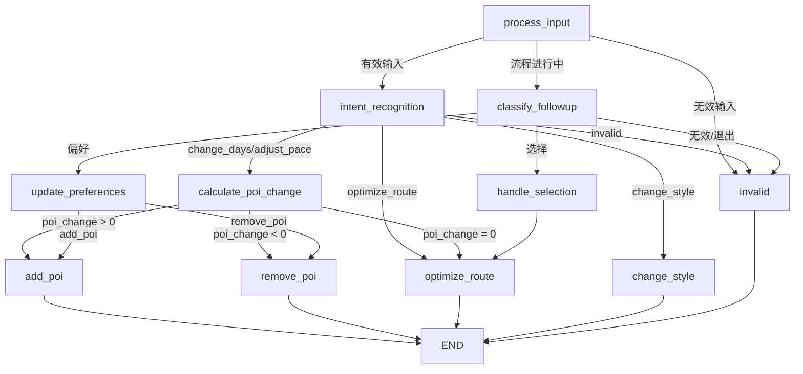
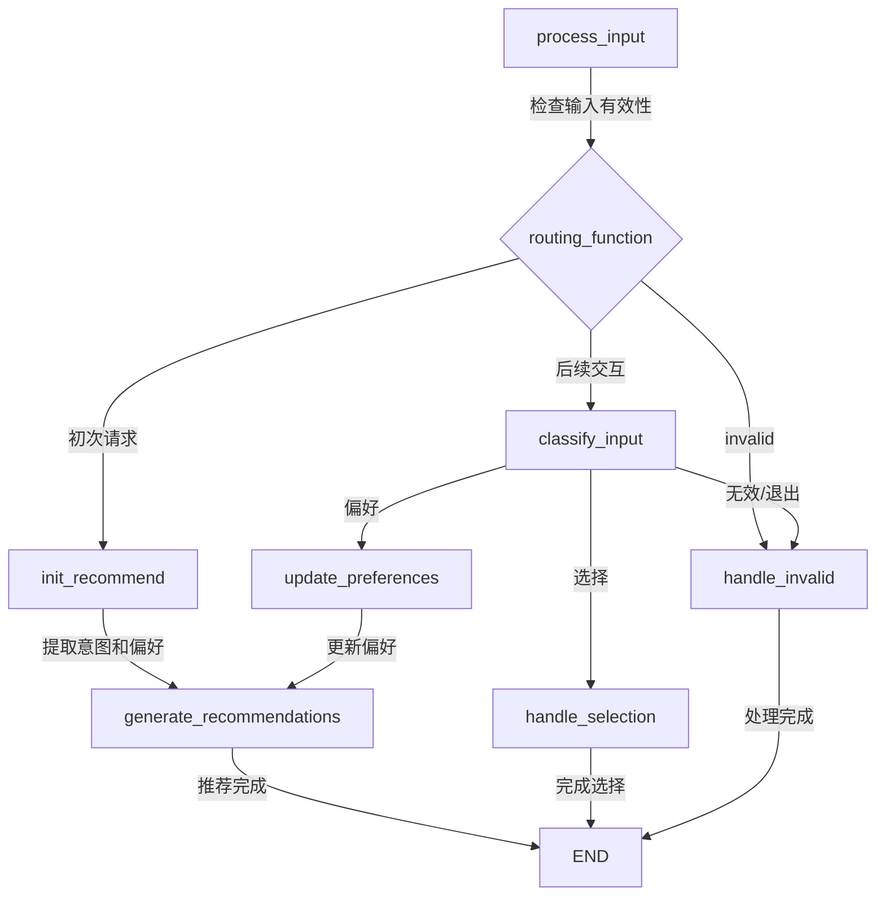
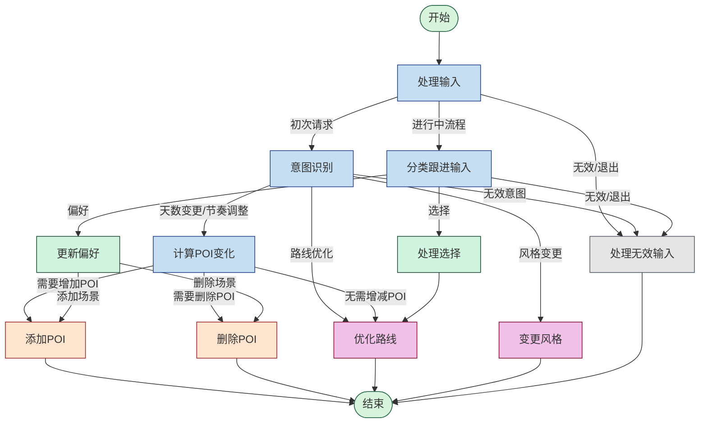
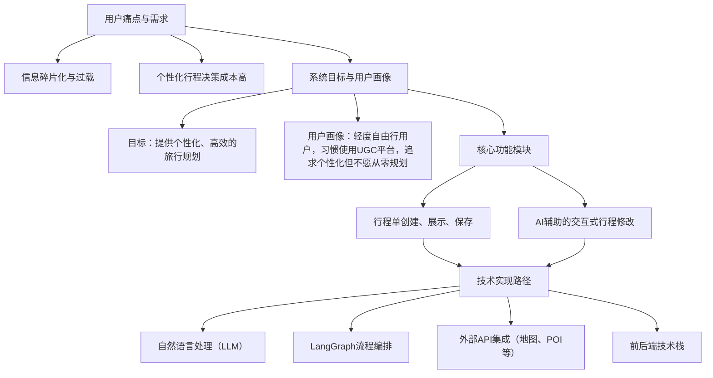
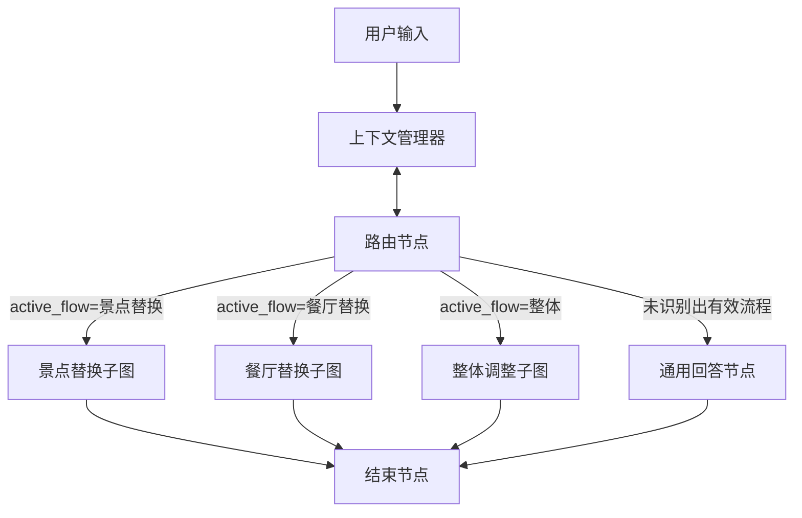
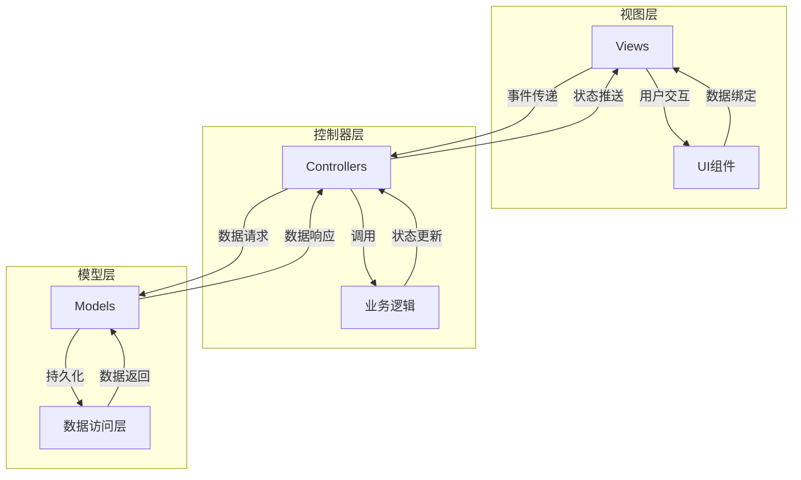
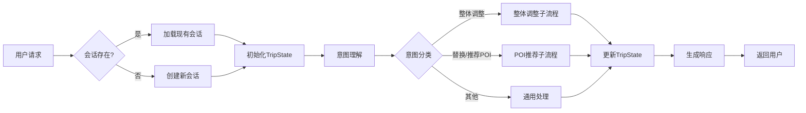
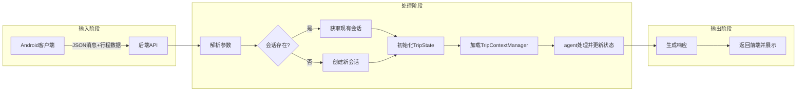

# AI聊天功能调用流程文档

## 1. 功能概述

AI聊天功能是本应用的核心特色，允许用户通过自然语言与AI助手交互，获取行程规划建议、景点和餐厅推荐等。整个功能由前端的`AIChatActivity`和后端的Flask服务共同实现，通过REST API进行通信。

## 2. 数据流程图

```
用户输入 → AIChatActivity → AIService.getAIResponse() → 后端API(/chat) → 处理回复
    ↓                                                          ↓
显示聊天记录 ← 更新UI ← 解析响应 ← 接收JSON响应 ← AI生成回复
    ↓
处理结构化数据(如推荐) ← 检测data_type → 显示推荐卡片 → 用户选择 → 更新行程
```

## 3. 前端实现 (Android)

### 3.1 主要组件

- **AIChatActivity.java**: 聊天界面UI和交互逻辑
- **AIService.java**: 与后端API通信的服务类
- **RestaurantRecommendService.java**: 处理餐厅推荐的专用服务

### 3.2 关键方法

#### 3.2.1 消息发送流程

1. **发送用户消息**:

```java
private void sendMessage(final String message) {
    addMessage(message, true);  // 添加用户消息到UI
    messageInput.setText("");   // 清空输入框
    
    // 在后台线程执行网络请求
    executorService.execute(() -> {
        try {
            // 隐藏之前的推荐
            mainHandler.post(() -> {
                recommendationsRecyclerView.setVisibility(View.GONE);
                // 清除当前适配器的数据
                if (recommendationsAdapter != null) {
                    recommendationsAdapter.updateRecommendations(new ArrayList<>());
                }
                // 显示处理中提示
                Toast.makeText(AIChatActivity.this, "正在处理您的请求...", Toast.LENGTH_SHORT).show();
            });

            // 调用AI服务获取响应
            AIService.AIResponseData responseData = aiService.getAIResponse(message, itineraryId, dbHelper);
            
            // 在主线程更新UI
            mainHandler.post(() -> {
                // 添加AI文本响应
                addMessage(responseData.getCleanText(), false);
                
                // 处理结构化数据
                if (responseData.hasStructuredData()) {
                    processStructuredData(responseData);
                }
            });
        } catch (Exception e) {
            // 错误处理
            mainHandler.post(() -> {
                Log.e(TAG, "发生错误", e);
                Toast.makeText(AIChatActivity.this, "错误: " + e.getMessage(), Toast.LENGTH_LONG).show();
                addMessage("抱歉，发生错误: " + e.getMessage(), false);
            });
        }
    });
}
```

2. **AIService.getAIResponse 方法**:

```java
public AIResponseData getAIResponse(String message, long itineraryId, DatabaseHelper dbHelper) throws Exception {
    // 获取行程数据
    Itinerary itinerary = dbHelper.getItineraryById(itineraryId);
    ArrayList<ItineraryAttraction> attractions = dbHelper.getItineraryAttractions(itineraryId);
    
    // 构建请求体
    JSONObject requestBody = new JSONObject();
    requestBody.put("message", message);
    
    // 添加行程信息到请求
    JSONObject itineraryData = new JSONObject();
    itineraryData.put("itinerary_id", itineraryId);
    itineraryData.put("title", itinerary.getTittle());
    itineraryData.put("location", itinerary.getLocation());
    itineraryData.put("days", itinerary.getDays());
    
    // 添加行程中的景点信息
    JSONArray attractionsArray = new JSONArray();
    for (ItineraryAttraction attraction : attractions) {
        JSONObject attractionObj = new JSONObject();
        // 设置景点信息...
        attractionsArray.put(attractionObj);
    }
    
    itineraryData.put("attractions", attractionsArray);
    requestBody.put("itinerary_data", itineraryData);
    
    // 发送请求并获取响应
    String response = sendRequest(requestBody);
    
    // 处理响应
    AIResponseData responseData = processAIResponse(response);
    return responseData;
}
```

#### 3.2.2 结构化数据处理

```java
private void processStructuredData(AIService.AIResponseData responseData) {
    try {
        String dataType = responseData.getDataType();
        JSONObject structuredData = responseData.getStructuredData();
        
        if ("restaurant_recommendations".equals(dataType)) {
            handleRestaurantRecommendations(structuredData);
        } else if ("poi_recommendations".equals(dataType)) {
            handlePOIRecommendations(structuredData);
        } else if ("itinerary_update".equals(dataType)) {
            handleItineraryUpdate(structuredData);
        }
    } catch (Exception e) {
        Log.e(TAG, "处理结构化数据失败", e);
    }
}
```

## 4. 后端实现 (Flask)

### 4.1 API端点

#### 4.1.1 `/chat` API

```python
@app.route('/chat', methods=['POST'])
def chat():
    try:
        data = request.get_json()
        message = data.get('message')
        itinerary_data = data.get('itinerary_data')
        
        # 调用AI处理函数
        response = process_message(message, itinerary_data)
        
        # 检查response是否是字典类型（结构化响应）
        if isinstance(response, dict):
            return jsonify({
                'success': True,
                'response': response.get('message', '处理完成'),
                'data': response.get('data'),
                'data_type': response.get('data_type')
            })
        else:
            # 处理字符串响应
            return jsonify({
                'success': True,
                'response': response,
                'data': None,
                'data_type': None
            })
            
    except Exception as e:
        logger.error(f"处理请求时出错: {str(e)}", exc_info=True)
        return jsonify({'error': str(e)}), 500
```

### 4.2 响应格式

#### 4.2.1 普通文本响应

```json
{
  "success": true,
  "response": "这是AI的文本回复",
  "data": null,
  "data_type": null
}
```

#### 4.2.2 结构化响应（餐厅推荐示例）

```json
{
  "success": true,
  "response": "我为您找到了几家不错的餐厅，您可以选择其中一家添加到行程中。",
  "data": {
    "day_info": {
      "day": 2,
      "order": 1
    },
    "recommendations": [
      {
        "uid": "d6960855f9573e9d744ff15b",
        "name": "示例餐厅",
        "label": "美食;快餐店",
        "latitude": 30.548506,
        "longitude": 114.364165,
        "address": "示例地址",
        "telephone": "(027)12345678",
        "overall_rating": "4.5",
        "reason": "这家餐厅靠近您的下一个景点，评分很高"
      }
    ]
  },
  "data_type": "restaurant_recommendations"
}
```

## 5. 推荐数据格式

### 5.1 数据类型

系统支持的结构化数据类型包括：

- **restaurant_recommendations**: 餐厅推荐
- **poi_recommendations**: 景点推荐
- **itinerary_update**: 行程更新建议

### 5.2 数据结构

每种类型的数据结构如下：

#### 5.2.1 餐厅推荐

```json
{
  "data_type": "restaurant_recommendations",
  "day_info": {
    "day": 1,
    "order": 2
  },
  "recommendations": [
    {
      "uid": "餐厅ID",
      "name": "餐厅名称",
      "label": "餐厅类型",
      "latitude": 纬度,
      "longitude": 经度,
      "address": "地址",
      "telephone": "电话",
      "overall_rating": "评分",
      "reason": "推荐理由"
    }
  ]
}
```

#### 5.2.2 景点推荐

```json
{
  "data_type": "poi_recommendations",
  "day_info": {
    "day": 1,
    "order": 3
  },
  "recommendations": [
    {
      "uid": "景点ID",
      "name": "景点名称",
      "label": "景点类型",
      "latitude": 纬度,
      "longitude": 经度,
      "address": "地址",
      "overall_rating": "评分",
      "reason": "推荐理由"
    }
  ]
}
```

## 6. 使用示例

### 6.1 用户对话示例

- 用户: "帮我找一家今天晚餐的餐厅"
- AI: "好的，根据您的行程和位置，我为您推荐以下几家餐厅..." (同时显示餐厅推荐卡片)
- 用户: (点击其中一家餐厅的"选择"按钮)
- AI: "已将[餐厅名称]添加到您的行程中"

### 6.2 代码调用示例

```java
// 在AIChatActivity中
// 1. 用户点击发送按钮
sendButton.setOnClickListener(v -> {
    String message = messageInput.getText().toString().trim();
    if (!message.isEmpty()) {
        sendMessage(message);
    }
});

// 2. 用户选择推荐的餐厅
@Override
public void onSelectClick(RecommendedRestaurant restaurant) {
    selectRestaurant(restaurant);
}

private void selectRestaurant(RecommendedRestaurant restaurant) {
    try {
        // 构建JSON数据
        JSONObject confirmData = new JSONObject();
        confirmData.put("itinerary_id", itineraryId);
        
        // 从AI响应中获取day_info
        JSONObject dayInfo = structuredData.getJSONObject("day_info");
        confirmData.put("day_info", dayInfo);
        
        // 添加餐厅信息
        confirmData.put("restaurant", restaurant.toJson());
        
        // 调用服务确认选择
        boolean success = restaurantRecommendService.confirmRestaurantSelection(confirmData, this);
        
        if (success) {
            // 处理成功
            recommendationsRecyclerView.setVisibility(View.GONE);
            addMessage("已将 " + restaurant.getName() + " 添加到您的行程中。", false);
            hasUnsavedChanges = true;
            loadItineraryData();  // 刷新行程显示
        } else {
            // 处理失败
            addMessage("添加餐厅失败，请重试。", false);
        }
    } catch (Exception e) {
        Log.e(TAG, "选择餐厅时出错", e);
        addMessage("发生错误: " + e.getMessage(), false);
    }
}
```

## 7. 注意事项与常见问题

1. **网络延迟处理**：确保添加适当的加载指示器和错误处理
2. **API版本兼容**：根据API版本的不同，可能需要额外的兼容逻辑
3. **UI状态管理**：确保在获取新推荐时清除旧推荐的UI显示
4. **错误恢复**：当AI服务暂时不可用时，提供友好的提示信息
5. **数据持久化**：用户与AI的对话历史目前不会持久化存储，这可能是未来的改进点 

# 第3章 基于LLM的旅行规划系统设计

本系统的核心功能，在于基于用户已有的行程单，通过自然语言对话的方式理解用户的动态旅行需求，并自动生成个性化、合理且可执行的旅行行程。为实现此目标，系统设计应达成以下要求：

1.  支持安卓前端调用，能够接收从前端（如 `AIChatActivity`）传递的数据，包括用户消息、当前行程的完整信息（如行程ID、标题、地点、天数、已包含的景点/餐厅及其顺序和类型等）。
2.  能够解析和理解用户的自然语言输入，准确识别其意图，例如请求推荐、修改行程、查询信息等。
3.  集成大语言模型（LLM）作为核心处理单元，利用其强大的自然语言理解和生成能力。
4.  结合外部工具（如高德地图API）获取实时数据，确保规划的实用性和准确性。
5.  能够将处理和规划后的结果以结构化数据（如JSON）和自然语言结合的形式返回给前端，便于展示和后续操作。
6.  支持多轮对话，能够记忆对话上下文，进行连贯的交互式规划。

## 3.1 模型与方法选择

为了构建一个能够有效理解用户需求、进行规划并调用工具的智能代理（Agent），我们从大语言模型（LLM）、记忆（Memory）、规划技能（Planning Skills）和工具使用（Tool Use）四个关键方面进行了技术选型。

**大语言模型 (LLM)**：
LLM是这个智能体的大脑，其自然语言解析能力赋予了智能体进行计划、记忆以及调用外部工具的能力。考虑到系统主要服务于中文用户，对中文语境的理解至关重要。因此，本系统选择国产大模型 **千问Qwen** 系列。Qwen模型在中文理解方面表现出色，能够生成自然流畅的回复，并且具备良好的多轮对话记忆能力，非常适合构建交互式旅行规划助手。

**开发框架 (LangChain)**：
为了高效地开发和集成LLM应用，本系统采用 **LangChain** 作为主要的开发框架。LangChain提供了一套模块化的工具和抽象，极大地简化了与大模型的交互、记忆管理（如对话历史记录）、Prompt模板化、输出解析以及外部工具（如API、数据库）的接入和调用。这使得开发者可以更专注于业务逻辑的实现，而不是底层的技术细节。

**Agent构建与流程控制 (LangGraph)**：
在具体的Agent实现上，特别是在处理复杂交互和多步骤任务时，本系统选用 **LangGraph** 进行开发。LangGraph是LangChain的一个扩展库，它允许以图（Graph）的形式定义Agent的执行流程。相比于传统的链式（Chain）结构，LangGraph提供了更清晰、更灵活的任务路径定义和条件跳转支持。
主要优势包括：

1.  **可视化编排**：对话流程和任务逻辑更易于可视化和理解。
2.  **复杂流程控制**：非常适合旅行规划中涉及的多种功能组合，如推荐请求、信息查询、行程调整等。可以将每一类核心请求（如推荐景点、查询餐厅、调整出行顺序、修改交通方式）组织为图中的一个节点（Node）。
3.  **条件跳转**：可以根据用户对话状态、LLM的判断或工具的返回结果，灵活地在不同节点间跳转，实现更智能的交互逻辑。
4.  **状态管理**：LangGraph内置了对状态（State）的管理，便于在图的执行过程中传递和更新信息，如当前的行程数据、用户偏好、对话历史等。

### 3.1.1 Agent构建

使用LangGraph构建Agent的核心在于定义图的节点（Nodes）和边（Edges），以及管理整个图的状态（State）。
图的流程设计思路如下：

1.  **状态定义 (State)**：首先定义一个全局状态对象，该对象将贯穿整个图的执行过程。状态中应包含如用户当前消息、完整的行程数据（从安卓端传来）、对话历史、LLM处理后的中间结果（如识别出的意图和槽位）、工具调用结果等。
2.  **入口节点 (Entry Point)**：图的起点，通常负责接收用户输入和当前行程状态，并决定下一个处理节点。
3.  **功能节点 (Functional Nodes)**：将项目的核心AI功能（如餐厅推荐、景点推荐、行程修改、信息查询等）分别实现为独立的节点。每个节点接收当前状态，执行特定任务（可能包括调用LLM进行理解或生成、调用工具API等），并更新状态。
    *   例如，可以设计 `recommend_restaurant_node`、`recommend_poi_node`、`modify_itinerary_node`、`qa_node` 等。
    *   **子图思想**：对于一些复杂的功能，比如"行程优化"，其本身可能包含多个步骤（如分析现有行程、识别可优化点、生成优化方案、用户确认），可以考虑将其设计为一个子图（Subgraph），主图调用子图来完成特定任务。这样可以提高模块化程度和复用性。
4.  **条件边 (Conditional Edges)**：在节点之间定义条件跳转逻辑。例如，在LLM解析用户意图后，根据意图类型（如"推荐餐厅"或"修改行程"），图会跳转到相应的处理节点。如果需要调用工具，则会有一个节点负责准备工具输入并调用工具，然后根据工具返回结果决定下一个节点（如展示给用户或进一步处理）。
5.  **工具调用节点 (Tool Invocation Nodes)**：专门用于执行外部工具（如调用高德地图API获取POI信息，或调用数据库接口查询/更新行程数据）的节点。
6.  **响应生成节点 (Response Generation Node)**：负责整合LLM的生成内容、工具的查询结果等，形成最终的回复（包括自然语言文本和可能的结构化数据），并更新状态，准备返回给前端。
7.  **循环与结束**：支持多轮对话，图的执行可以回到等待用户输入的节点，或者在任务完成后结束。

通过这种方式，可以将复杂的旅行规划对话流程拆解为一系列可管理、可组合的节点和清晰的流转路径。

### 3.1.2 自然语言解析与意图理解

用户通过自然语言与系统交互，准确理解用户的意图并提取关键信息是系统有效运作的前提。这主要依赖于大语言模型（LLM）的理解能力和精心设计的提示工程（Prompt Engineering）。

**1. 基于Prompt的意图识别与槽位提取**：
当用户发送消息时（例如："帮我在故宫附近找家评分高的人均100元左右的川菜馆"），系统会将该消息连同必要的上下文信息（如当前正在规划的城市、已有的行程信息）一起通过Prompt传递给LLM（千问Qwen）。
Prompt的设计目标是引导LLM：
    *   **识别核心意图**：判断用户是想"推荐餐厅"、"推荐景点"、"修改行程"、"查询信息"还是其他。
    *   **提取关键槽位 (Slots)**：从用户输入中提取与意图相关的具体参数。例如，对于餐厅推荐，槽位可能包括菜系（川菜）、价格范围（人均100元左右）、评分要求（评分高）、特定地点（故宫附近）等。
    *   **输出JSON格式**：要求LLM将识别出的意图和提取出的槽位以结构化的JSON对象形式返回。这样做的好处是，后续的程序逻辑（如LangGraph中的条件边、工具调用节点）可以直接解析这个JSON对象，而无需再次进行复杂的文本处理。

    一个简化的Prompt示例可能如下：
    ```
    用户输入: "{user_message}"
    当前行程信息: "{itinerary_context}" // 例如，城市、日期等
    请识别用户的核心意图，并提取相关的参数。将结果以JSON格式返回，包含 "intent" 字段和 "parameters" 对象。
    可选的意图包括: "recommend_restaurant", "recommend_poi", "modify_itinerary_item", "general_qa".
    ```
    LLM的输出可能为：
    ```json
    {
      "intent": "recommend_restaurant",
      "parameters": {
        "cuisine": "川菜",
        "price_range": "100元左右",
        "rating_preference": "高",
        "location_context": "故宫附近"
      }
    }
    ```

**2. 解析用户提供的行程单的Prompt设计**：
在对话开始或用户明确提供行程信息时，系统需要能够解析用户以自然语言描述的或从前端结构化传递过来的行程单。
    *   **对于前端结构化数据**：如项目中的 `AIService.java` 所示，前端可以将行程ID、标题、天数、以及每日的景点/餐厅列表（包含名称、类型、顺序等）直接传递给后端。后端 `app.py` 的 `/chat` 接口接收这些 `itinerary_data`。这种情况下，主要任务是确保数据被正确解析并融入到LLM的上下文中，以便AI理解当前的规划基础。
    *   **对于用户自然语言描述的行程**：如果用户用文本描述"我第一天去天安门和故宫，第二天去颐和园"，也需要设计Prompt让LLM提取出结构化的行程信息（日期、顺序、地点名称、地点类型等），以便后续的精确规划和修改。

通过有效的Prompt设计，LLM能够充当一个强大的自然语言接口，将用户的模糊需求和多样化表达转化为机器可处理的结构化信息，为后续的规划和工具调用奠定基础。

## 3.2 系统整体架构

本系统基于LLM的旅行规划功能，其整体架构旨在实现高效的人机交互、智能的规划决策以及与外部服务的无缝集成。核心是采用LangGraph构建的对话任务图（Conversational Task Graph），辅以LLM的强大能力和外部API的实时数据。

**系统架构图示**：

```
+---------------------+     +----------------------+     +---------------------+
|   安卓前端          | --> |   后端Flask API      | --> |  LangGraph Agent    |
| (AIChatActivity)    |     | (app.py - /chat)     |     | (主要业务逻辑)      |
+---------------------+     +----------------------+     +----------+----------+
        ^                                                        |
        |  (JSON Response:                                       | (LLM, Memory, Tools)
        |   Text + Structured Data)                              |
        +--------------------------------------------------------+
                                                                 |
                                     +---------------------------+---------------------------+
                                     |                                                       |
                         +-----------v-----------+                               +-----------v-----------+
                         | LLM (千问Qwen)        |                               |  工具集 (Tools)       |
                         | - 意图识别            |                               |  - 高德地图API        |
                         | - 槽位提取            |                               |  - 数据库接口         |
                         | - 对话生成            |                               |  - (其他自定义工具)   |
                         | - 规划建议            |                               +-----------------------+
                         +-----------------------+

```

### 3.2.1 核心组件结构

在我们的实现中，系统架构分为以下几个关键组件：

#### 1. 全局状态管理

采用 TypedDict 类型的 `TripState` 类来表示系统的全局状态，包含以下关键信息：

- `user_input`：用户当前输入的文本
- `conversation_history`：对话历史记录
- `response`：当前系统响应
- `flow_state`：控制流状态，包含当前激活的子流程、流程进度状态、后续动作等
- `error`、`should_continue`、`completed`、`awaiting_selection` 等控制标志

这种设计允许各节点间高效地传递和更新状态，而不必重复计算或查询外部存储。状态对象在图执行过程中被传递并根据需要进行更新，确保了整个Agent的状态一致性。

#### 2. 应用上下文管理

`AppContext` 类作为单例模式实现，提供了对系统共享资源的集中管理：

- LLM 实例：已配置好的千问Qwen模型接口
- 上下文管理器：存储和管理行程数据、用户偏好、城市信息等
- 工具集合：封装的各种外部API和功能函数

这种设计允许系统中的任何组件快速访问这些共享资源，而不必担心资源重复创建或状态不一致的问题。

#### 3. 主图与路由机制

核心是 `main_graph.py` 中定义的主图结构，它实现了基于用户意图的路由机制：

- **入口节点**：所有请求首先进入路由节点
- **路由节点**：使用LLM分析用户意图，将请求路由到相应的子图
- **子图节点**：包括景点替换、餐厅替换、行程整体调整等专门处理特定任务的子图
- **条件边**：根据用户意图、处理状态等动态决定执行路径

路由功能通过 `route_to_subgraph` 和 `routing_function` 函数实现，它们分析用户输入，判断用户想要执行的操作（如查看行程、替换景点、替换餐厅等），并将请求路由到相应的子图进行处理。

当主图无法处理某些请求时（如一般性问题），系统会使用LLM直接生成回复，避免不必要的复杂处理路径。

### 3.2.2 子图设计与实现

系统的核心功能通过一系列专门的子图来实现，每个子图专注于解决特定类型的用户需求：

#### 1. 餐厅推荐子图 (restaurant.py)

餐厅推荐子图专门处理用户替换或添加餐厅的需求，其设计如下：


主要节点功能：

- **process_input**: 处理初始用户输入，确认是否有效
- **init_recommend**: 分析用户需求，提取用户想要替换的餐厅信息和偏好
- **classify_input**: 分类用户的后续输入（如选择推荐、提供新偏好、退出流程）
- **generate_recommendations**: 调用高德API获取餐厅数据并生成推荐列表
- **handle_selection**: 处理用户选择特定餐厅的操作
- **update_preferences**: 根据用户新提供的偏好更新推荐参数
- **handle_invalid**: 处理无效或不相关的用户输入

这个子图支持多轮交互，允许用户通过自然对话逐步精确化自己的餐厅需求，比如先表达想找一家中餐厅，然后进一步说明想要价格适中的川菜。

#### 2. 景点替换子图 (attraction.py)

景点替换子图与餐厅推荐子图结构类似，但专注于处理景点更换需求：

主要功能：

- 分析用户想要替换的景点（如"第二天的故宫"）
- 理解用户的偏好要求（如"想换一个历史类的景点"）
- 调用高德API获取周边景点数据
- 生成个性化的景点推荐列表
- 处理用户选择，更新行程中的景点信息

#### 3. 行程整体调整子图 (schedule_adjustment.py)

这是一个更复杂的子图，负责处理对整个行程的结构性调整：

主要功能：

- 分析调整类型（如延长行程、缩短行程、调整行程密度、变更主题风格）
- 理解用户的具体调整需求（如"将3天行程缩短为2天"）
- 分析现有行程结构和景点重要性
- 生成优化方案（如合并、删除、重新安排景点）
- 提供调整后的行程预览
- 处理用户确认或修改请求

这个子图实现了复杂的行程规划算法，能够考虑景点间的距离、游览时间、主题相关性等因素，生成最优的行程结构。

### 3.2.3 上下文管理机制

系统通过 `TripContextManager` 类实现了强大的上下文管理机制，确保对话过程中信息的连贯性和一致性：

核心功能：

- **行程数据管理**：存储和更新当前行程的详细信息
- **用户偏好跟踪**：记录用户在对话中表达的各种偏好
- **目标POI管理**：跟踪用户当前想要替换或添加的景点/餐厅
- **推荐列表管理**：存储系统生成的推荐列表，支持后续引用
- **对话历史维护**：保存多轮对话历史，为LLM提供上下文
- **城市和地理信息**：维护当前规划的城市和相关地理信息

上下文管理器支持子流程状态的隔离，每个专门的子流程（如景点替换、餐厅替换）都有自己的状态对象，避免了不同功能之间的状态混淆。

## 3.3 与外部系统的集成

### 3.3.1 安卓前端集成

系统通过 Flask API 与安卓前端进行无缝集成：

1. **数据接收**：
   - 通过 `/chat` 接口接收前端发送的用户消息和行程数据
   - 行程数据包含完整的行程结构，如行程ID、标题、天数、景点列表等

2. **数据返回**：
   - 返回包含两部分的JSON响应：
     - 文本响应（如"我为您找到了几家不错的餐厅..."）
     - 结构化数据（如包含推荐餐厅详情的JSON对象）
   - 前端根据返回的 `data_type` 字段（如 "restaurant_recommendations"）决定如何渲染结果

3. **用户交互处理**：
   - 前端将用户选择（如点击了某个推荐餐厅的"添加"按钮）通过API发送回后端
   - 后端处理选择并返回成功/失败状态

这种集成方式使得前端可以专注于UI渲染和用户交互，而将复杂的AI逻辑和规划算法交给后端处理。

### 3.3.2 高德地图API集成

系统与高德地图API深度集成，获取高质量的POI数据：

1. **POI搜索**：
   - 根据用户偏好和当前行程位置，搜索周边景点和餐厅
   - 支持关键词搜索、周边搜索、多边形区域搜索等

2. **POI详情获取**：
   - 获取景点/餐厅的详细信息，如营业时间、评分、价格水平、标签等
   - 使用这些数据为用户提供更精准的推荐

3. **路线规划**：
   - 计算景点间的行走/驾车时间
   - 优化每日行程路线，减少不必要的来回奔波

通过高德地图API的集成，系统能够基于真实、最新的地理和POI数据进行推荐和规划，大大提高了行程的实用性和准确性。

## 3.4 LLM与规划算法集成

在这个架构中，LLM并不仅仅是用于聊天。它深度参与到规划过程中：

*   **需求理解**：LLM将用户的自然语言需求转化为结构化的规划任务。
*   **初步方案生成**：对于一些规划任务（如"帮我安排一下明天的行程"），LLM可以根据上下文信息生成一个初步的行程框架或建议序列。
*   **工具参数生成**：LLM可以帮助决定调用哪些工具以及如何设置工具的参数。
*   **结果评估与解释**：LLM可以评估工具返回结果的适用性，并用自然语言向用户解释推荐的理由或规划的逻辑。
*   **迭代优化**：在多轮对话中，LLM根据用户的反馈不断调整和优化规划方案。

而更偏向确定性计算或需要实时外部数据的部分（如精确的POI搜索、距离计算、数据库操作）则由专门的工具和算法完成。LangGraph负责协调LLM和这些工具的协作，使得整个系统既有LLM的灵活性和智能性，又有传统算法和API的精确性和可靠性。

通过这样的设计，系统能够以一种灵活、可扩展的方式处理复杂的旅行规划任务，为用户提供真正个性化和智能的旅行助手服务。

## 3.5 基于LangGraph的Agent子流程设计

本系统使用LangGraph框架构建了多个专业子流程，用于处理不同类型的旅行规划需求。每个子流程都被组织为独立的图结构，具有明确的节点定义、状态管理和条件流转逻辑。以下详细介绍各个子流程的设计与实现。

买个macmini,但是那不是还不如笔记本电脑吗?但是笔记本电脑贵啊，

### 3.5.1 行程整体调整子流程

行程整体调整子流程专门处理用户对现有行程的总体修改需求，例如改变行程天数、调整每日景点数量、优化路线规划等。

#### 3.5.1.1 流程图设计



#### 3.5.1.2 支持的需求类型

1. **天数变更 (change_days)**
   - 延长行程：将现有行程扩展至更多天（如"把行程延长到5天"）
   - 缩短行程：压缩现有行程至较少的天数（如"把4天行程缩短为3天"）

2. **行程节奏调整 (adjust_pace)**
   - 增加密度：每天添加更多景点（如"增加每天的景点数量"）
   - 减少密度：每天减少景点数量，行程更轻松（如"每天安排少一点景点"）
   - 调整限制：设置每日景点上限（如"每天不超过3个景点"）

3. **风格调整 (change_style)**
   - 主题偏好更改：从一种风格切换到另一种（如"从历史景点改为更多自然景点"）
   - 删除特定类型：移除某类景点（如"移除所有博物馆"）

4. **路线优化 (optimize_route)**
   - 地理优化：减少无效移动，优化同一天内景点的游览顺序
   - 景点重组：根据位置关系重新分配每天的景点安排

#### 3.5.1.3 算法实现细节

1. **意图识别模块**

   通过`extract_intent_from_user_input`函数，使用LLM将用户自然语言请求转换为结构化的调整指令：

   ```
   {
     "adjust_type": "change_days/adjust_pace/change_style/optimize_route", 
     "target_days": 数值/null,
     "daily_limit": 数值,      
     "style_replace": {"旧标签": ["新标签1", "新标签2"]},
     "prefer_tags": ["标签1", "标签2"]
   }
   ```

2. **POI变化计算**

   `calculate_poi_change`函数计算现有景点与目标景点数量的差值：

   - 计算公式：`expected_total = target_days * max_per_day - len(existing_pois)`
   - 正值表示需要添加景点
   - 负值表示需要删除景点
   - 零值表示仅需优化不需增减

3. **POI推荐与选择**

   - **添加景点**：使用`search_pois_by_center`搜索周边景点，然后通过`rank_pois_by_utility`计算效用评分排序
   - **删除景点**：对现有景点进行效用评分排序，建议删除评分最低的景点
   - 效用评分计算考虑三个维度：
     - 用户偏好匹配度：景点与用户偏好标签的匹配程度
     - 位置兼容性：景点与现有行程其他景点的地理兼容性
     - 景点评分：景点本身的评价评分

4. **路线优化算法**

   路线优化采用两步处理：

   - **聚类分配**：使用K-Means聚类算法（`cluster_pois_kmeans`）根据地理位置将景点分配到不同天
   - **单日路线优化**：使用近似TSP（旅行商问题）解法（`optimize_daily_route`）优化每天内的景点访问顺序

   优化目标是最小化总移动距离的同时，保证地理上相近的景点安排在同一天游览。

### 3.5.2 餐厅推荐子流程

餐厅推荐子流程专门处理用户对于餐厅的替换或添加需求，基于用户对餐厅的特定偏好和当前行程的地理位置进行个性化推荐。

#### 3.5.2.1 流程图设计



#### 3.5.2.2 支持的需求类型

1. **餐厅替换需求**
   - 特定餐厅替换：替换行程中已有的特定餐厅（如"帮我换掉第二天的四季民福"）
   - 特定餐饮时段替换：替换特定天特定时段的餐厅（如"帮我换掉第三天的午餐"）

2. **餐厅偏好定制**
   - **预算偏好**：指定餐厅预算区间（如"人均100-200元"、"经济实惠的"）
   - **菜系偏好**：指定餐厅菜系类型（如"川菜"、"西餐"、"日料"）
   - **特殊需求**：指定特殊饮食或环境需求（如"有包厢的"、"适合家庭聚餐的"）
   - **评分偏好**：指定餐厅评分维度（如"服务好的"、"口味佳的"、"好评多的"）

3. **多轮交互细化**
   - 初步推荐后进一步补充偏好（如"再便宜一点的"、"有没有川菜"）
   - 对推荐结果进行选择（如"我选第一个"）
   - 退出当前推荐流程（如"算了，我们自己找地方吃"）

#### 3.5.2.3 算法实现细节

1. **用户意图提取**

   `extract_res_intent`函数从用户输入中提取两类关键信息：

   - **目标餐厅信息**：包括要替换的餐厅名称、位置、前后景点等
   - **用户偏好分析**：包括预算区间、菜系偏好、特殊要求和评分偏好

   ```json
   {
     "target_restaurant": {
       "res_info": { "name": "四季民福", "coordinates": [...] },
       "prev_poi": { "name": "故宫", "coordinates": [...] },
       "next_poi": { "name": "天安门", "coordinates": [...] },
       "day_info": { "day": 2, "order": 3 }
     },
     "preference_analysis": {
       "budget": [100, 200],
       "cuisine_preference": "川菜",
       "special_requirement": "有包厢",
       "rating": "taste_rating"
     }
   }
   ```

2. **地理位置优化搜索**

   系统通过`calculate_center_and_radius`计算前后景点的中心点和合理搜索半径：

   - 使用球面几何学计算准确的中点坐标
   - 基于Haversine公式计算两点间的实际距离
   - 将距离的一半作为搜索半径，确保找到的餐厅在合理的地理范围内

3. **多维度餐厅推荐**

   `search_restaurants_baidu`和`rerocommend_byllm`函数结合实现多维度推荐：

   - 首先使用百度地图API获取符合基本条件的候选餐厅列表
   - 然后使用LLM基于用户偏好对候选列表进行进一步筛选和排序
   - 为每个推荐结果生成个性化的推荐理由

4. **多轮交互与偏好累积**

   系统支持通过多轮对话持续优化推荐结果：

   - `classify_followup_input`函数分析用户后续输入的意图
   - `update_preferences`函数累积新增的偏好信息与已有偏好
   - `handle_selection`函数处理用户的最终选择并更新行程

### 3.5.3 核心算法技术细节

本节深入分析系统中使用的几个核心算法的技术细节：

1. **效用评分计算 (Utility Scoring)**

   `calculate_utility_score`函数综合考虑多个维度为每个POI计算效用评分：

   ```python
   utility_score = (
       weights[0] * preference_match + 
       weights[1] * location_compatibility + 
       weights[2] * rating_score
   )
   ```

   其中：

   - `preference_match`：通过LLM或关键词匹配计算POI与用户偏好的匹配程度
   - `location_compatibility`：计算POI与其他POI的地理兼容性，通过归一化的距离指标
   - `rating_score`：POI本身的评分归一化值
   - `weights`：三个因素的权重参数，默认为[0.5, 0.3, 0.2]

2. **K-Means地理聚类算法**

   `cluster_pois_kmeans`函数利用K-Means聚类算法将景点按地理位置分组：

   - 将每个POI的经纬度坐标作为二维特征
   - 使用K=行程天数作为聚类数量
   - 对聚类结果进行后处理，确保每天的景点数量不超过限制
   - 当某个聚类的POI数量超过限制时，将多余的POI重新分配到POI较少的聚类中

3. **近似TSP路径优化**

   `optimize_daily_route`函数使用贪心算法解决单日内的TSP问题：

   - 构建完整的景点间距离矩阵（使用高德API获取真实路径距离）
   - 从第一个POI开始，每次选择距离当前点最近的未访问点
   - 生成近似最优的游览顺序
   - 这种方法虽然不保证全局最优解，但计算效率高且结果通常接近最优

4. **LLM驱动的决策引导**

   系统在多个环节使用LLM增强决策质量：

   - **意图理解**：将自然语言请求转换为结构化操作指令
   - **个性化推荐**：基于用户偏好生成推荐并提供理由
   - **选择解析**：将用户自然语言选择（如"我要第一个和第三个"）解析为明确的索引列表
   - **文本解释**：为算法决策（如"为什么删除这个景点"）生成自然语言解释

这些算法共同构成了一个智能、灵活且用户友好的旅行规划系统，能够处理复杂的行程调整需求，同时保持地理和时间上的合理性。

### 3.5.4 子流程交互与协同

系统使用主控图（Main Graph）协调各个专业子流程的协同工作，实现无缝的多功能集成：

1. **状态共享机制**

   - 所有子流程共享统一的`TripState`类型，确保信息一致性
   - `AppContext`单例提供全局资源访问，如LLM实例和上下文管理
   - 子流程间通过状态传递实现信息共享，避免重复计算

2. **智能路由分发**

   主图中的路由功能基于用户意图将请求分发到适当的子流程：

   - 分析用户输入，判断应激活哪个子流程
   - 考虑上下文状态，如当前是否有进行中的推荐流程
   - 处理边界情况，如无法理解的请求或退出操作

3. **子流程互补协作**

   子流程设计为功能互补的专业模块：

   - 餐厅推荐子流程专注于餐饮体验优化
   - 景点替换子流程关注景点内容调整
   - 行程调整子流程处理整体行程结构变更

   这种设计既保证了每个子流程的专业性，又实现了整体系统的功能完备性。

通过这种模块化、状态共享和智能路由的设计，系统能够灵活应对各类旅行规划需求，提供连贯、智能的用户体验。 

# 旅行规划中的路线优化理论与实现

## 1. 旅行规划问题的理论基础

旅行规划问题本质上是一类复杂的组合优化问题，涉及多个子问题：POI选择问题、POI分配问题以及路线优化问题。理解这些问题的理论基础有助于设计更高效的算法。

### 1.1 问题定义

在旅行规划问题中，我们通常面临以下几个核心子问题：

**1. POI选择问题**：从候选POI集合中选择一个子集，使得总体效用最大化。

- 形式化定义：给定一组POI集合 $P = \{p_1, p_2, ..., p_n\}$，每个POI $p_i$ 具有效用值 $u_i$，选择子集 $S \subseteq P$ 使得 $\sum_{p_i \in S} u_i$ 最大化，同时满足各种约束条件。

**2. POI分配问题**：将选定的POI集合分配到多天的行程中。

- 形式化定义：给定POI集合 $S = \{p_1, p_2, ..., p_m\}$ 和天数 $D$，找到一个划分 $S_1, S_2, ..., S_D$，使得 $\cup_{i=1}^D S_i = S$ 且 $S_i \cap S_j = \emptyset$ （$i \neq j$），同时优化某些目标函数（如每天内POI间的距离最小化）。

**3. 路线优化问题**：确定每天内访问POI的最佳顺序。

- 形式化定义：对于每天的POI集合 $S_i$，找到一个访问顺序 $\pi_i$，使得总行程距离 $\sum_{j=1}^{|S_i|-1} dist(\pi_i(j), \pi_i(j+1))$ 最小化。

### 1.2 相关的经典问题

旅行规划问题与多个经典的计算机科学问题密切相关：

**1. 背包问题(Knapsack Problem)**：

- POI选择问题可以看作是背包问题的变种，其中每个POI具有"价值"（效用）和"重量"（所需时间），我们需要在时间预算的约束下最大化总效用。
- 在旅行规划中，我们通常采用0-1背包的思路，即每个POI要么完全选择，要么完全不选。

**2. 旅行商问题(Traveling Salesman Problem, TSP)**：

- 单日内的路线优化问题本质上是TSP问题，即寻找访问所有节点恰好一次并返回起点的最短路径。
- TSP是一个NP-困难问题，对于大规模实例通常采用启发式或近似算法求解。

**3. 多约束分配问题**：

- POI分配到多天的问题可以视为一种多约束分配问题，需要考虑时间约束、地理位置约束等。
- 这类问题通常使用聚类算法或启发式方法求解。

## 2. 主流旅行规划算法

在旅行规划领域，已有多种算法被应用于解决上述问题。以下是一些主流方法：

### 2.1 POI选择算法

**1. 基于效用的贪心算法**：

- 根据POI的效用值（可能由多个因素综合而成）对POI进行排序，从高到低选择，直到满足约束条件。
- 优点：实现简单，计算效率高；缺点：可能得到次优解。

**2. 动态规划算法**：

- 适用于经典的0-1背包问题，可以得到最优解。
- 当约束条件单一（如总时间限制）时效果最佳。

**3. 基于MCKP（多约束背包问题）的算法**：

- 当考虑多种约束时（如时间、预算、兴趣多样性等），可以使用MCKP模型。
- 通常需要使用线性规划松弛或拉格朗日松弛等技术求解。

**4. 个性化推荐方法**：

- 结合用户历史偏好和上下文信息，使用协同过滤、矩阵分解或深度学习方法计算个性化效用值。
- 在我们的实现中，使用LLM辅助计算POI与用户偏好的匹配度。

### 2.2 POI分配算法

**1. 基于聚类的方法**：

- 使用K-means等聚类算法，基于地理位置将POI分组到不同天。
- 优点：直观且符合自然出行逻辑，减少不必要的来回奔波。

**2. 基于时间窗口的分配**：

- 考虑每个POI的最佳访问时间窗口（如某些景点早上更适合游览），进行约束满足问题求解。

**3. 分层分配方法**：

- 先基于"必访"程度将POI划分为必访和可选，保证每天都有高质量POI，再进行细粒度分配。

**4. 基于图划分的算法**：

- 将POI构建为图，边权表示距离，使用图划分算法（如Kernighan-Lin算法）将图划分为子图。

### 2.3 路线优化算法

**1. 精确TSP算法**：

- 分支定界、动态规划等方法可以得到TSP问题的精确解。
- 仅适用于规模较小的问题（通常小于20个节点）。

**2. 近似TSP算法**：

- 最小生成树近似、Christofides算法等可以得到有理论保证的近似解。
- 对于中等规模问题（20-100个节点）比较适用。

**3. 启发式方法**：

- 贪心算法（如最近邻算法）、2-opt局部搜索、蚁群优化、模拟退火等。
- 对于大规模问题，往往能在可接受的时间内得到较好的解。

**4. 实时路径规划**：

- 结合实时交通信息，使用A*算法或Dijkstra算法进行路径规划。
- 适合考虑真实道路网络和交通状况的场景。

## 3. 我们的路线规划算法实现

在我们的系统中，采用了一种分层的方法来解决旅行规划问题，主要分为三个阶段：POI评分与选择、基于聚类的POI分配、以及单日内的路线优化。

### 3.1 POI评分与选择机制

我们设计了一个多维度的效用评分系统，考虑以下三个关键因素：

**1. 用户偏好匹配度(Preference Match)**：

```python
def evaluate_preference_match(poi_intro, prefer_tags, llm_client=None):
    # 如果没有偏好标签，返回中等匹配度
    if not prefer_tags or len(prefer_tags) == 0:
        return 0.5
    
    # 简单匹配：检查POI类型是否包含任何偏好标签
    poi_intro_lower = str(poi_intro).lower() if poi_intro else ""
    for tag in prefer_tags:
        if tag and str(tag).lower() in poi_intro_lower:
            return 1.0  # 完全匹配
    
    # 如果有LLM客户端，使用LLM进行匹配度评估
    if llm_client and poi_intro:
        try:
            prompt = f"""
            请评估景点"{poi_intro}"与用户偏好标签{prefer_tags}的匹配程度。
            返回一个0到1之间的分数，1表示完全匹配，0表示完全不匹配。
            只需返回一个数字，不要有任何其他文字。
            """
            response = llm_client.predict(prompt).strip()
            try:
                score = float(response)
                return max(0, min(1, score))  # 确保结果在0-1之间
            except ValueError:
                print(f"LLM返回的匹配度无法转换为浮点数: {response}")
        except Exception as e:
            print(f"使用LLM评估匹配度时出错: {e}")
    
    # 默认中等匹配度
    return 0.5
```

**2. 位置兼容性(Location Compatibility)**：

```python
def batch_calculate_compatibility(pois, existing_pois, max_distance=10000):
    # 计算每个候选POI到所有现有POI的平均距离，并将其归一化为兼容性得分
    # 距离越近，兼容性越高
    compatibility_scores = []
    
    # 提取所有现有POI的坐标
    existing_coords = []
    for poi in existing_pois:
        if poi.get("coordinates"):
            existing_coords.append(poi["coordinates"])
    
    if not existing_coords:
        # 如果没有现有POI，所有候选POI的兼容性都是中等
        return [0.5] * len(pois)
    
    # 批量计算距离并转换为兼容性得分
    # ... (具体实现略)
    
    return compatibility_scores
```

**3. 景点评分(Rating Score)**：

```python
def calculate_rating_score(poi):
    rating_score = 0.5  # 默认中等评分
    try:
        if isinstance(poi.get("rating"), (int, float)):
            rating = float(poi["rating"])
            rating_score = normalize_score(rating, 1, 5)  # 假设评分范围为1-5
        elif isinstance(poi.get("rating"), str) and poi["rating"] != "无评分":
            try:
                rating = float(poi["rating"])
                rating_score = normalize_score(rating, 1, 5)
            except ValueError:
                pass  # 使用默认评分
    except (ValueError, TypeError):
        pass  # 使用默认评分
    
    return rating_score
```

**综合效用计算**：

```python
def calculate_utility_score(poi, prefer_tags=None, weights=None, llm_client=None, compatibility_scores=None, poi_index=None):
    if weights is None:
        weights = [0.5, 0.3, 0.2]  # 默认权重
    
    # 1. 偏好匹配度
    preference_match = evaluate_preference_match(
        poi.get("name","")+poi.get("type", ""), 
        prefer_tags, 
        llm_client
    )
    
    # 2. 位置兼容性
    location_compatibility = compatibility_scores[poi_index]
    
    # 3. 评分得分
    rating_score = calculate_rating_score(poi)
    
    # 计算加权得分
    utility_score = (
        weights[0] * preference_match + 
        weights[1] * location_compatibility + 
        weights[2] * rating_score
    )
    
    return utility_score, {
        "preference_match": preference_match,
        "location_compatibility": location_compatibility,
        "rating_score": rating_score,
    }
```

在POI选择阶段，我们根据以上效用分数排序POI，并根据用户需求（如增加或减少景点数量）选择或剔除适当数量的POI。对于添加景点，选择效用分数最高的；对于删除景点，则剔除效用分数最低的。

### 3.2 基于K-Means的POI聚类分配

为了解决POI分配问题，我们使用了K-Means聚类算法，基于地理位置将POI分组到不同的日程中，并通过后处理确保每天的POI数量符合要求：

```python
def cluster_pois_kmeans(pois: List[Dict], n_clusters: int, pois_per_day: float = None) -> List[List[Dict]]:
    """
    使用KMeans对POI进行聚类，并限制每天POI数量
    
    Args:
        pois: POI列表，每个POI包含coordinates键
        n_clusters: 聚类数量（天数）
        pois_per_day: 每天POI数量限制
        
    Returns:
        List[List[Dict]]: 聚类后的POI分组列表
    """
    if not pois:
        return [[] for _ in range(n_clusters)]
    
    # 提取坐标
    coordinates = []
    valid_pois = []
    for poi in pois:
        if poi.get("coordinates"):
            coordinates.append(poi["coordinates"])
            valid_pois.append(poi)
    
    if not coordinates:
        return [[] for _ in range(n_clusters)]
   
    total_pois = len(valid_pois)
    
    # 计算每天实际的POI数量上限
    if pois_per_day is None:
        pois_per_day = math.ceil(total_pois / n_clusters)
    else:
        pois_per_day = float(pois_per_day)  # 确保是浮点数，支持小数值
    
    daily_limit = math.ceil(pois_per_day)
    
    # 转换为numpy数组
    X = np.array(coordinates)
    
    # KMeans聚类
    kmeans = KMeans(n_clusters=n_clusters, random_state=42)
    labels = kmeans.fit_predict(X)
    cluster_centers = kmeans.cluster_centers_
    
    # 计算每个POI到所有聚类中心的距离
    poi_distances = []
    for i, poi_coord in enumerate(coordinates):
        distances = []
        for center in cluster_centers:
            dist = np.sqrt(np.sum((np.array(poi_coord) - center) ** 2))
            distances.append(dist)
        poi_distances.append((i, distances))
    
    # 按照到最近聚类中心的距离排序POI
    poi_distances.sort(key=lambda x: min(x[1]))
    
    # 初始化每天的POI列表
    daily_pois = [[] for _ in range(n_clusters)]
    daily_counts = [0 for _ in range(n_clusters)]
    
    # 分配POI到各天
    for poi_idx, distances in poi_distances:
        # 找出距离最近的聚类（天）
        closest_clusters = sorted(range(n_clusters), key=lambda i: distances[i])
        
        # 尝试分配到最近的聚类，如果已满则尝试次近的
        assigned = False
        for cluster_idx in closest_clusters:
            if daily_counts[cluster_idx] < daily_limit:
                daily_pois[cluster_idx].append(valid_pois[poi_idx])
                daily_counts[cluster_idx] += 1
                assigned = True
                break
        
        # 如果所有聚类都已达到上限，则分配到拥有POI最少的一天
        if not assigned:
            min_count_idx = daily_counts.index(min(daily_counts))
            daily_pois[min_count_idx].append(valid_pois[poi_idx])
            daily_counts[min_count_idx] += 1
    
    return daily_pois
```

这种聚类方法的核心思想是：

1. 使用K-Means算法将所有POI基于地理位置分成K个聚类，其中K等于行程天数
2. 计算每个POI到所有聚类中心的距离
3. 按照POI到最近聚类中心的距离排序
4. 依次分配POI到最近的聚类，如果该聚类已达到上限，则尝试次近的聚类
5. 确保每个聚类（每天）的POI数量不超过上限

这种方法既考虑了地理位置的聚集性（减少跨区域移动），又保证了每天的负载均衡（避免某天POI过多或过少）。

### 3.3 近似TSP单日路线优化

对于每天内的路线优化，我们采用了贪心算法解决TSP问题：

```python
def optimize_daily_route(pois: List[Dict]) -> List[Dict]:
    """
    使用TSP优化单天的POI访问顺序
    
    Args:
        pois: 单天的POI列表
        
    Returns:
        List[Dict]: 优化顺序后的POI列表
    """
    if len(pois) <= 1:
        return pois
    
    n = len(pois)
    # 构建距离矩阵
    distance_matrix = np.zeros((n, n))
    
    # 利用batch_calculate_distances减少API调用次数
    for i in range(n):
        # 当前POI作为终点
        destination_poi = pois[i]["coordinates"]
        
        # 收集除了当前POI外的所有其他POI坐标作为起点
        origin_coords = []
        origin_indices = []
        for j in range(n):
            if i != j:  # 排除自身
                origin_coords.append(pois[j]["coordinates"])
                origin_indices.append(j)
        
        if origin_coords:
            # 批量计算从其他所有POI到当前POI的距离
            batch_results = batch_calculate_distances(origin_coords, destination_poi)
            
            # 填充距离矩阵
            for idx, result in enumerate(batch_results):
                if idx < len(origin_indices):
                    j = origin_indices[idx]
                    dist = int(result.get("distance", 0))
                    distance_matrix[j][i] = dist  # 注意：这里是从j到i的距离
    
    # 贪心算法求解TSP
    current = 0  # 从第一个POI开始
    unvisited = set(range(1, n))
    path = [current]
    
    while unvisited:
        next_point = min(unvisited, key=lambda x: distance_matrix[current][x])
        path.append(next_point)
        unvisited.remove(next_point)
        current = next_point
    
    # 按照优化后的顺序重排POI
    optimized_pois = [pois[i] for i in path]
    return optimized_pois
```

该算法的核心思想是：

1. 构建完整的景点间距离矩阵（使用高德API获取真实路径距离）
2. 从第一个POI开始，每次选择距离当前点最近的未访问点
3. 生成近似最优的游览顺序

这种贪心方法虽然不保证全局最优解，但计算效率高且结果通常接近最优，特别适合每天景点数量不多的情况（通常5-10个景点）。对于景点较多的日程，可以考虑使用更复杂的算法如2-opt局部搜索或模拟退火来进一步优化。

## 4. 高级路线规划技术与未来改进方向

### 4.1 时间窗口约束的路线规划

在实际旅行中，许多POI都有开放时间限制，一些研究已经将TSP扩展为带时间窗口的TSP（TSPTW）：

**实现思路**：

1. 为每个POI添加开放时间和关闭时间属性
2. 修改距离矩阵，增加时间维度，考虑到达时间是否在开放时间内
3. 使用动态规划或约束满足编程（CSP）求解

这将确保生成的路线既考虑了移动距离，又考虑了各景点的时间约束。

### 4.2 考虑实时交通的路线规划

目前的实现主要基于静态距离数据，但实际出行受交通状况影响很大：

**改进方向**：

1. 集成实时交通API，获取不同时段的预期交通状况
2. 使用时变边权图模型，反映一天中不同时段的交通情况
3. 应用A*算法或Dijkstra算法进行实时路径规划

### 4.3 基于强化学习的路线优化

对于大规模路线规划问题，强化学习提供了一种有前景的方法：

**实现思路**：

1. 将路线规划问题建模为马尔可夫决策过程（MDP）
2. 使用Q-learning或Deep Q-Network（DQN）学习最优策略
3. 考虑多种约束条件作为奖励函数的一部分

### 4.4 个性化路线推荐

未来可以引入更复杂的个性化机制：

**改进方向**：

1. 学习用户的移动模式和偏好（如步行距离偏好、参观时长等）
2. 结合协同过滤，利用相似用户的行为数据
3. 使用上下文感知推荐系统，考虑天气、季节、人流量等因素

## 3.4 行程整体修改功能的具体实现

行程整体修改是我们系统中一个核心功能，它允许用户通过自然语言指令调整整个行程的结构和内容。本节详细解析这一功能的实现细节，重点关注POI推荐与选择机制以及路线优化算法的具体步骤。

### 3.4.1 用户意图提取与解析

首先，系统需要准确理解用户的调整需求。我们使用LLM进行意图提取：

```python
def extract_intent_from_user_input(user_input: str, trip_json: dict, app_context: AppContext) -> dict:
```

该函数接收用户输入文本、当前行程数据和应用上下文，通过以下步骤进行处理：

1. **计算当前行程基础数据**：首先分析现有行程，获取原计划天数和每日平均景点数

   ```python
   base_days = trip_json["metadata"]["total_days"]
   daily_pois = get_total_attractions(trip_json) / base_days
   ```

2. **使用LLM提取意图**：构造提示词模板，引导LLM将用户自然语言请求转换为结构化调整指令

   ```python
   intent_prompt = PromptTemplate.from_template("""
   # 角色：智能行程调整解析专家
   ## 背景知识
   当前行程基础数据：
   - 原计划天数：{base_days} 天
   - 原每日平均景点数：{daily_pois} 个/天
   
   ## 任务
   将用户自然语言请求转换为结构化调整指令...
   """)
   ```

3. **解析结构化意图**：LLM返回的是一个JSON格式的结构化意图，包含以下关键字段：

   - `adjust_type`: 调整类型（"change_days"/"adjust_pace"/"change_style"/"optimize_route"）
   - `target_days`: 目标天数（当需要改变天数时）
   - `daily_limit`: 每日景点上限（当需要调整节奏时）
   - `style_replace`: 风格替换信息（如 {"历史": ["文化", "艺术"]}）
   - `prefer_tags`: 用户偏好标签列表

这种基于LLM的意图解析方式使系统能够理解复杂的自然语言指令，如"把行程延长到5天"、"每天安排少一点景点"或"我想减少历史景点，增加自然景点"等。

### 3.4.2 POI变化计算与景点调整

根据解析出的用户意图，系统决定是否需要添加或删除景点：

```python
def calculate_poi_change(existing_pois, current_days, target_days, max_per_day):
    expected_total = target_days * max_per_day
    diff = expected_total - len(existing_pois)
    return diff
```

这个函数计算理想情况下应该有的景点总数与当前实际景点数的差值：

- 正值表示需要添加景点
- 负值表示需要删除景点
- 零值表示仅需重新分配不需增减

例如，如果用户将3天行程（每天3个景点）改为4天，而当前总共有9个景点，那么：

- 目标总数 = 4天 × 3个/天 = 12个景点
- 差值 = 12 - 9 = 3，表示需要添加3个新景点

### 3.4.3 POI推荐与选择的详细实现

#### 1. 搜索周边景点

当需要添加新景点时，我们使用高德地图API搜索周边景点：

```python
def search_pois_by_center(center_poi, radius=4, limit=20):
```

该函数接收一个中心坐标、搜索半径和返回数量限制，调用高德地图的周边搜索API查询景点信息。实现细节：

1. **构造API请求参数**：将中心POI的经纬度转换为高德API需要的格式（"经度,纬度"）

   ```python
   location = f"{center_poi[1]},{center_poi[0]}"
   ```

2. **设置搜索条件**：指定搜索半径（转换为米），景点类型代码，以及需要的其他参数

   ```python
   params = {
       "key": "d477f25785fee6455f468f4702ff7bd5",
       "location": location,
       "radius": radius * 1000,  # 转换为米
       "keywords": "景点",
       "types": "110000",  # 景点类型代码
       "offset": limit,  # 每页记录数
       "page": 1,
       "extensions": "all",
       "show_fields": "business"
   }
   ```

3. **处理返回结果**：从API响应中提取有用的POI信息，包括ID、名称、评分、坐标等

   ```python
   poi_info = {
       "poi_id": poi.get('id'),
       "name": poi.get('name'),
       "type": poi_type,
       "rating": rating,
       "coordinates": coordinates,
       "address": poi.get('address', '无地址'),
       "distance": poi.get('distance', '未知'),
       "tel": biz_ext.get('tel', '无电话'),
       "opentime_week": biz_ext.get('opentime_week', '无营业时间'),
   }
   ```

4. **处理API请求限制**：添加适当的请求延迟，避免触发API的QPS限制

   ```python
   time.sleep(1.0)  # 每次搜索景点后等待1秒
   ```

#### 2. 构建距离矩阵

为了评估POI之间的地理兼容性，我们需要计算POI之间的实际距离：

```python
def calculate_distances_to_pois(target_poi, existing_pois):
```

该函数计算目标POI到已有POI列表中各个景点的距离。实现过程：

1. **筛选有效POI**：确保所有POI都有有效的坐标信息

   ```python
   valid_pois = []
   for poi in existing_pois:
       if poi.get("coordinates"):
           valid_pois.append(poi)
   ```

2. **单个请求与批量请求的选择**：根据POI数量选择不同的请求策略

   ```python
   if len(valid_pois) <= 1:
       # 使用单个请求
       for poi in valid_pois:
           distance_info = calculate_distance(target_coordinates, poi["coordinates"])
   else:
       # 使用批量请求
       origin_coords = [poi["coordinates"] for poi in valid_pois]
       batch_results = batch_calculate_distances(origin_coords, target_coordinates)
   ```

3. **批量计算距离**：使用高德地图的批量距离计算API，一次请求获取多个距离

   ```python
   def batch_calculate_distances(origin_pois, destination_poi, type=1, batch_size=50):
   ```

   关键实现细节：

   - 将坐标转换为高德API需要的格式（"经度,纬度"，用"|"分隔多个坐标）
   - 按批次处理，每批最多50个起点，降低请求失败风险
   - 添加错误重试逻辑，使用指数退避策略（exponential backoff）
   - 每次批量请求后添加足够的延迟，避免触发API限制

4. **结果处理与排序**：将距离信息与POI信息组合，并按距离升序排序

   ```python
   results.sort(key=lambda x: x["distance"])
   ```

#### 3. POI效用评分系统

我们设计了一个多维度的效用评分系统，用于POI选择和排序：

```python
def calculate_utility_score(poi, prefer_tags=None, weights=None, llm_client=None, compatibility_scores=None, poi_index=None):
```

该函数综合考虑三个因素，计算POI的综合效用：

1. **偏好匹配度计算**：评估POI与用户偏好标签的匹配程度

   ```python
   preference_match = evaluate_preference_match(poi.get("name","")+poi.get("type", ""), prefer_tags, llm_client)
   ```

   具体实现有三个层次：

   - 简单文本匹配：检查POI名称和类型是否包含用户偏好标签
   - LLM评估（可选）：使用LLM进行更深层次的语义匹配
   - 默认值回退：当无法确定时使用中等匹配度（0.5）

2. **位置兼容性计算**：评估POI与现有行程中其他POI的地理兼容性

   ```python
   def batch_calculate_compatibility(pois, existing_pois, max_distance=10000):
   ```

   该函数计算每个候选POI到所有现有POI的平均距离，并将其归一化为兼容性得分：

   - 首先提取所有POI的坐标信息
   - 使用批量距离计算API获取距离数据
   - 计算每个候选POI到所有现有POI的平均距离
   - 将平均距离归一化到0-1区间，距离越近，得分越高

   核心归一化逻辑：

   ```python
   if max_avg == min_avg:
       normalized = 1.0  # 所有距离相同的情况
   else:
       normalized = (max_avg - d) / (max_avg - min_avg)
   ```

3. **景点评分转换**：将原始评分数据归一化处理

   ```python
   rating_score = calculate_rating_score(poi)
   ```

   该函数处理不同格式的评分数据，将其统一归一化到0-1区间：

   - 处理数值型评分
   - 处理字符串格式的评分（转换为浮点数）
   - 处理缺失评分（使用默认中等评分0.5）

4. **加权计算最终效用分数**：

   ```python
   utility_score = (
       weights[0] * preference_match + 
       weights[1] * location_compatibility + 
       weights[2] * rating_score
   )
   ```

   默认权重为[0.5, 0.3, 0.2]，分别对应偏好匹配、位置兼容性和评分。此权重可根据实际场景调整。

#### 4. POI选择与排序

基于上述效用评分系统，我们实现了POI排序与选择功能：

```python
def rank_pois_by_utility(pois, existing_pois, prefer_tags=None, weights=None, llm_client=None, is_reversed=False, exclude_self=False):
```

这个函数根据POI的效用评分进行排序，主要实现：

1. **预计算位置兼容性**：批量计算所有POI的地理兼容性得分

   ```python
   compatibility_scores = batch_calculate_compatibility(pois, existing_pois)
   ```

2. **计算每个POI的效用评分**：

   ```python
   for i, poi in enumerate(pois):
       utility_score, score_details = calculate_utility_score(
           poi, prefer_tags, weights, llm_client,
           compatibility_scores, i
       )
       
       # 添加评分到POI字典
       poi_with_score = poi.copy()
       poi_with_score["utility_score"] = utility_score
       poi_with_score["score_details"] = score_details
       
       ranked_pois.append(poi_with_score)
   ```

3. **排序POI**：根据场景需要选择排序方向

   ```python
   # 按效用评分排序：默认降序（最高分在前），删除场景用升序（最低分在前）
   ranked_pois.sort(key=lambda x: x["utility_score"], reverse=not is_reversed)
   ```

4. **特殊处理删除场景**：当需要从现有行程中删除POI时，计算方式略有不同

   ```python
   if exclude_self and pois == existing_pois:
       # 计算所有POI的平均距离
       avg_distances = calculate_all_pois_avg_distances(pois)
       # 归一化平均距离
       compatibility_scores = normalize_distances_to_scores(avg_distances)
       # ... 计算每个POI的效用分数，排序等
   ```

5. **生成推荐理由**：为每个POI生成个性化的推荐或删除理由

   ```python
   def generate_recommendation_reason(poi_intro, score_details, prefer_tags, llm_client=None, is_removal=False):
   ```

   该函数使用LLM生成简短理由，解释为什么推荐或建议删除某个POI：

   - 对于推荐理由：强调POI的优势，如与用户偏好匹配、地理位置优越、评分高等
   - 对于删除理由：解释删除的原因，如评分较低、位置偏远、不符合用户偏好等

### 3.4.4 多天行程的POI分配与聚类

当确定了要保留的POI集合后，我们需要将它们分配到多天的行程中。为此，我们使用K-Means聚类算法基于地理位置进行分组：

```python
def cluster_pois_kmeans(pois: List[Dict], n_clusters: int, pois_per_day: float = None) -> List[List[Dict]]:
```

该函数实现了基于地理位置的POI聚类，并确保每天分配的POI数量不超过限制。实现细节：

1. **提取有效坐标**：筛选出具有有效坐标信息的POI

   ```python
   coordinates = []
   valid_pois = []
   for poi in pois:
       if poi.get("coordinates"):
           coordinates.append(poi["coordinates"])
           valid_pois.append(poi)
   ```

2. **计算每天POI数量上限**：

   ```python
   if pois_per_day is None:
       pois_per_day = math.ceil(total_pois / n_clusters)
   else:
       pois_per_day = float(pois_per_day)  # 确保是浮点数，支持小数值
   
   daily_limit = math.ceil(pois_per_day)
   ```

3. **执行K-Means聚类**：

   ```python
   X = np.array(coordinates)
   kmeans = KMeans(n_clusters=n_clusters, random_state=42)
   labels = kmeans.fit_predict(X)
   cluster_centers = kmeans.cluster_centers_
   ```

4. **计算POI到聚类中心的距离**：

   ```python
   poi_distances = []
   for i, poi_coord in enumerate(coordinates):
       distances = []
       for center in cluster_centers:
           dist = np.sqrt(np.sum((np.array(poi_coord) - center) ** 2))
           distances.append(dist)
       poi_distances.append((i, distances))
   ```

5. **基于距离排序POI**：按到最近聚类中心的距离排序所有POI

   ```python
   poi_distances.sort(key=lambda x: min(x[1]))
   ```

6. **贪婪分配POI到各天**：

   ```python
   for poi_idx, distances in poi_distances:
       # 找出距离最近的聚类（天）
       closest_clusters = sorted(range(n_clusters), key=lambda i: distances[i])
       
       # 尝试分配到最近的聚类，如果已满则尝试次近的
       assigned = False
       for cluster_idx in closest_clusters:
           if daily_counts[cluster_idx] < daily_limit:
               daily_pois[cluster_idx].append(valid_pois[poi_idx])
               daily_counts[cluster_idx] += 1
               assigned = True
               break
       
       # 如果所有聚类都已达到上限，则分配到拥有POI最少的一天
       if not assigned:
           min_count_idx = daily_counts.index(min(daily_counts))
           daily_pois[min_count_idx].append(valid_pois[poi_idx])
           daily_counts[min_count_idx] += 1
   ```

这种聚类方法确保了地理上相近的POI被分配到同一天，同时通过后处理保证了每天的POI数量不会超过限制，达到了地理优化和负载均衡的双重目标。

### 3.4.5 单日路线优化算法

为每一天的POI集合确定最佳的访问顺序，我们使用近似算法解决旅行商问题(TSP)：

```python
def optimize_daily_route(pois: List[Dict]) -> List[Dict]:
```

该函数通过以下步骤优化单天内POI的访问顺序：

1. **构建距离矩阵**：使用高德地图API获取POI之间的真实路径距离

   ```python
   distance_matrix = np.zeros((n, n))
   
   for i in range(n):
       # 当前POI作为终点
       destination_poi = pois[i]["coordinates"]
       
       # 收集除了当前POI外的所有其他POI坐标作为起点
       origin_coords = []
       origin_indices = []
       for j in range(n):
           if i != j:  # 排除自身
               origin_coords.append(pois[j]["coordinates"])
               origin_indices.append(j)
       
       if origin_coords:
           # 批量计算从其他所有POI到当前POI的距离
           batch_results = batch_calculate_distances(origin_coords, destination_poi)
           
           # 填充距离矩阵
           for idx, result in enumerate(batch_results):
               if idx < len(origin_indices):
                   j = origin_indices[idx]
                   dist = int(result.get("distance", 0))
                   distance_matrix[j][i] = dist  # 注意：这里是从j到i的距离
   ```

   这里采用了批量计算API来提高效率，一次性获取多个POI之间的距离。

2. **贪心算法求解TSP**：从第一个POI开始，每次选择距离当前点最近的未访问点

   ```python
   current = 0  # 从第一个POI开始
   unvisited = set(range(1, n))
   path = [current]
   
   while unvisited:
       next_point = min(unvisited, key=lambda x: distance_matrix[current][x])
       path.append(next_point)
       unvisited.remove(next_point)
       current = next_point
   ```

   这种贪心方法（也称为"最近邻算法"）虽然不保证全局最优解，但计算效率高，且在POI数量不多的情况下（通常每天5-10个景点）结果通常接近最优。

3. **重排POI列表**：根据优化后的路径重新排序POI

   ```python
   optimized_pois = [pois[i] for i in path]
   ```

值得注意的是，这种实现考虑了真实世界的约束：

- 使用实际路径距离而非直线距离
- 通过批量API请求减少网络调用
- 处理可能的API限制和错误情况

### 3.4.6 行程整体优化流程

综合上述所有组件，完整的行程整体修改流程如下：

1. **解析用户意图**：使用LLM将自然语言指令转换为结构化调整指令
2. **计算POI变化**：确定是否需要添加或删除景点
3. **POI选择**：
   - 如需添加：搜索周边景点，计算效用评分，选择评分最高的POI
   - 如需删除：计算现有POI的效用评分，建议删除评分最低的POI
4. **POI分配**：使用K-Means聚类将POI分配到多天行程
5. **路线优化**：使用近似TSP算法优化每天内POI的访问顺序
6. **生成新行程**：组装优化后的信息，生成新的行程结构

这种分层设计使系统能够处理从"将4天行程缩短为3天"到"每天不超过3个景点"等多种复杂的行程调整需求，既考虑了用户偏好和景点评分，又优化了地理位置和访问顺序，从而生成高质量的个性化旅行路线。

## 5. 总结

路线规划是旅行规划系统中至关重要的一环，它直接影响用户的旅行体验。我们的实现采用了三层结构：多维度的POI效用评分与选择、基于K-Means的POI天数分配、以及贪心算法的单日路线优化。这种设计既考虑了用户偏好，又优化了地理上的合理性，能够生成高质量的旅行路线。

未来，我们将进一步优化算法，引入时间窗口约束、实时交通数据和更复杂的个性化机制，以提供更加智能和个性化的旅行规划服务。

## 3.5 行程调整子流程的设计思路与工作流程

### 3.5.1 子流程设计思路

行程调整子流程是整个系统中最复杂的子模块之一，需要处理从"将行程天数调整为不同天数"到"优化路线安排"等多种用户需求。在设计这个子流程时，我们采用了基于LangGraph的状态图（StateGraph）模式，将复杂任务拆分为一系列职责明确的节点，并通过条件边连接它们。这种设计思路主要基于以下几个关键考量：

**1. 模块化与职责分离**：
每个节点专注于完成一个特定任务，比如意图识别、POI变化计算、添加POI、删除POI等。这种模块化设计使得每个功能点都可以独立开发、测试和优化，同时提高了代码的可维护性和可扩展性。例如，如果未来需要改进POI推荐算法，只需修改`add_poi_node`节点，而不会影响整体流程。

**2. 状态驱动的流程控制**：
使用`TripState`类型的状态对象来存储和传递整个流程中的信息，如用户输入、推荐列表、选择结果等。这种状态驱动的方式使得节点之间可以高效地共享信息，而不必重复计算或查询。例如，当用户选择了某些推荐景点后，这些选择会保存在状态中，供后续的优化节点使用。

**3. 条件路由与灵活跳转**：
基于状态内容的条件路由机制使得流程可以根据不同场景灵活地在节点间跳转。例如：

- 当识别出"change_days"意图时，先计算POI变化数量，然后根据需要增加还是减少POI跳转到不同节点
- 当用户对推荐结果做出反馈时，根据反馈类型（选择、新偏好、退出）跳转到不同的处理节点

**4. 多轮交互支持**：
设计中特别考虑了与用户的多轮交互，通过`on_progress`状态标志来追踪流程是处于初始阶段还是后续交互阶段。这使得系统能够连贯地处理用户在景点推荐、删除建议等环节的后续输入和选择，提供更自然的对话体验。

**5. 错误处理与优雅降级**：
每个节点都考虑了可能的异常情况，比如API调用失败、数据缺失等，并提供了合理的错误处理机制和用户友好的错误消息。此外，还设计了`invalid_node`来处理无法理解的用户请求，确保系统即使在异常情况下也能保持稳定运行。

### 3.5.2 节点设计与功能职责

行程调整子流程包含多个功能节点，每个节点承担特定的职责：

**1. 入口与路由节点 (process_input, routing_function)**：

- `process_input`：验证用户输入的有效性，并初始化状态
- `routing_function`：根据当前状态（是否有进行中的推荐流程、用户是否要求退出等）决定下一步应该进入哪个节点

**2. 意图理解节点 (intent_recognition_function)**：

- 使用LLM解析用户的自然语言请求
- 提取核心意图（天数变更、节奏调整、风格变更、路线优化）
- 识别关键参数（目标天数、每日景点限制、风格替换、偏好标签等）

**3. 计算与分析节点 (calculate_poi_change_node)**：

- 分析当前行程状态（天数、景点分布）
- 根据用户意图计算需要增减的景点数量
- 为后续操作提供决策依据（增加、删除还是仅优化）

**4. POI操作节点 (add_poi_node, remove_poi_node)**：

- `add_poi_node`：搜索、评分并推荐新景点
- `remove_poi_node`：评估现有景点，推荐删除效用最低的景点
- 两者都生成个性化推荐理由，并等待用户选择

**5. 用户反馈处理节点 (classify_followup_node, handle_selection_node, update_preferences_node)**：

- `classify_followup_node`：分析用户的后续输入，判断是选择、提供新偏好还是退出
- `handle_selection_node`：解析用户选择的具体景点，更新POI列表
- `update_preferences_node`：提取用户表达的新偏好，用于重新推荐

**6. 优化执行节点 (optimize_route_node, change_style_node)**：

- `optimize_route_node`：使用聚类和TSP算法优化景点分配和访问顺序
- `change_style_node`：执行风格替换操作

**7. 异常处理节点 (invalid_node)**：

- 处理无法识别的请求或流程中断的情况
- 提供友好的错误提示和后续操作建议

### 3.5.3 状态流转与条件路由

节点之间的连接和条件路由是子流程设计的核心。主要的状态流转路径包括：

1. **初始请求处理路径**：

   ```
   process_input → intent_recognition → calculate_poi_change → add_poi/remove_poi/optimize_route
   ```

2. **用户选择路径**：

   ```
   process_input → classify_followup → handle_selection → optimize_route
   ```

3. **用户偏好更新路径**：

   ```
   process_input → classify_followup → update_preferences → add_poi/remove_poi
   ```

条件路由主要基于以下几个状态变量：

- `flow_state.on_progress`：标识是否有进行中的推荐流程
- `flow_state.adjustment_type`：用户的意图类型
- `flow_state.poi_change`：需要增减的POI数量
- `flow_state.followup_action`：用户后续输入的分类
- `flow_state.action_type`：当前执行的操作类型（添加或删除）

### 3.5.4 行程调整子流程工作流程图



### 3.5.5 子流程的实际运行示例

为了更好地理解行程调整子流程的工作方式，以下是一个典型场景的运行示例：

**场景：用户请求将4天行程缩短为3天**

1. **用户输入**：

   ```
   "把行程从4天缩短为3天"
   ```

2. **process_input节点**：

   - 验证输入有效性
   - 设置`should_continue = True`

3. **routing_function**：

   - 检查`on_progress`为False
   - 路由到`intent_recognition`

4. **intent_recognition_function**：

   - 使用LLM提取意图
   - 识别为`adjustment_type = "change_days"`
   - 设置`target_days = 3`（从原来的4天）

5. **calculate_poi_change_node**：

   - 获取当前行程有12个POI
   - 计算目标天数3天、每天4个POI的情况下，总共需要12个POI
   - 得到`poi_change = 0`（无需增减POI，仅需重新分配）

6. **optimize_route_node**：

   - 使用K-Means聚类将12个POI重新分配到3天
   - 为每天的POI使用近似TSP算法优化访问顺序
   - 生成优化后的行程数据和响应

7. **结束流程**：

   - 返回优化后的行程给用户
   - 设置`on_progress = False`表示流程结束

这个示例展示了系统如何通过多个专业节点的协作，将复杂的行程调整任务分解为清晰的步骤，并根据不同情况动态决定执行路径。

### 3.5.6 设计优势与创新点

行程调整子流程的设计具有以下几个优势和创新点：

**1. 高度智能化的意图理解**：
使用LLM解析复杂的自然语言指令，能够处理各种模糊和隐含的用户需求，如"行程太紧了，放松一点"、"把行程压缩一天"、"我更喜欢历史类景点"等。

**2. 动态多轮推荐机制**：
不同于静态的一次性推荐，系统支持基于用户反馈的动态多轮推荐，用户可以在初步推荐后进一步表达偏好、筛选或拒绝，系统能够持续优化推荐结果。

**3. 综合优化算法**：
结合了多种算法来解决行程规划的不同方面：效用评分系统用于景点选择，K-Means聚类用于天数分配，TSP近似算法用于单日路线优化，这种组合方法能够在景点选择与路线优化之间取得平衡。

**4. 状态连贯性保证**：
通过精心设计的状态管理，确保在多轮对话过程中保持上下文连贯，系统"记得"先前的推荐、用户选择和偏好，避免重复询问或前后矛盾。

**5. 优雅的降级策略**：
针对各种异常情况（如API失败、数据缺失、用户意图不明确等）设计了合理的降级策略，确保系统即使在不理想条件下也能提供有用的响应，而不是完全失败。

这种设计不仅提高了系统的功能完备性和用户体验，也增强了系统的鲁棒性和可维护性，为进一步扩展和优化提供了良好的基础架构。 

# 基于大语言模型的智能旅行规划系统设计与实现

## 第一章 绪论

### 1.1 研究背景与意义

- 旅游业数字化转型现状
- 大语言模型在智能出行领域的应用前景
- 个性化旅行规划需求的增长与挑战
- 研究意义：提升旅行体验、节省规划时间、提高旅行质量

### 1.2 国内外研究现状

- 传统旅行规划系统的局限性
- 基于规则的自动规划系统综述
- 基于人工智能的旅行规划技术发展
- 大语言模型在智能助手领域的最新应用

### 1.3 研究内容与创新点

- 基于LangGraph的多智能体架构设计
- 行程整体修改功能的路线优化算法
- POI推荐与选择机制的个性化实现
- 多轮对话的流程设计与状态管理

### 1.4 研究内容与技术路线

本研究的技术路线聚焦于解决用户在旅行规划中面临的信息过载和决策成本高的痛点，特别是通过AI辅助的交互式行程修改功能，来满足轻度自由行用户对个性化和效率的需求。其核心技术路线图如下所示：



**注意**: 上述代码块为Mermaid语法，用于生成流程图。您可以在支持Mermaid的Markdown编辑器（如Typora、VS Code的相关插件、或在线Mermaid编辑器）中粘贴并预览其可视化效果。

**技术路线图说明：**

该技术路线图从用户痛点出发，明确了系统的核心价值和目标用户。核心部分详细展示了"AI行程修改引擎"的工作流程：

1.  **用户交互层**：用户通过浏览现有行程单，触发"AI改成我的版本"功能，进入交互式修改流程。这是您设计的核心用户路径的起点。
2.  **AI行程修改引擎 (核心Agent)**：这是系统的"大脑"，负责处理用户的修改请求。
    *   **意图理解与解析模块**：接收用户的自然语言修改指令（例如"把第二天的故宫换成天坛"，"行程太赶了，帮我调整一下"）和当前行程信息。利用大语言模型（LLM）的强大自然语言理解能力，准确识别用户意图并提取行程修改所需的关键参数（如日期、地点、偏好、约束条件等）。
    *   **LangGraph流程编排与状态管理**：这是整个AI辅助修改功能的中枢。正如您所设想的，LangGraph负责定义和管理人机多轮交互的复杂流程。它将复杂的修改任务分解为一系列定义好的状态节点（Agent Steps）。每个节点执行特定子任务（如询问用户偏好、调用工具查询信息、生成修改建议等），并根据执行结果和用户的实时反馈进行条件跳转，从而实现灵活、可控且具有上下文记忆的对话式修改体验。
    *   **工具调用与LLM决策节点 (LangGraph Nodes)**：LangGraph中的关键节点会紧密结合LLM的推理能力与外部实际工具（Tool Use）的执行能力，而非单纯依赖LLM生成文本建议：
        *   **POI推荐/筛选节点**：调用POI数据库、高德地图API等工具，根据用户提出的新偏好和当前行程上下文，智能推荐或筛选景点/餐厅。
        *   **路线规划/优化节点**：调用地图服务API（如高德），为用户规划或优化每日的游览路线，计算交通时间、调整顺序等。
        *   **信息提取/问答节点**：可能涉及从您提到的UGC内容（如小红书、马蜂窝的攻略）中提取结构化信息，或调用知识库回答用户的特定旅行问题。
        *   **LLM综合决策节点**：对于需要更复杂逻辑推理、整合多个工具输出信息或工具无法直接覆盖的模糊请求，由LLM进行综合判断、生成解释性建议或引导用户进一步明确需求。
    *   **行程更新与预览模块**：在用户与AI Agent的每一轮交互修改后，系统会根据AI的建议和用户的确认，实时更新结构化的行程数据，并清晰地向用户展示修改后的行程片段或完整行程，等待用户确认或进行下一步修改。这个即时反馈对于提升用户体验至关重要。
3.  **系统基础功能模块**：包括您已实现的行程单的创建、展示、保存等基础功能，它们为核心的AI修改功能提供了必要的运行环境和数据支持。
4.  **底层技术支撑**：明确了实现该系统所依赖的关键技术，包括核心的大语言模型（用于理解、生成和推理）、LangGraph框架（用于构建Agent和控制复杂流程）、外部API的集成（地图、POI等实用工具的接口）以及通用的前后端开发技术。

这条技术路线的核心优势在于，它通过LangGraph将LLM的强大语义理解和推理能力与外部工具的精准数据和执行能力进行了深度整合，形成了一个能够与用户进行多轮、精细化交互的智能修改代理（Agent）。这能有效解决您指出的用户在个性化行程规划中信息过载、决策成本高的痛点，帮助目标用户（轻度自由行爱好者）快速、高效地将初步的行程想法或他人攻略，智能修改并细化成满足自身需求的、结构化的旅行行程单。

## 第二章 相关技术与理论基础

### 2.1 大语言模型技术

#### 2.1.1 大语言模型的工作原理与发展

大语言模型(Large Language Model, LLM)是基于深度学习技术训练的自然语言处理模型，通过对海量文本数据的学习，掌握了语言的语法规则、语义知识和上下文关系，从而能够理解和生成人类语言。这些模型基于Transformer架构(Vaswani et al., 2017)，采用自注意力机制(Self-attention)处理序列数据，突破了传统循环神经网络(RNN)的限制。

大语言模型的发展经历了以下几个关键阶段：

- **BERT时代(2018)**：Google提出的BERT(Bidirectional Encoder Representations from Transformers)通过双向上下文学习，显著提升了模型的语言理解能力(Devlin et al., 2018)。
- **GPT时代(2020-)**：OpenAI发布的GPT系列模型采用自回归预训练方法，通过增加参数规模和训练数据量，实现了从语言理解到复杂任务推理的质变(Brown et al., 2020)。
- **指令微调时代(2022-)**：通过人类反馈的强化学习(RLHF)和指令微调(Instruction Tuning)，使模型能够更好地遵循人类指令，降低了有害输出(Ouyang et al., 2022)。

目前主流的大语言模型如GPT-4、Claude、Gemini、Qwen等，已经展示出接近人类水平的语言理解和生成能力，为构建智能对话系统提供了坚实基础。

#### 2.1.2 大语言模型在对话系统中的应用

大语言模型在对话系统中的应用主要体现在以下几个方面：

1. **自然语言理解(NLU)**：LLM能够从用户输入中精确捕捉意图(Intent)和实体(Entity)，并理解复杂的上下文关系，使对话系统能够处理模糊、不完整甚至多意图的表达(Zhang et al., 2023)。

2. **对话状态跟踪(DST)**：传统对话系统需要为每个领域设计专用的状态跟踪器，而LLM可以通过少量示例学习维护对话状态，实现跨领域的知识迁移(Hu et al., 2022)。

3. **响应生成(Response Generation)**：LLM能够基于当前对话状态和用户查询生成流畅、连贯且信息丰富的回复，相比模板或检索式方法更具灵活性(Thoppilan et al., 2022)。

4. **多轮对话管理**：LLM具备较强的上下文理解能力，可以在多轮对话中保持主题一致性和逻辑连贯性，有效减少了传统对话系统中常见的状态追踪错误(Zhou et al., 2022)。

在旅行规划系统中，大语言模型特别适合处理用户的复杂需求表达，如"我想把行程中的博物馆换成更适合孩子的地方"这类需要深度语义理解的请求。

#### 2.1.3 Prompt工程在智能助手场景中的应用

Prompt工程是指通过精心设计输入提示(prompt)来引导语言模型完成预期任务的过程。随着LLM能力的增强，提示设计逐渐从简单的"问题+一句指令"向更具结构性和控制力的形式演进，形成了一套完整的工程方法论(Liu et al., 2023)。

在智能旅行助手场景中，Prompt工程主要应用了以下关键技术：

1. **角色设定与任务限定(Role & Task Specification)**：
   提示中明确设定语言模型扮演"旅行规划专家"角色，并通过任务指令限定其输出目标。这种角色驱动式提示(Role Prompting)有助于模型聚焦任务语义，减少无关内容生成(White et al., 2023)。

2. **多维任务拆解(Decomposed Prompting)**：
   对于复杂任务，如提取包括POI基础信息、上下文关系、时间安排等多个字段的信息，采用任务分解式提示(Step-by-Step Decomposition)可显著提升抽取准确率和输出一致性(Wei et al., 2022)。

3. **结构化输出引导(Output Forcing)**：
   通过JSON模板对输出格式进行严格约束，属于典型的模式强制(Schema-forcing)技术。这使得LLM能够直接生成可被程序处理的结构化结果，特别适合集成到多模块系统中(Khattab et al., 2022)。

4. **上下文注入与状态维护(Contextual Prompting)**：
   在具体应用中，如用户偏好提取，系统将历史偏好作为上下文注入，与用户最新输入联合判断是否需要更新偏好状态。这种上下文融合提示特别适用于需要信息融合与增量更新的任务(Madotto et al., 2021)。

5. **逻辑约束与默认值引导(Constraint Prompting)**：
   通过规则描述和示例，提示明确指示模型在缺失信息时如何处理，如未提及餐厅类型则默认为"美食"。这种逻辑约束提示有助于保障输出鲁棒性与任务完整性(Reynolds & McDonell, 2021)。

在本研究的旅行规划系统中，这些Prompt技术被集成应用于各个功能模块，包括意图识别、POI提取、用户偏好解析等关键环节，为系统提供了灵活而精确的自然语言理解能力。

#### 2.1.4 智能体(Agent)架构设计

在智能行程助手系统中，Agent扮演着具备长期记忆与短期推理能力的智能体角色，依托大型语言模型作为核心推理引擎。根据Weng(2023)的定义，一个完整的智能体应包括四个核心部分：大语言模型(LLM)、记忆(Memory)、规划能力(Planning Skills)和工具使用(Tool Use)。

1. **大语言模型作为核心引擎**：
   LLM是智能体的"大脑"，其自然语言解析能力赋予智能体理解、计划、记忆和工具调用的基础能力。本研究选择中文理解能力强、响应风格自然的国产大模型千问Qwen作为核心引擎，其多轮对话记忆能力特别适合旅行规划场景。

2. **记忆机制设计**：
   智能体需要同时管理短期记忆(当前对话上下文)和长期记忆(用户偏好、历史行程)。在实现上采用了分层记忆架构，将对话历史、行程状态和用户配置文件分开存储，并通过上下文窗口管理技术防止记忆溢出(Xu et al., 2022)。

3. **规划与推理能力**：
   旅行规划涉及复杂的推理和决策过程，如何根据用户需求调整行程，需要模型具备较强的规划能力。系统采用Chain-of-Thought提示技术增强模型的推理能力，使其能够分步骤思考问题(Wei et al., 2022)。

4. **工具使用与环境交互**：
   赋予智能体调用外部工具的能力是提升其实用性的关键。在本系统中，Agent可以调用地图API、POI搜索、交通查询等外部工具，并将结果整合到对话流程中。这种模式也被称为"工具增强型LLM"(Tool-Augmented LLM)(Mialon et al., 2023)。

通过这种完整的Agent架构设计，系统能够综合利用LLM的语言理解能力和外部工具的专业功能，为用户提供个性化、智能化的旅行规划服务。

### 2.2 LangGraph框架

#### 2.2.1 LangGraph框架与智能体的关系

传统的基于大语言模型的智能体虽然具备强大的自然语言理解和生成能力，但在复杂应用场景中面临着状态管理混乱、对话流程难以控制等挑战。为解决这些问题，LangGraph框架应运而生，它在保留智能体核心能力的同时，通过图结构为智能体提供了确定性的状态转换机制和明确的行为控制能力。

LangGraph并不意味着完全放弃智能体的自主性，而是提供了一种结构化方式来组织和协调多个智能体的行为。在这种框架下，智能体的角色从"无约束的自由决策者"转变为"在特定状态下的专业决策者"，即在明确定义的状态和职责范围内，智能体仍然保持着其自主推理和决策的能力。以旅行规划系统为例，当系统处于"POI推荐"状态时，负责推荐的智能体可以根据当前上下文和用户需求，自主决定最佳的推荐策略和内容。

#### 2.2.2 LangGraph的核心概念与优势

LangGraph是一个为大型语言模型(LLM)构建有状态、多智能体系统的框架，由LangChain团队开发，它通过图结构实现了复杂对话流程的精确控制(Chase, 2023)。LangGraph本质上是一种有向图(Directed Graph)实现，专门设计用于管理LLM应用中的状态转换和工作流程。

LangGraph的核心概念包括：

1. **有向状态图(Directed State Graph)**：
   LangGraph将对话流程建模为一个有向图，其中节点代表不同的处理状态，边表示状态转换条件。这种结构允许开发者明确定义系统的状态空间和转换逻辑，避免了传统LLM应用中常见的状态管理混乱问题(Fan et al., 2023)。

2. **状态持久化(State Persistence)**：
   框架提供了内置的状态持久化机制，能够在对话的不同轮次之间保持状态一致性。这解决了LLM本身无状态(Stateless)的局限，使系统能够维护长期对话上下文和用户会话信息(Hong et al., 2023)。

3. **可组合性(Composability)**：
   LangGraph采用了模块化设计，支持将复杂工作流分解为可重用的子图(Subgraphs)。这种可组合性使得开发者能够构建和维护复杂系统，同时保持代码的可读性和可维护性(Chen et al., 2023)。

LangGraph相比传统LLM应用框架具有以下优势：

1. **确定性行为(Deterministic Behavior)**：
   通过显式定义状态转换规则，LangGraph减少了LLM推理过程中的不确定性，提高了系统行为的可预测性和可靠性(Zhao et al., 2023)。

2. **降低提示复杂度(Reduced Prompt Complexity)**：
   LangGraph允许将复杂任务分解为多个小型专用节点，每个节点负责特定功能，从而简化了提示设计，降低了单个提示的复杂度和长度(Li et al., 2023)。

3. **高效错误处理(Efficient Error Handling)**：
   框架支持定义错误处理路径和回退策略，使系统能够优雅地处理异常情况，增强了应用的鲁棒性(Jiao et al., 2022)。

4. **可视化与调试能力(Visualization & Debugging)**：
   LangGraph提供了内置的可视化工具，使开发者能够直观地检查状态转换流程和调试系统行为，加速了开发和调试过程(Chase, 2023)。

#### 2.2.3 状态图模型在对话流程控制中的应用

在深入理解了智能体的核心要素和LangGraph的基本概念后，我们需要探讨如何利用状态图模型来控制和协调智能体的行为。状态图模型是控制对话流程的有效方法，在LangGraph框架中得到了深入应用。这种建模方式源于有限状态机(FSM)理论，但针对基于LLM的智能体交互场景进行了特定优化(Peng et al., 2022)。

在对话流程控制中，状态图模型的应用主要体现在以下方面：

1. **对话状态定义(Dialog State Definition)**：
   在LangGraph中，对话状态通常包含三个核心元素：对话历史(Dialog History)、当前状态标识(Current State ID)和状态变量(State Variables)。这种结构使智能体系统能够全面捕捉对话的当前上下文，为智能体的决策提供必要信息(Peng et al., 2022)。

2. **条件状态转换(Conditional State Transitions)**：
   LangGraph支持基于条件逻辑的状态转换，开发者可以定义基于用户输入内容、当前状态变量或外部API调用结果的转换规则。这种机制使对话流程能够动态适应用户需求(Zeng et al., 2023)。

3. **状态持久化策略(State Persistence Strategies)**：
   框架提供多种状态持久化选项，包括内存存储、文件系统和数据库存储。在旅行规划系统中，状态持久化对于保存用户的行程信息和偏好设置至关重要(Wu et al., 2022)。

在旅行规划系统的具体应用中，状态图模型特别适用于以下场景：

- **意图识别与路由(Intent Recognition & Routing)**：
  系统根据用户输入识别意图(如"修改行程"、"查询景点"等)，并将对话引导到相应的处理节点(Ni et al., 2023)。

- **多轮信息收集(Multi-turn Information Collection)**：
  通过定义信息收集状态和条件转换，系统能够在多个对话轮次中逐步收集规划所需的用户偏好和约束条件(Liu et al., 2022)。

- **上下文敏感响应生成(Context-aware Response Generation)**：
  基于当前状态和对话历史，系统生成针对性的响应，保持对话的连贯性和相关性(Zhang et al., 2022)。

#### 2.2.4 智能体与子流程的组织架构

基于LangGraph框架的状态图模型，我们可以将2.1.4节介绍的智能体架构进一步扩展为多智能体协作系统。LangGraph支持构建多智能体系统(Multi-agent Systems)，通过定义专门的智能体节点和子流程来处理复杂任务。这种架构特别适合旅行规划这类需要专业知识分工和协作的应用场景(Wang et al., 2023)。

智能体架构的四个核心组件（LLM、记忆、规划能力和工具使用）在LangGraph框架中被以结构化的方式组织起来：LLM被封装在各个功能节点中执行特定任务；记忆通过状态持久化机制实现；规划能力通过状态转换路径定义；工具使用则被整合到专门的工具调用节点中。

在智能旅行规划系统中，主要采用了以下智能体组织架构：

1. **多智能体协作模型(Multi-agent Collaboration Model)**：
   系统中的不同智能体负责特定的专业领域，例如景点推荐智能体(POI Recommendation Agent)、路线规划智能体(Route Planning Agent)和行程调整智能体(Itinerary Adjustment Agent)。这些智能体通过明确定义的接口和状态共享机制相互协作(Li et al., 2023)。

2. **层次化子流程设计(Hierarchical Subprocess Design)**：
   复杂的处理逻辑被组织为层次化的子流程，例如POI选择子流程、聚类分配子流程和路径优化子流程。这种层次结构提高了系统的可维护性和可扩展性(Chen et al., 2023)。

3. **状态共享与同步机制(State Sharing & Synchronization)**：
   在多智能体架构中，状态共享是确保系统协调一致的关键。LangGraph提供了状态复制、合并和同步的机制，使不同智能体能够基于一致的信息进行决策(Zhao et al., 2023)。

智能体与子流程组织的具体实现包括：

- **控制流智能体(Controller Agent)**：
  负责整体对话管理和任务分配，根据用户意图将请求路由到专门的处理智能体(Wang et al., 2023)。

- **专家智能体(Expert Agents)**：
  包括POI推荐专家、路线规划专家和预算管理专家等，每个专家智能体专注于特定领域的决策(Li et al., 2023)。

- **工具调用智能体(Tool-using Agents)**：
  负责与外部API和服务交互，如地图服务、天气API和票务系统等，将外部数据整合到规划过程中(Hong et al., 2023)。

- **记忆管理子流程(Memory Management Subprocess)**：
  管理用户偏好、历史交互和行程版本的存储和检索，确保系统能够提供个性化和上下文相关的服务(Wu et al., 2022)。

这种基于LangGraph的多智能体架构为复杂旅行规划提供了灵活性和可扩展性，能够处理从简单的景点推荐到复杂的多日行程规划等各种需求。

### 2.3 旅行规划问题的数学模型

本节讨论旅行规划问题的核心数学模型。从计算复杂性理论角度看，旅行规划问题是一个NP难问题的组合，包含多个子问题：POI选择（组合优化问题）、POI分配（聚类问题）以及路线优化（TSP问题）。本研究采用分阶段建模的方法，在保持计算可行性的同时，尽可能提高规划质量。

#### 2.3.1 POI选择问题（背包问题变种）

旅行规划中的POI选择本质上是一个带约束的组合优化问题，与经典的多维背包问题(Multidimensional Knapsack Problem, MKP)相似(Martello & Toth, 1990)。在MKP中，每个物品有多维属性和收益，目标是在约束条件下最大化总收益。

- **多维效用评分机制**
  - **理论基础**：基于多属性决策理论（MCDM）构建效用函数模型，源自经济学和运筹学的效用理论(Keeney & Raiffa, 1976)
  - **形式化表达**：$U(p) = \sum_{i=1}^{m} w_i \cdot s_i(p)$，其中$U(p)$为POI $p$的总效用分数，$w_i$为第$i$个维度的权重，$s_i(p)$为该维度的归一化评分
  - **选择依据**：加权求和模型(WSM)相比AHP(层次分析法)和TOPSIS方法，具有直观性和计算效率优势(Triantaphyllou, 2000)
  - **维度设计**：基于旅游研究文献(Lew & McKercher, 2006)，确定三个关键评分维度：
    - 偏好匹配度：$s_{prefer}(p) \in [0,1]$，衡量POI与用户兴趣标签的匹配程度
    - 位置兼容性：$s_{location}(p) \in [0,1]$，衡量POI与现有行程的地理协调性
    - 评分得分：$s_{rating}(p) \in [0,1]$，基于历史用户评价的质量指标
  - **评分归一化**：采用最小-最大规范化方法：$s_i(p) = \frac{v_i(p) - min(v_i)}{max(v_i) - min(v_i)}$，确保不同维度的可比性

- **基于内容过滤的推荐模型**
  - **理论依据**：借鉴推荐系统中的内容过滤(Content-based Filtering)范式(Pazzani & Billsus, 2007)
  - **方法选择理由**：相较于协同过滤，内容过滤在"冷启动"问题和个性化程度上更具优势，特别适合旅行场景中的有限交互(Lu et al., 2015)
  - **优化策略**：
    - 添加场景：采用贪心选择策略(Greedy Selection)，每次选择效用最高的POI
    - 剔除场景：反向排序，优先移除效用较低的POI
    - 这种方法虽非全局最优，但具有良好的近似性和解释性(Martello & Toth, 1990)

#### 2.3.2 POI分配问题（聚类问题）

将POI分配到不同日期本质上是一个空间聚类问题，需要平衡地理邻近性和每日负载平衡。

- **K-Means聚类数学模型**
  - **理论基础**：K-Means算法最早由MacQueen(1967)提出，是最经典的基于划分的聚类方法
  - **目标函数**：$\min \sum_{i=1}^{k} \sum_{x_j \in C_i} \|x_j - \mu_i\|^2$
  - **数学解释**：目标是最小化各POI点到其所属聚类中心的欧氏距离平方和，其中$C_i$为第$i$个聚类，$\mu_i$为聚类中心，$x_j$为POI的坐标
  - **选择依据**：相比于层次聚类(Hierarchical Clustering)和密度聚类(DBSCAN)，K-Means在本场景具有计算效率高和结果直观的优势(Saxena et al., 2017)
  - **地理适用性**：对于城市尺度的旅游规划，欧氏距离在小区域内是合理的近似(Van Sickle, 2004)

- **带容量约束的聚类分配**
  - **理论扩展**：标准K-Means的变种，加入容量约束，属于容量受限聚类问题(Capacitated Clustering Problem, CCP)(Negreiros & Palhano, 2006)
  - **数学约束**：$\forall i, |C_i| \leq L$，其中$L$为每日POI数量上限
  - **平衡策略**：采用最近可行分配(Nearest Feasible Assignment)策略，当一个聚类达到容量上限时，将POI分配给次近的未满聚类
  - **选择理由**：相比精确求解方法(如整数线性规划)，此启发式方法在大规模实例中计算效率更高(Behling et al., 2022)

#### 2.3.3 路线优化问题（TSP问题）

单日内的景点游览路线优化本质上是经典的旅行商问题(Travelling Salesman Problem, TSP)的实例。

- **单日游路线TSP模型**
  - **问题定义**：给定$n$个POI和它们之间的距离矩阵，寻找访问所有POI一次且总距离最短的闭合回路
  - **数学形式化**：$\min \sum_{i=1}^{n-1} d(p_i, p_{i+1}) + d(p_n, p_1)$
  - **NP难问题**：TSP是计算理论中著名的NP难问题，精确解的计算复杂性随POI数量呈指数增长(Lawler et al., 1985)
  - **实际意义**：在旅游路线规划中，优化路线可显著减少交通时间，提高游览效率(Lim et al., 2018)

- **贪心最近邻算法的选择与应用**
  - **算法原理**：最近邻(Nearest Neighbor, NN)启发式算法由Flood(1956)首次应用于TSP
  - **计算复杂度**：$O(n^2)$，其中$n$为POI数量
  - **近似比**：最坏情况下，NN算法的解可能比最优解差$\Theta(\log n)$倍(Rosenkrantz et al., 1977)
  - **选择依据**：
    1. 实时响应要求：大语言模型应用场景需要快速响应
    2. 可解释性：算法逻辑直观，便于向用户解释路线规划结果
    3. 验证研究：在城市旅游场景中，NN算法的实际表现接近更复杂算法(Gavalas et al., 2015)
  - **算法步骤**：
    1. 选择起始POI（通常为当日第一个POI）
    2. 每次选择距离当前POI最近的未访问POI
    3. 更新当前POI，重复步骤2直到所有POI都被访问

#### 2.3.4 批量距离计算与综合优化

在实际系统实现中，距离计算和综合优化策略同样关键。

- **距离矩阵构建优化**
  - **理论意义**：距离矩阵是TSP的核心输入，其精度和计算效率直接影响规划质量
  - **实现挑战**：在API资源有限的情况下，需要优化调用策略(Wang et al., 2021)
  - **批量计算模型**：将$n$个POI的两两距离计算转化为$O(\frac{n^2}{b})$次API调用，其中$b$为批量大小
  - **现实意义**：真实路网距离比欧氏距离更准确反映交通时间，但计算成本更高(Van Hemert & Urquhart, 2010)

- **分阶段优化策略的理论基础**
  - **概念来源**：源自大规模组合优化问题的分解方法(Decomposition Methods)(Conforti et al., 2014)
  - **理论依据**：将复杂的NP难问题分解为一系列子问题，通过逐步求解简化计算复杂性
  - **优势分析**：
    1. 计算可行性：相比整合型模型(如整合型线性规划)，计算复杂度大幅降低
    2. 可扩展性：各子模块可独立优化和扩展，便于系统迭代
    3. 可解释性：每个阶段的结果具有明确的业务含义，便于用户理解
  - **最新研究**：与最新旅游推荐系统研究(Chen et al., 2022)相符，强调解释性和用户控制的重要性

本研究的数学模型设计，在理论严谨性和实际应用之间取得了平衡，既考虑了计算复杂性和系统响应速度的要求，又保证了规划结果的质量。通过分阶段优化策略，有效规避了旅行规划问题的NP难特性，为基于大语言模型的智能旅行规划系统提供了可行的理论基础。

**参考文献：**

1. Behling, J. et al. (2022). Exact and heuristic methods for the capacitated balanced clustering problem. European Journal of Operational Research, 296(2), 636-652.
2. Chen, Y. et al. (2022). Explainable and controllable tourist attraction recommendation. IEEE Transactions on Knowledge and Data Engineering.
3. Conforti, M., Cornuéjols, G., & Zambelli, G. (2014). Integer programming. Springer.
4. Flood, M. M. (1956). The traveling-salesman problem. Operations Research, 4(1), 61-75.
5. Gavalas, D. et al. (2015). Mobile recommender systems in tourism. Journal of Network and Computer Applications, 39, 319-333.
6. Keeney, R. L., & Raiffa, H. (1976). Decisions with multiple objectives. Cambridge University Press.
7. Lawler, E. L. et al. (1985). The traveling salesman problem: A guided tour of combinatorial optimization. Wiley.
8. Lew, A., & McKercher, B. (2006). Modeling tourist movements: A local destination analysis. Annals of Tourism Research, 33(2), 403-423.
9. Lim, K. H. et al. (2018). Personalized trip recommendation for tourists based on user interests, points of interest visit durations and visit recency. Knowledge and Information Systems, 54(2), 375-406.
10. Lu, E. H. C. et al. (2015). A framework for personal mobile commerce pattern mining and prediction. IEEE Transactions on Knowledge and Data Engineering, 27(3), 608-621.
11. MacQueen, J. (1967). Some methods for classification and analysis of multivariate observations. Proceedings of the Fifth Berkeley Symposium on Mathematical Statistics and Probability, 1(14), 281-297.
12. Martello, S., & Toth, P. (1990). Knapsack problems: Algorithms and computer implementations. Wiley.
13. Negreiros, M., & Palhano, A. (2006). The capacitated centred clustering problem. Computers & Operations Research, 33(6), 1639-1663.
14. Pazzani, M. J., & Billsus, D. (2007). Content-based recommendation systems. In The adaptive web (pp. 325-341). Springer.
15. Rosenkrantz, D. J. et al. (1977). An analysis of several heuristics for the traveling salesman problem. SIAM Journal on Computing, 6(3), 563-581.
16. Saxena, A. et al. (2017). A review of clustering techniques and developments. Neurocomputing, 267, 664-681.
17. Triantaphyllou, E. (2000). Multi-criteria decision making methods: A comparative study. Springer.
18. Van Hemert, J. I., & Urquhart, N. (2010). Phase transition properties of clustered travelling salesman problem instances generated with evolutionary computation. In Evolutionary Computation in Combinatorial Optimization (pp. 304-315). Springer.
19. Van Sickle, J. (2004). Basic GIS coordinates. CRC Press.
20. Wang, S. et al. (2021). Route planning for tourism recommendation systems: A survey. Engineering Applications of Artificial Intelligence, 102, 104263.

### 2.4 地理信息系统与API

- 高德地图API的主要功能与应用
- 地理编码与反地理编码技术
- 距离矩阵计算与路线规划算法

## 第三章 系统总体设计

本章将详细讨论基于大语言模型的智能旅行规划系统的总体设计，包括系统需求分析、系统架构设计、核心模块设计以及数据模型设计。通过对系统各组成部分的详细阐述，展现本研究的设计思路与技术实现方案。

### 3.1 系统需求分析

需求分析是系统设计的起点，明确的需求定义能够指导后续的架构设计和功能实现。本节将从功能需求、非功能需求和用户场景三个维度进行分析。

#### 3.1.1 功能需求分析

基于对目标用户群体的调研和现有旅行规划工具的不足分析，本系统的功能需求主要包括以下几个方面：

1. **行程创建与查看**
   - **新行程创建**：支持用户通过设定目的地、出行日期、出行人数、兴趣偏好等基本信息创建个性化旅行行程
   - **行程总览**：提供日历式和列表式两种行程展示视图，直观呈现每日安排和时间线
   - **行程详情**：展示每个POI的详细信息，包括名称、地址、开放时间、门票价格、推荐游览时间等
   - **行程分享与导出**：支持将行程导出为PDF或分享给其他用户

2. **行程智能修改**
   - **单点修改**：支持替换特定日期的特定景点或餐厅（如"把第二天的故宫换成天坛"）
   - **批量修改**：支持按类型或主题批量调整行程内容（如"把所有博物馆换成公园"）
   - **整体调整**：支持压缩/扩展行程天数、调整行程密度、变更行程主题风格等结构性修改
   - **时间优化**：优化每日游览顺序，减少交通时间，提升行程效率
   - **一键生成备选方案**：在保留用户核心需求的基础上，提供多种可能的行程安排

3. **个性化POI推荐**
   - **基于显式偏好推荐**：根据用户明确表达的偏好（如"我喜欢历史景点"）进行定向推荐
   - **基于隐式偏好推荐**：从用户对话和历史行为中挖掘潜在兴趣（如用户频繁查询艺术类景点）
   - **多维过滤**：支持按距离、价格、评分、类型等多维度过滤POI
   - **推荐理由生成**：为每个推荐POI提供个性化的推荐理由，增强推荐透明度
   - **季节与时令因素考虑**：根据出行季节和当地节庆活动调整推荐策略

4. **多轮对话交互**
   - **上下文理解**：支持指代消解、省略补全等语言现象，实现自然的对话体验（如用户说"把它换成另一个历史景点"）
   - **主动澄清与建议**：在需求不明确时主动提问澄清，并提供合理的建议（如"您想找的是博物馆类型的景点吗？北京有这几个知名博物馆..."）
   - **交互式修改**：支持用户查看推荐后进一步调整筛选条件（如"我想要评分更高的"）
   - **对话历史管理**：维护完整的对话历史，支持回溯之前的对话内容和决策

5. **辅助信息查询**
   - **POI详情查询**：提供景点和餐厅的详细信息，包括简介、评分、价格、开放时间等
   - **交通信息查询**：提供景点间的交通方式、距离和预计时间
   - **旅行建议获取**：根据目的地特点提供穿着、天气、文化礼仪等旅行贴士
   - **周边设施查询**：提供目的地周边的酒店、商店、医疗设施等信息

#### 3.1.2 非功能需求分析

除功能需求外，系统还需满足以下非功能性要求，以确保良好的用户体验和系统质量：

1. **性能需求**
   - **响应时间**：常规对话响应时间控制在3秒以内，复杂计算任务（如整体行程重规划）不超过15秒
   - **并发处理**：支持多用户同时访问和使用系统，无明显性能降级
   - **资源占用**：优化内存和CPU使用，保证在移动设备上运行流畅
   - **进度反馈**：对于耗时操作，提供进度指示和状态更新，避免用户等待焦虑

2. **可靠性需求**
   - **错误处理**：对用户输入的模糊、不完整或矛盾指令具有容错能力
   - **数据一致性**：确保在多轮对话和多次修改过程中行程数据保持一致
   - **服务持续性**：在外部API（如地图服务）不可用时提供降级服务方案
   - **异常恢复**：系统崩溃后能够恢复到最近的稳定状态，最小化数据丢失

3. **可扩展性需求**
   - **模块化设计**：系统组件高度模块化，支持独立升级和扩展
   - **新功能集成**：架构支持新功能和新城市数据的便捷接入
   - **算法可配置**：推荐算法参数可配置，适应不同类型的旅行场景
   - **第三方服务集成**：预留接口，便于集成更多第三方服务（如酒店预订、门票购买）

4. **用户体验需求**
   - **直观界面**：简洁明了的对话界面，降低用户学习成本
   - **个性化交互**：适应用户的表达习惯和偏好，提供个性化的交互体验
   - **引导式设计**：为新用户提供功能引导和示例，帮助了解系统能力
   - **错误提示友好**：当无法满足用户需求时，给予清晰的原因解释和可行的替代方案

5. **安全性与隐私需求**
   - **数据保护**：用户个人信息和行程数据加密存储，防止未授权访问
   - **隐私控制**：用户可控制个人偏好和历史数据的使用范围
   - **授权机制**：明确获取用户位置等敏感信息的授权流程
   - **合规性**：符合相关数据保护法规和隐私政策

#### 3.1.3 用户场景分析

通过构建典型用户场景，可以更全面地理解系统在实际使用中需要满足的具体需求：

**场景一：行程天数调整**

> 张先生原计划在北京旅游5天，但临时工作变动需要将行程压缩为3天。他希望系统能够在保留最值得去的景点的同时，确保每天行程不会过于紧凑，仍能体验北京的精华。
>
> 用户对话："我需要把我的北京5天行程缩短为3天，但还是想去长城和故宫，能帮我重新安排一下吗？"
>
> 期望系统行为：系统应分析当前5天行程中的所有POI，评估其重要性和游览价值，识别出用户明确要保留的景点（长城和故宫），然后重新将POI分配到3天中，保证每天的地理分布合理，游览强度适中，并提供调整后的详细行程安排。

**场景二：根据特殊需求替换POI**

> 李女士计划带着7岁的孩子出游，发现原行程中的历史博物馆可能不适合孩子的兴趣和注意力。她希望系统能推荐更适合儿童的景点来替换部分行程。
>
> 用户对话："我要带小孩一起去，能帮我把第三天的国家博物馆换成更适合孩子玩的地方吗？孩子7岁，比较喜欢有互动性的景点。"
>
> 期望系统行为：系统应理解"适合孩子"这一特殊需求，识别出要替换的具体POI，然后在相近区域搜索适合儿童的景点（如科技馆、儿童公园、主题乐园等），考虑互动性这一特征，提供带有详细说明的推荐选项，并在用户选择后更新行程。

**场景三：行程节奏调整**

> 王先生年事已高（65岁），发现系统生成的原始行程过于紧凑，每天安排了4-5个景点，恐怕体力跟不上。他希望调整为"轻松"版本，减少每日景点数量，并避免需要长时间步行的景点。
>
> 用户对话："我年纪大了，走不了太多路，能不能把行程调整得轻松一些，每天最多安排2-3个景点，最好是那种不用爬山的？"
>
> 期望系统行为：系统应理解"轻松"和"年纪大"隐含的行动力限制，分析原行程中每个POI的体力消耗程度（如是否需要大量步行、是否有坡度等），然后减少每日POI数量，优先保留适合老年人的景点，并确保修改后的行程在地理上更加紧凑，减少不必要的移动。

**场景四：基于偏好的餐厅推荐**

> 刘女士对美食有特别的兴趣，希望在每天的行程中增加一些当地特色餐厅，特别偏好海鲜和当地小吃，但对辣味不太能接受。
>
> 用户对话："我想在行程中每天午餐安排一家有特色的当地餐厅，我喜欢海鲜和地方小吃，但不太能吃辣，预算每人100元左右，有推荐吗？"
>
> 期望系统行为：系统应提取用户的餐饮偏好（喜欢：海鲜、地方小吃；不喜欢：辣味）和预算约束（人均100元），然后为行程中的每一天推荐符合这些条件且靠近当天行程路线的餐厅选项。推荐应包含餐厅名称、菜系、特色菜品、价格区间、位置和简短评价，并说明为什么这些餐厅符合用户偏好。

**场景五：主题式行程生成**

> 陈先生是摄影爱好者，希望系统能够生成一个以"最佳摄影点"为主题的专属行程，涵盖城市地标、自然风光和人文场景。
>
> 用户对话："我是摄影爱好者，能否帮我规划一个4天的行程，主要包含杭州最适合拍照的景点？最好能覆盖日出、日落和夜景的最佳取景地。"
>
> 期望系统行为：系统应识别"摄影主题"这一特殊需求，从POI数据库中筛选出以摄影价值著称的景点，考虑光线条件（日出、日落、夜景）对取景的影响，同时按照地理位置和最佳拍摄时间进行合理分配，生成一份摄影专属行程。规划应考虑到不同景点的最佳拍摄时段，例如某些景点适合日出拍摄，则安排在早晨游览。

这些场景涵盖了系统需要处理的不同类型的用户需求，为后续功能设计和架构选择提供了具体的参考。每个场景都包含用户的实际需求表达、隐含的约束条件和系统需要执行的智能分析过程，体现了系统需要具备的自然语言理解、个性化推荐和智能规划能力。

### 3.2 系统架构设计

基于上述需求分析，本研究设计了一套基于多智能体协作的旅行规划系统架构。该架构充分利用大语言模型的语义理解能力和LangGraph框架的状态管理优势，实现了灵活、可扩展的智能旅行助手系统。

#### 3.2.1 多智能体协作架构

系统采用基于LangGraph的多智能体协作架构，通过将复杂任务分解为专门的功能组件，使各智能体专注于特定领域的决策，如下图所示：

```
+-------------------------------+
|        控制器智能体           |
|     (Controller Agent)        |
+---------------+---------------+
         |
         v
+------------------+  +------------------+  +------------------+  +------------------+
|  意图理解智能体  |  |  行程规划智能体  |  |  POI推荐智能体   |  | 知识检索智能体   |
|  (Intent Agent)  |  | (Planning Agent) |  |(Recommendation)|  | (Knowledge Agent) |
+------------------+  +------------------+  +------------------+  +------------------+
         |                   |                      |                     |
         v                   v                      v                     v
+-----------------------------------------------------------------------------------------------+
|                                    共享状态空间（Shared State Space）                          |
|   - 用户消息历史 (Message History)                                                            |
|   - 当前行程数据 (Current Itinerary)                                                         |
|   - 用户偏好模型 (User Preferences)                                                          |
|   - 工具调用结果 (Tool Results)                                                              |
+-----------------------------------------------------------------------------------------------+
         ^                   ^                      ^                     ^
         |                   |                      |                     |
+------------------+  +------------------+  +------------------+  +------------------+
|   地图服务API    |  |    LLM服务       |  |   数据存储服务   |  |  外部知识库      |
| (Map Service API)|  | (LLM Service)    |  | (Data Storage)   |  | (Knowledge Base) |
+------------------+  +------------------+  +------------------+  +------------------+
```

**1. 控制器智能体 (Controller Agent)**

控制器智能体作为系统的中央协调者，负责管理整个对话流程和任务分发：

- **主要职责**：
  - 接收和初步分析用户输入
  - 维护全局对话状态
  - 基于意图智能体的分析结果进行任务路由
  - 协调各专家智能体的工作
  - 整合处理结果并生成最终响应

- **工作流程**：
  - 首先接收用户输入和当前行程状态
  - 将用户输入传递给意图理解智能体进行分析
  - 根据识别出的意图类型，调用相应的专家智能体
  - 监控执行过程，处理可能的错误和异常情况
  - 收集专家智能体的处理结果，生成连贯的响应

- **状态管理**：
  - 维护会话级状态（如对话历史、当前活动子流程）
  - 确保任务上下文在智能体之间正确传递
  - 实现会话的持久化和恢复机制

**2. 意图理解智能体 (Intent Agent)**

意图理解智能体专注于从用户自然语言输入中提取结构化意图和参数：

- **主要职责**：
  - 分析用户输入，识别核心意图
  - 提取与意图相关的关键参数（槽位）
  - 处理指代消解和上下文补全
  - 将非结构化输入转换为系统可处理的结构化表示

- **核心技术**：
  - 基于大语言模型的自然语言理解
  - 结构化输出生成（JSON格式）
  - 上下文感知的槽位填充
  - 多意图识别与分解

- **支持的意图类型**：
  - 行程创建 (create_itinerary)
  - 景点/餐厅推荐 (recommend_poi)
  - 行程修改 (modify_itinerary)
  - 行程查询 (query_itinerary)
  - 通用问答 (general_qa)

**3. 行程规划智能体 (Planning Agent)**

行程规划智能体负责处理行程的创建、修改和优化等核心业务逻辑：

- **主要职责**：
  - 基于用户需求创建初始行程
  - 处理行程的局部修改请求（如替换单个POI）
  - 执行整体行程调整（如天数压缩/扩展）
  - 优化每日游览路线
  - 验证行程的可行性和合理性

- **核心算法**：
  - POI分配算法（基于K-Means聚类）
  - 路线优化算法（基于TSP近似求解）
  - 行程平衡算法（均衡各天负载）
  - 天数调整算法（压缩/扩展策略）

- **子流程管理**：
  - 行程创建子流程
  - POI替换子流程
  - 行程优化子流程
  - 天数调整子流程

**4. POI推荐智能体 (Recommendation Agent)**

POI推荐智能体专门负责基于用户偏好和上下文提供个性化的景点和餐厅推荐：

- **主要职责**：
  - 从对话和行为中提取用户偏好
  - 生成符合偏好的POI候选集
  - 计算多维度效用评分
  - 生成个性化推荐列表和推荐理由
  - 处理用户对推荐的反馈，迭代优化推荐结果

- **推荐策略**：
  - 基于内容的推荐（Content-based Recommendation）
  - 上下文感知推荐（Context-aware Recommendation）
  - 多因素加权推荐（Multi-criteria Recommendation）

- **个性化特性**：
  - 偏好权重动态调整
  - 推荐多样性保障
  - 位置敏感性推荐（考虑当前行程地理分布）
  - 时间敏感性推荐（考虑季节、节假日等因素）

**5. 知识检索智能体 (Knowledge Agent)**

知识检索智能体负责提供关于旅游目的地、景点、交通等领域知识，支持用户的信息查询需求：

- **主要职责**：
  - 回答关于目的地的一般性问题
  - 提供POI详细信息（如历史背景、特色、开放时间）
  - 查询实时信息（如天气、交通状况）
  - 提供旅行建议和提示

- **知识来源**：
  - 预构建的旅游知识库
  - 外部API（天气、交通等）
  - 实时网络搜索（对于非常具体的问题）
  - 大语言模型的通用知识

- **信息处理**：
  - 信息检索和排序
  - 信息综合与摘要
  - 结果验证与校对
  - 知识更新机制

#### 3.2.2 基于LangGraph的流程管理

系统采用LangGraph构建的状态图模型来管理复杂的对话流程和任务执行：

```
+--------------------+
|  用户输入初始化    |
+----------+---------+
           |
           v
+--------------------+
|    意图识别       |
+----------+---------+
           |
           +----------------+----------------+----------------+
           |                |                |                |
           v                v                v                v
+----------------+  +----------------+  +----------------+  +----------------+
| 景点推荐子图   |  | 餐厅推荐子图   |  | 行程调整子图   |  | 一般问答子图   |
+-------+--------+  +-------+--------+  +-------+--------+  +-------+--------+
        |                   |                   |                   |
        v                   v                   v                   v
+-------+--------+  +-------+--------+  +-------+--------+  +-------+--------+
| API调用与处理  |  | API调用与处理  |  | 算法计算与处理 |  | LLM生成回答   |
+-------+--------+  +-------+--------+  +-------+--------+  +-------+--------+
        |                   |                   |                   |
        +-------------------+-------------------+-------------------+
                            |
                            v
                   +------------------+
                   |   响应生成      |
                   +------------------+
```

**1. 状态图模型设计**

- **节点类型**：
  - **处理节点**：执行特定任务的函数节点，如意图分析、POI搜索、路线计算等
  - **决策节点**：根据条件决定下一步流程的节点，如用户意图分类、输入验证等
  - **工具调用节点**：封装外部API调用的节点，如地图API、天气API等
  - **响应生成节点**：生成用户可见响应的节点

- **边类型**：
  - **直接转换**：无条件从一个节点转到下一个节点
  - **条件转换**：根据节点执行结果决定下一个节点
  - **循环边**：支持在特定条件下重复执行某些节点
  - **退出边**：定义子流程结束和返回主流程的条件

- **状态管理**：
  - 每个节点可以读取和更新共享状态
  - 状态包含对话历史、当前行程、用户偏好等信息
  - 状态在节点之间传递，确保信息的连续性和一致性

**2. 典型子流程设计**

以"行程调整子流程"为例，其内部状态图设计如下：

```
+-----------------------+
| 调整需求初始分析     |
+-----------+-----------+
            |
            v
+-----------------------+
| 调整类型识别         |
+-----------+-----------+
            |
+---------------------------+------------------------+
|                           |                        |
v                           v                        v
+----------------+  +----------------+  +----------------+
| 天数压缩子图   |  | 天数扩展子图   |  | 风格调整子图   |
+-------+--------+  +-------+--------+  +-------+--------+
        |                   |                   |
        v                   v                   v
+-------+--------+  +-------+--------+  +-------+--------+
| POI重要性评估 |  | 候选POI生成    |  | 主题POI筛选    |
+-------+--------+  +-------+--------+  +-------+--------+
        |                   |                   |
        v                   v                   v
+-------+--------+  +-------+--------+  +-------+--------+
| 天数重分配    |  | 新增天填充     |  | POI替换计算    |
+-------+--------+  +-------+--------+  +-------+--------+
        |                   |                   |
        +-------------------+-------------------+
                            |
                            v
                   +------------------+
                   | 调整方案生成    |
                   +--------+---------+
                            |
                            v
                   +------------------+
                   | 用户确认处理    |
                   +--------+---------+
                            |
                            v
                   +------------------+
                   | 行程更新执行    |
                   +------------------+
```

**3. 条件跳转与循环机制**

- **意图路由**：基于意图理解智能体的分析结果，将请求路由到相应的子图
- **多轮交互**：在复杂任务中支持多轮交互，如推荐→用户反馈→调整推荐→用户选择
- **流程中断恢复**：支持用户临时中断当前流程，处理其他请求后返回原流程
- **错误处理路径**：定义专门的错误处理节点和恢复策略

#### 3.2.3 服务端与客户端交互架构

系统的端到端架构设计涵盖了从移动客户端到后端服务的完整交互流程：

```
+------------------+       +------------------+       +------------------+
|   移动客户端     |       |  REST API 网关   |       |  多智能体引擎    |
|  (Android App)   | <---> |  (Flask Server)  | <---> | (LangGraph Engine)|
+------------------+       +------------------+       +------------------+
        |                          |                          |
        v                          v                          v
+------------------+       +------------------+       +------------------+
|  用户界面组件    |       |   认证与授权     |       |    核心服务      |
|- 对话界面        |       |- JWT认证         |       |- LLM服务        |
|- 行程展示        |       |- 权限控制        |       |- 地图服务       |
|- 地图组件        |       |- 速率限制        |       |- 持久化存储     |
+------------------+       +------------------+       +------------------+
```

**1. 客户端组件**

- **用户界面层**：
  - 对话界面：支持文本输入和AI响应展示
  - 行程展示组件：日历视图和详细行程列表
  - 地图组件：显示POI位置和路线规划
  - 推荐展示组件：以卡片形式展示推荐选项

- **客户端逻辑层**：
  - 用户输入处理：文本输入验证和预处理
  - 会话管理：维护客户端的对话历史
  - 数据缓存：本地缓存行程数据和常用POI信息
  - 离线功能支持：基本的离线查看功能

- **网络通信层**：
  - REST API客户端：与后端服务通信
  - WebSocket客户端：支持实时对话更新
  - 错误处理：网络异常的处理和重试机制

**2. 服务端组件**

- **API网关层**：
  - 请求路由：将请求路由到相应的处理模块
  - 认证与授权：验证用户身份和权限
  - 速率限制：防止API滥用
  - 请求日志：记录API调用情况

- **业务逻辑层**：
  - LangGraph引擎：执行多智能体协作的核心引擎
  - 状态管理：维护会话状态和用户上下文
  - 工具管理：集成和管理外部工具和API
  - 业务规则：实施业务逻辑和规则验证

- **数据服务层**：
  - 用户数据服务：管理用户配置和偏好
  - 行程数据服务：处理行程的存储和检索
  - POI数据服务：提供POI信息和搜索功能
  - 缓存服务：优化频繁访问数据的性能

**3. 外部服务集成**

- **大语言模型服务**：
  - 千问Qwen API：提供自然语言理解和生成能力
  - 配置管理：管理模型参数和Prompt模板
  - 结果解析：处理LLM返回的JSON响应

- **地图服务**：
  - 高德地图API：提供POI搜索、地理编码和路线规划
  - 批量请求优化：减少API调用次数
  - 数据缓存：缓存常用地理数据

- **持久化存储服务**：
  - 用户数据存储：保存用户账户和偏好信息
  - 行程数据存储：保存用户的行程计划
  - 会话历史存储：保存对话历史记录
  - 系统日志存储：记录系统运行日志

通过这种分层架构设计，系统实现了高度的模块化和可扩展性，同时保证了前后端交互的效率和可靠性。各组件之间的职责边界清晰，便于独立开发和测试，也为未来的功能扩展和性能优化提供了良好的基础。

### 3.3 核心模块设计

系统的核心功能由四个主要模块实现，它们共同支撑了旅行规划的完整生命周期。

#### 3.3.1 对话理解与管理模块

对话理解与管理模块是用户与系统交互的核心接口，负责处理自然语言输入并维护对话上下文：

1. **意图识别子模块**
   - 基于专门设计的Prompt模板，从用户输入中提取关键意图
   - 支持的核心意图类别：查询、创建、修改、推荐、解释、评价等
   - 混合意图处理机制，应对包含多个请求的复杂输入

2. **参数提取子模块**
   - 从对话中提取实体和参数，如地点、时间、数量、偏好等
   - 参数规范化和验证，确保数据质量
   - 支持从历史对话中补全缺失参数

3. **对话状态管理子模块**
   - 维护对话历史缓存，支持上下文相关的理解
   - 管理对话流程状态，如信息收集、确认、建议等
   - 实现状态转换逻辑，控制多轮交互流程

4. **响应生成子模块**
   - 基于当前状态和处理结果生成自然语言响应
   - 动态调整响应的详细程度和风格
   - 整合系统行为解释和建议，提升透明度和可用性

#### 3.3.2 行程规划与优化模块

行程规划与优化模块实现了系统的核心业务逻辑，负责行程的创建、修改和优化：

1. **行程生成子模块**
   - 基于目的地和用户偏好初始化行程框架
   - 与POI推荐模块协作，填充每日行程内容
   - 应用启发式规则，确保生成行程的合理性（如考虑开放时间、交通可行性）

2. **行程修改子模块**
   - 实现行程的局部修改功能，如替换单个POI
   - 支持整体性修改，如天数调整、节奏变更
   - 维护行程版本历史，支持回退和比较

3. **行程优化子模块**
   - 实现基于K-Means的POI时空分配算法
   - 应用近似TSP算法优化单日游览路线
   - 提供行程平衡性评估和调整建议

4. **异常处理子模块**
   - 检测和解决时间冲突、距离不合理等问题
   - 为不可行修改提供替代方案
   - 生成警告和建议，辅助用户决策

#### 3.3.3 POI推荐模块

POI推荐模块是系统的智能核心，负责基于用户偏好和上下文提供个性化推荐：

1. **偏好管理子模块**
   - **显隐偏好提取**：
     - 显式偏好提取：从用户明确表达的兴趣标签中获取（如"我喜欢历史景点"）
     - 隐式偏好分析：基于用户历史选择、驻留时间和关注点推断潜在兴趣
     - 负面偏好记录：捕捉用户表达的不喜欢（如"不想去人多的地方"）
   - **多维度偏好模型**：
     - 兴趣向量：将用户偏好表示为多维特征向量，支持相似度计算
     - 权重学习：根据用户反馈动态调整各兴趣维度的权重
     - 时间衰减：对历史偏好应用时间衰减函数，反映兴趣变化
   - **上下文感知偏好**：
     - 旅行场景适应：根据旅行类型（如家庭游、商务考察）调整偏好解释
     - 同行人分析：考虑同行人组成（如带老人、儿童）对偏好的影响
     - 季节与天气适应：根据出行季节和天气情况调整活动偏好

2. **候选生成子模块**
   - **多源候选获取**：
     - 地图API调用：通过高德地图API获取基于地理位置的POI信息
     - 知识库检索：从预建的旅游POI数据库中检索高质量候选项
     - 历史热门分析：基于历史用户选择频率识别热门景点
   - **筛选策略**：
     - 基础过滤：根据开放状态、价格范围、评分阈值等进行初步筛选
     - 地理约束：考虑与当前行程地理分布的兼容性，避免过度分散
     - 时间窗口匹配：考虑POI的最佳游览时间与行程时间的匹配度
   - **动态候选池管理**：
     - 候选池扩展：在结果不满意时自动扩大搜索范围或放宽条件
     - 多样性保障：确保候选集包含不同类型、价格区间的选项
     - 实时更新：根据外部API返回的最新信息动态更新候选池

3. **多维评分子模块**
   - **评分维度设计**：
     - 偏好匹配度：计算POI特征与用户偏好的相似度，使用余弦相似度等方法
     - 位置兼容性：评估POI与现有行程的地理协调性，考虑交通时间和成本
     - 时间适配性：评估POI是否适合安排在特定时间段（如晚上适合夜景）
     - 社会评价：基于其他用户的评分、评论情感分析等社会信号
     - 新颖性：衡量POI相对于用户已有经历的新鲜程度
   - **评分计算方法**：
     - 加权求和模型：为各维度分配权重并计算加权总分
     - 层次分析法：对关键维度进行两两比较，构建评分优先级
     - 自适应权重：根据用户反馈调整不同维度的权重
   - **场景适应性评分**：
     - 添加场景：优先推荐与当前行程主题一致的POI
     - 替换场景：优先推荐与被替换POI类似但更符合用户偏好的选项
     - 填充场景：优先考虑时间和地理上适合填充空缺的POI

4. **推荐生成与优化子模块**
   - **推荐列表生成**：
     - 排序策略：基于多维评分对候选POI进行排序
     - 多样性算法：使用最大边际相关性(MMR)等算法确保推荐结果多样性
     - 组合优化：考虑POI之间的互补性和搭配效果
   - **推荐理由生成**：
     - 个性化理由：针对每个推荐项生成符合用户具体偏好的解释
     - 特点突出：强调POI的独特卖点和与众不同之处
     - 上下文关联：说明POI如何与现有行程和用户需求相契合
   - **交互式推荐优化**：
     - 反馈收集：捕捉用户对推荐结果的显式和隐式反馈
     - 实时调整：根据反馈立即调整后续推荐策略
     - 批量调整：支持用户通过简单指令批量调整推荐偏好（如"再推荐些不那么贵的"）

#### 3.3.4 上下文管理模块

上下文管理模块负责维护系统运行所需的各类上下文信息，确保跨会话的一致性和个性化体验：

1. **用户配置管理子模块**
   - **用户配置存储**：
     - 基础信息管理：存储用户ID、设备信息、语言偏好等基本配置
     - 偏好设置：管理用户设定的默认偏好，如预算级别、出行风格、体力水平等
     - 界面设置：记录用户自定义的UI布局、通知设置等
   - **配置版本控制**：
     - 配置历史：保留用户配置的历史版本，支持回退和对比
     - 增量更新：实现配置的增量更新，减少数据传输和存储
     - 冲突解决：处理多设备同步时可能出现的配置冲突
   - **配置同步机制**：
     - 云端同步：实现配置在多设备间的无缝同步
     - 离线支持：支持在离线状态下使用本地缓存的配置
     - 选择性同步：允许用户控制哪些配置项需要同步，保护隐私

2. **会话状态管理子模块**
   - **会话初始化与恢复**：
     - 上下文初始化：根据用户ID和请求信息创建会话上下文
     - 会话恢复：支持从中断点恢复会话，保持对话连贯性
     - 多会话管理：支持用户并行管理多个旅行规划会话
   - **状态转换控制**：
     - 状态图实现：基于状态图模型管理会话内的状态转换
     - 条件触发：定义从一个状态到另一个状态的转换条件
     - 超时处理：设置状态超时机制，防止会话长时间无响应
   - **上下文窗口管理**：
     - 滑动窗口：维护固定大小的对话历史窗口，避免上下文过大
     - 重要信息保留：确保关键决策和用户偏好在窗口收缩时不丢失
     - 压缩机制：对长对话历史实施摘要压缩，保留关键信息

3. **缓存管理子模块**
   - **多级缓存设计**：
     - 内存缓存：缓存频繁访问的POI数据、用户偏好等
     - 持久化缓存：将长期有用的数据（如目的地信息）存储到持久层
     - 分布式缓存：在多服务器环境下实现缓存共享
   - **缓存策略优化**：
     - 预取机制：基于用户行为预测可能需要的数据并提前加载
     - 过期策略：实现基于访问频率和时间的缓存淘汰策略
     - 一致性保障：确保缓存数据与源数据的一致性
   - **API调用优化**：
     - 批量请求：合并多个POI信息请求为一次批量API调用
     - 频率控制：实现API调用频率限制，避免触发服务商限制
     - 错误重试：针对临时性API错误实现智能重试机制

4. **分析与监控子模块**
   - **用户行为分析**：
     - 交互模式：记录和分析用户的对话模式和习惯
     - 偏好演变：追踪用户偏好随时间的变化趋势
     - 满意度评估：通过交互信号推断用户满意度
   - **系统性能监控**：
     - 响应时间：监控各模块的响应时间，识别性能瓶颈
     - 资源使用：跟踪内存、CPU使用率和API调用量
     - 错误率：统计各类错误的发生频率和影响范围
   - **持续优化机制**：
     - 数据驱动优化：基于使用数据持续优化系统参数
     - A/B测试：支持对新功能和算法改进进行对照测试
     - 反馈循环：建立从用户反馈到系统改进的闭环机制

### 3.4 数据模型设计

良好的数据模型设计是系统稳定运行的基础。本系统设计了四种核心数据模型，分别对应行程数据、用户偏好、POI信息和对话状态。

#### 3.4.1 行程数据模型

行程数据模型是系统的核心数据结构，采用JSON格式存储，包含以下主要字段：

```json
{
  "trip_id": "唯一标识符",
  "metadata": {
    "destination": "目的地",
    "total_days": "行程天数",
    "created_at": "创建时间",
    "last_modified": "最后修改时间",
    "version": "版本号"
  },
  "daily_itinerary": [
    {
      "day": "天数编号",
      "date": "具体日期",
      "schedule": [
        {
          "poi_id": "POI唯一标识",
          "name": "POI名称",
          "poi_type": "POI类型",
          "coordinates": [纬度, 经度],
          "visit_time": "预计游览时间",
          "visit_order": "访问顺序",
          "description": "POI描述"
        }
      ]
    }
  ]
}
```

这种结构设计兼顾了数据完整性和访问效率，支持快速的天级和POI级操作。

#### 3.4.2 用户偏好模型

用户偏好模型捕捉用户的兴趣和需求，为个性化推荐提供基础：

```json
{
  "user_id": "用户唯一标识",
  "basic_info": {
    "travel_style": "旅行风格",
    "group_type": "出行人群",
    "mobility_constraints": "出行限制"
  },
  "interest_tags": [
    {
      "tag": "兴趣标签",
      "weight": "权重值",
      "source": "来源（显式/隐式）"
    }
  ],
  "avoid_tags": ["不感兴趣的标签"],
  "context_preferences": {
    "current_trip": {
      "preferred_pace": "当前行程节奏偏好",
      "time_constraints": "时间约束",
      "budget_constraints": "预算约束"
    }
  },
  "preference_history": [
    {
      "timestamp": "记录时间",
      "action": "用户行为",
      "context": "上下文",
      "preference_update": "偏好更新内容"
    }
  ]
}
```

该模型支持偏好的动态更新和历史追踪，能够适应用户兴趣的变化。

#### 3.4.3 POI数据模型

POI数据模型存储景点和餐厅的详细信息，是推荐系统的基础数据：

```json
{
  "poi_id": "POI唯一标识",
  "basic_info": {
    "name": "名称",
    "name_en": "英文名称",
    "coordinates": [纬度, 经度],
    "address": "详细地址",
    "city": "所在城市",
    "district": "所在区域",
    "category": ["分类标签"],
    "description": "简要描述"
  },
  "visit_info": {
    "suggested_visit_time": "建议游览时间（分钟）",
    "opening_hours": {
      "monday": ["09:00-17:00"],
      "tuesday": ["09:00-17:00"],
      "wednesday": ["09:00-17:00"],
      "thursday": ["09:00-17:00"],
      "friday": ["09:00-17:00"],
      "saturday": ["09:00-18:00"],
      "sunday": ["09:00-18:00"],
      "holiday": ["09:00-18:00"]
    },
    "ticket_price": {
      "adult": "成人票价",
      "child": "儿童票价",
      "senior": "老人票价",
      "special": "特殊票种信息"
    },
    "best_time": "最佳游览时段",
    "visit_tips": "游览提示",
    "accessibility_info": "无障碍设施信息"
  },
  "rating_info": {
    "overall_rating": "总体评分（1-5）",
    "review_count": "评价数量",
    "popularity_rank": "区域内受欢迎度排名",
    "ratings_breakdown": {
      "environment": "环境评分",
      "service": "服务评分",
      "value": "性价比评分",
      "facility": "设施评分"
    },
    "review_keywords": ["高频评价关键词"]
  },
  "feature_tags": ["特色标签"],
  "media_resources": {
    "cover_image": "封面图URL",
    "images": ["图片URL数组"],
    "panorama": "全景图URL",
    "videos": ["视频URL数组"]
  },
  "nearby_pois": [
    {
      "poi_id": "相邻POI的ID",
      "distance": "距离（米）",
      "travel_time": {
        "walking": "步行时间（分钟）",
        "driving": "驾车时间（分钟）",
        "transit": "公共交通时间（分钟）"
      }
    }
  ],
  "transportation": {
    "public_transit": [
      {
        "type": "交通方式（地铁/公交）",
        "line": "线路名称",
        "station": "站点名称",
        "distance": "到站点距离（米）"
      }
    ],
    "parking": {
      "availability": "是否有停车场",
      "fee": "停车费用",
      "capacity": "停车位数量"
    }
  },
  "additional_services": ["提供的额外服务"],
  "seasonal_info": {
    "peak_seasons": ["旺季月份"],
    "special_events": [
      {
        "name": "特殊活动名称",
        "dates": "活动日期",
        "description": "活动描述"
      }
    ]
  },
  "metadata": {
    "source": "数据来源",
    "last_updated": "最后更新时间",
    "verification_status": "验证状态"
  }
}
```

POI数据模型的设计特点和应用考量：

1. **完整性与灵活性**：
   - 模型设计覆盖了POI的基础信息、访问信息、评价信息等多个方面，确保推荐系统能够利用丰富的信息进行精细化决策
   - 分层结构设计支持不同来源的POI数据整合，能够适应不同API提供的数据结构差异

2. **地理关联性**：
   - 特别关注POI间的空间关系，通过nearby_pois字段存储与其他POI的距离和交通时间
   - 支持多种交通方式的时间估算，为路线优化提供基础数据

3. **时间维度考量**：
   - 详细记录开放时间，支持按星期和假日区分
   - 包含季节性信息和特殊活动，确保推荐考虑时间因素

4. **动态扩展性**：
   - 使用数组形式存储分类标签、特色标签等，支持多值属性和后续扩展
   - 通过metadata字段记录数据状态，支持数据更新和验证流程

5. **富媒体支持**：
   - 包含多种媒体资源引用，提升用户体验
   - 支持全景图等高级媒体类型，为沉浸式预览做准备

这种设计不仅提供了丰富的信息支持推荐算法决策，还便于系统对POI数据进行高效索引和查询，满足不同场景下的数据需求。

#### 3.4.4 对话状态模型

对话状态模型记录当前对话的上下文和状态信息，是多轮对话管理的核心：

```json
{
  "session_id": "会话唯一标识",
  "user_id": "用户标识",
  "session_start_time": "会话开始时间",
  "last_activity_time": "最近活动时间",
  "current_state": {
    "state_name": "当前状态标识",
    "state_metadata": {
      "entry_time": "进入该状态的时间",
      "retry_count": "重试次数",
      "expected_next_states": ["可能的下一状态"]
    }
  },
  "dialog_history": [
    {
      "turn_id": "对话轮次ID",
      "role": "发言角色（user/system）",
      "content": "发言内容",
      "timestamp": "时间戳",
      "analyzed_data": {
        "entities": ["提取的实体"],
        "intent": {
          "name": "识别的意图",
          "confidence": "置信度",
          "parameters": {
            "param1": "值1",
            "param2": "值2"
          }
        },
        "sentiment": "情感倾向分析"
      },
      "system_actions": ["系统执行的动作"]
    }
  ],
  "active_context": {
    "current_trip_id": "当前讨论的行程ID",
    "focused_day": "关注的天数",
    "focused_poi": {
      "poi_id": "关注的POI ID",
      "focus_reason": "关注原因"
    },
    "pending_action": {
      "action_type": "待执行操作类型",
      "action_parameters": {},
      "expires_at": "过期时间"
    },
    "previous_recommendations": [
      {
        "recommendation_id": "推荐批次ID",
        "poi_ids": ["推荐的POI ID列表"],
        "timestamp": "推荐时间",
        "user_reaction": "用户反应"
      }
    ]
  },
  "user_inputs_buffer": {
    "partial_inputs": [],
    "focused_poi": "关注的POI",
    "pending_action": "待执行操作"
  },
  "state_variables": {
    "collected_info": {},
    "confirmed_changes": [],
    "pending_recommendations": []
  },
  "system_metrics": {
    "confidence_score": "系统置信度",
    "ambiguity_level": "歧义程度",
    "satisfaction_signals": "满意度信号"
  }
}
```

该模型支持复杂的多轮对话管理，为系统提供了必要的上下文信息。

## 第四章 行程整体修改功能实现

### 4.1 用户意图提取与解析

- 基于LLM的自然语言理解
- 结构化意图表示
- 支持的意图类型与参数提取

### 4.2 POI推荐与选择机制

- 多维度效用评分系统
- 个性化推荐算法
- 推荐理由生成

### 4.3 距离矩阵构建

- 批量距离计算实现
- API调用优化
- 错误处理与重试机制

### 4.4 POI聚类与分配

- K-Means聚类算法应用
- 天数与POI数量平衡机制
- 行程分配的优化策略

### 4.5 单日路线优化

- 近似TSP算法实现
- 贪心策略的效果分析
- 优化后路线的评估指标

### 4.6 多轮对话流程设计

- 状态转换图设计
- 节点设计与职责分离
- 条件路由实现

## 第五章 系统实现与测试

本章旨在对基于大语言模型的智能旅行规划系统进行全面测试，验证其功能完整性、性能效率以及用户体验，并通过对测试结果的分析，提出系统优化和改进的方向。测试过程主要围绕系统的核心功能——AI辅助的交互式行程修改展开。

### 5.1 测试环境与方法

#### 5.1.1 测试环境

- **硬件环境**：[请在此处填写您的开发和测试服务器配置，例如：CPU: Intel Core i7-XXXX, RAM: 16GB DDR4, 存储: 512GB SSD]
- **软件环境**：
  - 后端：Python [版本号], Flask [版本号], LangGraph [版本号], [所用LLM的名称及版本/API]
  - 前端：[请在此处填写您的前端技术栈，例如：React, Vue.js, 或原生App技术]
  - 数据库：[例如：PostgreSQL, MongoDB]
  - API依赖：高德地图开放平台API
- **网络环境**：实验室百兆/千兆以太网，模拟家庭宽带及移动网络环境。

#### 5.1.2 测试方法

为了百八十块钱浪费时间的事情你还要做吗？

本系统测试采用黑盒测试与灰盒测试相结合的方法。

- **黑盒测试**：主要用于功能性测试和用户体验测试，测试人员不关注内部实现细节，仅从用户视角验证系统功能是否符合需求文档。
- **灰盒测试**：在部分性能测试和模块联调中，适当关注内部模块（特别是LangGraph中AI Agent的节点调用、LLM交互、工具API调用）的执行流程和数据传递，以更精确地定位问题。

### 5.2 功能性测试

功能性测试的核心目标是验证"AI辅助修改行程单"功能在不同场景下的表现，确保其能够准确理解用户意图，并结合外部工具和LLM的综合能力，生成符合用户需求的结构化行程。

11.30

#### 5.2.1 测试用例设计原则

- **基于用户核心流程**：覆盖用户"浏览他人行程 -> 点击'AI改成我的版本' -> 多轮交互修改 -> 生成新攻略 -> 保存/导出"的完整操作路径。
- **基于用户痛点**：重点测试系统在解决信息碎片化、整合UGC内容、降低个性化决策成本方面的有效性。
- **输入多样性**：
  - 修改指令类型：包括替换POI、调整天数、改变旅行节奏（如"轻松点"、"紧凑点"）、增加/删除特定类型的活动、基于模糊偏好（如"文艺一点"、"适合拍照"）的调整。
  - 行程单上下文：测试不同城市、不同初始天数、不同POI密度的行程单。
  - 用户表达方式：测试不同自然语言表达风格的指令。
- **输出正确性**：
  - 修改后行程单的准确性、完整性和逻辑性。
  - 对用户意图的理解和执行是否到位。
  - 多轮交互中上下文的保持与连贯性。
- **边界与异常处理**：
  - 不明确或矛盾的修改指令。
  - 请求信息不足时的澄清能力。
  - 工具调用失败或返回异常数据时的处理。

#### 5.2.2 核心功能测试场景与预期结果

需要进行多细致的拆分？

| 测试场景 ID | 测试模块                 | 测试描述                                                     | 输入示例                                                     | 预期输出                                                     |
| :---------- | :----------------------- | :----------------------------------------------------------- | :----------------------------------------------------------- | :----------------------------------------------------------- |
| FT-001      | AI意图理解与POI替换      | 用户希望将行程中某一POI替换为另一POI（可能来自UGC描述）。    | "把行程单里第二天的[A博物馆]换成小红书上推荐的[B艺术馆]，据说B艺术馆更现代一些。" | 系统正确识别替换意图和POI，更新行程，并可能确认[B艺术馆]的开放时间等信息。 |
| FT-002      | AI行程结构调整（天数）   | 用户希望调整行程总天数，并要求保留核心景点。                 | "这个北京5日游行程太长了，帮我改成3日精华游，但故宫和长城一定要去。" | 系统在保留指定核心POI的前提下，合理重新规划3日行程，调整每日POI数量和顺序，确保行程可行性和主要景点覆盖。 |
| FT-003      | AI行程风格调整（节奏）   | 用户希望调整行程的整体节奏。                                 | "我觉得这个行程安排得太赶了，能不能帮我放慢一点节奏，每天少安排一两个点？" | 系统减少每日POI数量，优先保留评分高或用户可能更感兴趣的POI，或建议增加休闲活动（如咖啡馆、公园），优化路线以减少奔波。 |
| FT-004      | 多轮交互与需求澄清       | 用户初始指令模糊，AI通过多轮对话引导用户明确需求。           | 用户："帮我改改这个上海行程。" AI："好的，请问您想怎么修改呢？比如调整天数、替换景点或者改变旅行风格？" 用户："我想加入一些适合拍照的网红打卡点。" | AI能够进行有效的多轮对话，逐步收集用户偏好，并基于"拍照"、"网红打卡点"等关键词推荐相关POI并整合入行程。 |
| FT-005      | LangGraph工具节点调用    | 测试AI Agent调用外部工具（如地图API进行路线规划，POI数据库进行信息查询）的准确性和有效性。 | "明天我想从[外滩]出发，先去[豫园]，再去[南京路步行街]，帮我规划下顺序和交通方式。" | AI Agent正确调用地图API，返回合理的游览顺序、建议交通方式（如地铁、公交、步行）和预估时间，并更新到行程单。 |
| FT-006      | UGC内容整合与信息提取    | 用户提供UGC内容（如游记片段），要求系统提取关键信息并融入行程。 | "我看到一篇游记说[某城市]的[C美食街]有很多特色小吃，帮我加到行程里，最好是第二天晚上。" | 系统能从UGC描述中提取[C美食街]作为POI，结合用户指定的时间（第二天晚上）和当前行程的地理位置，合理安排。 |
| FT-007      | 异常处理与用户引导       | 用户输入无法执行或矛盾的指令。                               | "把所有景点都换成公园，并且要求每天必须参观3个博物馆。"      | 系统识别指令的矛盾性，向用户澄清："您希望将所有景点换成公园，但又要求每天参观3个博物馆，这似乎有些矛盾。您能具体说明一下您的想法吗？"或提供替代方案。 |
| FT-008      | 行程创建、展示、保存功能 | 测试基础的行程单管理功能。                                   | 用户创建新行程、输入目的地和天数；查看已生成的行程；保存修改后的行程。 | 系统能成功创建、展示（日历视图/列表视图）、保存行程单，数据准确无误。 |

### 5.3 性能测试

性能测试主要评估系统在处理AI辅助修改请求时的响应速度和稳定性，特别关注LLM调用和外部API集成对性能的影响。

#### 5.3.1 测试指标

- **平均响应时间**：
  - 用户发出修改指令后，AI Agent首次有效响应（如提出澄清问题、给出初步建议、完成修改）的时间。
  - 多轮交互中，每一轮对话的系统响应时间。
  - 涉及复杂计算或多次API调用的操作（如整体行程重规划）的完成时间。
- **LLM及API调用耗时**：单独记录LLM推理时间和主要外部API（如高德地图）调用的平均耗时。
- **并发处理能力（初步评估）**：模拟少量用户同时使用AI修改功能的系统表现（主要观察是否有明显延迟或错误增多）。
- **资源利用率**：观察服务器在处理请求时的CPU、内存使用情况（主要为开发阶段的参考）。

#### 5.3.2 测试场景与方法

- **单点修改响应测试**：测试替换单个POI、修改单个活动时间等简单请求的平均响应时间。
- **复杂修改响应测试**：测试调整行程总天数、基于主题风格重排等复杂请求的平均响应时间。
- **连续交互性能测试**：进行5-10轮连续交互修改，记录每轮的响应时间，观察是否存在性能衰减。
- **峰值模拟测试（简化）**：在特定时间段内，通过脚本模拟5-10个并发用户进行不同类型的修改操作，记录系统响应情况和成功率。
- **工具监控**：使用浏览器开发者工具、服务器日志或APM工具（如果集成）监控网络延迟、API调用时间和服务器负载。

### 5.4 用户体验测试与反馈

用户体验测试旨在从目标用户（轻度自由行用户）的角度评估系统的易用性、实用性和满意度，收集用户在真实使用场景中的反馈。

#### 5.4.1 测试用户招募

- 招募5-10名符合目标用户画像（有一定自由行经验，常使用UGC平台，对个性化有需求但希望快速规划）的测试者。

#### 5.4.2 测试方法

- **任务导向测试**：设计一系列典型的行程修改任务（如"请将这份朋友分享的5日东京行程，根据你的喜好修改成一个更偏重动漫文化体验的4日行程"）。
- **出声思维法 (Thinking Aloud Protocol)**：鼓励用户在操作过程中说出自己的想法、遇到的困惑和决策过程。
- **观察记录**：记录用户完成任务的时间、操作路径、错误次数、寻求帮助的频率。
- **半结构化访谈与问卷调查**：测试后进行访谈，并使用SUS可用性量表或自定义问卷收集用户对以下维度的评价：
  - **易用性**：AI指令的理解能力、交互流程的自然与顺畅度、系统引导的清晰度。
  - **有效性**：AI建议的质量（POI推荐相关性、路线规划合理性）、解决用户实际问题的能力。
  - **效率**：相比传统规划方式或从零开始，使用AI辅助修改是否节省了时间。
  - **智能性**：AI在理解用户深层需求、提供超预期建议方面的表现。
  - **满意度**：对整体使用体验、修改结果的满意程度，以及再次使用的意愿。
  - **痛点解决**：系统在解决信息过载、辅助决策方面的实际效果。

#### 5.4.3 重点收集的用户反馈内容

- 用户认为AI最智能/最有帮助的环节是哪里？
- 在与AI交互过程中，哪些指令或场景AI难以理解或处理不当？
- 用户对AI提供的修改建议、POI推荐、路线规划的接受程度如何？
- 用户认为哪些功能可以进一步改进或希望增加哪些新功能？
- 对比未使用AI辅助修改前，用户在行程规划上的体验有何变化？

### 5.5 测试结果分析与系统改进

#### 5.5.1 功能性测试结果分析

- **主要发现**：[总结FT系列测试用例的通过率，例如：核心AI修改功能（如POI替换、基于明确指令的调整）基本实现，通过率为XX%。但在处理高度模糊指令、深层语义理解方面，准确率有待提升。]
- **具体问题**：
  - [例如：FT-00X中，AI对用户"随便安排几个小众景点"的理解存在歧义，推荐结果不够精准。]
  - [例如：LangGraph中某一工具节点在特定输入下未能正确触发，导致流程中断。]
- **量化指标**：[如有可能，记录意图识别模块的初步准确率、槽位填充的召回率等。]

#### 5.5.2 性能测试结果分析

- **主要发现**：[总结各项性能指标的平均值，例如：简单修改请求平均响应时间为X秒，复杂请求为Y秒。LLM调用平均耗时Z秒，是主要的性能瓶颈。]
- **具体问题**：
  - [例如：在连续多轮交互后，部分请求响应时间出现小幅增长。]
  - [例如：高德地图API在请求地理编码服务时，偶尔出现超时情况。]
- **瓶颈分析**：[指出主要的性能瓶颈环节，如LLM推理、特定外部API响应慢等。]

#### 5.5.3 用户体验测试结果分析

- **主要发现**：[总结用户整体评价，例如：多数用户认可AI辅助修改的便捷性和新颖性，认为其在一定程度上减轻了规划负担。SUS平均得分为XX分。]
- **正面反馈**：
  - [例如："AI能快速帮我调整天数并保留想去的景点，很方便。"]
  - [例如："对于不熟悉的城市，AI推荐的POI和路线规划很有参考价值。"]
- **待改进点（用户痛点反馈）**：
  - [例如："有时候AI不太明白我的意思，需要换好几种说法它才能理解。"——对应指令理解能力]
  - [例如："AI推荐的某些'网红'景点其实评价一般，希望能结合更多维度的筛选。"——对应推荐质量和信息整合]
  - [例如："如果能直接导入小红书笔记链接让AI分析就更好了。"——对应UGC整合的便捷性]
  - [例如："修改过程中，如果能更直观地看到行程变化前后的对比会更好。"——对应交互与界面设计]

#### 5.5.4 系统改进建议（模块优化）

基于以上测试结果分析，提出以下系统改进方向：

1.  **AI核心能力优化 (针对功能与体验)**：
    *   **增强意图理解与Prompt工程**：针对模糊指令、复杂指令场景，优化LLM的Prompt设计，引入更精细的上下文理解机制和对话管理策略。考虑使用Few-shot Learning或思维链（CoT）提示来提升LLM对复杂任务的拆解和推理能力。
    *   **提升LangGraph流程鲁棒性**：优化Agent中各节点的逻辑，增强错误处理和重试机制。对于工具调用失败的情况，应有优雅降级方案（如提示用户、尝试其他工具或由LLM提供通用建议）。
    *   **优化POI推荐与筛选逻辑**：结合更多维度的POI数据（如用户真实评价、时效性、热度趋势），引入更个性化的推荐算法。允许用户对推荐结果进行更细致的筛选和偏好设置。

2.  **性能优化 (针对响应速度)**：
    *   **LLM调用优化**：研究是否可以针对特定简单任务使用更小、更快的LLM模型。对LLM的输出采用流式响应，逐步展示结果，减少用户等待感。
    *   **API调用与缓存**：优化对高德地图等外部API的调用策略（如批量请求、合并请求）。对不常变化的API结果（如POI基础信息、地理编码）引入缓存机制。
    *   **异步处理**：对于耗时较长的后台任务（如复杂的行程重规划），采用异步处理，及时给用户前端反馈，避免长时间阻塞。

3.  **用户体验提升 (针对交互与易用性)**：
    *   **交互流程打磨**：简化用户输入，提供更智能的指令提示和补全。在多轮交互中，AI的提问和引导应更具启发性。
    *   **可视化与反馈增强**：提供更清晰的行程修改前后对比视图。AI的决策过程（如为何推荐某POI）应更透明，可向用户提供简要解释。
    *   **UGC内容整合深化**：探索更便捷的UGC内容导入方式（如链接解析、图片识别初步尝试）。优化从UGC内容中提取结构化信息（POI、体验、建议）的准确性和效率。
    *   **个性化偏好管理**：允许用户更细致地管理和调整自己的旅行偏好（如明确不喜欢的POI类型、活动强度偏好等），让AI的建议更贴心。

4.  **后续迭代方向**：
    *   考虑引入用户反馈闭环，允许用户对AI的修改建议进行评分或修正，用于持续优化模型和算法。
    *   探索更主动的AI辅助功能，如在用户修改过程中，AI能根据上下文主动发现潜在的行程冲突或提出优化建议。

通过以上测试与分析，本系统在核心功能上已初步达到设计目标，但在AI的智能性、响应性能和用户交互细节上仍有提升空间。后续将根据改进建议进行迭代优化，以期为用户提供更优质的智能旅行规划体验。

### 5.6 测试结果分析

- 主要功能测试结果
- 性能瓶颈分析
- 优化方向

## 第六章 总结与展望

### 6.1 研究工作总结

本研究旨在解决传统旅行规划过程中存在的用户体验差、个性化程度低、规划效率低等问题，通过引入大语言模型、多智能体架构和科学的路线优化算法，构建了一个智能化、对话式旅行规划系统。主要研究成果如下：

1. 多智能体协同架构设计：成功设计并实现了基于LangGraph框架的多智能体系统，通过专业化的子智能体（景点替换、餐厅替换、整体调整等）协同工作，实现了复杂旅行规划任务的分解与整合。

1. 旅行规划数学模型的研究与实现：建立了POI多维效用评分机制、基于K-Means的POI聚类算法和TSP路线优化算法，为系统提供了科学的理论基础和算法支撑。

1. 状态管理机制的创新：设计了TripState与TripContextManager双层状态管理架构，实现了临时状态与持久状态的分离，解决了对话系统中状态追踪和上下文管理的复杂问题。

1. 用户体验优化：通过丰富的数据类型定义和前后端交互机制，实现了自然流畅的对话式交互体验，支持行程推荐、替换、调整等多种操作模式。

### 6.2 系统局限性分析

尽管本系统在智能旅行规划领域取得了一定成果，但仍存在以下局限性：

1. 大语言模型的不确定性：由于大语言模型固有的随机性和幻觉问题，系统在某些情况下可能产生不准确或不一致的规划结果，特别是在处理高度复杂或非常规需求时。

1. 数据覆盖范围有限：目前系统仅支持有限的目的地城市和POI数据，缺乏全球范围内的旅游资源信息，对小众或新兴景点的推荐能力受限。

1. 实时信息整合不足：系统缺乏与天气、交通、票务等实时数据的集成能力，无法对突发情况（如天气变化、交通拥堵）进行动态调整。

1. 计算资源需求高：基于大语言模型的多智能体系统需要较高的计算资源，在移动端设备上运行效率受限，增加了系统的部署成本。

1. 用户个性化模型有限：当前的用户偏好建模较为简单，无法全面捕捉用户的复杂偏好和行为模式，影响个性化推荐的精准度。

### 6.3 未来研究方向

针对系统现有局限性，未来研究可从以下几个方向展开：

1. 用户个性化模型的深化：引入更复杂的用户建模技术，如基于历史行程的协同过滤、多模态用户兴趣提取等，提高个性化推荐的精准度。

1. 实时交通数据的引入：整合公共交通API、实时交通状况数据，实现动态路线规划，提高行程的可行性和灵活性。

1. 基于强化学习的路线规划：探索将强化学习应用于路线规划，通过不断学习用户反馈优化路线生成策略，适应不同场景的规划需求。

1. 多模态交互的引入：结合图像识别、语音交互等多模态技术，使系统能够理解和处理更丰富的用户输入，如通过照片识别景点、通过语音表达旅行偏好等。

1. 知识图谱与大语言模型的结合：构建旅游领域知识图谱，与大语言模型结合，提高系统对旅游资源的理解深度和推理能力，减少幻觉问题。

1. 低资源部署优化：研究模型压缩、知识蒸馏等技术，降低系统的计算资源需求，实现在移动端的高效运行。

1. 群体决策支持：扩展系统功能，支持多人共同参与的旅行规划，协调不同用户的偏好和需求，实现群体决策支持。

### 6.1 研究工作总结

- 主要研究成果
- 关键技术点总结
- 实现的功能与创新点

### 6.2 系统局限性分析

- 当前系统的不足
- 技术实现的挑战
- 待解决的问题

### 6.3 未来研究方向

- 用户个性化模型的深化
- 实时交通数据的引入
- 基于强化学习的路线规划
- 多模态交互的引入

## 参考文献

## 附录

- 核心算法代码
- 测试数据样例
- 用户测试报告
- 系统截图

## 写作建议

### 第一章 绪论

- **研究背景**：重点强调后疫情时代旅游业复苏和智能化转型的需求，以及大语言模型在个性化服务中的新机遇。
- **研究意义**：可以引用一些统计数据，如用户在旅行规划上花费的平均时间、不满意的比例等，突出你的系统解决的实际问题。
- **研究现状**：可以对比几个主流旅行App（如携程、马蜂窝）的行程规划功能，分析其局限性。

### 第二章 相关技术与理论基础

- 重点介绍LangGraph框架的优势，可以直接引用你已经整理的"为什么选择LangGraph"的内容。
- 旅行规划问题的数学模型部分可以使用伪代码和数学公式来表达，增强学术性。
- API部分可以加入实际调用示例，展示如何获取和处理地理数据。

### 第三章 系统总体设计

- 系统架构图是必须的，建议使用流程图或组件图清晰展示各模块之间的关系。
- 数据模型设计可以使用E-R图或JSON Schema表示，增强可视化效果。
- 用户场景分析可以使用具体的用例来说明，如"张先生想将5天行程压缩为3天"。

### 第四章 行程整体修改功能实现

- 这是论文的核心章节，建议占总篇幅的30%-40%。
- 用户意图提取部分可以展示几个真实例子，对比原始用户输入和提取后的结构化意图。
- POI推荐机制部分可以加入效用评分的计算公式和实际例子，展示如何综合考虑多个因素。
- 距离矩阵构建部分可以强调批量API调用的优化，如何减少API调用次数，提高效率。
- 聚类算法可以通过可视化展示效果，比如展示聚类前后的POI地理分布。
- 多轮对话流程建议使用状态图清晰展示，可以借鉴`schedule_adjustment.py`文件中的节点设计。

### 第五章 系统实现与测试

- 开发环境部分简明扼要即可。
- 关键功能实现可以选择2-3个特色功能进行详细介绍，展示代码实现的精巧之处。
- 测试部分建议设计几个典型场景的测试用例，如"行程压缩"、"行程扩展"、"风格调整"等。
- 可以使用表格对比不同算法或参数设置下的性能表现。

### 第六章 总结与展望

- 总结部分要回顾整个论文的主要贡献和创新点。
- 局限性分析要实事求是，指出系统目前的不足，如可能的API调用限制、大模型的响应延迟等。
- 未来研究方向要具体可行，可以与你的"路线规划算法与实现"文档中提到的高级技术相呼应。

### 整体写作提示

1. 注重理论与实践的结合，既有算法的数学分析，也有具体的实现细节。
2. 适当使用图表、流程图、代码片段和公式，增强论文的可读性和专业性。
3. 突出你的系统创新点，如基于LangGraph的多智能体架构、多维度效用评分系统等。
4. 在每章开头简要介绍本章内容，在章末总结本章要点，增强连贯性。
5. 引用最新的研究文献和行业报告，增强论文的时效性和学术性。 

# 3.1 主流程设计

系统使用LangGraph框架进行智能体(Agent)开发，基于前述需求设计了多个专业子流程，通过主控图(Main Graph)协调各子流程的协同工作，实现多功能集成。本章将详细阐述主控图的设计、状态管理机制以及各子流程的交互方式。

## 3.1.1 智能体架构设计

使用LangGraph构建智能体的核心在于定义图的节点(Nodes)、边(Edges)以及管理整个图的状态(State)。主控图的设计遵循以下原则：

1. **模块化设计**：将复杂功能拆分为独立子图，提高代码可维护性和复用性
2. **状态隔离**：各子流程拥有独立的状态管理，同时共享全局上下文
3. **明确的责任边界**：每个节点和子图具有明确定义的职责
4. **灵活的流程控制**：通过条件边实现动态路由，支持复杂的交互逻辑

系统的流程设计思路如下图所示：



### 关键节点设计

1. **路由节点(Router Node)**
   - 功能：分析用户输入，识别意图，将请求路由到相应的子图
   - 输入：用户消息、当前状态
   - 输出：更新后的状态、路由决策
   - 实现：通过LLM分析用户意图，根据意图类型决定激活哪个子流程

2. **查看行程节点(View Itinerary Node)**
   - 功能：展示当前行程信息，为用户提供行程概览
   - 输入：当前状态中的行程数据
   - 输出：格式化的行程信息
   - 实现：从上下文管理器获取当前行程，格式化为用户友好的形式

3. **子图节点(Subgraph Nodes)**
   - 景点替换子图：处理单个景点的替换请求
   - 餐厅替换子图：处理餐厅推荐和替换
   - 整体调整子图：处理行程天数调整、节奏改变等整体优化

## 3.1.2 状态管理机制

状态管理是LangGraph框架的核心功能之一，它解决了传统对话系统中状态追踪和上下文管理的复杂问题。本系统采用两层状态管理架构：

1. **全局状态(TripState)**：由LangGraph维护，贯穿整个图执行过程
2. **上下文管理器(TripContextManager)**：作为外部服务，提供持久化存储和高级上下文管理

### TripState与TripContextManager的区别与协作

两者在系统中扮演不同但互补的角色，共同构成了完整的状态管理体系：

#### 1. 作用域与生命周期

**TripState（图内状态）**：

- 作用域限于单次图执行过程
- 随每次用户请求创建，请求处理完成后销毁
- 存储在内存中，用于节点间的即时数据传递
- 主要包含当前对话轮次的临时状态信息

**TripContextManager（持久化上下文）**：

- 跨会话持久存在
- 在应用程序生命周期内持续维护
- 可以持久化到数据库或文件系统
- 存储用户的长期状态和历史信息

#### 2. 职责分工

**TripState职责**：

- 维护对话流程控制信息（如当前激活的子流程）
- 传递节点间的临时数据
- 记录当前请求的处理状态
- 存储LLM的中间处理结果

**TripContextManager职责**：

- 管理用户的完整行程数据
- 维护用户长期偏好和设置
- 提供数据持久化服务
- 管理复杂的状态转换逻辑

#### 3. 数据结构特点

**TripState（轻量级）**：

```python
class TripState(TypedDict):
    user_input: str  # 当前用户输入
    conversation_history: List[Dict]  # 对话历史
    response: str  # 当前响应
    error: Optional[str]  # 错误信息
    flow_state: Dict[str, Any]  # 流程状态
```

**TripContextManager（重量级）**：

```python
class TripContextManager:
    conversation_history: List[Dict]  # 完整对话历史
    itinerary_data: Dict  # 完整行程数据
    user_preferences: Dict  # 用户偏好
    attraction_flow: AttractionFlow  # 景点流状态
    schedule_adjustment_flow: ScheduleAdjustmentFlow  # 行程调整流状态
```

#### 4. 协作方式

1. **状态同步**：

   - TripState在每个节点执行时可以从TripContextManager读取需要的上下文
   - 节点执行完成后，可以将重要状态更新回TripContextManager

2. **数据流转**：

   ```mermaid
   graph TD
       A[用户请求] --> B[TripState创建]
       B --> C[节点执行]
       C -->|读取| D[TripContextManager]
       C -->|更新临时状态| B
    	B --> |更新数据|D
   ```

3. **职责边界**：

   - TripState负责"即时通信"：节点间的数据传递
   - TripContextManager负责"长期记忆"：数据的持久化存储

#### 5. 设计优势

1. **解耦与模块化**：
   - 将临时状态和持久状态分离，降低系统复杂度
   - 便于独立维护和升级各个组件

2. **性能优化**：
   - TripState保持轻量，提高节点间通信效率
   - TripContextManager可以实现高效的缓存和持久化策略

3. **可扩展性**：
   - 可以方便地添加新的状态类型和管理逻辑
   - 支持未来功能扩展和系统演进

4. **可靠性**：
   - 即使TripState在处理过程中出错，TripContextManager也能保证数据安全
   - 支持状态恢复和回滚机制

#### 6. 实际应用示例

**场景：用户请求替换景点**

1. **TripState参与过程**：

```python
{
    "user_input": "把故宫换成天坛",
    "flow_state": {
        "active_flow": "景点替换",
        "on_progress": True
    },
    "current_step": "候选景点推荐"
}
```

2. **TripContextManager参与过程**：

```python
{
    "current_trip": {
        "trip_id": "trip_001",
        "itinerary": {...}
    },
    "attraction_flow": {
        "target_poi": "故宫",
        "user_preferences": {...},
        "recommendations": [...]
    }
}
```

3. **协作流程**：
   - TripState控制替换流程的执行
   - TripContextManager提供行程数据和用户偏好
   - 替换完成后，TripContextManager持久化更新后的行程

通过这种分层的状态管理设计，系统既能高效处理即时的对话交互，又能可靠地维护用户的长期数据，为智能旅行规划提供了强大的状态管理支持。

### TripState设计

TripState是一个TypedDict类型，定义系统在运行过程中需要的所有状态信息：

```python
class TripState(TypedDict):
    """旅行系统的全局状态"""
    # 基本信息
    user_input: str  # 用户当前输入
    
    # 上下文和历史
    conversation_history: List[Dict]  # 对话历史
    response: str  # 当前响应
    error: Optional[str]  # 错误信息
    
    # 控制流
    should_continue: bool  # 是否继续子流程
    completed: bool  # 当前流程是否完成
    awaiting_selection: bool  # 是否等待用户选择

    flow_state: Dict[str, Any] = {
        "active_flow": None,  # 当前激活的子流程
        "on_progress": False,   # 是否在该流程中流转
        "followup_action": None,  # 后续动作
    }
```

TripState的设计特点：

1. **信息分类**：将状态信息分为基本信息、上下文历史和控制流三类
2. **控制流标志**：使用布尔值指示当前流程状态，如是否完成、是否继续等
3. **子流程状态**：`flow_state`字段专门用于管理子流程的状态信息
4. **类型安全**：使用TypedDict确保类型检查，减少运行时错误

### TripContextManager设计

TripContextManager作为独立的上下文管理服务，负责更复杂的状态管理任务：

```python
class TripContextManager:
    def __init__(self, itinerary_data: dict):
        self.conversation_history = []
        self.itinerary_data = itinerary_data['travel_itineraries']
        self.current_trip_id: Optional[str] = None
        self.current_city: Optional[str] = None
        self.attraction_flow = AttractionFlow()  # 景点流状态
        self.schedule_adjustment_flow = ScheduleAdjustmentFlow()  # 行程调整流状态
        
        # 初始化当前行程ID
        if self.itinerary_data and len(self.itinerary_data) > 0:
            self.current_trip_id = str(self.itinerary_data[0]['metadata']['trip_id'])
        else:
            self.current_trip_id = "default_trip_id"
```

TripContextManager的核心功能：

1. **行程数据管理**：
   - 存储完整的行程数据
   - 提供行程查询、修改和更新接口
   - 维护行程版本和历史记录

2. **子流程状态管理**：
   - 为每个子流程维护专门的状态对象(AttractionFlow, ScheduleAdjustmentFlow等)
   - 支持子流程状态的初始化、更新和重置

3. **用户偏好管理**：
   - 存储和更新用户偏好信息
   - 提供偏好查询和修改接口

4. **会话历史管理**：
   - 记录完整的对话历史
   - 支持历史查询和分析

关键子流程状态设计：

1. **景点流状态(AttractionFlow)**：

```python
class AttractionFlow:
    def __init__(self):
        self.target_poi: Optional[Dict[str, Any]] = None  # 目标POI
        self.user_preferences: Dict[str, str] = {}  # 用户偏好
        self.current_recommendations: List[Dict] = []  # 当前推荐列表
        self.retry_count: int = 0  # 重试计数

    def reset(self):
        """重置景点流状态"""
        self.target_poi = None
        self.user_preferences = {}
        self.current_recommendations = []
        self.retry_count = 0
```

2. **行程调整流状态(ScheduleAdjustmentFlow)**：

```python
class ScheduleAdjustmentFlow:
    def __init__(self):
        self.adjust_type: Optional[str] = None  # 调整类型
        self.daily_limit: Optional[int] = None  # 每日景点数量限制
        self.original_days: Optional[int] = None  # 原始天数
        self.new_days: Optional[int] = None  # 新天数
        self.suggested_poi_list: List[Dict[str, Any]] = []  # 建议景点列表
        self.deleted_pois: List[str] = []  # 已删除景点
        self.added_pois: List[Dict[str, Any]] = []  # 新增景点

    def reset(self):
        """重置行程调整流状态"""
        self.adjust_type = None
        self.daily_limit = None
        self.original_days = None
        self.new_days = None
        self.suggested_poi_list = []
        self.deleted_pois = []
        self.added_pois = []
```

## 3.1.3 主控图实现

主控图(main_graph.py)是系统的核心组件，负责协调各子流程的工作：

```python
def create_main_graph():
    """创建主图结构"""
    # 确保AppContext已初始化
    app_context = AppContext.get_instance()
    
    graph = StateGraph(TripState)

    # 添加基本节点
    graph.add_node("router", route_to_subgraph)
    graph.add_node("view_itinerary", view_itinerary_node)

    # 添加子图节点
    attraction_graph = create_attraction_graph()
    graph.add_node("attraction_flow", attraction_graph)
    
    restaurant_graph = create_restaurant_graph()
    graph.add_node("restaurant_flow", restaurant_graph)
    
    schedule_adjustment_graph = create_schedule_adjustment_graph_test()
    graph.add_node("schedule_adjustment_flow", schedule_adjustment_graph)

    # 设置起始边
    graph.add_edge(START, "router")
    
    # 设置条件边
    graph.add_conditional_edges(
        "router",
        routing_function
    )
    
    # 设置子图返回边
    graph.add_edge("attraction_flow", END)
    graph.add_edge("restaurant_flow", END) 
    graph.add_edge("schedule_adjustment_flow", END)

    # 设置完成条件边
    graph.add_conditional_edges(
        "router",
        decide_if_done,
    )
    
    return graph.compile()
```

### 路由函数实现

路由函数是主控图的核心决策组件，根据当前状态决定下一步流程：

```python
def routing_function(state: TripState) -> str:
    print(f"当前状态: {state['flow_state']['active_flow']}")

    if state["flow_state"]["active_flow"] == "景点替换":
        print("路由到 attraction_flow")
        return "attraction_flow"
    elif state["flow_state"]["active_flow"] == "查看行程":
        print("路由到 view_itinerary")
        return "view_itinerary"
    elif state["flow_state"]["active_flow"] == "餐厅替换":
        print("路由到 restaurant_flow")
        return "restaurant_flow"
    elif state["flow_state"]["active_flow"] == "整体调整":
        print("路由到整体调整子图")
        return "schedule_adjustment_flow"
    else:
        print("结束")
        return END
```

## 3.1.4 子流程集成

主控图通过添加子图节点的方式集成各个专业子流程。每个子流程都是一个独立的状态图，有自己的节点和边，但共享全局TripState：

### 景点替换子流程

景点替换子流程负责处理单个景点的替换请求，包括理解用户需求、搜索候选景点、生成推荐和执行替换等步骤。

主要节点：

- **需求解析节点**：理解用户对替换景点的需求
- **候选生成节点**：搜索符合条件的候选景点
- **推荐生成节点**：生成个性化推荐列表
- **执行替换节点**：根据用户选择执行替换操作

### 餐厅替换子流程

餐厅替换子流程专注于餐厅推荐和替换，考虑用户的饮食偏好、预算和位置等因素。

主要节点：

- **餐饮偏好提取节点**：分析用户的餐饮偏好
- **餐厅搜索节点**：搜索符合条件的餐厅
- **菜品推荐节点**：推荐符合用户口味的菜品
- **餐厅替换节点**：执行餐厅替换操作

### 整体调整子流程

整体调整子流程处理行程的结构性调整，如天数压缩/扩展、行程密度调整等。

主要节点：

- **调整需求分析节点**：理解用户的调整需求
- **POI重要性评估节点**：评估各POI的重要性
- **行程重构节点**：根据新要求重构行程
- **调整方案确认节点**：向用户展示调整方案并获取确认

## 3.1.5 状态流转机制

系统采用以下机制确保状态在各节点和子图之间正确流转：

1. **状态初始化**：
   - 系统启动时初始化TripState
   - 从持久化存储加载用户会话信息和行程数据

2. **状态更新**：
   - 每个节点处理完成后更新状态
   - 状态更新遵循不可变原则，返回新状态而非修改原状态

3. **子图状态传递**：
   - 进入子图时，将主图状态传递给子图
   - 子图处理完成后，将更新后的状态返回给主图

4. **状态持久化**：
   - 关键节点处理后将状态写入持久化存储
   - 系统崩溃或重启后可从持久化存储恢复状态

## 3.1.6 主流程优化策略

为提高系统效率和用户体验，主流程设计采用以下优化策略：

1. **延迟加载**：子图按需加载，减少系统启动时间
2. **状态缓存**：频繁访问的状态数据进行缓存，减少重复计算
3. **并行处理**：独立任务并行执行，如同时进行POI搜索和用户偏好分析
4. **预测性加载**：根据当前状态预测可能的下一步操作，提前准备资源
5. **错误恢复机制**：节点处理失败时有明确的回退策略，确保系统稳定性

通过以上设计，系统实现了一个灵活、可扩展的对话式旅行规划框架，能够有效协调各专业子流程的工作，为用户提供流畅的交互体验。

## 3.1.3 数据模型详解

系统中包含多种数据模型，它们共同构成了完整的状态管理体系。以下是基于实际代码实现的各类数据模型详解：

```


### 1. TripState 图内状态模型

`TripState` 是LangGraph图执行过程中的核心状态容器，定义为TypedDict类型，包含以下字段：

```python
class TripState(TypedDict):
    """旅行系统的全局状态"""
    # 基本信息
    user_input: str  # 用户当前输入
    
    # 上下文和历史
    conversation_history: List[Dict]  # 对话历史
    response: str  # 当前响应
    error: Optional[str]  # 错误信息
    
    # 控制流
    should_continue: bool  # 是否继续子流程
    completed: bool  # 当前流程是否完成
    awaiting_selection: bool  # 是否等待用户选择

    flow_state: Dict[str, Any] = {
        "active_flow": None,  # 当前激活的子流程
        "on_progress": False,   # 是否在该流程中流转
        "followup_action": None,  # 后续动作
    }
```

在实际初始化时，`LangGraphApp`类会创建以下完整的初始状态：

```python
def _initialize_state(self) -> TripState:
    """初始化状态"""
    return {
        "user_input": "",
        "active_flow": None,
        "target_poi": None,
        "candidates": [],
        "user_preferences": {
            "budget": None,
            "poi_type": None,
            "rating": None,
            "tags": []
        },
        "conversation_history": [],
        "response": "",
        "error": None,
        "should_continue": True,
        "completed": False,
        "awaiting_selection": False,
        "flow_state": {  
            "active_flow": None,
            "on_progress": False,
            "followup_action": None,
        }
    }
```

### 2. TripContextManager 上下文管理器

`TripContextManager`是跨会话持久化的上下文管理器，负责管理长期状态：

```python
class TripContextManager:
    def __init__(self, itinerary_data: dict):
        self.conversation_history = []
        self.itinerary_data = itinerary_data['travel_itineraries']
        self.current_trip_id: Optional[str] = None
        self.current_city: Optional[str] = None
        self.attraction_flow = AttractionFlow()  # 景点流
        self.schedule_adjustment_flow = ScheduleAdjustmentFlow()  # 行程调整流
```

主要职责包括：

- 行程数据管理：设置/获取当前行程、更新行程数据
- 用户偏好管理：更新/获取用户偏好
- 历史消息管理：添加对话历史
- 子流程状态管理：管理景点流和行程调整流的状态

### 3. AttractionFlow 景点替换子流程状态

`AttractionFlow`管理景点替换相关的状态：

```python
class AttractionFlow:
    def __init__(self):
        self.target_poi: Optional[Dict[str, Any]] = None
        self.user_preferences: Dict[str, str] = {}
        self.current_recommendations: List[Dict] = []
        self.retry_count: int = 0

    def reset(self):
        """重置 AttractionFlow 的所有属性"""
        self.target_poi = None
        self.user_preferences = {}
        self.current_recommendations = []
        self.retry_count = 0
```

### 4. ScheduleAdjustmentFlow 行程调整子流程状态

`ScheduleAdjustmentFlow`管理行程整体调整相关的状态：

```python
class ScheduleAdjustmentFlow:
    def __init__(self):
        self.adjust_type: Optional[str] = None  # 调整类型
        self.daily_limit: Optional[int] = None  # 每日调整景点数量限制
        self.original_days: Optional[int] = None  # 原始天数
        self.new_days: Optional[int] = None  # 新天数
        self.suggested_poi_list: List[Dict[str, Any]] = []  # 建议景点列表
        self.deleted_pois: List[str] = []  # 记录被删除的POI
        self.added_pois: List[Dict[str, Any]] = []  # 记录被添加的POI

    def reset(self):
        self.adjust_type = None
        self.daily_limit = None
        self.original_days = None
        self.new_days = None
        self.suggested_poi_list = []
        self.deleted_pois = []
        self.added_pois = []
```

### 5. AppContext 应用上下文

`AppContext`是全局单例，管理应用级别的共享资源：

```python
class AppContext:
    _instance = None
    
    @classmethod
    def get_instance(cls):
        """获取单例实例"""
        if cls._instance is None:
            cls._instance = cls()
        return cls._instance
    
    def __init__(self):
        self.itinerary_data = {"travel_itineraries": []}
        self.context_manager = TripContextManager(self.itinerary_data)
        self.llm = ChatOpenAI(...)
        self.tools = {}
```

### 6. 行程数据模型

行程数据采用JSON结构，包含元数据和每日行程：

```json
{
  "travel_itineraries": [
    {
      "metadata": {
        "trip_id": "北京-8372",
        "title": "北京经典3日游",
        "destination": "beijing",
        "total_days": 3,
        "target_audience": "家庭游",
        "start_date": "2025-01-01"
      },
      "daily_itinerary": [
        {
          "day": 1,
          "date": "2025-01-01",
          "hotel": {
            "id": 4,
            "name": "赛特饭店",
            "lat": 39.906667,
            "lon": 116.441675,
            "price": 678,
            "numbed": 3
          },
          "schedule": [
            {
              "id": 2,
              "poi_type": "景点",
              "name": "八达岭长城",
              "type": "历史古迹",
              "coordinates": [40.362639, 116.024067],
              "time": {"start": "09:00", "end": "11:30"},
              "duration_hours": 2.5,
              "price": 40.0,
              "notes": ["建议提前预约"]
            },
            {
              "id": 3,
              "poi_type": "餐厅",
              "name": "北京璞瑄酒店·左岸",
              "coordinates": [39.9237932, 116.4101746],
              "price": 733.0,
              "cuisine": "西餐",
              "recommended_food": [" "],
              "time": {"start": "12:00", "end": "13:30"},
              "duration_hours": 1.5
            }
          ]
        }
      ]
    }
  ]
}
```

### 7. 子流程特定状态

各子流程在执行过程中会在TripState的flow_state中存储特定状态：

#### 景点替换子流程状态

```python
flow_state = {
    "active_flow": "景点替换",
    "on_progress": True,
    "followup_action": "选择"  # 或 "偏好", "无效"
}
```

#### 行程调整子流程状态

```python
flow_state = {
    "active_flow": "整体调整",
    "adjustment_type": "change_days",  # 或 "adjust_pace", "change_style", "optimize_route"
    "target_days": 3,
    "daily_limit": 4,
    "poi_change": 5,  # 正值表示添加POI，负值表示删除POI
    "on_progress": True
}
```

### 数据模型的交互关系

1. **状态流转**：用户请求 → TripState创建 → 节点执行 → TripState更新 → 响应生成
2. **持久化机制**：TripContextManager维护长期状态，TripState维护单次请求状态
3. **数据共享**：AppContext作为全局单例，提供对TripContextManager和LLM的共享访问
4. **子流程隔离**：每个子流程(AttractionFlow, ScheduleAdjustmentFlow)管理自己的状态，避免状态污染

这种多层状态管理架构使系统能够同时处理临时状态和持久状态，保证了多轮对话的连贯性和会话的独立性。

## 3.1.4 数据类型与前后端交互

系统中定义了多种结构化数据类型(dataType)，用于在后端Agent处理结果与前端Android客户端之间传递特定格式的信息。这些数据类型封装了不同场景下的处理结果，前端根据不同的dataType执行相应的操作。

### 数据类型概览

系统中的主要数据类型包括：

| 数据类型                     | 描述          | 触发条件                   | 前端处理方式         |
| :--------------------------- | ------------- | -------------------------- | -------------------- |
| `restaurant_recommendations` | 餐厅推荐数据  | 用户请求推荐餐厅或替换餐厅 | 显示餐厅推荐卡片列表 |
| `poi_recommendations`        | 景点推荐数据  | 用户请求推荐或替换景点     | 显示景点推荐卡片列表 |
| `selected_pois`              | 用户选择的POI | 用户从推荐列表中选择POI    | 更新行程数据         |
| `itinerary_update`           | 行程更新数据  | 行程整体调整后             | 刷新整个行程视图     |

### 数据传输机制

系统采用特殊标记`<!--JSON_DATA:{json_data}-->`将结构化数据嵌入到文本响应中，前端通过正则表达式提取并解析这些数据：

```java
private static final String JSON_DATA_PATTERN = "<!--JSON_DATA:(.+?)-->";

private AIResponseData processAIResponse(String response) {
    String cleanText = response;
    JSONObject structuredData = null;
    String dataType = null;

    // 提取JSON数据
    Pattern pattern = Pattern.compile(JSON_DATA_PATTERN);
    Matcher matcher = pattern.matcher(response);
    
    if (matcher.find()) {
        try {
            String jsonStr = matcher.group(1);
            structuredData = new JSONObject(jsonStr);
            dataType = structuredData.optString("data_type");
            
            // 移除JSON数据部分，获取纯文本
            cleanText = response.replaceAll(JSON_DATA_PATTERN, "").trim();
        } catch (JSONException e) {
            // 处理解析异常
        }
    }

    return new AIResponseData(cleanText, structuredData, dataType);
}
```

### 主要数据类型详解

#### 1. 餐厅推荐数据模型 (restaurant_recommendations)

此类型的数据由餐厅替换子流程生成，包含推荐餐厅列表及目标替换信息：

```json
{
    "data_type": "restaurant_recommendations",
    "res_info": {
        "poi_type": "餐厅",
        "name": "被替换餐厅的名称",
        "coordinates": [32.0782506, 118.7828654],
        "price": 334.0,
        "cuisine": "江浙菜",
        "recommended_food": ["慈城年糕烧大黄鱼", "蜜汁小番茄"]
    },
    "day_info": {
        "day": 1,
        "order": 2
    },
    "recommendations": [
        {
            "uid": "餐厅ID",
            "name": "餐厅名称",
            "label": "餐厅类型",
            "latitude": 32.0782506,
            "longitude": 118.7828654,
            "address": "餐厅地址",
            "overall_rating": 4.7,
            "reason": "推荐理由",
            "res_detail": {
                "price": "人均消费",
                "shop_hours": "营业时间",
                "comment_num": "评论数量"
            }
        }
    ]
}
```

前端处理流程：

1. 提取推荐餐厅列表
2. 使用`RestaurantRecommendationAdapter`创建横向滚动的餐厅卡片
3. 当用户选择卡片时，调用`confirmRestaurantSelection`更新行程数据

#### 2. 景点推荐数据模型 (poi_recommendations)

此类型的数据由景点替换子流程或行程整体调整子流程生成，包含推荐景点列表：

```json
{
    "data_type": "poi_recommendations",
    "recommendations": [
        {
            "uid": "景点ID",
            "name": "景点名称",
            "type": "景点类型",
            "rating": 4.8,
            "utility_score": 0.85,
            "recommendation_reason": "推荐理由",
            "lat": 39.924091,
            "lng": 116.403414,
            "address": "景点地址",
            "tel": "联系电话",
            "opentime_week": "营业时间",
            "image_url": "图片URL",
            "distance": 1200
        }
    ]
}
```

前端处理流程：

1. 提取推荐景点列表
2. 使用`POIRecommendationAdapter`创建横向滚动的景点卡片
3. 当用户选择卡片时，调用`updateItineraryWithPOIRecommendation`更新行程数据

#### 3. 用户选择数据模型 (selected_pois)

此类型的数据在用户从推荐列表中选择POI后生成，记录用户的选择：

```json
{
    "data_type": "selected_pois",
    "selections": [
        {
            "name": "景点名称",
            "type": "景点类型",
            "rating": "4.8",
            "coordinates": [39.924091, 116.403414],
            "address": "景点地址"
        }
    ]
}
```

#### 4. 行程更新数据模型 (itinerary_update)

此类型的数据在行程整体调整后生成，包含完整的更新后行程：

```json
{
    "data_type": "itinerary_update",
    "itinerary": {
        "metadata": {
            "trip_id": "行程ID",
            "title": "行程标题",
            "destination": "目的地",
            "total_days": 3
        },
        "daily_itinerary": [
            {
                "day": 1,
                "schedule": [
                    {
                        "poi_type": "景点",
                        "name": "景点名称",
                        "coordinates": [39.924091, 116.403414],
                        "time": {"start": "09:00", "end": "11:30"},
                        "duration_hours": 2.5
                    }
                ]
            }
        ]
    }
}
```

### 数据流处理机制

1. **生成阶段**：后端子流程生成带有dataType标记的结构化数据：

```python
# 在Agent节点中生成带有JSON数据的响应
json_data = {
    "data_type": "restaurant_recommendations",
    "recommendations": recommended_pois
}

# 将JSON数据嵌入到文本响应中
response_with_json = response_text + f"\n<!--JSON_DATA:{json.dumps(json_data, ensure_ascii=False)}-->"
```

2. **解析阶段**：前端解析响应并提取结构化数据：

```java
// 在AIService中解析响应
AIResponseData responseData = processAIResponse(response);
String dataType = responseData.getDataType();
JSONObject structuredData = responseData.getStructuredData();
```

3. **处理阶段**：前端根据dataType执行对应操作：

```java
// 在AIChatActivity中处理不同类型的数据
private void processStructuredData(AIResponseData responseData) {
    String dataType = responseData.getDataType();
    JSONObject structuredData = responseData.getStructuredData();
    
    if ("restaurant_recommendations".equals(dataType)) {
        handleRestaurantRecommendations(structuredData);
    } else if ("poi_recommendations".equals(dataType)) {
        handlePOIRecommendations(structuredData);
    } else if ("itinerary_update".equals(dataType)) {
        handleItineraryUpdate(structuredData);
    }
}
```

这种设计使前后端能够在保持松耦合的同时，高效地交换复杂的结构化数据，支持丰富的交互场景和用户体验。 

# 3. 技术选型与架构设计

## 3.1 技术选型

本节详细介绍系统开发过程中的技术选型决策，包括前端框架、后端框架、数据库以及大语言模型的选择与评估。

169

### 3.1.1 前端技术栈

前端采用原生Android开发，主要考虑以下因素：

1. **性能表现**：原生开发能够提供最佳的性能体验，尤其在地图渲染和复杂交互场景中优势明显
2. **设备功能集成**：更好地访问设备硬件功能，如GPS定位、相机等
3. **用户体验一致性**：符合Android平台的设计规范和交互习惯
4. **开发生态成熟度**：Android开发工具链和生态系统成熟，有丰富的第三方库支持

主要技术组件包括：

- **开发语言**：Java
- **UI框架**：Android原生UI组件
- **地图组件**：高德地图SDK
- **网络请求**：OkHttp
- **异步处理**：Android AsyncTask和Handler机制
- **数据存储**：SQLite + Room持久化库
- **UI组件库**：Material Design组件

### 3.1.2 后端技术栈

后端架构采用Python Flask框架构建RESTful API服务，结合LangGraph框架实现多智能体协作系统：

1. **核心框架**：
   - **Flask**：轻量级Web框架，适合构建API服务
   - **LangGraph**：基于LangChain的有向图框架，专为LLM应用设计
   - **LangChain**：大语言模型应用开发框架，提供工具调用、链式处理等功能

2. **大语言模型选择**：
   - **主选模型**：千问Qwen，选择原因：
     - 优秀的中文理解和生成能力
     - 较低的推理延迟
     - 较好的指令遵循能力
     - 支持多轮对话的上下文记忆
   - **备选模型**：GPT-3.5-turbo，作为备用方案

3. **数据存储**：
   - **主数据库**：SQLite，考虑到部署简便性和单机性能
   - **缓存系统**：Redis，用于会话状态和频繁访问数据的缓存

4. **第三方API集成**：
   - **高德地图API**：提供POI搜索、地理编码、路线规划等地理信息服务
   - **天气API**：提供目的地天气预报信息

### 3.1.3 技术选型评估

各技术方案的评估维度及结果：

| 技术方案              | 性能  | 开发效率 | 生态支持 | 学习成本 | 可扩展性 | 综合评分 |
| --------------------- | ----- | -------- | -------- | -------- | -------- | -------- |
| 前端：Android原生     | ★★★★★ | ★★★☆☆    | ★★★★★    | ★★★☆☆    | ★★★★☆    | 4.2/5    |
| 后端：Flask+LangGraph | ★★★★☆ | ★★★★★    | ★★★★☆    | ★★★★★    | ★★★★★    | 4.6/5    |
| 数据库：SQLite        | ★★★★☆ | ★★★★★    | ★★★★☆    | ★★★★★    | ★★★☆☆    | 4.2/5    |
| LLM：千问Qwen         | ★★★★☆ | ★★★★★    | ★★★★☆    | ★★★★☆    | ★★★★★    | 4.5/5    |

## 3.2 前后端框架搭建

### 3.2.1 前端架构设计

Android客户端采用经典的MVC架构，并结合Repository模式管理数据源：




主要模块划分：

1. **UI模块**：
   - **MainActivity**：应用主入口，管理底部导航和Fragment切换
   - **ChatFragment**：对话交互界面，显示对话历史和输入区域
   - **ItineraryFragment**：行程展示界面，包含日历视图和详细行程列表
   - **MapFragment**：地图展示界面，显示POI位置和路线
   - **SettingsFragment**：设置界面，管理用户偏好和应用配置

2. **业务逻辑模块**：
   - **AIService**：负责与后端AI服务通信，处理对话请求和响应
   - **ItineraryManager**：管理行程数据，包括创建、修改和删除操作
   - **LocationService**：处理位置相关功能，如获取当前位置、计算距离等
   - **RecommendationManager**：处理推荐结果的展示和用户选择

3. **数据模块**：
   - **DatabaseHelper**：SQLite数据库操作封装
   - **ApiClient**：网络请求客户端，封装API调用
   - **PreferenceManager**：管理用户偏好设置
   - **CacheManager**：管理本地缓存数据

### 3.2.2 后端架构设计

后端采用基于Flask的RESTful API服务架构，结合LangGraph实现多智能体系统：

```
+-------------------+
|    Flask API层    |
|- 请求路由         |
|- 参数验证         |
|- 响应格式化       |
+--------+----------+
         |
         v
+-------------------+
|  多智能体引擎     |
|- 主控图(Main Graph)|
|- 子图(Subgraphs)   |
|- 状态管理          |
+--------+----------+
         |
         v
+-------------------+       +-------------------+
|   核心服务层      |       |    外部服务集成   |
|- 对话管理         |       |- 大语言模型API    |
|- 行程规划         |       |- 地图服务API      |
|- POI推荐          |       |- 天气服务API      |
+--------+----------+       +-------------------+
         |
         v
+-------------------+
|    数据访问层     |
|- SQLite操作       |
|- Redis缓存        |
|- 文件存储         |
+-------------------+
```

主要模块划分：

1. **API层**：
   - **app.py**：Flask应用主入口，定义API路由
   - **routes/**：API路由处理模块，包含各端点的处理逻辑
   - **middlewares/**：中间件，如认证、日志、错误处理等

2. **多智能体引擎**：
   - **main_graph.py**：定义主控图结构，协调各子图
   - **subgraphs/**：各功能子图实现，如景点推荐、餐厅推荐、行程调整等
   - **nodes.py**：定义图中的处理节点
   - **state.py**：定义状态结构和管理方法

3. **核心服务层**：
   - **context_manager.py**：上下文管理器，维护会话状态
   - **app_context.py**：应用上下文，管理全局资源
   - **travel_tools/**：旅行相关工具函数，如POI搜索、路线规划等

4. **数据访问层**：
   - **db/**：数据库操作封装
   - **cache/**：缓存操作封装
   - **storage/**：文件存储操作封装

### 3.2.3 框架搭建流程

#### 前端框架搭建

1. **项目初始化**：

   ```bash
   # 使用Android Studio创建新项目
   # 配置Gradle依赖
   ```

2. **基础架构搭建**：

   - 创建包结构（activities, fragments, models, services, utils等）
   - 配置主题和样式
   - 设置导航组件

3. **核心功能模块实现**：

   - 实现数据库Helper类
   - 创建网络请求客户端
   - 设计基础UI组件

4. **集成第三方SDK**：

   - 集成高德地图SDK
   - 配置OkHttp网络库
   - 添加必要的UI库

#### 后端框架搭建

1. **环境准备**：

   ```bash
   # 创建虚拟环境
   python -m venv venv
   
   # 激活虚拟环境
   source venv/bin/activate  # Linux/Mac
   venv\Scripts\activate     # Windows
   
   # 安装依赖
   pip install flask langchain langgraph python-dotenv requests redis
   ```

2. **项目结构创建**：

   ```bash
   mkdir -p agent/subgraphs travel_tools db cache
   touch app.py agent/main_graph.py agent/nodes.py agent/state.py
   ```

3. **配置文件设置**：

   ```bash
   # 创建.env文件存储配置
   touch .env
   # 添加API密钥和配置参数
   ```

4. **基础服务实现**：

   - 实现Flask应用主框架
   - 创建LangGraph主控图结构
   - 设计基础状态管理机制

## 4.3 前后端接口的联调与开发

### 4.3.1 接口设计原则

本系统的API接口设计遵循以下原则：

1. **RESTful设计**：遵循REST架构风格，使用HTTP动词表示操作类型
2. **JSON数据格式**：请求和响应均使用JSON格式，便于处理和解析
3. **版本控制**：API路径包含版本信息，便于未来升级
4. **错误处理统一**：统一的错误响应格式，包含错误码和描述信息
5. **幂等性设计**：确保重复请求不会导致意外的副作用

### 4.3.2 核心接口定义

#### 1. 对话接口

```
POST /chat
```

请求体：

```json
{
  "message": "用户输入的消息",
  "itinerary_data": {
    "itinerary_id": "行程ID",
    "title": "行程标题",
    "location": "目的地",
    "days": 3,
    "attractions": [
      {
        "name": "景点名称",
        "day": 1,
        "order": 1,
        "transport": "交通方式",
        "poi_id": "POI ID",
        "latitude": 39.9042,
        "longitude": 116.4074,
        "address": "详细地址",
        "type_desc": "景点类型"
      }
    ]
  }
}
```

响应体：

```json
{
  "success": true,
  "response": "AI助手的文本响应",
  "data": {
    "recommendations": [
      {
        "name": "推荐POI名称",
        "rating": 4.5,
        "distance": "1.2km",
        "reason": "推荐理由",
        "coordinates": [39.9, 116.4],
        "address": "详细地址",
        "price": 50,
        "type": "类型"
      }
    ]
  },
  "data_type": "restaurant_recommendations"
}
```


#### 3. 确认推荐接口

```
POST /confirm_recommendation
```

请求体：

```json
{
  "itinerary_id": "行程ID",
  "day": 2,
  "meal_type": "午餐",
  "restaurant": {
    "uid": "餐厅唯一ID",
    "name": "餐厅名称",
    "address": "详细地址",
    "latitude": 39.9,
    "longitude": 116.4,
    "cuisine": "菜系",
    "price": 100,
    "reason": "选择理由"
  }
}
```

响应体：

```json
{
  "success": true,
  "message": "餐厅已成功更新",
  "updated_attractions": [
    {
      "name": "景点名称",
      "day": 2,
      "order": 1,
      "transport": "交通方式",
      "notes": "备注信息",
      "ai_optimized": true,
      "coordinates": [39.9, 116.4],
      "address": "详细地址",
      "type": "类型"
    }
  ]
}
```

#### 4. 会话管理接口

```
POST /clear_session
```

请求体：

```json
{
  "trip_id": "行程ID"
}
```

响应体：

```json
{
  "result": "会话已清除"
}
```

### 4.3.3 接口实现与联调


#### 后端接口实现

以对话接口为例，后端实现如下：

```python
@app.route('/chat', methods=['POST'])
def chat():
    try:
        logger.info("收到新的聊天请求")
        
        # 验证请求内容是否为JSON
        if not request.is_json:
            logger.error("请求内容不是JSON格式")
            return jsonify({'error': '请求必须是JSON格式'}), 400
        
        data = request.get_json()
        
        # 验证必要参数
        if not data:
            logger.error("JSON解析失败或为空")
            return jsonify({'error': 'JSON解析失败或为空'}), 400
        
        message = data.get('message')
        if not message:
            logger.warning("消息内容为空")
            return jsonify({'error': '消息内容不能为空'}), 400
        
        itinerary_data = data.get('itinerary_data')
        
        logger.info(f"请求参数: message={message}")
        if itinerary_data:
            logger.info(f"行程数据: {json.dumps(itinerary_data, ensure_ascii=False)[:200]}...")
        else:
            logger.warning("既没有提供行程数据也没有提供itinerary_id")
            return jsonify({'response': '抱歉，请提供行程信息或行程ID'}), 400

        logger.info("调用 AI 处理函数")
        # 将itinerary_data传递给AI处理函数
        response = process_message(message, itinerary_data)
        
        # 检查response是否是字典类型（新格式）
        if isinstance(response, dict):
            logger.info(f"AI 返回了数据: {str(response)[:100]}...")
            return jsonify({
                'success': True,
                'response': response.get('message', '处理完成'),
                'data': response.get('data'),
                'data_type': response.get('data_type')
            })
            
        else:
            # 处理旧格式（字符串）响应
            logger.info(f"AI 响应: {response[:100]}...")
            return jsonify({
                'success': True,
                'response': response,
                'data': None,
                'data_type': None
            })
            
    except Exception as e:
        logger.error(f"处理请求时出错: {str(e)}", exc_info=True)
        error_traceback = traceback.format_exc()
        logger.error(f"错误详情: {error_traceback}")
        return jsonify({'error': str(e)}), 500
```

#### 前端接口调用实现

Android客户端中的接口调用实现：

```java
public AIResponseData getAIResponse(String message, long itineraryId, DatabaseHelper dbHelper) throws Exception {
    Log.d(TAG, "开始准备请求数据: message=" + message + ", itineraryId=" + itineraryId);
    
    // 获取行程和景点数据
    Itinerary itinerary = dbHelper.getItineraryById(itineraryId);
    
    if (itinerary == null) {
        Log.e(TAG, "获取行程失败：itinerary为null");
        throw new Exception("找不到指定的行程");
    }
    
    // 详细打印行程信息
    Log.d(TAG, "行程详细信息 - " +
          "ID: " + itinerary.getId() + 
          ", 标题: " + itinerary.getTittle() + 
          ", 位置: " + itinerary.getLocation() + 
          ", 天数: " + itinerary.getDays());
    
    ArrayList<ItineraryAttraction> attractions = dbHelper.getItineraryAttractions(itineraryId);
    
    // 构建请求体
    JSONObject requestBody = new JSONObject();
    requestBody.put("message", message);
    
    // 构建行程数据
    JSONObject itineraryData = new JSONObject();
    itineraryData.put("itinerary_id", itineraryId);
    itineraryData.put("title", itinerary.getTittle());
    itineraryData.put("location", itinerary.getLocation());
    itineraryData.put("days", itinerary.getDays());
    
    // 构建景点数组
    JSONArray attractionsArray = new JSONArray();
    for (ItineraryAttraction attraction : attractions) {
        JSONObject attractionObj = new JSONObject();
        attractionObj.put("name", attraction.getAttractionName());
        attractionObj.put("day", attraction.getDayNumber());
        attractionObj.put("order", attraction.getVisitOrder());
        attractionObj.put("transport", attraction.getTransport());
        attractionObj.put("type", attraction.getType());
        
        Sites site = dbHelper.getSiteBySiteId(attraction.getSiteId());
        if (site != null) {
            attractionObj.put("poi_id", site.getPoiId());
            attractionObj.put("latitude", site.getLatitude());
            attractionObj.put("longitude", site.getLongitude());
            attractionObj.put("address", site.getAddress());
            attractionObj.put("type_desc", site.getTypeDesc());
        }
        
        attractionsArray.put(attractionObj);
    }
    
    itineraryData.put("attractions", attractionsArray);
    requestBody.put("itinerary_data", itineraryData);
    
    // 发送请求并获取响应
    String response = sendRequest(requestBody);
    
    // 处理响应
    AIResponseData responseData = processAIResponse(response);
    this.structuredData = responseData.getStructuredData();  // 保存结构化数据
    return responseData;
}
```

### 4.3.4 接口联调过程

前后端接口联调采用以下步骤：

1. **接口文档准备**：
   - 使用Markdown文档定义接口规范
   - 明确请求参数、响应格式和错误码

2. **模拟数据测试**：
   - 后端先使用模拟数据实现接口
   - 前端使用Postman等工具测试接口响应

3. **单接口联调**：
   - 逐个接口进行联调测试
   - 验证请求参数解析和响应格式

4. **场景化联调**：
   - 按照用户操作场景进行端到端测试
   - 验证多个接口的协作流程

5. **异常情况测试**：
   - 测试网络异常、参数错误等异常情况
   - 验证错误处理和恢复机制

6. **性能测试**：
   - 测试接口响应时间
   - 验证并发请求处理能力

### 4.3.5 接口优化与改进

联调过程中发现并解决的主要问题：

1. **数据格式不一致**：
   - 问题：前后端对日期、坐标等数据格式理解不一致
   - 解决：统一使用ISO标准格式，明确数据类型规范

2. **大数据量传输**：
   - 问题：完整行程数据过大，影响传输效率
   - 解决：实现增量更新机制，只传输变更部分

3. **超时处理**：
   - 问题：LLM处理耗时长，导致请求超时
   - 解决：实现异步处理机制，先返回处理中状态，再通过轮询获取结果

4. **错误处理标准化**：
   - 问题：不同接口错误格式不统一
   - 解决：统一错误响应格式，包含错误码和详细描述

5. **接口版本管理**：
   - 问题：接口变更导致兼容性问题
   - 解决：引入API版本控制，确保向后兼容

通过这些优化措施，系统接口稳定性和性能得到显著提升，为多智能体旅行规划系统的顺利运行提供了坚实基础。 

# 旅行规划系统的主流程实现与数据流转

## 系统流程概述

旅行规划系统的整体流程围绕用户输入处理、状态管理和多智能体协作展开。整个流程可以概括为以下几个关键步骤：




1. 用户请求接收：系统通过前端接口接收用户的自然语言输入和行程数据

1. 会话管理：根据行程ID确定是创建新会话还是使用现有会话

1. 状态初始化：为当前请求创建或更新TripState临时状态

1. 意图理解：分析用户输入，识别用户意图和操作需求

1. 路由分发：将请求路由到相应的专业子流程

1. 子流程处理：执行特定子流程的业务逻辑

1. 状态更新：更新临时状态和持久化状态

1. 响应生成：生成自然语言响应或结构化数据返回给用户

## 详细流程解析

### 1. 用户请求处理

当用户发送一条消息时，系统首先接收并解析请求：

- 请求验证：检查请求格式是否正确，必要参数是否存在

- 参数提取：从请求中提取用户消息和行程数据

- 日志记录：记录请求信息，便于后续调试和分析

### 2. 会话管理机制

系统使用行程ID作为会话标识，维护用户的对话上下文：

- 会话查找：检查是否存在与当前行程ID匹配的活跃会话

- 会话复用：如有匹配会话，直接使用该会话继续对话

- 会话创建：如无匹配会话，创建新的会话实例并初始化状态

- 会话清理：提供会话清除机制，释放不再需要的资源

### 3. 行程数据处理

系统需要将客户端提供的行程数据转换为内部标准格式：

- 数据标准化：将输入的行程数据转换为系统内部统一的JSON结构

- 数据补全：为缺失字段提供默认值，确保数据完整性

- 数据验证：检查行程数据的有效性和一致性

- 数据组织：按天数组织行程数据，构建完整的行程结构

### 4. 状态管理流程

系统采用双层状态管理架构，分别处理临时状态和持久状态：

- TripState初始化：为当前请求创建临时状态容器

- 上下文加载：从TripContextManager加载持久化上下文

- 状态同步：确保临时状态与持久状态的一致性

- 状态传递：在各节点间传递和更新状态

### 5. 意图理解与路由

系统通过大语言模型分析用户意图，并路由到相应处理流程：

- 意图提取：使用LLM分析用户输入，识别核心意图

- 参数解析：从用户输入中提取关键参数和约束条件

- 流程匹配：将识别的意图映射到具体的处理子流程

- 路由决策：根据意图和当前状态决定下一步处理节点

### 6. 子流程执行

根据路由结果，系统激活相应的专业子流程：

- 子流程初始化：准备子流程所需的状态和资源

- 节点执行：按照子流程图定义的顺序执行各节点

- 条件判断：根据节点执行结果和条件边决定下一步

- 子流程完成：执行完成后，将控制权返回给主流程

### 7. 外部API调用

在处理过程中，系统可能需要调用外部API获取数据：

- 请求准备：构建API请求参数

- 请求发送：发送HTTP请求到外部服务

- 响应处理：解析API响应并提取有用信息

- 错误处理：处理可能的API错误和异常情况

### 8. 响应生成与返回

完成处理后，系统生成响应并返回给用户：

- 响应格式确定：根据处理结果决定返回普通文本还是结构化数据

- 响应内容生成：使用LLM生成自然语言响应或格式化结构化数据

- 状态持久化：将更新后的状态保存到持久存储

- 响应返回：将最终响应通过API返回给客户端

## 数据流转过程

整个系统的数据流转遵循以下路径：

1. 输入阶段：

- 用户通过Android客户端发送消息和行程数据

- 前端将数据打包成JSON格式发送到后端API

1. 处理阶段：

- 后端API接收请求并解析参数

- 创建或获取会话实例

- 初始化TripState临时状态

- 加载TripContextManager持久状态

- 通过主控图路由到相应子流程

- 子流程执行业务逻辑并更新状态

1. 输出阶段：

- 生成响应文本或结构化数据

- 更新持久化状态

- 将响应返回给前端

- 前端解析响应并展示给用户

  ```mermaid
  graph LR
      subgraph 输入阶段
          A[Android客户端] -->|JSON消息\n+行程数据| B[后端API]
      end
  
      subgraph 处理阶段
          B --> C[解析参数]
          C --> D{会话存在?}
          D -->|是| E[获取现有会话]
          D -->|否| F[创建新会话]
          E & F --> G[初始化TripState]
          
          subgraph 垂直状态管理[状态管理]
              direction TB
              G --> H[加载TripContextManager]
              H --> I[主控图路由]
          end
  
          subgraph 垂直子流程[子流程集群]
              direction TB
              I --> J1[行程规划]
              I --> J2[POI推荐]
              I --> J3[日程调整]
              J1 & J2 & J3 --> K[更新状态]
          end
      end
  
      subgraph 输出阶段
          K --> L[生成响应]
          L --> M[持久化状态]
          M --> N[返回前端]
          N --> O[客户端展示]
      end
  ```

  




#  旅行规划系统功能改进文档

## 改进内容概述

本次改进主要针对旅行规划系统的两个核心功能：

1. **AI优化功能集成**：在TripDetailActivity中添加AI优化功能，实现与TripDetailMainActivity相同的AI辅助功能。
2. **行程编辑界面优化**：创建了全新的增强版行程编辑界面，支持拖拽排序、便捷增删景点等功能。
3. **滚动问题修复**：解决了行程详情页面中天数之间可以左右滑动，但当天景点数量过多时无法上下滑动的问题。
4. **优化行程展示与保存功能**：实现了AI优化行程的展示和一键保存功能，提升用户体验。

## 具体改进内容

十一期

### 1. AI优化功能集成

#### 修改内容：

- 在`TripDetailActivity`中添加了AI优化按钮的点击事件处理
- 实现了与`TripDetailMainActivity`相同的AI功能调用逻辑
- 修改了布局文件中AI优化按钮的ID，确保与代码一致

#### 实现方式：

```java
// 初始化AI优化按钮
aiButton = findViewById(R.id.aiBtn);
if (aiButton != null) {
    aiButton.setOnClickListener(new View.OnClickListener() {
        @Override
        public void onClick(View v) {
            handleAiButtonClick(itineraryId);
        }
    });
}

// 处理AI优化按钮点击事件
private void handleAiButtonClick(long itineraryId) {
    try {
        Log.i(TAG, "准备启动 AIChatActivity，传递 itineraryId: " + itineraryId);
        Intent intent = new Intent(TripDetailActivity.this, AIChatActivity.class);
        intent.putExtra("itineraryId", itineraryId);
        startActivity(intent);
    } catch (Exception e) {
        Log.e(TAG, "启动 AIChatActivity 失败", e);
        Toast.makeText(this, "启动AI优化失败: " + e.getMessage(), Toast.LENGTH_SHORT).show();
    }
}
```

### 2. 行程编辑界面优化

#### 修改内容：

- 创建了全新的`EnhancedEditActivity`替代原有的`detailEditActivity`
- 设计了更直观的编辑界面布局`activity_enhanced_edit.xml`
- 实现了支持拖拽排序的景点项布局`item_enhanced_edit_attraction.xml`
- 创建了专用的适配器`EnhancedEditAdapter`，支持拖拽排序和删除功能
- 添加了新增景点的对话框功能

#### 核心功能实现：

1. **拖拽排序功能**：
   - 使用`ItemTouchHelper`实现列表项的拖拽排序
   - 通过拖拽手柄触发拖拽操作
   - 自动更新排序后的访问顺序

```java
// 设置ItemTouchHelper实现拖拽功能
ItemTouchHelper.Callback callback = new ItemTouchHelper.SimpleCallback(
        ItemTouchHelper.UP | ItemTouchHelper.DOWN, 0) {
    
    @Override
    public boolean onMove(RecyclerView recyclerView, RecyclerView.ViewHolder source, RecyclerView.ViewHolder target) {
        int fromPosition = source.getAdapterPosition();
        int toPosition = target.getAdapterPosition();
        enhancedEditAdapter.moveItem(fromPosition, toPosition);
        return true;
    }
    
    @Override
    public void onSwiped(RecyclerView.ViewHolder viewHolder, int direction) {
        // 不实现滑动删除功能
    }
};
```

2. **添加景点功能**：
   - 创建了专用的添加景点对话框布局
   - 自动填充合理的默认值（如当前最大天数）
   - 支持直接添加新景点到行程中

3. **景点删除功能**：
   - 在每个景点项中添加删除按钮
   - 点击删除按钮可直接移除景点
   - 删除后自动更新剩余景点的顺序

### 3. 滚动问题修复

#### 修改内容：

- 修改了日期卡片布局`item_itinerary_day.xml`，使内部RecyclerView可以垂直滚动
- 优化了主界面布局，确保RecyclerView可以正常滚动
- 修改了适配器，确保内部RecyclerView可以垂直滚动

#### 实现方式：

1. **日期卡片布局优化**：
   - 将固定高度改为自适应高度
   - 添加了NestedScrollView嵌套RecyclerView
   - 启用了nestedScrollingEnabled属性

```xml
<androidx.core.widget.NestedScrollView
    android:layout_width="match_parent"
    android:layout_height="match_parent"
    android:fillViewport="true">

    <androidx.recyclerview.widget.RecyclerView
        android:id="@+id/recyclerViewItems"
        android:layout_width="match_parent"
        android:layout_height="wrap_content"
        android:nestedScrollingEnabled="true" />
        
</androidx.core.widget.NestedScrollView>
```

2. **适配器优化**：
   - 使用LinearLayoutManager替代GridLayoutManager
   - 设置垂直方向的布局管理器
   - 启用嵌套滚动

```java
// 使用LinearLayoutManager替代GridLayoutManager，并设置为垂直方向
LinearLayoutManager layoutManager = new LinearLayoutManager(holder.itemView.getContext());
layoutManager.setOrientation(LinearLayoutManager.VERTICAL);
holder.recyclerViewItems.setLayoutManager(layoutManager);

// 启用嵌套滚动
holder.recyclerViewItems.setNestedScrollingEnabled(true);
```

3. **ViewParent转换问题修复**：
   - 修复了ViewParent无法直接设置可见性的问题
   - 正确处理父视图的可见性设置

```java
// 正确处理父视图的可见性
ViewGroup parent = (ViewGroup) holder.visitOrderEditText.getParent();
if (parent != null) {
    parent.setVisibility(View.GONE);
}
```

### 4. 优化行程展示与保存功能

#### 修改内容：

- 修改了聊天界面右侧行程展示区域的布局
- 将"编辑行程"按钮替换为"保存行程"按钮
- 创建了专用的优化行程展示适配器
- 实现了优化行程的保存功能

#### 实现方式：

1. **布局文件修改**：
   - 将右侧区域的"编辑行程"按钮改为"保存行程"按钮

```xml
<Button
    android:id="@+id/saveButton"
    android:layout_width="wrap_content"
    android:layout_height="wrap_content"
    android:text="保存行程"
    android:textSize="12sp"
    android:background="@drawable/bg_rounded_white"
    android:textColor="@color/orange"
    android:padding="4dp"/>
```

2. **新增行程适配器**：
   - 创建了`ChatItineraryAdapter`类来处理优化行程的展示
   - 支持按天分组显示景点
   - 实现了嵌套RecyclerView结构，外层按天分组，内层显示每天的景点

```java
public class ChatItineraryAdapter extends RecyclerView.Adapter<ChatItineraryAdapter.DayViewHolder> {
    // 处理优化行程数据
    private void processItineraryData() {
        if (itineraryData == null) {
            days = 0;
            return;
        }

        try {
            days = itineraryData.getInt("days");
            JSONArray attractions = itineraryData.getJSONArray("attractions");

            // 按天分组景点
            for (int i = 0; i < attractions.length(); i++) {
                JSONObject attraction = attractions.getJSONObject(i);
                int day = attraction.getInt("day");

                if (!dayAttractions.containsKey(day)) {
                    dayAttractions.put(day, new ArrayList<>());
                }
                dayAttractions.get(day).add(attraction);
            }
        } catch (JSONException e) {
            e.printStackTrace();
            days = 0;
        }
    }
}
```

3. **AIService扩展功能**：
   - 添加了获取优化行程数据的方法
   - 实现了保存优化行程到数据库的功能

```java
// 获取优化后的行程数据
public JSONObject getOptimizedItinerary() {
    if (structuredData == null || !hasStructuredDataOfType("optimized_itinerary")) {
        return null;
    }
    
    try {
        return structuredData.getJSONObject("itinerary");
    } catch (JSONException e) {
        Log.e(TAG, "解析优化行程数据失败: " + e.getMessage());
        return null;
    }
}

// 保存优化后的行程到数据库
public boolean saveOptimizedItinerary(long itineraryId, DatabaseHelper dbHelper) {
    JSONObject itineraryData = getOptimizedItinerary();
    if (itineraryData == null) {
        return false;
    }
    
    try {
        // 先清除原有行程中的所有景点
        dbHelper.deleteAttractionsForItinerary(itineraryId);
        
        // 添加新的景点
        JSONArray attractions = itineraryData.getJSONArray("attractions");
        for (int i = 0; i < attractions.length(); i++) {
            JSONObject attraction = attractions.getJSONObject(i);
            
            // 处理景点数据并保存到数据库
            String name = attraction.getString("name");
            String poiId = attraction.optString("poi_id", "");
            int day = attraction.getInt("day");
            int order = attraction.getInt("order");
            double latitude = attraction.getDouble("latitude");
            double longitude = attraction.getDouble("longitude");
            // ...更多属性处理
            
            // 添加景点到数据库
            // ...
        }
        return true;
    } catch (Exception e) {
        return false;
    }
}
```

4. **AIChatActivity功能增强**：
   - 添加了处理优化行程数据的方法
   - 实现了保存按钮的点击事件处理
   - 优化了结构化数据处理流程

```java
// 处理优化后的行程
private void handleOptimizedItinerary(JSONObject data) {
    try {
        JSONObject itineraryData = data.getJSONObject("itinerary");
        
        // 使用ChatItineraryAdapter替换原来的适配器
        ChatItineraryAdapter chatItineraryAdapter = new ChatItineraryAdapter(this, itineraryData);
        itineraryRecyclerView.setAdapter(chatItineraryAdapter);
        
        // 显示保存按钮
        saveButton.setVisibility(View.VISIBLE);
    } catch (JSONException e) {
        Log.e(TAG, "解析优化行程数据出错", e);
    }
}

// 保存优化后的行程
private void saveOptimizedItinerary() {
    executorService.execute(() -> {
        final boolean success = aiService.saveOptimizedItinerary(itineraryId, dbHelper);
        
        mainHandler.post(() -> {
            if (success) {
                Toast.makeText(this, "行程保存成功！", Toast.LENGTH_SHORT).show();
                // 重新加载行程数据
                loadItineraryData();
                // 通知AI用户已保存行程
                sendMessage("我已保存了优化后的行程");
            } else {
                Toast.makeText(this, "保存行程失败，请重试", Toast.LENGTH_SHORT).show();
            }
        });
    });
}
```

#### 改进效果：

1. **用户体验提升**：
   - 当AI返回优化行程时，右侧区域自动更新显示新的行程信息
   - 用户可以通过点击"保存行程"按钮一键保存优化后的行程
   - 保存成功后会自动刷新显示最新的行程信息
   - 界面交互更加直观，减少了用户操作步骤

2. **功能增强**：
   - 支持按天分组显示优化后的行程
   - 实现了JSON格式行程数据与数据库之间的无缝转换
   - 优化了数据处理流程，提高了系统稳定性

3. **代码质量提升**：
   - 采用了适配器模式，使代码结构更加清晰
   - 使用异步处理保存操作，避免阻塞UI线程
   - 增强了错误处理和用户反馈机制

## 改进效果

1. **用户体验提升**：
   - 在TripDetailActivity中直接使用AI优化功能，无需切换到其他界面
   - 通过拖拽方式直观调整景点顺序，操作更加自然
   - 景点信息以卡片形式展示，界面更加美观清晰
   - 解决了滚动问题，使用户可以查看所有景点信息

2. **功能增强**：
   - 支持快速添加新景点，无需返回到创建行程界面
   - 支持直接删除不需要的景点
   - 自动管理景点顺序，减少手动输入错误
   - 实现了嵌套滚动，提高了界面交互体验

3. **代码质量提升**：
   - 使用更现代的Android UI组件和交互模式
   - 代码结构更加清晰，遵循单一职责原则
   - 增强了错误处理和用户反馈
   - 修复了类型转换和视图操作的问题

## 未来改进方向

1. 集成景点搜索功能，直接从高德地图API获取景点信息
2. 添加景点详情预览功能，帮助用户更好地了解景点信息
3. 实现行程天数的智能调整功能，自动重新分配景点
4. 添加景点推荐功能，基于当前行程和用户偏好推荐相关景点
5. 进一步优化滚动和交互体验，提高应用的流畅度 

# 景点替换功能算法说明

## 功能概述

景点替换功能允许用户在现有行程中替换特定的景点，系统会根据原景点的位置以及前后景点的位置，推荐合适的替代景点。

## 实现流程

1. **意图提取**：
   - 从用户输入中提取要替换的景点名称、所在天数和顺序
   - 同时识别该景点的前一个和后一个景点信息，包括名称和坐标

2. **搜索中心确定**：
   - 如果成功提取前一个和后一个景点的坐标，则使用它们的中点作为搜索中心
   - 如果无法获取前后景点信息，则使用目标景点本身的坐标作为搜索中心

3. **候选景点搜索**：
   - 以搜索中心为圆心，5km为半径搜索周边景点
   - 使用高德地图API获取搜索结果

4. **景点筛选**：
   - 利用大语言模型(LLM)根据以下标准对候选景点进行筛选：
     - 景点类型与原景点相似度
     - 位置便利性（与前后景点形成的路线合理性）
     - 景点评分和受欢迎程度
     - 景点的游览价值
   - 每个景点会生成推荐理由，帮助用户理解为什么该景点被推荐

5. **结果展示与确认**：
   - 向用户展示最符合条件的5个替代景点
   - 显示每个景点的基本信息，包括名称、类型、评分、与前后景点的距离等
   - 用户可以直接选择一个景点，或者提供额外的偏好进行重新筛选

6. **景点替换**：
   - 用户确认选择后，系统将原景点替换为新选择的景点
   - 保持原有的天数和游览顺序，确保行程结构不变

## 核心算法

### 前后景点中点计算

```python
# 计算两点的中点
def calculate_midpoint(prev_coords, next_coords):
    return [
        (prev_coords[0] + next_coords[0]) / 2,
        (prev_coords[1] + next_coords[1]) / 2
    ]
```

### 景点搜索实现

使用`search_pois_by_center`函数在指定中心点周围搜索景点：

```python
searched_pois = search_pois_by_center(center_poi, radius=5, limit=30)
```

### LLM筛选策略

使用LLM对景点进行智能筛选，考虑以下因素：

1. 景点类型匹配度
2. 地理位置的合理性
3. 用户偏好匹配
4. 景点评分和受欢迎程度

```python
# LLM分析示例
selected_indices = llm.predict(
    filter_prompt.format(
        target_poi=json.dumps(target_poi),
        prev_poi=json.dumps(prev_poi),
        next_poi=json.dumps(next_poi),
        pois_list=pois_list_text
    )
)
```

## 系统架构

替换景点功能基于状态图(StateGraph)实现，主要节点包括：

1. **process_input**: 处理用户输入并验证
2. **initial_user_input**: 提取替换意图和景点信息
3. **generate_recommendations**: 生成替代景点推荐
4. **classify_followup_input**: 分析用户跟进输入
5. **handle_selection**: 处理用户最终选择
6. **update_preferences**: 更新用户偏好
7. **handle_invalid**: 处理无效输入

这些节点组合成一个完整的子图，被集成到主应用中，形成完整的景点替换功能。

## 前端实现

### 数据结构设计

为了支持景点替换功能，前端需要处理特定的JSON结构：

```json
{
  "data_type": "poi_replace",
  "replace_poi_info": {
    "target_poi": {
      "name": "伯乐山",
      "coordinates": [30.510862, 114.335989],
      "day": 1,
      "order": 2
    },
    "prev_poi": {
      "name": "武汉理工大学(南湖校区)",
      "coordinates": [30.508522, 114.332921]
    },
    "next_poi": {
      "name": null,
      "coordinates": null
    }
  },
  "recommendations": [
    {
      "uid": "B0FFLA6DJD",
      "tel": "无电话",
      "opentime_week": "周一至周日 00:00-24:00",
      "name": "洪山菜薹公园",
      "type": "风景名胜;公园广场;公园",
      "rating": "4.4",
      "recommendation_reason": "洪山菜薹公园与原景点类型相似，都是风景名胜类...",
      "lat": 30.519366,
      "lng": 114.33976,
      "address": "武珞路小学石牌岭分校对面",
      "day": 1,
      "order": 2
    },
    ... // 更多推荐景点
  ]
}
```

### 对话框实现

1. **POIReplaceDialog类**：创建专用于景点替换的对话框，与原有的POIRecommendationDialog类似，但只允许选择一个景点
   - 使用现有的`dialog_poi_recommendation.xml`布局，但隐藏多选框
   - 提供单选功能，用户点击"选择此景点"按钮即可完成选择

2. **处理流程**：
   - 当接收到`data_type`为`poi_replace`的响应时，调用`handlePOIReplacement`方法
   - 从响应中提取推荐列表和被替换景点信息
   - 显示POIReplaceDialog对话框
   - 用户选择景点后，调用`processReplacementSelection`方法处理选择

### 替换操作实现

景点替换的核心功能通过`updateItineraryWithPOIRecommendation`方法实现：

1. 获取选中景点的详细信息（名称、坐标、地址等）
2. 根据景点信息创建Site记录或获取已存在的Site ID
3. 检查是否存在需要替换的景点（根据day和order）
4. 如果存在，先删除原景点，然后添加新景点
5. 如果不存在，直接添加新景点
6. 通知用户替换成功

这种实现确保了景点替换的正确性和用户体验的流畅性。

## 优势与特点

1. **智能推荐**：利用LLM对候选景点进行智能筛选，确保推荐的景点与原景点类型相似并且地理位置合理
2. **路线优化**：考虑前后景点的位置，确保替换后的行程路线仍然合理
3. **个性化推荐**：可以根据用户提供的额外偏好进行重新筛选，例如景点类型、评分等
4. **完整信息**：提供推荐景点的详细信息，帮助用户做出决策
5. **无缝集成**：前端实现与现有应用完美集成，提供一致的用户体验

## 未来改进方向

1. 增加更多景点属性考量，如游览时长匹配、门票价格等
2. 支持批量替换多个景点
3. 优化距离计算，考虑实际交通路线而非直线距离
4. 增加推荐理由的个性化 
5. 添加景点图片展示，增强视觉效果 

# 替换景点功能实现小结

## 实现概述

在本次开发中，我们成功实现了替换景点功能，使用户能够方便地替换行程中的特定景点。实现过程中遵循了以下设计原则：

1. 保持与现有功能的一致性和兼容性
2. 专注于替换景点这一核心功能
3. 提供直观的用户界面和交互体验

## 技术实现

### 后端实现

1. **创建了POI替换子图**：在`4.27ver/agent/subgraphs/poi_replacement.py`中实现了完整的POI替换逻辑
   - 基于状态图(StateGraph)设计，包含多个处理节点
   - 支持景点搜索、智能筛选和用户交互

2. **修改了ContextManager**：在`4.27ver/agent/context_manager.py`中添加了PoiReplaceFlow类
   - 管理替换景点的流程状态
   - 存储替换信息和推荐列表

3. **更新了主图路由**：在`4.27ver/agent/main_graph.py`中集成了POI替换子图
   - 确保"替换景点"请求正确路由到POI替换流程

### 前端实现

1. **创建POIReplaceDialog类**：新增专用于景点替换的对话框
   - 基于现有POIRecommendationDialog修改
   - 简化为单选模式，用户只能选择一个景点进行替换

2. **添加数据处理方法**：在AIChatActivity中添加
   - `handlePOIReplacement`: 处理替换景点的响应数据
   - `processReplacementSelection`: 处理用户选择的替换景点

3. **更新AIService**：增强了updateItineraryWithPOIRecommendation方法
   - 支持根据day和order查找并替换景点
   - 添加了参数验证和错误处理逻辑

4. **数据库支持**：在DatabaseHelper中添加相关方法
   - `hasAttractionForDayAndOrder`: 检查指定天数和顺序是否存在景点
   - `updateAttractionSiteId`: 直接更新现有记录的site_id，避免删除再添加

## 用户流程

1. 用户输入替换景点请求，如"帮我换掉第一天的伯乐山"
2. 系统分析请求，识别出要替换的景点、天数和顺序
3. 系统搜索并筛选替代景点，提供最合适的5个推荐
4. 展示POIReplaceDialog对话框，显示推荐景点的详细信息
5. 用户浏览并选择一个景点，或者请求"换一批"
6. 系统根据用户选择替换原景点，并更新行程
7. 显示成功替换的确认消息

## 技术亮点

1. **智能推荐**：使用LLM筛选最合适的替代景点，考虑类型相似度、评分等因素
2. **无缝集成**：与现有应用架构和UI完美融合，保持一致的用户体验
3. **友好交互**：提供简洁明了的操作界面，用户可以轻松浏览和选择景点
4. **数据完整性**：确保替换操作的准确性，维护行程数据的完整性

## 性能优化

### 解决多次API调用问题

在初始实现中遇到了高德地图API的QPS限制问题（`CUQPS_HAS_EXCEEDED_THE_LIMIT`），原因是在`generate_recommendations`函数中存在大量重复的距离计算API调用。

**解决方案**：

1. **完全移除距离计算**：根据用户需求，删除了所有与前后POI距离计算相关的代码
2. **简化推荐逻辑**：专注于景点类型相似度、评分、知名度等核心因素
3. **显著减少API调用**：从 `1 + (搜索POI数量 × 4)` 次减少到仅 `1` 次（只有搜索API调用）

**优化效果**：

- 对于20个搜索结果，从81次API调用减少到1次，减少了98%以上
- 完全避免了QPS限制问题
- 提升了响应速度和用户体验

### 数据库操作优化

**问题**：原始实现使用"删除-添加"的方式替换景点，会改变记录的ID和顺序

**解决方案**：

1. **直接更新策略**：使用`updateAttractionSiteId`方法直接更新现有记录的`site_id`
2. **保持原有顺序**：确保替换后的景点保持原有的day和order，不影响行程结构
3. **数据一致性**：同时更新景点名称和类型，确保数据完整性

**代码实现**：

```java
// 新增的数据库方法
public boolean updateAttractionSiteId(long itineraryId, int dayNumber, int visitOrder, 
                                     long newSiteId, String newName, String newType) {
    // 直接更新现有记录，而不是删除再添加
    ContentValues values = new ContentValues();
    values.put(COLUMN_ITINERARY_SITE_ID, newSiteId);
    values.put(COLUMN_ATTRACTION_NAME, newName);
    values.put(COLUMN_ATTRACTION_TYPE, determineAttractionType(newType));
    
    // 根据itineraryId, dayNumber, visitOrder精确定位记录
    return db.update(TABLE_ATTRACTIONS, values, whereClause, whereArgs) > 0;
}
```

### 界面刷新机制

**问题**：替换景点后，用户需要手动刷新才能看到最新的行程

**解决方案**：

1. **自动刷新**：在替换成功后自动调用`loadItineraryData()`
2. **页面生命周期刷新**：在`onResume()`中添加数据刷新逻辑
3. **实时反馈**：替换成功后立即显示确认消息

## 结论

替换景点功能的实现进一步丰富了应用的功能，使用户能够更灵活地调整和优化自己的行程。通过智能推荐和直观的用户界面，我们为用户提供了高效、便捷的行程编辑体验。同时，通过性能优化和数据操作改进，确保了系统的稳定性、准确性和用户体验。 

# AI辅助旅行规划应用

## 项目概述

AITravel是一个基于安卓平台的智能旅行规划应用，集成了AI聊天助手功能，帮助用户创建、优化和管理旅行行程。该应用利用高德地图API提供位置服务，并通过自建的AI服务提供餐厅推荐、景点推荐等智能功能。

## 核心功能

- **行程创建与管理**：创建多日行程，添加景点和餐厅，设置访问顺序和交通方式
- **AI聊天助手**：通过自然语言与AI助手交互，获取旅行建议
- **智能推荐**：AI根据行程上下文提供餐厅和景点推荐
- **地图显示**：在地图上直观展示行程路线和地点
- **行程详情查看**：查看行程的详细信息，包括每日安排、景点详情
- **行程编辑**：修改已创建的行程，调整行程顺序、交通方式等

## 项目结构

```
trave_v6-showmap/           # 安卓客户端
├── app/
│   ├── src/main/
│   │   ├── java/com/example/trave/
│   │   │   ├── Activities/       # UI界面
│   │   │   ├── Adapters/         # RecyclerView适配器
│   │   │   ├── Domains/          # 数据模型
│   │   │   ├── Services/         # 业务逻辑服务
│   │   │   └── DatabaseHelper.java  # 数据库管理
│   │   └── res/                  # 资源文件
│   └── build.gradle.kts          # 依赖管理
├── Summary_of_Changes.md         # 重构说明
└── Restaurant_Recommendations_Flow.md  # 餐厅推荐流程

4.27ver/                    # 后端服务
├── app.py                  # Flask API服务
├── main.py                 # 主逻辑处理
├── travel_tools/           # 工具类
└── models/                 # AI模型

amap_poi_details.py        # 高德POI数据提取脚本
```

## 技术栈

- **前端**：
  - Android原生开发 (Java)
  - RecyclerView、CardView等UI组件
  - SQLite本地数据库

- **后端**：
  - Flask Web框架
  - Python AI处理逻辑
  - RESTful API设计

- **外部API**：
  - 高德地图API

## 安装与运行

### 安卓客户端

1. 使用Android Studio打开`trave_v6-showmap`目录
2. 同步Gradle依赖
3. 构建并运行项目到Android设备或模拟器

### 后端服务

1. 进入`4.27ver`目录
2. 安装依赖：`pip install -r requirements.txt`
3. 启动Flask服务：`python app.py`

## 环境配置

- 将高德API密钥配置到环境变量：
  - 创建系统环境变量`AMAP_KEY`，值为您的高德API密钥
  - 重启应用后，系统将自动使用环境变量中的API密钥

## 使用流程

1. 打开应用，登录或创建账户
2. 创建新行程，设置目的地和天数
3. 添加景点到行程中，设置访问顺序
4. 使用AI聊天功能获取餐厅推荐
5. 选择您喜欢的餐厅，添加到行程
6. 查看地图上的完整行程路线
7. 编辑或保存行程

## 开发者须知

- 数据库结构在`DatabaseHelper.java`中定义
- AI功能与后端交互逻辑在`AIService.java`中实现
- 推荐功能的处理流程在单独的文档中详细说明
