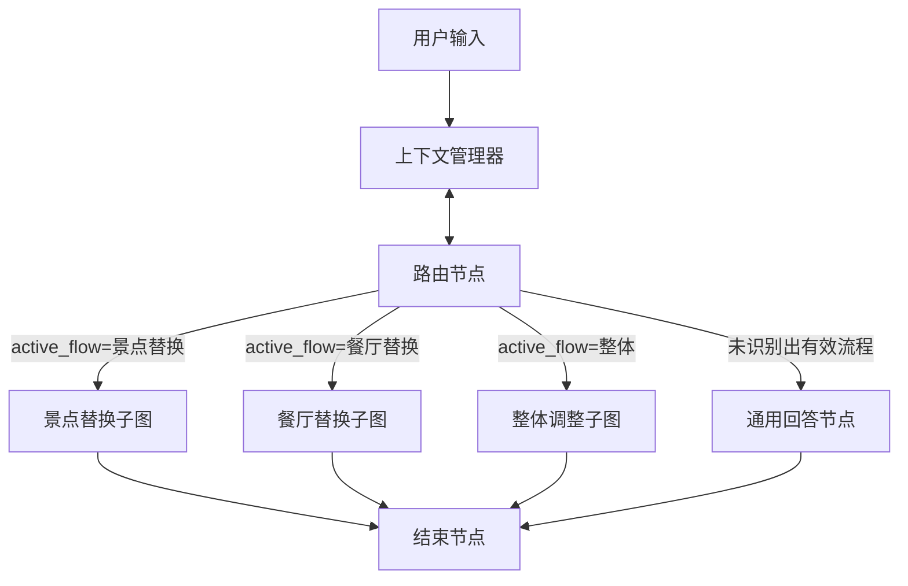

# 3.1 主流程设计

系统使用LangGraph框架进行智能体(Agent)开发，基于前述需求设计了多个专业子流程，通过主控图(Main Graph)协调各子流程的协同工作，实现多功能集成。本章将详细阐述主控图的设计、状态管理机制以及各子流程的交互方式。

## 3.1.1 智能体架构设计

使用LangGraph构建智能体的核心在于定义图的节点(Nodes)、边(Edges)以及管理整个图的状态(State)。主控图的设计遵循以下原则：

1. **模块化设计**：将复杂功能拆分为独立子图，提高代码可维护性和复用性
2. **状态隔离**：各子流程拥有独立的状态管理，同时共享全局上下文
3. **明确的责任边界**：每个节点和子图具有明确定义的职责
4. **灵活的流程控制**：通过条件边实现动态路由，支持复杂的交互逻辑

系统的流程设计思路如下图所示：



### 关键节点设计

1. **路由节点(Router Node)**
   - 功能：分析用户输入，识别意图，将请求路由到相应的子图
   - 输入：用户消息、当前状态
   - 输出：更新后的状态、路由决策
   - 实现：通过LLM分析用户意图，根据意图类型决定激活哪个子流程

2. **查看行程节点(View Itinerary Node)**
   - 功能：展示当前行程信息，为用户提供行程概览
   - 输入：当前状态中的行程数据
   - 输出：格式化的行程信息
   - 实现：从上下文管理器获取当前行程，格式化为用户友好的形式

3. **子图节点(Subgraph Nodes)**
   - 景点替换子图：处理单个景点的替换请求
   - 餐厅替换子图：处理餐厅推荐和替换
   - 整体调整子图：处理行程天数调整、节奏改变等整体优化

## 3.1.2 状态管理机制

状态管理是LangGraph框架的核心功能之一，它解决了传统对话系统中状态追踪和上下文管理的复杂问题。本系统采用两层状态管理架构：

1. **全局状态(TripState)**：由LangGraph维护，贯穿整个图执行过程
2. **上下文管理器(TripContextManager)**：作为外部服务，提供持久化存储和高级上下文管理

### TripState与TripContextManager的区别与协作

两者在系统中扮演不同但互补的角色，共同构成了完整的状态管理体系：

#### 1. 作用域与生命周期

**TripState（图内状态）**：

- 作用域限于单次图执行过程
- 随每次用户请求创建，请求处理完成后销毁
- 存储在内存中，用于节点间的即时数据传递
- 主要包含当前对话轮次的临时状态信息

**TripContextManager（持久化上下文）**：

- 跨会话持久存在
- 在应用程序生命周期内持续维护
- 可以持久化到数据库或文件系统
- 存储用户的长期状态和历史信息

#### 2. 职责分工

**TripState职责**：
- 维护对话流程控制信息（如当前激活的子流程）
- 传递节点间的临时数据
- 记录当前请求的处理状态
- 存储LLM的中间处理结果

**TripContextManager职责**：
- 管理用户的完整行程数据
- 维护用户长期偏好和设置
- 提供数据持久化服务
- 管理复杂的状态转换逻辑

#### 3. 数据结构特点

**TripState（轻量级）**：
```python
class TripState(TypedDict):
    user_input: str  # 当前用户输入
    conversation_history: List[Dict]  # 对话历史
    response: str  # 当前响应
    error: Optional[str]  # 错误信息
    flow_state: Dict[str, Any]  # 流程状态
```

**TripContextManager（重量级）**：

```python
class TripContextManager:
    conversation_history: List[Dict]  # 完整对话历史
    itinerary_data: Dict  # 完整行程数据
    user_preferences: Dict  # 用户偏好
    attraction_flow: AttractionFlow  # 景点流状态
    schedule_adjustment_flow: ScheduleAdjustmentFlow  # 行程调整流状态
```

#### 4. 协作方式

1. **状态同步**：
   - TripState在每个节点执行时可以从TripContextManager读取需要的上下文
   - 节点执行完成后，可以将重要状态更新回TripContextManager

2. **数据流转**：
   
   ```mermaid
   graph TD
       A[用户请求] --> B[TripState创建]
       B --> C[节点执行]
       C -->|读取| D[TripContextManager]
       C -->|更新临时状态| B
    	B --> |更新数据|D
   ```
   
3. **职责边界**：
   
   - TripState负责"即时通信"：节点间的数据传递
   - TripContextManager负责"长期记忆"：数据的持久化存储

#### 5. 设计优势

1. **解耦与模块化**：
   - 将临时状态和持久状态分离，降低系统复杂度
   - 便于独立维护和升级各个组件

2. **性能优化**：
   - TripState保持轻量，提高节点间通信效率
   - TripContextManager可以实现高效的缓存和持久化策略

3. **可扩展性**：
   - 可以方便地添加新的状态类型和管理逻辑
   - 支持未来功能扩展和系统演进

4. **可靠性**：
   - 即使TripState在处理过程中出错，TripContextManager也能保证数据安全
   - 支持状态恢复和回滚机制

#### 6. 实际应用示例

**场景：用户请求替换景点**

1. **TripState参与过程**：
```python
{
    "user_input": "把故宫换成天坛",
    "flow_state": {
        "active_flow": "景点替换",
        "on_progress": True
    },
    "current_step": "候选景点推荐"
}
```

2. **TripContextManager参与过程**：

```python
{
    "current_trip": {
        "trip_id": "trip_001",
        "itinerary": {...}
    },
    "attraction_flow": {
        "target_poi": "故宫",
        "user_preferences": {...},
        "recommendations": [...]
    }
}
```

3. **协作流程**：
   - TripState控制替换流程的执行
   - TripContextManager提供行程数据和用户偏好
   - 替换完成后，TripContextManager持久化更新后的行程

通过这种分层的状态管理设计，系统既能高效处理即时的对话交互，又能可靠地维护用户的长期数据，为智能旅行规划提供了强大的状态管理支持。

### TripState设计

TripState是一个TypedDict类型，定义系统在运行过程中需要的所有状态信息：

```python
class TripState(TypedDict):
    """旅行系统的全局状态"""
    # 基本信息
    user_input: str  # 用户当前输入
    
    # 上下文和历史
    conversation_history: List[Dict]  # 对话历史
    response: str  # 当前响应
    error: Optional[str]  # 错误信息
    
    # 控制流
    should_continue: bool  # 是否继续子流程
    completed: bool  # 当前流程是否完成
    awaiting_selection: bool  # 是否等待用户选择

    flow_state: Dict[str, Any] = {
        "active_flow": None,  # 当前激活的子流程
        "on_progress": False,   # 是否在该流程中流转
        "followup_action": None,  # 后续动作
    }
```

TripState的设计特点：

1. **信息分类**：将状态信息分为基本信息、上下文历史和控制流三类
2. **控制流标志**：使用布尔值指示当前流程状态，如是否完成、是否继续等
3. **子流程状态**：`flow_state`字段专门用于管理子流程的状态信息
4. **类型安全**：使用TypedDict确保类型检查，减少运行时错误

### TripContextManager设计

TripContextManager作为独立的上下文管理服务，负责更复杂的状态管理任务：

```python
class TripContextManager:
    def __init__(self, itinerary_data: dict):
        self.conversation_history = []
        self.itinerary_data = itinerary_data['travel_itineraries']
        self.current_trip_id: Optional[str] = None
        self.current_city: Optional[str] = None
        self.attraction_flow = AttractionFlow()  # 景点流状态
        self.schedule_adjustment_flow = ScheduleAdjustmentFlow()  # 行程调整流状态
        
        # 初始化当前行程ID
        if self.itinerary_data and len(self.itinerary_data) > 0:
            self.current_trip_id = str(self.itinerary_data[0]['metadata']['trip_id'])
        else:
            self.current_trip_id = "default_trip_id"
```

TripContextManager的核心功能：

1. **行程数据管理**：
   - 存储完整的行程数据
   - 提供行程查询、修改和更新接口
   - 维护行程版本和历史记录

2. **子流程状态管理**：
   - 为每个子流程维护专门的状态对象(AttractionFlow, ScheduleAdjustmentFlow等)
   - 支持子流程状态的初始化、更新和重置

3. **用户偏好管理**：
   - 存储和更新用户偏好信息
   - 提供偏好查询和修改接口

4. **会话历史管理**：
   - 记录完整的对话历史
   - 支持历史查询和分析

关键子流程状态设计：

1. **景点流状态(AttractionFlow)**：
```python
class AttractionFlow:
    def __init__(self):
        self.target_poi: Optional[Dict[str, Any]] = None  # 目标POI
        self.user_preferences: Dict[str, str] = {}  # 用户偏好
        self.current_recommendations: List[Dict] = []  # 当前推荐列表
        self.retry_count: int = 0  # 重试计数

    def reset(self):
        """重置景点流状态"""
        self.target_poi = None
        self.user_preferences = {}
        self.current_recommendations = []
        self.retry_count = 0
```

2. **行程调整流状态(ScheduleAdjustmentFlow)**：
```python
class ScheduleAdjustmentFlow:
    def __init__(self):
        self.adjust_type: Optional[str] = None  # 调整类型
        self.daily_limit: Optional[int] = None  # 每日景点数量限制
        self.original_days: Optional[int] = None  # 原始天数
        self.new_days: Optional[int] = None  # 新天数
        self.suggested_poi_list: List[Dict[str, Any]] = []  # 建议景点列表
        self.deleted_pois: List[str] = []  # 已删除景点
        self.added_pois: List[Dict[str, Any]] = []  # 新增景点

    def reset(self):
        """重置行程调整流状态"""
        self.adjust_type = None
        self.daily_limit = None
        self.original_days = None
        self.new_days = None
        self.suggested_poi_list = []
        self.deleted_pois = []
        self.added_pois = []
```

## 3.1.3 主控图实现

主控图(main_graph.py)是系统的核心组件，负责协调各子流程的工作：

```python
def create_main_graph():
    """创建主图结构"""
    # 确保AppContext已初始化
    app_context = AppContext.get_instance()
    
    graph = StateGraph(TripState)

    # 添加基本节点
    graph.add_node("router", route_to_subgraph)
    graph.add_node("view_itinerary", view_itinerary_node)

    # 添加子图节点
    attraction_graph = create_attraction_graph()
    graph.add_node("attraction_flow", attraction_graph)
    
    restaurant_graph = create_restaurant_graph()
    graph.add_node("restaurant_flow", restaurant_graph)
    
    schedule_adjustment_graph = create_schedule_adjustment_graph_test()
    graph.add_node("schedule_adjustment_flow", schedule_adjustment_graph)

    # 设置起始边
    graph.add_edge(START, "router")
    
    # 设置条件边
    graph.add_conditional_edges(
        "router",
        routing_function
    )
    
    # 设置子图返回边
    graph.add_edge("attraction_flow", END)
    graph.add_edge("restaurant_flow", END) 
    graph.add_edge("schedule_adjustment_flow", END)

    # 设置完成条件边
    graph.add_conditional_edges(
        "router",
        decide_if_done,
    )
    
    return graph.compile()
```

### 路由函数实现

路由函数是主控图的核心决策组件，根据当前状态决定下一步流程：

```python
def routing_function(state: TripState) -> str:
    print(f"当前状态: {state['flow_state']['active_flow']}")

    if state["flow_state"]["active_flow"] == "景点替换":
        print("路由到 attraction_flow")
        return "attraction_flow"
    elif state["flow_state"]["active_flow"] == "查看行程":
        print("路由到 view_itinerary")
        return "view_itinerary"
    elif state["flow_state"]["active_flow"] == "餐厅替换":
        print("路由到 restaurant_flow")
        return "restaurant_flow"
    elif state["flow_state"]["active_flow"] == "整体调整":
        print("路由到整体调整子图")
        return "schedule_adjustment_flow"
    else:
        print("结束")
        return END
```

## 3.1.4 子流程集成

主控图通过添加子图节点的方式集成各个专业子流程。每个子流程都是一个独立的状态图，有自己的节点和边，但共享全局TripState：

### 景点替换子流程

景点替换子流程负责处理单个景点的替换请求，包括理解用户需求、搜索候选景点、生成推荐和执行替换等步骤。

主要节点：
- **需求解析节点**：理解用户对替换景点的需求
- **候选生成节点**：搜索符合条件的候选景点
- **推荐生成节点**：生成个性化推荐列表
- **执行替换节点**：根据用户选择执行替换操作

### 餐厅替换子流程

餐厅替换子流程专注于餐厅推荐和替换，考虑用户的饮食偏好、预算和位置等因素。

主要节点：
- **餐饮偏好提取节点**：分析用户的餐饮偏好
- **餐厅搜索节点**：搜索符合条件的餐厅
- **菜品推荐节点**：推荐符合用户口味的菜品
- **餐厅替换节点**：执行餐厅替换操作

### 整体调整子流程

整体调整子流程处理行程的结构性调整，如天数压缩/扩展、行程密度调整等。

主要节点：
- **调整需求分析节点**：理解用户的调整需求
- **POI重要性评估节点**：评估各POI的重要性
- **行程重构节点**：根据新要求重构行程
- **调整方案确认节点**：向用户展示调整方案并获取确认

## 3.1.5 状态流转机制

系统采用以下机制确保状态在各节点和子图之间正确流转：

1. **状态初始化**：
   - 系统启动时初始化TripState
   - 从持久化存储加载用户会话信息和行程数据

2. **状态更新**：
   - 每个节点处理完成后更新状态
   - 状态更新遵循不可变原则，返回新状态而非修改原状态

3. **子图状态传递**：
   - 进入子图时，将主图状态传递给子图
   - 子图处理完成后，将更新后的状态返回给主图

4. **状态持久化**：
   - 关键节点处理后将状态写入持久化存储
   - 系统崩溃或重启后可从持久化存储恢复状态

## 3.1.6 主流程优化策略

为提高系统效率和用户体验，主流程设计采用以下优化策略：

1. **延迟加载**：子图按需加载，减少系统启动时间
2. **状态缓存**：频繁访问的状态数据进行缓存，减少重复计算
3. **并行处理**：独立任务并行执行，如同时进行POI搜索和用户偏好分析
4. **预测性加载**：根据当前状态预测可能的下一步操作，提前准备资源
5. **错误恢复机制**：节点处理失败时有明确的回退策略，确保系统稳定性

通过以上设计，系统实现了一个灵活、可扩展的对话式旅行规划框架，能够有效协调各专业子流程的工作，为用户提供流畅的交互体验。

## 3.1.3 数据模型详解

系统中包含多种数据模型，它们共同构成了完整的状态管理体系。以下是基于实际代码实现的各类数据模型详解：

```


### 1. TripState 图内状态模型

`TripState` 是LangGraph图执行过程中的核心状态容器，定义为TypedDict类型，包含以下字段：

```python
class TripState(TypedDict):
    """旅行系统的全局状态"""
    # 基本信息
    user_input: str  # 用户当前输入
    
    # 上下文和历史
    conversation_history: List[Dict]  # 对话历史
    response: str  # 当前响应
    error: Optional[str]  # 错误信息
    
    # 控制流
    should_continue: bool  # 是否继续子流程
    completed: bool  # 当前流程是否完成
    awaiting_selection: bool  # 是否等待用户选择

    flow_state: Dict[str, Any] = {
        "active_flow": None,  # 当前激活的子流程
        "on_progress": False,   # 是否在该流程中流转
        "followup_action": None,  # 后续动作
    }
```

在实际初始化时，`LangGraphApp`类会创建以下完整的初始状态：

```python
def _initialize_state(self) -> TripState:
    """初始化状态"""
    return {
        "user_input": "",
        "active_flow": None,
        "target_poi": None,
        "candidates": [],
        "user_preferences": {
            "budget": None,
            "poi_type": None,
            "rating": None,
            "tags": []
        },
        "conversation_history": [],
        "response": "",
        "error": None,
        "should_continue": True,
        "completed": False,
        "awaiting_selection": False,
        "flow_state": {  
            "active_flow": None,
            "on_progress": False,
            "followup_action": None,
        }
    }
```

### 2. TripContextManager 上下文管理器

`TripContextManager`是跨会话持久化的上下文管理器，负责管理长期状态：

```python
class TripContextManager:
    def __init__(self, itinerary_data: dict):
        self.conversation_history = []
        self.itinerary_data = itinerary_data['travel_itineraries']
        self.current_trip_id: Optional[str] = None
        self.current_city: Optional[str] = None
        self.attraction_flow = AttractionFlow()  # 景点流
        self.schedule_adjustment_flow = ScheduleAdjustmentFlow()  # 行程调整流
```

主要职责包括：
- 行程数据管理：设置/获取当前行程、更新行程数据
- 用户偏好管理：更新/获取用户偏好
- 历史消息管理：添加对话历史
- 子流程状态管理：管理景点流和行程调整流的状态

### 3. AttractionFlow 景点替换子流程状态

`AttractionFlow`管理景点替换相关的状态：

```python
class AttractionFlow:
    def __init__(self):
        self.target_poi: Optional[Dict[str, Any]] = None
        self.user_preferences: Dict[str, str] = {}
        self.current_recommendations: List[Dict] = []
        self.retry_count: int = 0

    def reset(self):
        """重置 AttractionFlow 的所有属性"""
        self.target_poi = None
        self.user_preferences = {}
        self.current_recommendations = []
        self.retry_count = 0
```

### 4. ScheduleAdjustmentFlow 行程调整子流程状态

`ScheduleAdjustmentFlow`管理行程整体调整相关的状态：

```python
class ScheduleAdjustmentFlow:
    def __init__(self):
        self.adjust_type: Optional[str] = None  # 调整类型
        self.daily_limit: Optional[int] = None  # 每日调整景点数量限制
        self.original_days: Optional[int] = None  # 原始天数
        self.new_days: Optional[int] = None  # 新天数
        self.suggested_poi_list: List[Dict[str, Any]] = []  # 建议景点列表
        self.deleted_pois: List[str] = []  # 记录被删除的POI
        self.added_pois: List[Dict[str, Any]] = []  # 记录被添加的POI

    def reset(self):
        self.adjust_type = None
        self.daily_limit = None
        self.original_days = None
        self.new_days = None
        self.suggested_poi_list = []
        self.deleted_pois = []
        self.added_pois = []
```

### 5. AppContext 应用上下文

`AppContext`是全局单例，管理应用级别的共享资源：

```python
class AppContext:
    _instance = None
    
    @classmethod
    def get_instance(cls):
        """获取单例实例"""
        if cls._instance is None:
            cls._instance = cls()
        return cls._instance
    
    def __init__(self):
        self.itinerary_data = {"travel_itineraries": []}
        self.context_manager = TripContextManager(self.itinerary_data)
        self.llm = ChatOpenAI(...)
        self.tools = {}
```

### 6. 行程数据模型

行程数据采用JSON结构，包含元数据和每日行程：

```json
{
  "travel_itineraries": [
    {
      "metadata": {
        "trip_id": "北京-8372",
        "title": "北京经典3日游",
        "destination": "beijing",
        "total_days": 3,
        "target_audience": "家庭游",
        "start_date": "2025-01-01"
      },
      "daily_itinerary": [
        {
          "day": 1,
          "date": "2025-01-01",
          "hotel": {
            "id": 4,
            "name": "赛特饭店",
            "lat": 39.906667,
            "lon": 116.441675,
            "price": 678,
            "numbed": 3
          },
          "schedule": [
            {
              "id": 2,
              "poi_type": "景点",
              "name": "八达岭长城",
              "type": "历史古迹",
              "coordinates": [40.362639, 116.024067],
              "time": {"start": "09:00", "end": "11:30"},
              "duration_hours": 2.5,
              "price": 40.0,
              "notes": ["建议提前预约"]
            },
            {
              "id": 3,
              "poi_type": "餐厅",
              "name": "北京璞瑄酒店·左岸",
              "coordinates": [39.9237932, 116.4101746],
              "price": 733.0,
              "cuisine": "西餐",
              "recommended_food": [" "],
              "time": {"start": "12:00", "end": "13:30"},
              "duration_hours": 1.5
            }
          ]
        }
      ]
    }
  ]
}
```

### 7. 子流程特定状态

各子流程在执行过程中会在TripState的flow_state中存储特定状态：

#### 景点替换子流程状态
```python
flow_state = {
    "active_flow": "景点替换",
    "on_progress": True,
    "followup_action": "选择"  # 或 "偏好", "无效"
}
```

#### 行程调整子流程状态
```python
flow_state = {
    "active_flow": "整体调整",
    "adjustment_type": "change_days",  # 或 "adjust_pace", "change_style", "optimize_route"
    "target_days": 3,
    "daily_limit": 4,
    "poi_change": 5,  # 正值表示添加POI，负值表示删除POI
    "on_progress": True
}
```

### 数据模型的交互关系

1. **状态流转**：用户请求 → TripState创建 → 节点执行 → TripState更新 → 响应生成
2. **持久化机制**：TripContextManager维护长期状态，TripState维护单次请求状态
3. **数据共享**：AppContext作为全局单例，提供对TripContextManager和LLM的共享访问
4. **子流程隔离**：每个子流程(AttractionFlow, ScheduleAdjustmentFlow)管理自己的状态，避免状态污染

这种多层状态管理架构使系统能够同时处理临时状态和持久状态，保证了多轮对话的连贯性和会话的独立性。

## 3.1.4 数据类型与前后端交互

系统中定义了多种结构化数据类型(dataType)，用于在后端Agent处理结果与前端Android客户端之间传递特定格式的信息。这些数据类型封装了不同场景下的处理结果，前端根据不同的dataType执行相应的操作。

### 数据类型概览

系统中的主要数据类型包括：

| 数据类型 | 描述 | 触发条件 | 前端处理方式 |
|:--------|------|---------|------------|
| `restaurant_recommendations` | 餐厅推荐数据 | 用户请求推荐餐厅或替换餐厅 | 显示餐厅推荐卡片列表 |
| `poi_recommendations` | 景点推荐数据 | 用户请求推荐或替换景点 | 显示景点推荐卡片列表 |
| `selected_pois` | 用户选择的POI | 用户从推荐列表中选择POI | 更新行程数据 |
| `itinerary_update` | 行程更新数据 | 行程整体调整后 | 刷新整个行程视图 |

### 数据传输机制

系统采用特殊标记`<!--JSON_DATA:{json_data}-->`将结构化数据嵌入到文本响应中，前端通过正则表达式提取并解析这些数据：

```java
private static final String JSON_DATA_PATTERN = "<!--JSON_DATA:(.+?)-->";

private AIResponseData processAIResponse(String response) {
    String cleanText = response;
    JSONObject structuredData = null;
    String dataType = null;

    // 提取JSON数据
    Pattern pattern = Pattern.compile(JSON_DATA_PATTERN);
    Matcher matcher = pattern.matcher(response);
    
    if (matcher.find()) {
        try {
            String jsonStr = matcher.group(1);
            structuredData = new JSONObject(jsonStr);
            dataType = structuredData.optString("data_type");
            
            // 移除JSON数据部分，获取纯文本
            cleanText = response.replaceAll(JSON_DATA_PATTERN, "").trim();
        } catch (JSONException e) {
            // 处理解析异常
        }
    }

    return new AIResponseData(cleanText, structuredData, dataType);
}
```

### 主要数据类型详解

#### 1. 餐厅推荐数据模型 (restaurant_recommendations)

此类型的数据由餐厅替换子流程生成，包含推荐餐厅列表及目标替换信息：

```json
{
    "data_type": "restaurant_recommendations",
    "res_info": {
        "poi_type": "餐厅",
        "name": "被替换餐厅的名称",
        "coordinates": [32.0782506, 118.7828654],
        "price": 334.0,
        "cuisine": "江浙菜",
        "recommended_food": ["慈城年糕烧大黄鱼", "蜜汁小番茄"]
    },
    "day_info": {
        "day": 1,
        "order": 2
    },
    "recommendations": [
        {
            "uid": "餐厅ID",
            "name": "餐厅名称",
            "label": "餐厅类型",
            "latitude": 32.0782506,
            "longitude": 118.7828654,
            "address": "餐厅地址",
            "overall_rating": 4.7,
            "reason": "推荐理由",
            "res_detail": {
                "price": "人均消费",
                "shop_hours": "营业时间",
                "comment_num": "评论数量"
            }
        }
    ]
}
```

前端处理流程：
1. 提取推荐餐厅列表
2. 使用`RestaurantRecommendationAdapter`创建横向滚动的餐厅卡片
3. 当用户选择卡片时，调用`confirmRestaurantSelection`更新行程数据

#### 2. 景点推荐数据模型 (poi_recommendations)

此类型的数据由景点替换子流程或行程整体调整子流程生成，包含推荐景点列表：

```json
{
    "data_type": "poi_recommendations",
    "recommendations": [
        {
            "uid": "景点ID",
            "name": "景点名称",
            "type": "景点类型",
            "rating": 4.8,
            "utility_score": 0.85,
            "recommendation_reason": "推荐理由",
            "lat": 39.924091,
            "lng": 116.403414,
            "address": "景点地址",
            "tel": "联系电话",
            "opentime_week": "营业时间",
            "image_url": "图片URL",
            "distance": 1200
        }
    ]
}
```

前端处理流程：
1. 提取推荐景点列表
2. 使用`POIRecommendationAdapter`创建横向滚动的景点卡片
3. 当用户选择卡片时，调用`updateItineraryWithPOIRecommendation`更新行程数据

#### 3. 用户选择数据模型 (selected_pois)

此类型的数据在用户从推荐列表中选择POI后生成，记录用户的选择：

```json
{
    "data_type": "selected_pois",
    "selections": [
        {
            "name": "景点名称",
            "type": "景点类型",
            "rating": "4.8",
            "coordinates": [39.924091, 116.403414],
            "address": "景点地址"
        }
    ]
}
```

#### 4. 行程更新数据模型 (itinerary_update)

此类型的数据在行程整体调整后生成，包含完整的更新后行程：

```json
{
    "data_type": "itinerary_update",
    "itinerary": {
        "metadata": {
            "trip_id": "行程ID",
            "title": "行程标题",
            "destination": "目的地",
            "total_days": 3
        },
        "daily_itinerary": [
            {
                "day": 1,
                "schedule": [
                    {
                        "poi_type": "景点",
                        "name": "景点名称",
                        "coordinates": [39.924091, 116.403414],
                        "time": {"start": "09:00", "end": "11:30"},
                        "duration_hours": 2.5
                    }
                ]
            }
        ]
    }
}
```

### 数据流处理机制

1. **生成阶段**：后端子流程生成带有dataType标记的结构化数据：

```python
# 在Agent节点中生成带有JSON数据的响应
json_data = {
    "data_type": "restaurant_recommendations",
    "recommendations": recommended_pois
}

# 将JSON数据嵌入到文本响应中
response_with_json = response_text + f"\n<!--JSON_DATA:{json.dumps(json_data, ensure_ascii=False)}-->"
```

2. **解析阶段**：前端解析响应并提取结构化数据：

```java
// 在AIService中解析响应
AIResponseData responseData = processAIResponse(response);
String dataType = responseData.getDataType();
JSONObject structuredData = responseData.getStructuredData();
```

3. **处理阶段**：前端根据dataType执行对应操作：

```java
// 在AIChatActivity中处理不同类型的数据
private void processStructuredData(AIResponseData responseData) {
    String dataType = responseData.getDataType();
    JSONObject structuredData = responseData.getStructuredData();
    
    if ("restaurant_recommendations".equals(dataType)) {
        handleRestaurantRecommendations(structuredData);
    } else if ("poi_recommendations".equals(dataType)) {
        handlePOIRecommendations(structuredData);
    } else if ("itinerary_update".equals(dataType)) {
        handleItineraryUpdate(structuredData);
    }
}
```

这种设计使前后端能够在保持松耦合的同时，高效地交换复杂的结构化数据，支持丰富的交互场景和用户体验。 