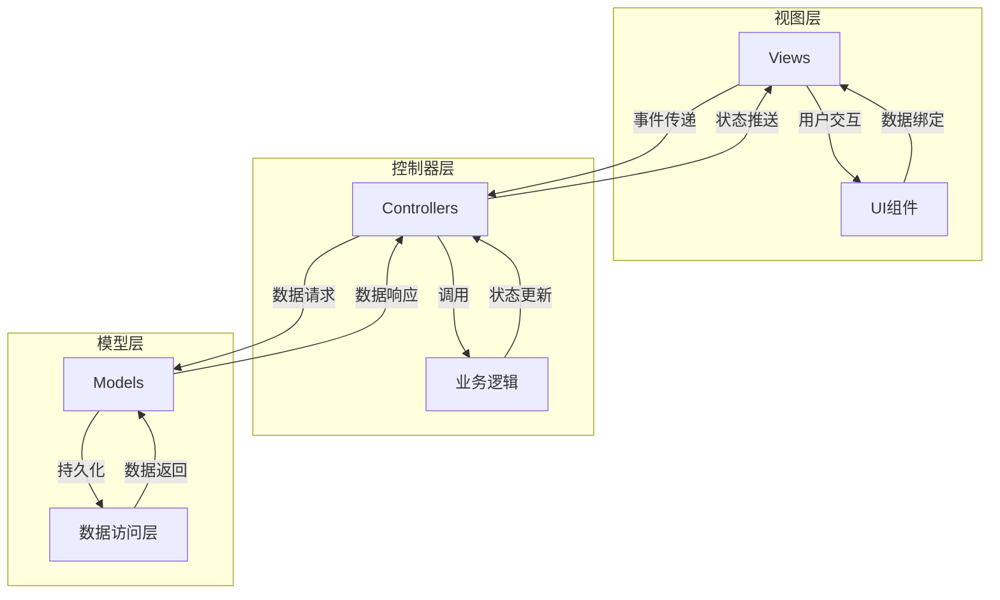
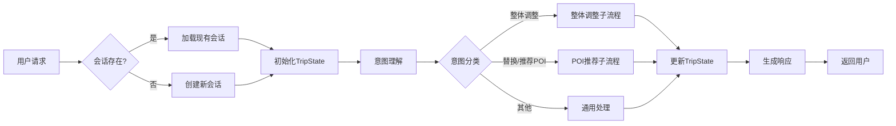
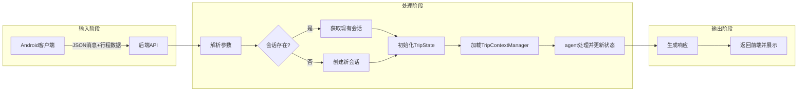

# 3. 技术选型与架构设计

## 3.1 技术选型

本节详细介绍系统开发过程中的技术选型决策，包括前端框架、后端框架、数据库以及大语言模型的选择与评估。

169

### 3.1.1 前端技术栈

前端采用原生Android开发，主要考虑以下因素：

1. **性能表现**：原生开发能够提供最佳的性能体验，尤其在地图渲染和复杂交互场景中优势明显
2. **设备功能集成**：更好地访问设备硬件功能，如GPS定位、相机等
3. **用户体验一致性**：符合Android平台的设计规范和交互习惯
4. **开发生态成熟度**：Android开发工具链和生态系统成熟，有丰富的第三方库支持

主要技术组件包括：

- **开发语言**：Java
- **UI框架**：Android原生UI组件
- **地图组件**：高德地图SDK
- **网络请求**：OkHttp
- **异步处理**：Android AsyncTask和Handler机制
- **数据存储**：SQLite + Room持久化库
- **UI组件库**：Material Design组件

### 3.1.2 后端技术栈

后端架构采用Python Flask框架构建RESTful API服务，结合LangGraph框架实现多智能体协作系统：

1. **核心框架**：
   - **Flask**：轻量级Web框架，适合构建API服务
   - **LangGraph**：基于LangChain的有向图框架，专为LLM应用设计
   - **LangChain**：大语言模型应用开发框架，提供工具调用、链式处理等功能

2. **大语言模型选择**：
   - **主选模型**：千问Qwen，选择原因：
     - 优秀的中文理解和生成能力
     - 较低的推理延迟
     - 较好的指令遵循能力
     - 支持多轮对话的上下文记忆
   - **备选模型**：GPT-3.5-turbo，作为备用方案

3. **数据存储**：
   - **主数据库**：SQLite，考虑到部署简便性和单机性能
   - **缓存系统**：Redis，用于会话状态和频繁访问数据的缓存

4. **第三方API集成**：
   - **高德地图API**：提供POI搜索、地理编码、路线规划等地理信息服务
   - **天气API**：提供目的地天气预报信息

### 3.1.3 技术选型评估

各技术方案的评估维度及结果：

| 技术方案 | 性能 | 开发效率 | 生态支持 | 学习成本 | 可扩展性 | 综合评分 |
|---------|------|---------|---------|---------|---------|---------|
| 前端：Android原生 | ★★★★★ | ★★★☆☆ | ★★★★★ | ★★★☆☆ | ★★★★☆ | 4.2/5 |
| 后端：Flask+LangGraph | ★★★★☆ | ★★★★★ | ★★★★☆ | ★★★★★ | ★★★★★ | 4.6/5 |
| 数据库：SQLite | ★★★★☆ | ★★★★★ | ★★★★☆ | ★★★★★ | ★★★☆☆ | 4.2/5 |
| LLM：千问Qwen | ★★★★☆ | ★★★★★ | ★★★★☆ | ★★★★☆ | ★★★★★ | 4.5/5 |

## 3.2 前后端框架搭建

### 3.2.1 前端架构设计

Android客户端采用经典的MVC架构，并结合Repository模式管理数据源：




主要模块划分：

1. **UI模块**：
   - **MainActivity**：应用主入口，管理底部导航和Fragment切换
   - **ChatFragment**：对话交互界面，显示对话历史和输入区域
   - **ItineraryFragment**：行程展示界面，包含日历视图和详细行程列表
   - **MapFragment**：地图展示界面，显示POI位置和路线
   - **SettingsFragment**：设置界面，管理用户偏好和应用配置

2. **业务逻辑模块**：
   - **AIService**：负责与后端AI服务通信，处理对话请求和响应
   - **ItineraryManager**：管理行程数据，包括创建、修改和删除操作
   - **LocationService**：处理位置相关功能，如获取当前位置、计算距离等
   - **RecommendationManager**：处理推荐结果的展示和用户选择

3. **数据模块**：
   - **DatabaseHelper**：SQLite数据库操作封装
   - **ApiClient**：网络请求客户端，封装API调用
   - **PreferenceManager**：管理用户偏好设置
   - **CacheManager**：管理本地缓存数据

### 3.2.2 后端架构设计

后端采用基于Flask的RESTful API服务架构，结合LangGraph实现多智能体系统：

```
+-------------------+
|    Flask API层    |
|- 请求路由         |
|- 参数验证         |
|- 响应格式化       |
+--------+----------+
         |
         v
+-------------------+
|  多智能体引擎     |
|- 主控图(Main Graph)|
|- 子图(Subgraphs)   |
|- 状态管理          |
+--------+----------+
         |
         v
+-------------------+       +-------------------+
|   核心服务层      |       |    外部服务集成   |
|- 对话管理         |       |- 大语言模型API    |
|- 行程规划         |       |- 地图服务API      |
|- POI推荐          |       |- 天气服务API      |
+--------+----------+       +-------------------+
         |
         v
+-------------------+
|    数据访问层     |
|- SQLite操作       |
|- Redis缓存        |
|- 文件存储         |
+-------------------+
```

主要模块划分：

1. **API层**：
   - **app.py**：Flask应用主入口，定义API路由
   - **routes/**：API路由处理模块，包含各端点的处理逻辑
   - **middlewares/**：中间件，如认证、日志、错误处理等

2. **多智能体引擎**：
   - **main_graph.py**：定义主控图结构，协调各子图
   - **subgraphs/**：各功能子图实现，如景点推荐、餐厅推荐、行程调整等
   - **nodes.py**：定义图中的处理节点
   - **state.py**：定义状态结构和管理方法

3. **核心服务层**：
   - **context_manager.py**：上下文管理器，维护会话状态
   - **app_context.py**：应用上下文，管理全局资源
   - **travel_tools/**：旅行相关工具函数，如POI搜索、路线规划等

4. **数据访问层**：
   - **db/**：数据库操作封装
   - **cache/**：缓存操作封装
   - **storage/**：文件存储操作封装

### 3.2.3 框架搭建流程

#### 前端框架搭建

1. **项目初始化**：
   ```bash
   # 使用Android Studio创建新项目
   # 配置Gradle依赖
   ```

2. **基础架构搭建**：
   - 创建包结构（activities, fragments, models, services, utils等）
   - 配置主题和样式
   - 设置导航组件

3. **核心功能模块实现**：
   - 实现数据库Helper类
   - 创建网络请求客户端
   - 设计基础UI组件

4. **集成第三方SDK**：
   - 集成高德地图SDK
   - 配置OkHttp网络库
   - 添加必要的UI库

#### 后端框架搭建

1. **环境准备**：
   ```bash
   # 创建虚拟环境
   python -m venv venv
   
   # 激活虚拟环境
   source venv/bin/activate  # Linux/Mac
   venv\Scripts\activate     # Windows
   
   # 安装依赖
   pip install flask langchain langgraph python-dotenv requests redis
   ```

2. **项目结构创建**：
   ```bash
   mkdir -p agent/subgraphs travel_tools db cache
   touch app.py agent/main_graph.py agent/nodes.py agent/state.py
   ```

3. **配置文件设置**：
   ```bash
   # 创建.env文件存储配置
   touch .env
   # 添加API密钥和配置参数
   ```

4. **基础服务实现**：
   - 实现Flask应用主框架
   - 创建LangGraph主控图结构
   - 设计基础状态管理机制

## 4.3 前后端接口的联调与开发

### 4.3.1 接口设计原则

本系统的API接口设计遵循以下原则：

1. **RESTful设计**：遵循REST架构风格，使用HTTP动词表示操作类型
2. **JSON数据格式**：请求和响应均使用JSON格式，便于处理和解析
3. **版本控制**：API路径包含版本信息，便于未来升级
4. **错误处理统一**：统一的错误响应格式，包含错误码和描述信息
5. **幂等性设计**：确保重复请求不会导致意外的副作用

### 4.3.2 核心接口定义

#### 1. 对话接口

```
POST /chat
```

请求体：
```json
{
  "message": "用户输入的消息",
  "itinerary_data": {
    "itinerary_id": "行程ID",
    "title": "行程标题",
    "location": "目的地",
    "days": 3,
    "attractions": [
      {
        "name": "景点名称",
        "day": 1,
        "order": 1,
        "transport": "交通方式",
        "poi_id": "POI ID",
        "latitude": 39.9042,
        "longitude": 116.4074,
        "address": "详细地址",
        "type_desc": "景点类型"
      }
    ]
  }
}
```

响应体：
```json
{
  "success": true,
  "response": "AI助手的文本响应",
  "data": {
    "recommendations": [
      {
        "name": "推荐POI名称",
        "rating": 4.5,
        "distance": "1.2km",
        "reason": "推荐理由",
        "coordinates": [39.9, 116.4],
        "address": "详细地址",
        "price": 50,
        "type": "类型"
      }
    ]
  },
  "data_type": "restaurant_recommendations"
}
```


#### 3. 确认推荐接口

```
POST /confirm_recommendation
```

请求体：
```json
{
  "itinerary_id": "行程ID",
  "day": 2,
  "meal_type": "午餐",
  "restaurant": {
    "uid": "餐厅唯一ID",
    "name": "餐厅名称",
    "address": "详细地址",
    "latitude": 39.9,
    "longitude": 116.4,
    "cuisine": "菜系",
    "price": 100,
    "reason": "选择理由"
  }
}
```

响应体：
```json
{
  "success": true,
  "message": "餐厅已成功更新",
  "updated_attractions": [
    {
      "name": "景点名称",
      "day": 2,
      "order": 1,
      "transport": "交通方式",
      "notes": "备注信息",
      "ai_optimized": true,
      "coordinates": [39.9, 116.4],
      "address": "详细地址",
      "type": "类型"
    }
  ]
}
```

#### 4. 会话管理接口

```
POST /clear_session
```

请求体：
```json
{
  "trip_id": "行程ID"
}
```

响应体：
```json
{
  "result": "会话已清除"
}
```

### 4.3.3 接口实现与联调


#### 后端接口实现

以对话接口为例，后端实现如下：

```python
@app.route('/chat', methods=['POST'])
def chat():
    try:
        logger.info("收到新的聊天请求")
        
        # 验证请求内容是否为JSON
        if not request.is_json:
            logger.error("请求内容不是JSON格式")
            return jsonify({'error': '请求必须是JSON格式'}), 400
        
        data = request.get_json()
        
        # 验证必要参数
        if not data:
            logger.error("JSON解析失败或为空")
            return jsonify({'error': 'JSON解析失败或为空'}), 400
        
        message = data.get('message')
        if not message:
            logger.warning("消息内容为空")
            return jsonify({'error': '消息内容不能为空'}), 400
        
        itinerary_data = data.get('itinerary_data')
        
        logger.info(f"请求参数: message={message}")
        if itinerary_data:
            logger.info(f"行程数据: {json.dumps(itinerary_data, ensure_ascii=False)[:200]}...")
        else:
            logger.warning("既没有提供行程数据也没有提供itinerary_id")
            return jsonify({'response': '抱歉，请提供行程信息或行程ID'}), 400

        logger.info("调用 AI 处理函数")
        # 将itinerary_data传递给AI处理函数
        response = process_message(message, itinerary_data)
        
        # 检查response是否是字典类型（新格式）
        if isinstance(response, dict):
            logger.info(f"AI 返回了数据: {str(response)[:100]}...")
            return jsonify({
                'success': True,
                'response': response.get('message', '处理完成'),
                'data': response.get('data'),
                'data_type': response.get('data_type')
            })
            
        else:
            # 处理旧格式（字符串）响应
            logger.info(f"AI 响应: {response[:100]}...")
            return jsonify({
                'success': True,
                'response': response,
                'data': None,
                'data_type': None
            })
            
    except Exception as e:
        logger.error(f"处理请求时出错: {str(e)}", exc_info=True)
        error_traceback = traceback.format_exc()
        logger.error(f"错误详情: {error_traceback}")
        return jsonify({'error': str(e)}), 500
```

#### 前端接口调用实现

Android客户端中的接口调用实现：

```java
public AIResponseData getAIResponse(String message, long itineraryId, DatabaseHelper dbHelper) throws Exception {
    Log.d(TAG, "开始准备请求数据: message=" + message + ", itineraryId=" + itineraryId);
    
    // 获取行程和景点数据
    Itinerary itinerary = dbHelper.getItineraryById(itineraryId);
    
    if (itinerary == null) {
        Log.e(TAG, "获取行程失败：itinerary为null");
        throw new Exception("找不到指定的行程");
    }
    
    // 详细打印行程信息
    Log.d(TAG, "行程详细信息 - " +
          "ID: " + itinerary.getId() + 
          ", 标题: " + itinerary.getTittle() + 
          ", 位置: " + itinerary.getLocation() + 
          ", 天数: " + itinerary.getDays());
    
    ArrayList<ItineraryAttraction> attractions = dbHelper.getItineraryAttractions(itineraryId);
    
    // 构建请求体
    JSONObject requestBody = new JSONObject();
    requestBody.put("message", message);
    
    // 构建行程数据
    JSONObject itineraryData = new JSONObject();
    itineraryData.put("itinerary_id", itineraryId);
    itineraryData.put("title", itinerary.getTittle());
    itineraryData.put("location", itinerary.getLocation());
    itineraryData.put("days", itinerary.getDays());
    
    // 构建景点数组
    JSONArray attractionsArray = new JSONArray();
    for (ItineraryAttraction attraction : attractions) {
        JSONObject attractionObj = new JSONObject();
        attractionObj.put("name", attraction.getAttractionName());
        attractionObj.put("day", attraction.getDayNumber());
        attractionObj.put("order", attraction.getVisitOrder());
        attractionObj.put("transport", attraction.getTransport());
        attractionObj.put("type", attraction.getType());
        
        Sites site = dbHelper.getSiteBySiteId(attraction.getSiteId());
        if (site != null) {
            attractionObj.put("poi_id", site.getPoiId());
            attractionObj.put("latitude", site.getLatitude());
            attractionObj.put("longitude", site.getLongitude());
            attractionObj.put("address", site.getAddress());
            attractionObj.put("type_desc", site.getTypeDesc());
        }
        
        attractionsArray.put(attractionObj);
    }
    
    itineraryData.put("attractions", attractionsArray);
    requestBody.put("itinerary_data", itineraryData);
    
    // 发送请求并获取响应
    String response = sendRequest(requestBody);
    
    // 处理响应
    AIResponseData responseData = processAIResponse(response);
    this.structuredData = responseData.getStructuredData();  // 保存结构化数据
    return responseData;
}
```

### 4.3.4 接口联调过程

前后端接口联调采用以下步骤：

1. **接口文档准备**：
   - 使用Markdown文档定义接口规范
   - 明确请求参数、响应格式和错误码

2. **模拟数据测试**：
   - 后端先使用模拟数据实现接口
   - 前端使用Postman等工具测试接口响应

3. **单接口联调**：
   - 逐个接口进行联调测试
   - 验证请求参数解析和响应格式

4. **场景化联调**：
   - 按照用户操作场景进行端到端测试
   - 验证多个接口的协作流程

5. **异常情况测试**：
   - 测试网络异常、参数错误等异常情况
   - 验证错误处理和恢复机制

6. **性能测试**：
   - 测试接口响应时间
   - 验证并发请求处理能力

### 4.3.5 接口优化与改进

联调过程中发现并解决的主要问题：

1. **数据格式不一致**：
   - 问题：前后端对日期、坐标等数据格式理解不一致
   - 解决：统一使用ISO标准格式，明确数据类型规范

2. **大数据量传输**：
   - 问题：完整行程数据过大，影响传输效率
   - 解决：实现增量更新机制，只传输变更部分

3. **超时处理**：
   - 问题：LLM处理耗时长，导致请求超时
   - 解决：实现异步处理机制，先返回处理中状态，再通过轮询获取结果

4. **错误处理标准化**：
   - 问题：不同接口错误格式不统一
   - 解决：统一错误响应格式，包含错误码和详细描述

5. **接口版本管理**：
   - 问题：接口变更导致兼容性问题
   - 解决：引入API版本控制，确保向后兼容

通过这些优化措施，系统接口稳定性和性能得到显著提升，为多智能体旅行规划系统的顺利运行提供了坚实基础。 

# 旅行规划系统的主流程实现与数据流转

## 系统流程概述

旅行规划系统的整体流程围绕用户输入处理、状态管理和多智能体协作展开。整个流程可以概括为以下几个关键步骤：




1. 用户请求接收：系统通过前端接口接收用户的自然语言输入和行程数据

1. 会话管理：根据行程ID确定是创建新会话还是使用现有会话

1. 状态初始化：为当前请求创建或更新TripState临时状态

1. 意图理解：分析用户输入，识别用户意图和操作需求

1. 路由分发：将请求路由到相应的专业子流程

1. 子流程处理：执行特定子流程的业务逻辑

1. 状态更新：更新临时状态和持久化状态

1. 响应生成：生成自然语言响应或结构化数据返回给用户

## 详细流程解析

### 1. 用户请求处理

当用户发送一条消息时，系统首先接收并解析请求：

- 请求验证：检查请求格式是否正确，必要参数是否存在

- 参数提取：从请求中提取用户消息和行程数据

- 日志记录：记录请求信息，便于后续调试和分析

### 2. 会话管理机制

系统使用行程ID作为会话标识，维护用户的对话上下文：

- 会话查找：检查是否存在与当前行程ID匹配的活跃会话

- 会话复用：如有匹配会话，直接使用该会话继续对话

- 会话创建：如无匹配会话，创建新的会话实例并初始化状态

- 会话清理：提供会话清除机制，释放不再需要的资源

### 3. 行程数据处理

系统需要将客户端提供的行程数据转换为内部标准格式：

- 数据标准化：将输入的行程数据转换为系统内部统一的JSON结构

- 数据补全：为缺失字段提供默认值，确保数据完整性

- 数据验证：检查行程数据的有效性和一致性

- 数据组织：按天数组织行程数据，构建完整的行程结构

### 4. 状态管理流程

系统采用双层状态管理架构，分别处理临时状态和持久状态：

- TripState初始化：为当前请求创建临时状态容器

- 上下文加载：从TripContextManager加载持久化上下文

- 状态同步：确保临时状态与持久状态的一致性

- 状态传递：在各节点间传递和更新状态

### 5. 意图理解与路由

系统通过大语言模型分析用户意图，并路由到相应处理流程：

- 意图提取：使用LLM分析用户输入，识别核心意图

- 参数解析：从用户输入中提取关键参数和约束条件

- 流程匹配：将识别的意图映射到具体的处理子流程

- 路由决策：根据意图和当前状态决定下一步处理节点

### 6. 子流程执行

根据路由结果，系统激活相应的专业子流程：

- 子流程初始化：准备子流程所需的状态和资源

- 节点执行：按照子流程图定义的顺序执行各节点

- 条件判断：根据节点执行结果和条件边决定下一步

- 子流程完成：执行完成后，将控制权返回给主流程

### 7. 外部API调用

在处理过程中，系统可能需要调用外部API获取数据：

- 请求准备：构建API请求参数

- 请求发送：发送HTTP请求到外部服务

- 响应处理：解析API响应并提取有用信息

- 错误处理：处理可能的API错误和异常情况

### 8. 响应生成与返回

完成处理后，系统生成响应并返回给用户：

- 响应格式确定：根据处理结果决定返回普通文本还是结构化数据

- 响应内容生成：使用LLM生成自然语言响应或格式化结构化数据

- 状态持久化：将更新后的状态保存到持久存储

- 响应返回：将最终响应通过API返回给客户端

## 数据流转过程

整个系统的数据流转遵循以下路径：

1. 输入阶段：

- 用户通过Android客户端发送消息和行程数据

- 前端将数据打包成JSON格式发送到后端API

1. 处理阶段：

- 后端API接收请求并解析参数

- 创建或获取会话实例

- 初始化TripState临时状态

- 加载TripContextManager持久状态

- 通过主控图路由到相应子流程

- 子流程执行业务逻辑并更新状态

1. 输出阶段：

- 生成响应文本或结构化数据

- 更新持久化状态

- 将响应返回给前端

- 前端解析响应并展示给用户

  ```mermaid
  graph LR
      subgraph 输入阶段
          A[Android客户端] -->|JSON消息\n+行程数据| B[后端API]
      end
  
      subgraph 处理阶段
          B --> C[解析参数]
          C --> D{会话存在?}
          D -->|是| E[获取现有会话]
          D -->|否| F[创建新会话]
          E & F --> G[初始化TripState]
          
          subgraph 垂直状态管理[状态管理]
              direction TB
              G --> H[加载TripContextManager]
              H --> I[主控图路由]
          end
  
          subgraph 垂直子流程[子流程集群]
              direction TB
              I --> J1[行程规划]
              I --> J2[POI推荐]
              I --> J3[日程调整]
              J1 & J2 & J3 --> K[更新状态]
          end
      end
  
      subgraph 输出阶段
          K --> L[生成响应]
          L --> M[持久化状态]
          M --> N[返回前端]
          N --> O[客户端展示]
      end
  ```

  



