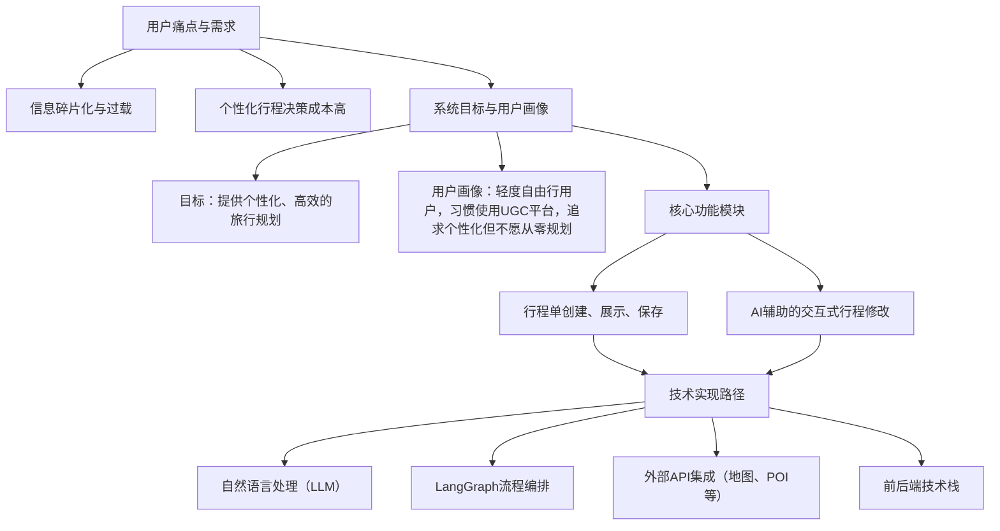

# 基于大语言模型的智能旅行规划系统设计与实现

## 第一章 绪论
### 1.1 研究背景与意义
- 旅游业数字化转型现状
- 大语言模型在智能出行领域的应用前景
- 个性化旅行规划需求的增长与挑战
- 研究意义：提升旅行体验、节省规划时间、提高旅行质量

### 1.2 国内外研究现状
- 传统旅行规划系统的局限性
- 基于规则的自动规划系统综述
- 基于人工智能的旅行规划技术发展
- 大语言模型在智能助手领域的最新应用

### 1.3 研究内容与创新点
- 基于LangGraph的多智能体架构设计
- 行程整体修改功能的路线优化算法
- POI推荐与选择机制的个性化实现
- 多轮对话的流程设计与状态管理

### 1.4 研究内容与技术路线

本研究的技术路线聚焦于解决用户在旅行规划中面临的信息过载和决策成本高的痛点，特别是通过AI辅助的交互式行程修改功能，来满足轻度自由行用户对个性化和效率的需求。其核心技术路线图如下所示：



**注意**: 上述代码块为Mermaid语法，用于生成流程图。您可以在支持Mermaid的Markdown编辑器（如Typora、VS Code的相关插件、或在线Mermaid编辑器）中粘贴并预览其可视化效果。

**技术路线图说明：**

该技术路线图从用户痛点出发，明确了系统的核心价值和目标用户。核心部分详细展示了"AI行程修改引擎"的工作流程：

1.  **用户交互层**：用户通过浏览现有行程单，触发"AI改成我的版本"功能，进入交互式修改流程。这是您设计的核心用户路径的起点。
2.  **AI行程修改引擎 (核心Agent)**：这是系统的"大脑"，负责处理用户的修改请求。
    *   **意图理解与解析模块**：接收用户的自然语言修改指令（例如"把第二天的故宫换成天坛"，"行程太赶了，帮我调整一下"）和当前行程信息。利用大语言模型（LLM）的强大自然语言理解能力，准确识别用户意图并提取行程修改所需的关键参数（如日期、地点、偏好、约束条件等）。
    *   **LangGraph流程编排与状态管理**：这是整个AI辅助修改功能的中枢。正如您所设想的，LangGraph负责定义和管理人机多轮交互的复杂流程。它将复杂的修改任务分解为一系列定义好的状态节点（Agent Steps）。每个节点执行特定子任务（如询问用户偏好、调用工具查询信息、生成修改建议等），并根据执行结果和用户的实时反馈进行条件跳转，从而实现灵活、可控且具有上下文记忆的对话式修改体验。
    *   **工具调用与LLM决策节点 (LangGraph Nodes)**：LangGraph中的关键节点会紧密结合LLM的推理能力与外部实际工具（Tool Use）的执行能力，而非单纯依赖LLM生成文本建议：
        *   **POI推荐/筛选节点**：调用POI数据库、高德地图API等工具，根据用户提出的新偏好和当前行程上下文，智能推荐或筛选景点/餐厅。
        *   **路线规划/优化节点**：调用地图服务API（如高德），为用户规划或优化每日的游览路线，计算交通时间、调整顺序等。
        *   **信息提取/问答节点**：可能涉及从您提到的UGC内容（如小红书、马蜂窝的攻略）中提取结构化信息，或调用知识库回答用户的特定旅行问题。
        *   **LLM综合决策节点**：对于需要更复杂逻辑推理、整合多个工具输出信息或工具无法直接覆盖的模糊请求，由LLM进行综合判断、生成解释性建议或引导用户进一步明确需求。
    *   **行程更新与预览模块**：在用户与AI Agent的每一轮交互修改后，系统会根据AI的建议和用户的确认，实时更新结构化的行程数据，并清晰地向用户展示修改后的行程片段或完整行程，等待用户确认或进行下一步修改。这个即时反馈对于提升用户体验至关重要。
3.  **系统基础功能模块**：包括您已实现的行程单的创建、展示、保存等基础功能，它们为核心的AI修改功能提供了必要的运行环境和数据支持。
4.  **底层技术支撑**：明确了实现该系统所依赖的关键技术，包括核心的大语言模型（用于理解、生成和推理）、LangGraph框架（用于构建Agent和控制复杂流程）、外部API的集成（地图、POI等实用工具的接口）以及通用的前后端开发技术。

这条技术路线的核心优势在于，它通过LangGraph将LLM的强大语义理解和推理能力与外部工具的精准数据和执行能力进行了深度整合，形成了一个能够与用户进行多轮、精细化交互的智能修改代理（Agent）。这能有效解决您指出的用户在个性化行程规划中信息过载、决策成本高的痛点，帮助目标用户（轻度自由行爱好者）快速、高效地将初步的行程想法或他人攻略，智能修改并细化成满足自身需求的、结构化的旅行行程单。

## 第二章 相关技术与理论基础
### 2.1 大语言模型技术

#### 2.1.1 大语言模型的工作原理与发展

大语言模型(Large Language Model, LLM)是基于深度学习技术训练的自然语言处理模型，通过对海量文本数据的学习，掌握了语言的语法规则、语义知识和上下文关系，从而能够理解和生成人类语言。这些模型基于Transformer架构(Vaswani et al., 2017)，采用自注意力机制(Self-attention)处理序列数据，突破了传统循环神经网络(RNN)的限制。

大语言模型的发展经历了以下几个关键阶段：
- **BERT时代(2018)**：Google提出的BERT(Bidirectional Encoder Representations from Transformers)通过双向上下文学习，显著提升了模型的语言理解能力(Devlin et al., 2018)。
- **GPT时代(2020-)**：OpenAI发布的GPT系列模型采用自回归预训练方法，通过增加参数规模和训练数据量，实现了从语言理解到复杂任务推理的质变(Brown et al., 2020)。
- **指令微调时代(2022-)**：通过人类反馈的强化学习(RLHF)和指令微调(Instruction Tuning)，使模型能够更好地遵循人类指令，降低了有害输出(Ouyang et al., 2022)。

目前主流的大语言模型如GPT-4、Claude、Gemini、Qwen等，已经展示出接近人类水平的语言理解和生成能力，为构建智能对话系统提供了坚实基础。

#### 2.1.2 大语言模型在对话系统中的应用

大语言模型在对话系统中的应用主要体现在以下几个方面：

1. **自然语言理解(NLU)**：LLM能够从用户输入中精确捕捉意图(Intent)和实体(Entity)，并理解复杂的上下文关系，使对话系统能够处理模糊、不完整甚至多意图的表达(Zhang et al., 2023)。

2. **对话状态跟踪(DST)**：传统对话系统需要为每个领域设计专用的状态跟踪器，而LLM可以通过少量示例学习维护对话状态，实现跨领域的知识迁移(Hu et al., 2022)。

3. **响应生成(Response Generation)**：LLM能够基于当前对话状态和用户查询生成流畅、连贯且信息丰富的回复，相比模板或检索式方法更具灵活性(Thoppilan et al., 2022)。

4. **多轮对话管理**：LLM具备较强的上下文理解能力，可以在多轮对话中保持主题一致性和逻辑连贯性，有效减少了传统对话系统中常见的状态追踪错误(Zhou et al., 2022)。

在旅行规划系统中，大语言模型特别适合处理用户的复杂需求表达，如"我想把行程中的博物馆换成更适合孩子的地方"这类需要深度语义理解的请求。

#### 2.1.3 Prompt工程在智能助手场景中的应用

Prompt工程是指通过精心设计输入提示(prompt)来引导语言模型完成预期任务的过程。随着LLM能力的增强，提示设计逐渐从简单的"问题+一句指令"向更具结构性和控制力的形式演进，形成了一套完整的工程方法论(Liu et al., 2023)。

在智能旅行助手场景中，Prompt工程主要应用了以下关键技术：

1. **角色设定与任务限定(Role & Task Specification)**：
   提示中明确设定语言模型扮演"旅行规划专家"角色，并通过任务指令限定其输出目标。这种角色驱动式提示(Role Prompting)有助于模型聚焦任务语义，减少无关内容生成(White et al., 2023)。

2. **多维任务拆解(Decomposed Prompting)**：
   对于复杂任务，如提取包括POI基础信息、上下文关系、时间安排等多个字段的信息，采用任务分解式提示(Step-by-Step Decomposition)可显著提升抽取准确率和输出一致性(Wei et al., 2022)。

3. **结构化输出引导(Output Forcing)**：
   通过JSON模板对输出格式进行严格约束，属于典型的模式强制(Schema-forcing)技术。这使得LLM能够直接生成可被程序处理的结构化结果，特别适合集成到多模块系统中(Khattab et al., 2022)。

4. **上下文注入与状态维护(Contextual Prompting)**：
   在具体应用中，如用户偏好提取，系统将历史偏好作为上下文注入，与用户最新输入联合判断是否需要更新偏好状态。这种上下文融合提示特别适用于需要信息融合与增量更新的任务(Madotto et al., 2021)。

5. **逻辑约束与默认值引导(Constraint Prompting)**：
   通过规则描述和示例，提示明确指示模型在缺失信息时如何处理，如未提及餐厅类型则默认为"美食"。这种逻辑约束提示有助于保障输出鲁棒性与任务完整性(Reynolds & McDonell, 2021)。

在本研究的旅行规划系统中，这些Prompt技术被集成应用于各个功能模块，包括意图识别、POI提取、用户偏好解析等关键环节，为系统提供了灵活而精确的自然语言理解能力。

#### 2.1.4 智能体(Agent)架构设计

在智能行程助手系统中，Agent扮演着具备长期记忆与短期推理能力的智能体角色，依托大型语言模型作为核心推理引擎。根据Weng(2023)的定义，一个完整的智能体应包括四个核心部分：大语言模型(LLM)、记忆(Memory)、规划能力(Planning Skills)和工具使用(Tool Use)。

1. **大语言模型作为核心引擎**：
   LLM是智能体的"大脑"，其自然语言解析能力赋予智能体理解、计划、记忆和工具调用的基础能力。本研究选择中文理解能力强、响应风格自然的国产大模型千问Qwen作为核心引擎，其多轮对话记忆能力特别适合旅行规划场景。

2. **记忆机制设计**：
   智能体需要同时管理短期记忆(当前对话上下文)和长期记忆(用户偏好、历史行程)。在实现上采用了分层记忆架构，将对话历史、行程状态和用户配置文件分开存储，并通过上下文窗口管理技术防止记忆溢出(Xu et al., 2022)。

3. **规划与推理能力**：
   旅行规划涉及复杂的推理和决策过程，如何根据用户需求调整行程，需要模型具备较强的规划能力。系统采用Chain-of-Thought提示技术增强模型的推理能力，使其能够分步骤思考问题(Wei et al., 2022)。

4. **工具使用与环境交互**：
   赋予智能体调用外部工具的能力是提升其实用性的关键。在本系统中，Agent可以调用地图API、POI搜索、交通查询等外部工具，并将结果整合到对话流程中。这种模式也被称为"工具增强型LLM"(Tool-Augmented LLM)(Mialon et al., 2023)。

通过这种完整的Agent架构设计，系统能够综合利用LLM的语言理解能力和外部工具的专业功能，为用户提供个性化、智能化的旅行规划服务。

### 2.2 LangGraph框架

#### 2.2.1 LangGraph框架与智能体的关系

传统的基于大语言模型的智能体虽然具备强大的自然语言理解和生成能力，但在复杂应用场景中面临着状态管理混乱、对话流程难以控制等挑战。为解决这些问题，LangGraph框架应运而生，它在保留智能体核心能力的同时，通过图结构为智能体提供了确定性的状态转换机制和明确的行为控制能力。

LangGraph并不意味着完全放弃智能体的自主性，而是提供了一种结构化方式来组织和协调多个智能体的行为。在这种框架下，智能体的角色从"无约束的自由决策者"转变为"在特定状态下的专业决策者"，即在明确定义的状态和职责范围内，智能体仍然保持着其自主推理和决策的能力。以旅行规划系统为例，当系统处于"POI推荐"状态时，负责推荐的智能体可以根据当前上下文和用户需求，自主决定最佳的推荐策略和内容。

#### 2.2.2 LangGraph的核心概念与优势

LangGraph是一个为大型语言模型(LLM)构建有状态、多智能体系统的框架，由LangChain团队开发，它通过图结构实现了复杂对话流程的精确控制(Chase, 2023)。LangGraph本质上是一种有向图(Directed Graph)实现，专门设计用于管理LLM应用中的状态转换和工作流程。

LangGraph的核心概念包括：

1. **有向状态图(Directed State Graph)**：
   LangGraph将对话流程建模为一个有向图，其中节点代表不同的处理状态，边表示状态转换条件。这种结构允许开发者明确定义系统的状态空间和转换逻辑，避免了传统LLM应用中常见的状态管理混乱问题(Fan et al., 2023)。

2. **状态持久化(State Persistence)**：
   框架提供了内置的状态持久化机制，能够在对话的不同轮次之间保持状态一致性。这解决了LLM本身无状态(Stateless)的局限，使系统能够维护长期对话上下文和用户会话信息(Hong et al., 2023)。

3. **可组合性(Composability)**：
   LangGraph采用了模块化设计，支持将复杂工作流分解为可重用的子图(Subgraphs)。这种可组合性使得开发者能够构建和维护复杂系统，同时保持代码的可读性和可维护性(Chen et al., 2023)。

LangGraph相比传统LLM应用框架具有以下优势：

1. **确定性行为(Deterministic Behavior)**：
   通过显式定义状态转换规则，LangGraph减少了LLM推理过程中的不确定性，提高了系统行为的可预测性和可靠性(Zhao et al., 2023)。

2. **降低提示复杂度(Reduced Prompt Complexity)**：
   LangGraph允许将复杂任务分解为多个小型专用节点，每个节点负责特定功能，从而简化了提示设计，降低了单个提示的复杂度和长度(Li et al., 2023)。

3. **高效错误处理(Efficient Error Handling)**：
   框架支持定义错误处理路径和回退策略，使系统能够优雅地处理异常情况，增强了应用的鲁棒性(Jiao et al., 2022)。

4. **可视化与调试能力(Visualization & Debugging)**：
   LangGraph提供了内置的可视化工具，使开发者能够直观地检查状态转换流程和调试系统行为，加速了开发和调试过程(Chase, 2023)。

#### 2.2.3 状态图模型在对话流程控制中的应用

在深入理解了智能体的核心要素和LangGraph的基本概念后，我们需要探讨如何利用状态图模型来控制和协调智能体的行为。状态图模型是控制对话流程的有效方法，在LangGraph框架中得到了深入应用。这种建模方式源于有限状态机(FSM)理论，但针对基于LLM的智能体交互场景进行了特定优化(Peng et al., 2022)。

在对话流程控制中，状态图模型的应用主要体现在以下方面：

1. **对话状态定义(Dialog State Definition)**：
   在LangGraph中，对话状态通常包含三个核心元素：对话历史(Dialog History)、当前状态标识(Current State ID)和状态变量(State Variables)。这种结构使智能体系统能够全面捕捉对话的当前上下文，为智能体的决策提供必要信息(Peng et al., 2022)。

2. **条件状态转换(Conditional State Transitions)**：
   LangGraph支持基于条件逻辑的状态转换，开发者可以定义基于用户输入内容、当前状态变量或外部API调用结果的转换规则。这种机制使对话流程能够动态适应用户需求(Zeng et al., 2023)。

3. **状态持久化策略(State Persistence Strategies)**：
   框架提供多种状态持久化选项，包括内存存储、文件系统和数据库存储。在旅行规划系统中，状态持久化对于保存用户的行程信息和偏好设置至关重要(Wu et al., 2022)。

在旅行规划系统的具体应用中，状态图模型特别适用于以下场景：

- **意图识别与路由(Intent Recognition & Routing)**：
  系统根据用户输入识别意图(如"修改行程"、"查询景点"等)，并将对话引导到相应的处理节点(Ni et al., 2023)。

- **多轮信息收集(Multi-turn Information Collection)**：
  通过定义信息收集状态和条件转换，系统能够在多个对话轮次中逐步收集规划所需的用户偏好和约束条件(Liu et al., 2022)。

- **上下文敏感响应生成(Context-aware Response Generation)**：
  基于当前状态和对话历史，系统生成针对性的响应，保持对话的连贯性和相关性(Zhang et al., 2022)。

#### 2.2.4 智能体与子流程的组织架构

基于LangGraph框架的状态图模型，我们可以将2.1.4节介绍的智能体架构进一步扩展为多智能体协作系统。LangGraph支持构建多智能体系统(Multi-agent Systems)，通过定义专门的智能体节点和子流程来处理复杂任务。这种架构特别适合旅行规划这类需要专业知识分工和协作的应用场景(Wang et al., 2023)。

智能体架构的四个核心组件（LLM、记忆、规划能力和工具使用）在LangGraph框架中被以结构化的方式组织起来：LLM被封装在各个功能节点中执行特定任务；记忆通过状态持久化机制实现；规划能力通过状态转换路径定义；工具使用则被整合到专门的工具调用节点中。

在智能旅行规划系统中，主要采用了以下智能体组织架构：

1. **多智能体协作模型(Multi-agent Collaboration Model)**：
   系统中的不同智能体负责特定的专业领域，例如景点推荐智能体(POI Recommendation Agent)、路线规划智能体(Route Planning Agent)和行程调整智能体(Itinerary Adjustment Agent)。这些智能体通过明确定义的接口和状态共享机制相互协作(Li et al., 2023)。

2. **层次化子流程设计(Hierarchical Subprocess Design)**：
   复杂的处理逻辑被组织为层次化的子流程，例如POI选择子流程、聚类分配子流程和路径优化子流程。这种层次结构提高了系统的可维护性和可扩展性(Chen et al., 2023)。

3. **状态共享与同步机制(State Sharing & Synchronization)**：
   在多智能体架构中，状态共享是确保系统协调一致的关键。LangGraph提供了状态复制、合并和同步的机制，使不同智能体能够基于一致的信息进行决策(Zhao et al., 2023)。

智能体与子流程组织的具体实现包括：

- **控制流智能体(Controller Agent)**：
  负责整体对话管理和任务分配，根据用户意图将请求路由到专门的处理智能体(Wang et al., 2023)。

- **专家智能体(Expert Agents)**：
  包括POI推荐专家、路线规划专家和预算管理专家等，每个专家智能体专注于特定领域的决策(Li et al., 2023)。

- **工具调用智能体(Tool-using Agents)**：
  负责与外部API和服务交互，如地图服务、天气API和票务系统等，将外部数据整合到规划过程中(Hong et al., 2023)。

- **记忆管理子流程(Memory Management Subprocess)**：
  管理用户偏好、历史交互和行程版本的存储和检索，确保系统能够提供个性化和上下文相关的服务(Wu et al., 2022)。

这种基于LangGraph的多智能体架构为复杂旅行规划提供了灵活性和可扩展性，能够处理从简单的景点推荐到复杂的多日行程规划等各种需求。

### 2.3 旅行规划问题的数学模型

本节讨论旅行规划问题的核心数学模型。从计算复杂性理论角度看，旅行规划问题是一个NP难问题的组合，包含多个子问题：POI选择（组合优化问题）、POI分配（聚类问题）以及路线优化（TSP问题）。本研究采用分阶段建模的方法，在保持计算可行性的同时，尽可能提高规划质量。

#### 2.3.1 POI选择问题（背包问题变种）

旅行规划中的POI选择本质上是一个带约束的组合优化问题，与经典的多维背包问题(Multidimensional Knapsack Problem, MKP)相似(Martello & Toth, 1990)。在MKP中，每个物品有多维属性和收益，目标是在约束条件下最大化总收益。

- **多维效用评分机制**
  - **理论基础**：基于多属性决策理论（MCDM）构建效用函数模型，源自经济学和运筹学的效用理论(Keeney & Raiffa, 1976)
  - **形式化表达**：$U(p) = \sum_{i=1}^{m} w_i \cdot s_i(p)$，其中$U(p)$为POI $p$的总效用分数，$w_i$为第$i$个维度的权重，$s_i(p)$为该维度的归一化评分
  - **选择依据**：加权求和模型(WSM)相比AHP(层次分析法)和TOPSIS方法，具有直观性和计算效率优势(Triantaphyllou, 2000)
  - **维度设计**：基于旅游研究文献(Lew & McKercher, 2006)，确定三个关键评分维度：
    - 偏好匹配度：$s_{prefer}(p) \in [0,1]$，衡量POI与用户兴趣标签的匹配程度
    - 位置兼容性：$s_{location}(p) \in [0,1]$，衡量POI与现有行程的地理协调性
    - 评分得分：$s_{rating}(p) \in [0,1]$，基于历史用户评价的质量指标
  - **评分归一化**：采用最小-最大规范化方法：$s_i(p) = \frac{v_i(p) - min(v_i)}{max(v_i) - min(v_i)}$，确保不同维度的可比性

- **基于内容过滤的推荐模型**
  - **理论依据**：借鉴推荐系统中的内容过滤(Content-based Filtering)范式(Pazzani & Billsus, 2007)
  - **方法选择理由**：相较于协同过滤，内容过滤在"冷启动"问题和个性化程度上更具优势，特别适合旅行场景中的有限交互(Lu et al., 2015)
  - **优化策略**：
    - 添加场景：采用贪心选择策略(Greedy Selection)，每次选择效用最高的POI
    - 剔除场景：反向排序，优先移除效用较低的POI
    - 这种方法虽非全局最优，但具有良好的近似性和解释性(Martello & Toth, 1990)

#### 2.3.2 POI分配问题（聚类问题）

将POI分配到不同日期本质上是一个空间聚类问题，需要平衡地理邻近性和每日负载平衡。

- **K-Means聚类数学模型**
  - **理论基础**：K-Means算法最早由MacQueen(1967)提出，是最经典的基于划分的聚类方法
  - **目标函数**：$\min \sum_{i=1}^{k} \sum_{x_j \in C_i} \|x_j - \mu_i\|^2$
  - **数学解释**：目标是最小化各POI点到其所属聚类中心的欧氏距离平方和，其中$C_i$为第$i$个聚类，$\mu_i$为聚类中心，$x_j$为POI的坐标
  - **选择依据**：相比于层次聚类(Hierarchical Clustering)和密度聚类(DBSCAN)，K-Means在本场景具有计算效率高和结果直观的优势(Saxena et al., 2017)
  - **地理适用性**：对于城市尺度的旅游规划，欧氏距离在小区域内是合理的近似(Van Sickle, 2004)
  
- **带容量约束的聚类分配**
  - **理论扩展**：标准K-Means的变种，加入容量约束，属于容量受限聚类问题(Capacitated Clustering Problem, CCP)(Negreiros & Palhano, 2006)
  - **数学约束**：$\forall i, |C_i| \leq L$，其中$L$为每日POI数量上限
  - **平衡策略**：采用最近可行分配(Nearest Feasible Assignment)策略，当一个聚类达到容量上限时，将POI分配给次近的未满聚类
  - **选择理由**：相比精确求解方法(如整数线性规划)，此启发式方法在大规模实例中计算效率更高(Behling et al., 2022)

#### 2.3.3 路线优化问题（TSP问题）

单日内的景点游览路线优化本质上是经典的旅行商问题(Travelling Salesman Problem, TSP)的实例。

- **单日游路线TSP模型**
  - **问题定义**：给定$n$个POI和它们之间的距离矩阵，寻找访问所有POI一次且总距离最短的闭合回路
  - **数学形式化**：$\min \sum_{i=1}^{n-1} d(p_i, p_{i+1}) + d(p_n, p_1)$
  - **NP难问题**：TSP是计算理论中著名的NP难问题，精确解的计算复杂性随POI数量呈指数增长(Lawler et al., 1985)
  - **实际意义**：在旅游路线规划中，优化路线可显著减少交通时间，提高游览效率(Lim et al., 2018)

- **贪心最近邻算法的选择与应用**
  - **算法原理**：最近邻(Nearest Neighbor, NN)启发式算法由Flood(1956)首次应用于TSP
  - **计算复杂度**：$O(n^2)$，其中$n$为POI数量
  - **近似比**：最坏情况下，NN算法的解可能比最优解差$\Theta(\log n)$倍(Rosenkrantz et al., 1977)
  - **选择依据**：
    1. 实时响应要求：大语言模型应用场景需要快速响应
    2. 可解释性：算法逻辑直观，便于向用户解释路线规划结果
    3. 验证研究：在城市旅游场景中，NN算法的实际表现接近更复杂算法(Gavalas et al., 2015)
  - **算法步骤**：
    1. 选择起始POI（通常为当日第一个POI）
    2. 每次选择距离当前POI最近的未访问POI
    3. 更新当前POI，重复步骤2直到所有POI都被访问

#### 2.3.4 批量距离计算与综合优化

在实际系统实现中，距离计算和综合优化策略同样关键。

- **距离矩阵构建优化**
  - **理论意义**：距离矩阵是TSP的核心输入，其精度和计算效率直接影响规划质量
  - **实现挑战**：在API资源有限的情况下，需要优化调用策略(Wang et al., 2021)
  - **批量计算模型**：将$n$个POI的两两距离计算转化为$O(\frac{n^2}{b})$次API调用，其中$b$为批量大小
  - **现实意义**：真实路网距离比欧氏距离更准确反映交通时间，但计算成本更高(Van Hemert & Urquhart, 2010)

- **分阶段优化策略的理论基础**
  - **概念来源**：源自大规模组合优化问题的分解方法(Decomposition Methods)(Conforti et al., 2014)
  - **理论依据**：将复杂的NP难问题分解为一系列子问题，通过逐步求解简化计算复杂性
  - **优势分析**：
    1. 计算可行性：相比整合型模型(如整合型线性规划)，计算复杂度大幅降低
    2. 可扩展性：各子模块可独立优化和扩展，便于系统迭代
    3. 可解释性：每个阶段的结果具有明确的业务含义，便于用户理解
  - **最新研究**：与最新旅游推荐系统研究(Chen et al., 2022)相符，强调解释性和用户控制的重要性

本研究的数学模型设计，在理论严谨性和实际应用之间取得了平衡，既考虑了计算复杂性和系统响应速度的要求，又保证了规划结果的质量。通过分阶段优化策略，有效规避了旅行规划问题的NP难特性，为基于大语言模型的智能旅行规划系统提供了可行的理论基础。

**参考文献：**
1. Behling, J. et al. (2022). Exact and heuristic methods for the capacitated balanced clustering problem. European Journal of Operational Research, 296(2), 636-652.
2. Chen, Y. et al. (2022). Explainable and controllable tourist attraction recommendation. IEEE Transactions on Knowledge and Data Engineering.
3. Conforti, M., Cornuéjols, G., & Zambelli, G. (2014). Integer programming. Springer.
4. Flood, M. M. (1956). The traveling-salesman problem. Operations Research, 4(1), 61-75.
5. Gavalas, D. et al. (2015). Mobile recommender systems in tourism. Journal of Network and Computer Applications, 39, 319-333.
6. Keeney, R. L., & Raiffa, H. (1976). Decisions with multiple objectives. Cambridge University Press.
7. Lawler, E. L. et al. (1985). The traveling salesman problem: A guided tour of combinatorial optimization. Wiley.
8. Lew, A., & McKercher, B. (2006). Modeling tourist movements: A local destination analysis. Annals of Tourism Research, 33(2), 403-423.
9. Lim, K. H. et al. (2018). Personalized trip recommendation for tourists based on user interests, points of interest visit durations and visit recency. Knowledge and Information Systems, 54(2), 375-406.
10. Lu, E. H. C. et al. (2015). A framework for personal mobile commerce pattern mining and prediction. IEEE Transactions on Knowledge and Data Engineering, 27(3), 608-621.
11. MacQueen, J. (1967). Some methods for classification and analysis of multivariate observations. Proceedings of the Fifth Berkeley Symposium on Mathematical Statistics and Probability, 1(14), 281-297.
12. Martello, S., & Toth, P. (1990). Knapsack problems: Algorithms and computer implementations. Wiley.
13. Negreiros, M., & Palhano, A. (2006). The capacitated centred clustering problem. Computers & Operations Research, 33(6), 1639-1663.
14. Pazzani, M. J., & Billsus, D. (2007). Content-based recommendation systems. In The adaptive web (pp. 325-341). Springer.
15. Rosenkrantz, D. J. et al. (1977). An analysis of several heuristics for the traveling salesman problem. SIAM Journal on Computing, 6(3), 563-581.
16. Saxena, A. et al. (2017). A review of clustering techniques and developments. Neurocomputing, 267, 664-681.
17. Triantaphyllou, E. (2000). Multi-criteria decision making methods: A comparative study. Springer.
18. Van Hemert, J. I., & Urquhart, N. (2010). Phase transition properties of clustered travelling salesman problem instances generated with evolutionary computation. In Evolutionary Computation in Combinatorial Optimization (pp. 304-315). Springer.
19. Van Sickle, J. (2004). Basic GIS coordinates. CRC Press.
20. Wang, S. et al. (2021). Route planning for tourism recommendation systems: A survey. Engineering Applications of Artificial Intelligence, 102, 104263.

### 2.4 地理信息系统与API
- 高德地图API的主要功能与应用
- 地理编码与反地理编码技术
- 距离矩阵计算与路线规划算法

## 第三章 系统总体设计

本章将详细讨论基于大语言模型的智能旅行规划系统的总体设计，包括系统需求分析、系统架构设计、核心模块设计以及数据模型设计。通过对系统各组成部分的详细阐述，展现本研究的设计思路与技术实现方案。

### 3.1 系统需求分析

需求分析是系统设计的起点，明确的需求定义能够指导后续的架构设计和功能实现。本节将从功能需求、非功能需求和用户场景三个维度进行分析。

#### 3.1.1 功能需求分析

基于对目标用户群体的调研和现有旅行规划工具的不足分析，本系统的功能需求主要包括以下几个方面：

1. **行程创建与查看**
   - **新行程创建**：支持用户通过设定目的地、出行日期、出行人数、兴趣偏好等基本信息创建个性化旅行行程
   - **行程总览**：提供日历式和列表式两种行程展示视图，直观呈现每日安排和时间线
   - **行程详情**：展示每个POI的详细信息，包括名称、地址、开放时间、门票价格、推荐游览时间等
   - **行程分享与导出**：支持将行程导出为PDF或分享给其他用户

2. **行程智能修改**
   - **单点修改**：支持替换特定日期的特定景点或餐厅（如"把第二天的故宫换成天坛"）
   - **批量修改**：支持按类型或主题批量调整行程内容（如"把所有博物馆换成公园"）
   - **整体调整**：支持压缩/扩展行程天数、调整行程密度、变更行程主题风格等结构性修改
   - **时间优化**：优化每日游览顺序，减少交通时间，提升行程效率
   - **一键生成备选方案**：在保留用户核心需求的基础上，提供多种可能的行程安排

3. **个性化POI推荐**
   - **基于显式偏好推荐**：根据用户明确表达的偏好（如"我喜欢历史景点"）进行定向推荐
   - **基于隐式偏好推荐**：从用户对话和历史行为中挖掘潜在兴趣（如用户频繁查询艺术类景点）
   - **多维过滤**：支持按距离、价格、评分、类型等多维度过滤POI
   - **推荐理由生成**：为每个推荐POI提供个性化的推荐理由，增强推荐透明度
   - **季节与时令因素考虑**：根据出行季节和当地节庆活动调整推荐策略

4. **多轮对话交互**
   - **上下文理解**：支持指代消解、省略补全等语言现象，实现自然的对话体验（如用户说"把它换成另一个历史景点"）
   - **主动澄清与建议**：在需求不明确时主动提问澄清，并提供合理的建议（如"您想找的是博物馆类型的景点吗？北京有这几个知名博物馆..."）
   - **交互式修改**：支持用户查看推荐后进一步调整筛选条件（如"我想要评分更高的"）
   - **对话历史管理**：维护完整的对话历史，支持回溯之前的对话内容和决策

5. **辅助信息查询**
   - **POI详情查询**：提供景点和餐厅的详细信息，包括简介、评分、价格、开放时间等
   - **交通信息查询**：提供景点间的交通方式、距离和预计时间
   - **旅行建议获取**：根据目的地特点提供穿着、天气、文化礼仪等旅行贴士
   - **周边设施查询**：提供目的地周边的酒店、商店、医疗设施等信息

#### 3.1.2 非功能需求分析

除功能需求外，系统还需满足以下非功能性要求，以确保良好的用户体验和系统质量：

1. **性能需求**
   - **响应时间**：常规对话响应时间控制在3秒以内，复杂计算任务（如整体行程重规划）不超过15秒
   - **并发处理**：支持多用户同时访问和使用系统，无明显性能降级
   - **资源占用**：优化内存和CPU使用，保证在移动设备上运行流畅
   - **进度反馈**：对于耗时操作，提供进度指示和状态更新，避免用户等待焦虑

2. **可靠性需求**
   - **错误处理**：对用户输入的模糊、不完整或矛盾指令具有容错能力
   - **数据一致性**：确保在多轮对话和多次修改过程中行程数据保持一致
   - **服务持续性**：在外部API（如地图服务）不可用时提供降级服务方案
   - **异常恢复**：系统崩溃后能够恢复到最近的稳定状态，最小化数据丢失

3. **可扩展性需求**
   - **模块化设计**：系统组件高度模块化，支持独立升级和扩展
   - **新功能集成**：架构支持新功能和新城市数据的便捷接入
   - **算法可配置**：推荐算法参数可配置，适应不同类型的旅行场景
   - **第三方服务集成**：预留接口，便于集成更多第三方服务（如酒店预订、门票购买）

4. **用户体验需求**
   - **直观界面**：简洁明了的对话界面，降低用户学习成本
   - **个性化交互**：适应用户的表达习惯和偏好，提供个性化的交互体验
   - **引导式设计**：为新用户提供功能引导和示例，帮助了解系统能力
   - **错误提示友好**：当无法满足用户需求时，给予清晰的原因解释和可行的替代方案

5. **安全性与隐私需求**
   - **数据保护**：用户个人信息和行程数据加密存储，防止未授权访问
   - **隐私控制**：用户可控制个人偏好和历史数据的使用范围
   - **授权机制**：明确获取用户位置等敏感信息的授权流程
   - **合规性**：符合相关数据保护法规和隐私政策

#### 3.1.3 用户场景分析

通过构建典型用户场景，可以更全面地理解系统在实际使用中需要满足的具体需求：

**场景一：行程天数调整**
> 张先生原计划在北京旅游5天，但临时工作变动需要将行程压缩为3天。他希望系统能够在保留最值得去的景点的同时，确保每天行程不会过于紧凑，仍能体验北京的精华。
> 
> 用户对话："我需要把我的北京5天行程缩短为3天，但还是想去长城和故宫，能帮我重新安排一下吗？"
> 
> 期望系统行为：系统应分析当前5天行程中的所有POI，评估其重要性和游览价值，识别出用户明确要保留的景点（长城和故宫），然后重新将POI分配到3天中，保证每天的地理分布合理，游览强度适中，并提供调整后的详细行程安排。

**场景二：根据特殊需求替换POI**
> 李女士计划带着7岁的孩子出游，发现原行程中的历史博物馆可能不适合孩子的兴趣和注意力。她希望系统能推荐更适合儿童的景点来替换部分行程。
> 
> 用户对话："我要带小孩一起去，能帮我把第三天的国家博物馆换成更适合孩子玩的地方吗？孩子7岁，比较喜欢有互动性的景点。"
> 
> 期望系统行为：系统应理解"适合孩子"这一特殊需求，识别出要替换的具体POI，然后在相近区域搜索适合儿童的景点（如科技馆、儿童公园、主题乐园等），考虑互动性这一特征，提供带有详细说明的推荐选项，并在用户选择后更新行程。

**场景三：行程节奏调整**
> 王先生年事已高（65岁），发现系统生成的原始行程过于紧凑，每天安排了4-5个景点，恐怕体力跟不上。他希望调整为"轻松"版本，减少每日景点数量，并避免需要长时间步行的景点。
> 
> 用户对话："我年纪大了，走不了太多路，能不能把行程调整得轻松一些，每天最多安排2-3个景点，最好是那种不用爬山的？"
> 
> 期望系统行为：系统应理解"轻松"和"年纪大"隐含的行动力限制，分析原行程中每个POI的体力消耗程度（如是否需要大量步行、是否有坡度等），然后减少每日POI数量，优先保留适合老年人的景点，并确保修改后的行程在地理上更加紧凑，减少不必要的移动。

**场景四：基于偏好的餐厅推荐**
> 刘女士对美食有特别的兴趣，希望在每天的行程中增加一些当地特色餐厅，特别偏好海鲜和当地小吃，但对辣味不太能接受。
> 
> 用户对话："我想在行程中每天午餐安排一家有特色的当地餐厅，我喜欢海鲜和地方小吃，但不太能吃辣，预算每人100元左右，有推荐吗？"
> 
> 期望系统行为：系统应提取用户的餐饮偏好（喜欢：海鲜、地方小吃；不喜欢：辣味）和预算约束（人均100元），然后为行程中的每一天推荐符合这些条件且靠近当天行程路线的餐厅选项。推荐应包含餐厅名称、菜系、特色菜品、价格区间、位置和简短评价，并说明为什么这些餐厅符合用户偏好。

**场景五：主题式行程生成**
> 陈先生是摄影爱好者，希望系统能够生成一个以"最佳摄影点"为主题的专属行程，涵盖城市地标、自然风光和人文场景。
> 
> 用户对话："我是摄影爱好者，能否帮我规划一个4天的行程，主要包含杭州最适合拍照的景点？最好能覆盖日出、日落和夜景的最佳取景地。"
> 
> 期望系统行为：系统应识别"摄影主题"这一特殊需求，从POI数据库中筛选出以摄影价值著称的景点，考虑光线条件（日出、日落、夜景）对取景的影响，同时按照地理位置和最佳拍摄时间进行合理分配，生成一份摄影专属行程。规划应考虑到不同景点的最佳拍摄时段，例如某些景点适合日出拍摄，则安排在早晨游览。

这些场景涵盖了系统需要处理的不同类型的用户需求，为后续功能设计和架构选择提供了具体的参考。每个场景都包含用户的实际需求表达、隐含的约束条件和系统需要执行的智能分析过程，体现了系统需要具备的自然语言理解、个性化推荐和智能规划能力。

### 3.2 系统架构设计

基于上述需求分析，本研究设计了一套基于多智能体协作的旅行规划系统架构。该架构充分利用大语言模型的语义理解能力和LangGraph框架的状态管理优势，实现了灵活、可扩展的智能旅行助手系统。

#### 3.2.1 多智能体协作架构

系统采用基于LangGraph的多智能体协作架构，通过将复杂任务分解为专门的功能组件，使各智能体专注于特定领域的决策，如下图所示：

```
+-------------------------------+
|        控制器智能体           |
|     (Controller Agent)        |
+---------------+---------------+
         |
         v
+------------------+  +------------------+  +------------------+  +------------------+
|  意图理解智能体  |  |  行程规划智能体  |  |  POI推荐智能体   |  | 知识检索智能体   |
|  (Intent Agent)  |  | (Planning Agent) |  |(Recommendation)|  | (Knowledge Agent) |
+------------------+  +------------------+  +------------------+  +------------------+
         |                   |                      |                     |
         v                   v                      v                     v
+-----------------------------------------------------------------------------------------------+
|                                    共享状态空间（Shared State Space）                          |
|   - 用户消息历史 (Message History)                                                            |
|   - 当前行程数据 (Current Itinerary)                                                         |
|   - 用户偏好模型 (User Preferences)                                                          |
|   - 工具调用结果 (Tool Results)                                                              |
+-----------------------------------------------------------------------------------------------+
         ^                   ^                      ^                     ^
         |                   |                      |                     |
+------------------+  +------------------+  +------------------+  +------------------+
|   地图服务API    |  |    LLM服务       |  |   数据存储服务   |  |  外部知识库      |
| (Map Service API)|  | (LLM Service)    |  | (Data Storage)   |  | (Knowledge Base) |
+------------------+  +------------------+  +------------------+  +------------------+
```

**1. 控制器智能体 (Controller Agent)**

控制器智能体作为系统的中央协调者，负责管理整个对话流程和任务分发：

- **主要职责**：
  - 接收和初步分析用户输入
  - 维护全局对话状态
  - 基于意图智能体的分析结果进行任务路由
  - 协调各专家智能体的工作
  - 整合处理结果并生成最终响应

- **工作流程**：
  - 首先接收用户输入和当前行程状态
  - 将用户输入传递给意图理解智能体进行分析
  - 根据识别出的意图类型，调用相应的专家智能体
  - 监控执行过程，处理可能的错误和异常情况
  - 收集专家智能体的处理结果，生成连贯的响应

- **状态管理**：
  - 维护会话级状态（如对话历史、当前活动子流程）
  - 确保任务上下文在智能体之间正确传递
  - 实现会话的持久化和恢复机制

**2. 意图理解智能体 (Intent Agent)**

意图理解智能体专注于从用户自然语言输入中提取结构化意图和参数：

- **主要职责**：
  - 分析用户输入，识别核心意图
  - 提取与意图相关的关键参数（槽位）
  - 处理指代消解和上下文补全
  - 将非结构化输入转换为系统可处理的结构化表示

- **核心技术**：
  - 基于大语言模型的自然语言理解
  - 结构化输出生成（JSON格式）
  - 上下文感知的槽位填充
  - 多意图识别与分解

- **支持的意图类型**：
  - 行程创建 (create_itinerary)
  - 景点/餐厅推荐 (recommend_poi)
  - 行程修改 (modify_itinerary)
  - 行程查询 (query_itinerary)
  - 通用问答 (general_qa)

**3. 行程规划智能体 (Planning Agent)**

行程规划智能体负责处理行程的创建、修改和优化等核心业务逻辑：

- **主要职责**：
  - 基于用户需求创建初始行程
  - 处理行程的局部修改请求（如替换单个POI）
  - 执行整体行程调整（如天数压缩/扩展）
  - 优化每日游览路线
  - 验证行程的可行性和合理性

- **核心算法**：
  - POI分配算法（基于K-Means聚类）
  - 路线优化算法（基于TSP近似求解）
  - 行程平衡算法（均衡各天负载）
  - 天数调整算法（压缩/扩展策略）

- **子流程管理**：
  - 行程创建子流程
  - POI替换子流程
  - 行程优化子流程
  - 天数调整子流程

**4. POI推荐智能体 (Recommendation Agent)**

POI推荐智能体专门负责基于用户偏好和上下文提供个性化的景点和餐厅推荐：

- **主要职责**：
  - 从对话和行为中提取用户偏好
  - 生成符合偏好的POI候选集
  - 计算多维度效用评分
  - 生成个性化推荐列表和推荐理由
  - 处理用户对推荐的反馈，迭代优化推荐结果

- **推荐策略**：
  - 基于内容的推荐（Content-based Recommendation）
  - 上下文感知推荐（Context-aware Recommendation）
  - 多因素加权推荐（Multi-criteria Recommendation）

- **个性化特性**：
  - 偏好权重动态调整
  - 推荐多样性保障
  - 位置敏感性推荐（考虑当前行程地理分布）
  - 时间敏感性推荐（考虑季节、节假日等因素）

**5. 知识检索智能体 (Knowledge Agent)**

知识检索智能体负责提供关于旅游目的地、景点、交通等领域知识，支持用户的信息查询需求：

- **主要职责**：
  - 回答关于目的地的一般性问题
  - 提供POI详细信息（如历史背景、特色、开放时间）
  - 查询实时信息（如天气、交通状况）
  - 提供旅行建议和提示

- **知识来源**：
  - 预构建的旅游知识库
  - 外部API（天气、交通等）
  - 实时网络搜索（对于非常具体的问题）
  - 大语言模型的通用知识

- **信息处理**：
  - 信息检索和排序
  - 信息综合与摘要
  - 结果验证与校对
  - 知识更新机制

#### 3.2.2 基于LangGraph的流程管理

系统采用LangGraph构建的状态图模型来管理复杂的对话流程和任务执行：

```
+--------------------+
|  用户输入初始化    |
+----------+---------+
           |
           v
+--------------------+
|    意图识别       |
+----------+---------+
           |
           +----------------+----------------+----------------+
           |                |                |                |
           v                v                v                v
+----------------+  +----------------+  +----------------+  +----------------+
| 景点推荐子图   |  | 餐厅推荐子图   |  | 行程调整子图   |  | 一般问答子图   |
+-------+--------+  +-------+--------+  +-------+--------+  +-------+--------+
        |                   |                   |                   |
        v                   v                   v                   v
+-------+--------+  +-------+--------+  +-------+--------+  +-------+--------+
| API调用与处理  |  | API调用与处理  |  | 算法计算与处理 |  | LLM生成回答   |
+-------+--------+  +-------+--------+  +-------+--------+  +-------+--------+
        |                   |                   |                   |
        +-------------------+-------------------+-------------------+
                            |
                            v
                   +------------------+
                   |   响应生成      |
                   +------------------+
```

**1. 状态图模型设计**

- **节点类型**：
  - **处理节点**：执行特定任务的函数节点，如意图分析、POI搜索、路线计算等
  - **决策节点**：根据条件决定下一步流程的节点，如用户意图分类、输入验证等
  - **工具调用节点**：封装外部API调用的节点，如地图API、天气API等
  - **响应生成节点**：生成用户可见响应的节点

- **边类型**：
  - **直接转换**：无条件从一个节点转到下一个节点
  - **条件转换**：根据节点执行结果决定下一个节点
  - **循环边**：支持在特定条件下重复执行某些节点
  - **退出边**：定义子流程结束和返回主流程的条件

- **状态管理**：
  - 每个节点可以读取和更新共享状态
  - 状态包含对话历史、当前行程、用户偏好等信息
  - 状态在节点之间传递，确保信息的连续性和一致性

**2. 典型子流程设计**

以"行程调整子流程"为例，其内部状态图设计如下：

```
+-----------------------+
| 调整需求初始分析     |
+-----------+-----------+
            |
            v
+-----------------------+
| 调整类型识别         |
+-----------+-----------+
            |
+---------------------------+------------------------+
|                           |                        |
v                           v                        v
+----------------+  +----------------+  +----------------+
| 天数压缩子图   |  | 天数扩展子图   |  | 风格调整子图   |
+-------+--------+  +-------+--------+  +-------+--------+
        |                   |                   |
        v                   v                   v
+-------+--------+  +-------+--------+  +-------+--------+
| POI重要性评估 |  | 候选POI生成    |  | 主题POI筛选    |
+-------+--------+  +-------+--------+  +-------+--------+
        |                   |                   |
        v                   v                   v
+-------+--------+  +-------+--------+  +-------+--------+
| 天数重分配    |  | 新增天填充     |  | POI替换计算    |
+-------+--------+  +-------+--------+  +-------+--------+
        |                   |                   |
        +-------------------+-------------------+
                            |
                            v
                   +------------------+
                   | 调整方案生成    |
                   +--------+---------+
                            |
                            v
                   +------------------+
                   | 用户确认处理    |
                   +--------+---------+
                            |
                            v
                   +------------------+
                   | 行程更新执行    |
                   +------------------+
```

**3. 条件跳转与循环机制**

- **意图路由**：基于意图理解智能体的分析结果，将请求路由到相应的子图
- **多轮交互**：在复杂任务中支持多轮交互，如推荐→用户反馈→调整推荐→用户选择
- **流程中断恢复**：支持用户临时中断当前流程，处理其他请求后返回原流程
- **错误处理路径**：定义专门的错误处理节点和恢复策略

#### 3.2.3 服务端与客户端交互架构

系统的端到端架构设计涵盖了从移动客户端到后端服务的完整交互流程：

```
+------------------+       +------------------+       +------------------+
|   移动客户端     |       |  REST API 网关   |       |  多智能体引擎    |
|  (Android App)   | <---> |  (Flask Server)  | <---> | (LangGraph Engine)|
+------------------+       +------------------+       +------------------+
        |                          |                          |
        v                          v                          v
+------------------+       +------------------+       +------------------+
|  用户界面组件    |       |   认证与授权     |       |    核心服务      |
|- 对话界面        |       |- JWT认证         |       |- LLM服务        |
|- 行程展示        |       |- 权限控制        |       |- 地图服务       |
|- 地图组件        |       |- 速率限制        |       |- 持久化存储     |
+------------------+       +------------------+       +------------------+
```

**1. 客户端组件**

- **用户界面层**：
  - 对话界面：支持文本输入和AI响应展示
  - 行程展示组件：日历视图和详细行程列表
  - 地图组件：显示POI位置和路线规划
  - 推荐展示组件：以卡片形式展示推荐选项

- **客户端逻辑层**：
  - 用户输入处理：文本输入验证和预处理
  - 会话管理：维护客户端的对话历史
  - 数据缓存：本地缓存行程数据和常用POI信息
  - 离线功能支持：基本的离线查看功能

- **网络通信层**：
  - REST API客户端：与后端服务通信
  - WebSocket客户端：支持实时对话更新
  - 错误处理：网络异常的处理和重试机制

**2. 服务端组件**

- **API网关层**：
  - 请求路由：将请求路由到相应的处理模块
  - 认证与授权：验证用户身份和权限
  - 速率限制：防止API滥用
  - 请求日志：记录API调用情况

- **业务逻辑层**：
  - LangGraph引擎：执行多智能体协作的核心引擎
  - 状态管理：维护会话状态和用户上下文
  - 工具管理：集成和管理外部工具和API
  - 业务规则：实施业务逻辑和规则验证

- **数据服务层**：
  - 用户数据服务：管理用户配置和偏好
  - 行程数据服务：处理行程的存储和检索
  - POI数据服务：提供POI信息和搜索功能
  - 缓存服务：优化频繁访问数据的性能

**3. 外部服务集成**

- **大语言模型服务**：
  - 千问Qwen API：提供自然语言理解和生成能力
  - 配置管理：管理模型参数和Prompt模板
  - 结果解析：处理LLM返回的JSON响应

- **地图服务**：
  - 高德地图API：提供POI搜索、地理编码和路线规划
  - 批量请求优化：减少API调用次数
  - 数据缓存：缓存常用地理数据

- **持久化存储服务**：
  - 用户数据存储：保存用户账户和偏好信息
  - 行程数据存储：保存用户的行程计划
  - 会话历史存储：保存对话历史记录
  - 系统日志存储：记录系统运行日志

通过这种分层架构设计，系统实现了高度的模块化和可扩展性，同时保证了前后端交互的效率和可靠性。各组件之间的职责边界清晰，便于独立开发和测试，也为未来的功能扩展和性能优化提供了良好的基础。

### 3.3 核心模块设计

系统的核心功能由四个主要模块实现，它们共同支撑了旅行规划的完整生命周期。

#### 3.3.1 对话理解与管理模块

对话理解与管理模块是用户与系统交互的核心接口，负责处理自然语言输入并维护对话上下文：

1. **意图识别子模块**
   - 基于专门设计的Prompt模板，从用户输入中提取关键意图
   - 支持的核心意图类别：查询、创建、修改、推荐、解释、评价等
   - 混合意图处理机制，应对包含多个请求的复杂输入

2. **参数提取子模块**
   - 从对话中提取实体和参数，如地点、时间、数量、偏好等
   - 参数规范化和验证，确保数据质量
   - 支持从历史对话中补全缺失参数

3. **对话状态管理子模块**
   - 维护对话历史缓存，支持上下文相关的理解
   - 管理对话流程状态，如信息收集、确认、建议等
   - 实现状态转换逻辑，控制多轮交互流程

4. **响应生成子模块**
   - 基于当前状态和处理结果生成自然语言响应
   - 动态调整响应的详细程度和风格
   - 整合系统行为解释和建议，提升透明度和可用性

#### 3.3.2 行程规划与优化模块

行程规划与优化模块实现了系统的核心业务逻辑，负责行程的创建、修改和优化：

1. **行程生成子模块**
   - 基于目的地和用户偏好初始化行程框架
   - 与POI推荐模块协作，填充每日行程内容
   - 应用启发式规则，确保生成行程的合理性（如考虑开放时间、交通可行性）

2. **行程修改子模块**
   - 实现行程的局部修改功能，如替换单个POI
   - 支持整体性修改，如天数调整、节奏变更
   - 维护行程版本历史，支持回退和比较

3. **行程优化子模块**
   - 实现基于K-Means的POI时空分配算法
   - 应用近似TSP算法优化单日游览路线
   - 提供行程平衡性评估和调整建议

4. **异常处理子模块**
   - 检测和解决时间冲突、距离不合理等问题
   - 为不可行修改提供替代方案
   - 生成警告和建议，辅助用户决策

#### 3.3.3 POI推荐模块

POI推荐模块是系统的智能核心，负责基于用户偏好和上下文提供个性化推荐：

1. **偏好管理子模块**
   - **显隐偏好提取**：
     - 显式偏好提取：从用户明确表达的兴趣标签中获取（如"我喜欢历史景点"）
     - 隐式偏好分析：基于用户历史选择、驻留时间和关注点推断潜在兴趣
     - 负面偏好记录：捕捉用户表达的不喜欢（如"不想去人多的地方"）
   - **多维度偏好模型**：
     - 兴趣向量：将用户偏好表示为多维特征向量，支持相似度计算
     - 权重学习：根据用户反馈动态调整各兴趣维度的权重
     - 时间衰减：对历史偏好应用时间衰减函数，反映兴趣变化
   - **上下文感知偏好**：
     - 旅行场景适应：根据旅行类型（如家庭游、商务考察）调整偏好解释
     - 同行人分析：考虑同行人组成（如带老人、儿童）对偏好的影响
     - 季节与天气适应：根据出行季节和天气情况调整活动偏好

2. **候选生成子模块**
   - **多源候选获取**：
     - 地图API调用：通过高德地图API获取基于地理位置的POI信息
     - 知识库检索：从预建的旅游POI数据库中检索高质量候选项
     - 历史热门分析：基于历史用户选择频率识别热门景点
   - **筛选策略**：
     - 基础过滤：根据开放状态、价格范围、评分阈值等进行初步筛选
     - 地理约束：考虑与当前行程地理分布的兼容性，避免过度分散
     - 时间窗口匹配：考虑POI的最佳游览时间与行程时间的匹配度
   - **动态候选池管理**：
     - 候选池扩展：在结果不满意时自动扩大搜索范围或放宽条件
     - 多样性保障：确保候选集包含不同类型、价格区间的选项
     - 实时更新：根据外部API返回的最新信息动态更新候选池

3. **多维评分子模块**
   - **评分维度设计**：
     - 偏好匹配度：计算POI特征与用户偏好的相似度，使用余弦相似度等方法
     - 位置兼容性：评估POI与现有行程的地理协调性，考虑交通时间和成本
     - 时间适配性：评估POI是否适合安排在特定时间段（如晚上适合夜景）
     - 社会评价：基于其他用户的评分、评论情感分析等社会信号
     - 新颖性：衡量POI相对于用户已有经历的新鲜程度
   - **评分计算方法**：
     - 加权求和模型：为各维度分配权重并计算加权总分
     - 层次分析法：对关键维度进行两两比较，构建评分优先级
     - 自适应权重：根据用户反馈调整不同维度的权重
   - **场景适应性评分**：
     - 添加场景：优先推荐与当前行程主题一致的POI
     - 替换场景：优先推荐与被替换POI类似但更符合用户偏好的选项
     - 填充场景：优先考虑时间和地理上适合填充空缺的POI

4. **推荐生成与优化子模块**
   - **推荐列表生成**：
     - 排序策略：基于多维评分对候选POI进行排序
     - 多样性算法：使用最大边际相关性(MMR)等算法确保推荐结果多样性
     - 组合优化：考虑POI之间的互补性和搭配效果
   - **推荐理由生成**：
     - 个性化理由：针对每个推荐项生成符合用户具体偏好的解释
     - 特点突出：强调POI的独特卖点和与众不同之处
     - 上下文关联：说明POI如何与现有行程和用户需求相契合
   - **交互式推荐优化**：
     - 反馈收集：捕捉用户对推荐结果的显式和隐式反馈
     - 实时调整：根据反馈立即调整后续推荐策略
     - 批量调整：支持用户通过简单指令批量调整推荐偏好（如"再推荐些不那么贵的"）

#### 3.3.4 上下文管理模块

上下文管理模块负责维护系统运行所需的各类上下文信息，确保跨会话的一致性和个性化体验：

1. **用户配置管理子模块**
   - **用户配置存储**：
     - 基础信息管理：存储用户ID、设备信息、语言偏好等基本配置
     - 偏好设置：管理用户设定的默认偏好，如预算级别、出行风格、体力水平等
     - 界面设置：记录用户自定义的UI布局、通知设置等
   - **配置版本控制**：
     - 配置历史：保留用户配置的历史版本，支持回退和对比
     - 增量更新：实现配置的增量更新，减少数据传输和存储
     - 冲突解决：处理多设备同步时可能出现的配置冲突
   - **配置同步机制**：
     - 云端同步：实现配置在多设备间的无缝同步
     - 离线支持：支持在离线状态下使用本地缓存的配置
     - 选择性同步：允许用户控制哪些配置项需要同步，保护隐私

2. **会话状态管理子模块**
   - **会话初始化与恢复**：
     - 上下文初始化：根据用户ID和请求信息创建会话上下文
     - 会话恢复：支持从中断点恢复会话，保持对话连贯性
     - 多会话管理：支持用户并行管理多个旅行规划会话
   - **状态转换控制**：
     - 状态图实现：基于状态图模型管理会话内的状态转换
     - 条件触发：定义从一个状态到另一个状态的转换条件
     - 超时处理：设置状态超时机制，防止会话长时间无响应
   - **上下文窗口管理**：
     - 滑动窗口：维护固定大小的对话历史窗口，避免上下文过大
     - 重要信息保留：确保关键决策和用户偏好在窗口收缩时不丢失
     - 压缩机制：对长对话历史实施摘要压缩，保留关键信息

3. **缓存管理子模块**
   - **多级缓存设计**：
     - 内存缓存：缓存频繁访问的POI数据、用户偏好等
     - 持久化缓存：将长期有用的数据（如目的地信息）存储到持久层
     - 分布式缓存：在多服务器环境下实现缓存共享
   - **缓存策略优化**：
     - 预取机制：基于用户行为预测可能需要的数据并提前加载
     - 过期策略：实现基于访问频率和时间的缓存淘汰策略
     - 一致性保障：确保缓存数据与源数据的一致性
   - **API调用优化**：
     - 批量请求：合并多个POI信息请求为一次批量API调用
     - 频率控制：实现API调用频率限制，避免触发服务商限制
     - 错误重试：针对临时性API错误实现智能重试机制

4. **分析与监控子模块**
   - **用户行为分析**：
     - 交互模式：记录和分析用户的对话模式和习惯
     - 偏好演变：追踪用户偏好随时间的变化趋势
     - 满意度评估：通过交互信号推断用户满意度
   - **系统性能监控**：
     - 响应时间：监控各模块的响应时间，识别性能瓶颈
     - 资源使用：跟踪内存、CPU使用率和API调用量
     - 错误率：统计各类错误的发生频率和影响范围
   - **持续优化机制**：
     - 数据驱动优化：基于使用数据持续优化系统参数
     - A/B测试：支持对新功能和算法改进进行对照测试
     - 反馈循环：建立从用户反馈到系统改进的闭环机制

### 3.4 数据模型设计

良好的数据模型设计是系统稳定运行的基础。本系统设计了四种核心数据模型，分别对应行程数据、用户偏好、POI信息和对话状态。

#### 3.4.1 行程数据模型

行程数据模型是系统的核心数据结构，采用JSON格式存储，包含以下主要字段：

```json
{
  "trip_id": "唯一标识符",
  "metadata": {
    "destination": "目的地",
    "total_days": "行程天数",
    "created_at": "创建时间",
    "last_modified": "最后修改时间",
    "version": "版本号"
  },
  "daily_itinerary": [
    {
      "day": "天数编号",
      "date": "具体日期",
      "schedule": [
        {
          "poi_id": "POI唯一标识",
          "name": "POI名称",
          "poi_type": "POI类型",
          "coordinates": [纬度, 经度],
          "visit_time": "预计游览时间",
          "visit_order": "访问顺序",
          "description": "POI描述"
        }
      ]
    }
  ]
}
```

这种结构设计兼顾了数据完整性和访问效率，支持快速的天级和POI级操作。

#### 3.4.2 用户偏好模型

用户偏好模型捕捉用户的兴趣和需求，为个性化推荐提供基础：

```json
{
  "user_id": "用户唯一标识",
  "basic_info": {
    "travel_style": "旅行风格",
    "group_type": "出行人群",
    "mobility_constraints": "出行限制"
  },
  "interest_tags": [
    {
      "tag": "兴趣标签",
      "weight": "权重值",
      "source": "来源（显式/隐式）"
    }
  ],
  "avoid_tags": ["不感兴趣的标签"],
  "context_preferences": {
    "current_trip": {
      "preferred_pace": "当前行程节奏偏好",
      "time_constraints": "时间约束",
      "budget_constraints": "预算约束"
    }
  },
  "preference_history": [
    {
      "timestamp": "记录时间",
      "action": "用户行为",
      "context": "上下文",
      "preference_update": "偏好更新内容"
    }
  ]
}
```

该模型支持偏好的动态更新和历史追踪，能够适应用户兴趣的变化。

#### 3.4.3 POI数据模型

POI数据模型存储景点和餐厅的详细信息，是推荐系统的基础数据：

```json
{
  "poi_id": "POI唯一标识",
  "basic_info": {
    "name": "名称",
    "name_en": "英文名称",
    "coordinates": [纬度, 经度],
    "address": "详细地址",
    "city": "所在城市",
    "district": "所在区域",
    "category": ["分类标签"],
    "description": "简要描述"
  },
  "visit_info": {
    "suggested_visit_time": "建议游览时间（分钟）",
    "opening_hours": {
      "monday": ["09:00-17:00"],
      "tuesday": ["09:00-17:00"],
      "wednesday": ["09:00-17:00"],
      "thursday": ["09:00-17:00"],
      "friday": ["09:00-17:00"],
      "saturday": ["09:00-18:00"],
      "sunday": ["09:00-18:00"],
      "holiday": ["09:00-18:00"]
    },
    "ticket_price": {
      "adult": "成人票价",
      "child": "儿童票价",
      "senior": "老人票价",
      "special": "特殊票种信息"
    },
    "best_time": "最佳游览时段",
    "visit_tips": "游览提示",
    "accessibility_info": "无障碍设施信息"
  },
  "rating_info": {
    "overall_rating": "总体评分（1-5）",
    "review_count": "评价数量",
    "popularity_rank": "区域内受欢迎度排名",
    "ratings_breakdown": {
      "environment": "环境评分",
      "service": "服务评分",
      "value": "性价比评分",
      "facility": "设施评分"
    },
    "review_keywords": ["高频评价关键词"]
  },
  "feature_tags": ["特色标签"],
  "media_resources": {
    "cover_image": "封面图URL",
    "images": ["图片URL数组"],
    "panorama": "全景图URL",
    "videos": ["视频URL数组"]
  },
  "nearby_pois": [
    {
      "poi_id": "相邻POI的ID",
      "distance": "距离（米）",
      "travel_time": {
        "walking": "步行时间（分钟）",
        "driving": "驾车时间（分钟）",
        "transit": "公共交通时间（分钟）"
      }
    }
  ],
  "transportation": {
    "public_transit": [
      {
        "type": "交通方式（地铁/公交）",
        "line": "线路名称",
        "station": "站点名称",
        "distance": "到站点距离（米）"
      }
    ],
    "parking": {
      "availability": "是否有停车场",
      "fee": "停车费用",
      "capacity": "停车位数量"
    }
  },
  "additional_services": ["提供的额外服务"],
  "seasonal_info": {
    "peak_seasons": ["旺季月份"],
    "special_events": [
      {
        "name": "特殊活动名称",
        "dates": "活动日期",
        "description": "活动描述"
      }
    ]
  },
  "metadata": {
    "source": "数据来源",
    "last_updated": "最后更新时间",
    "verification_status": "验证状态"
  }
}
```

POI数据模型的设计特点和应用考量：

1. **完整性与灵活性**：
   - 模型设计覆盖了POI的基础信息、访问信息、评价信息等多个方面，确保推荐系统能够利用丰富的信息进行精细化决策
   - 分层结构设计支持不同来源的POI数据整合，能够适应不同API提供的数据结构差异

2. **地理关联性**：
   - 特别关注POI间的空间关系，通过nearby_pois字段存储与其他POI的距离和交通时间
   - 支持多种交通方式的时间估算，为路线优化提供基础数据

3. **时间维度考量**：
   - 详细记录开放时间，支持按星期和假日区分
   - 包含季节性信息和特殊活动，确保推荐考虑时间因素

4. **动态扩展性**：
   - 使用数组形式存储分类标签、特色标签等，支持多值属性和后续扩展
   - 通过metadata字段记录数据状态，支持数据更新和验证流程

5. **富媒体支持**：
   - 包含多种媒体资源引用，提升用户体验
   - 支持全景图等高级媒体类型，为沉浸式预览做准备

这种设计不仅提供了丰富的信息支持推荐算法决策，还便于系统对POI数据进行高效索引和查询，满足不同场景下的数据需求。

#### 3.4.4 对话状态模型

对话状态模型记录当前对话的上下文和状态信息，是多轮对话管理的核心：

```json
{
  "session_id": "会话唯一标识",
  "user_id": "用户标识",
  "session_start_time": "会话开始时间",
  "last_activity_time": "最近活动时间",
  "current_state": {
    "state_name": "当前状态标识",
    "state_metadata": {
      "entry_time": "进入该状态的时间",
      "retry_count": "重试次数",
      "expected_next_states": ["可能的下一状态"]
    }
  },
  "dialog_history": [
    {
      "turn_id": "对话轮次ID",
      "role": "发言角色（user/system）",
      "content": "发言内容",
      "timestamp": "时间戳",
      "analyzed_data": {
        "entities": ["提取的实体"],
        "intent": {
          "name": "识别的意图",
          "confidence": "置信度",
          "parameters": {
            "param1": "值1",
            "param2": "值2"
          }
        },
        "sentiment": "情感倾向分析"
      },
      "system_actions": ["系统执行的动作"]
    }
  ],
  "active_context": {
    "current_trip_id": "当前讨论的行程ID",
    "focused_day": "关注的天数",
    "focused_poi": {
      "poi_id": "关注的POI ID",
      "focus_reason": "关注原因"
    },
    "pending_action": {
      "action_type": "待执行操作类型",
      "action_parameters": {},
      "expires_at": "过期时间"
    },
    "previous_recommendations": [
      {
        "recommendation_id": "推荐批次ID",
        "poi_ids": ["推荐的POI ID列表"],
        "timestamp": "推荐时间",
        "user_reaction": "用户反应"
      }
    ]
  },
  "user_inputs_buffer": {
    "partial_inputs": [],
    "focused_poi": "关注的POI",
    "pending_action": "待执行操作"
  },
  "state_variables": {
    "collected_info": {},
    "confirmed_changes": [],
    "pending_recommendations": []
  },
  "system_metrics": {
    "confidence_score": "系统置信度",
    "ambiguity_level": "歧义程度",
    "satisfaction_signals": "满意度信号"
  }
}
```

该模型支持复杂的多轮对话管理，为系统提供了必要的上下文信息。

## 第四章 行程整体修改功能实现
### 4.1 用户意图提取与解析
- 基于LLM的自然语言理解
- 结构化意图表示
- 支持的意图类型与参数提取

### 4.2 POI推荐与选择机制
- 多维度效用评分系统
- 个性化推荐算法
- 推荐理由生成

### 4.3 距离矩阵构建
- 批量距离计算实现
- API调用优化
- 错误处理与重试机制

### 4.4 POI聚类与分配
- K-Means聚类算法应用
- 天数与POI数量平衡机制
- 行程分配的优化策略

### 4.5 单日路线优化
- 近似TSP算法实现
- 贪心策略的效果分析
- 优化后路线的评估指标

### 4.6 多轮对话流程设计
- 状态转换图设计
- 节点设计与职责分离
- 条件路由实现

## 第五章 系统实现与测试

本章旨在对基于大语言模型的智能旅行规划系统进行全面测试，验证其功能完整性、性能效率以及用户体验，并通过对测试结果的分析，提出系统优化和改进的方向。测试过程主要围绕系统的核心功能——AI辅助的交互式行程修改展开。

### 5.1 测试环境与方法

#### 5.1.1 测试环境
- **硬件环境**：[请在此处填写您的开发和测试服务器配置，例如：CPU: Intel Core i7-XXXX, RAM: 16GB DDR4, 存储: 512GB SSD]
- **软件环境**：
    - 后端：Python [版本号], Flask [版本号], LangGraph [版本号], [所用LLM的名称及版本/API]
    - 前端：[请在此处填写您的前端技术栈，例如：React, Vue.js, 或原生App技术]
    - 数据库：[例如：PostgreSQL, MongoDB]
    - API依赖：高德地图开放平台API
- **网络环境**：实验室百兆/千兆以太网，模拟家庭宽带及移动网络环境。

#### 5.1.2 测试方法

为了百八十块钱浪费时间的事情你还要做吗？

本系统测试采用黑盒测试与灰盒测试相结合的方法。
- **黑盒测试**：主要用于功能性测试和用户体验测试，测试人员不关注内部实现细节，仅从用户视角验证系统功能是否符合需求文档。
- **灰盒测试**：在部分性能测试和模块联调中，适当关注内部模块（特别是LangGraph中AI Agent的节点调用、LLM交互、工具API调用）的执行流程和数据传递，以更精确地定位问题。

### 5.2 功能性测试

功能性测试的核心目标是验证"AI辅助修改行程单"功能在不同场景下的表现，确保其能够准确理解用户意图，并结合外部工具和LLM的综合能力，生成符合用户需求的结构化行程。

11.30

#### 5.2.1 测试用例设计原则
- **基于用户核心流程**：覆盖用户"浏览他人行程 -> 点击'AI改成我的版本' -> 多轮交互修改 -> 生成新攻略 -> 保存/导出"的完整操作路径。
- **基于用户痛点**：重点测试系统在解决信息碎片化、整合UGC内容、降低个性化决策成本方面的有效性。
- **输入多样性**：
    - 修改指令类型：包括替换POI、调整天数、改变旅行节奏（如"轻松点"、"紧凑点"）、增加/删除特定类型的活动、基于模糊偏好（如"文艺一点"、"适合拍照"）的调整。
    - 行程单上下文：测试不同城市、不同初始天数、不同POI密度的行程单。
    - 用户表达方式：测试不同自然语言表达风格的指令。
- **输出正确性**：
    - 修改后行程单的准确性、完整性和逻辑性。
    - 对用户意图的理解和执行是否到位。
    - 多轮交互中上下文的保持与连贯性。
- **边界与异常处理**：
    - 不明确或矛盾的修改指令。
    - 请求信息不足时的澄清能力。
    - 工具调用失败或返回异常数据时的处理。

#### 5.2.2 核心功能测试场景与预期结果

需要进行多细致的拆分？

| 测试场景 ID | 测试模块                 | 测试描述                                                                                                | 输入示例                                                                                                 | 预期输出                                                                                                                               |
| :---------- | :----------------------- | :------------------------------------------------------------------------------------------------------ | :------------------------------------------------------------------------------------------------------- | :------------------------------------------------------------------------------------------------------------------------------------- |
| FT-001      | AI意图理解与POI替换      | 用户希望将行程中某一POI替换为另一POI（可能来自UGC描述）。                                                     | "把行程单里第二天的[A博物馆]换成小红书上推荐的[B艺术馆]，据说B艺术馆更现代一些。"                                               | 系统正确识别替换意图和POI，更新行程，并可能确认[B艺术馆]的开放时间等信息。                                                                    |
| FT-002      | AI行程结构调整（天数）   | 用户希望调整行程总天数，并要求保留核心景点。                                                                    | "这个北京5日游行程太长了，帮我改成3日精华游，但故宫和长城一定要去。"                                                            | 系统在保留指定核心POI的前提下，合理重新规划3日行程，调整每日POI数量和顺序，确保行程可行性和主要景点覆盖。                                        |
| FT-003      | AI行程风格调整（节奏）   | 用户希望调整行程的整体节奏。                                                                                  | "我觉得这个行程安排得太赶了，能不能帮我放慢一点节奏，每天少安排一两个点？"                                                         | 系统减少每日POI数量，优先保留评分高或用户可能更感兴趣的POI，或建议增加休闲活动（如咖啡馆、公园），优化路线以减少奔波。                                  |
| FT-004      | 多轮交互与需求澄清       | 用户初始指令模糊，AI通过多轮对话引导用户明确需求。                                                                | 用户："帮我改改这个上海行程。" AI："好的，请问您想怎么修改呢？比如调整天数、替换景点或者改变旅行风格？" 用户："我想加入一些适合拍照的网红打卡点。" | AI能够进行有效的多轮对话，逐步收集用户偏好，并基于"拍照"、"网红打卡点"等关键词推荐相关POI并整合入行程。                                            |
| FT-005      | LangGraph工具节点调用    | 测试AI Agent调用外部工具（如地图API进行路线规划，POI数据库进行信息查询）的准确性和有效性。                                  | "明天我想从[外滩]出发，先去[豫园]，再去[南京路步行街]，帮我规划下顺序和交通方式。"                                                  | AI Agent正确调用地图API，返回合理的游览顺序、建议交通方式（如地铁、公交、步行）和预估时间，并更新到行程单。                                                |
| FT-006      | UGC内容整合与信息提取    | 用户提供UGC内容（如游记片段），要求系统提取关键信息并融入行程。                                                     | "我看到一篇游记说[某城市]的[C美食街]有很多特色小吃，帮我加到行程里，最好是第二天晚上。"                                             | 系统能从UGC描述中提取[C美食街]作为POI，结合用户指定的时间（第二天晚上）和当前行程的地理位置，合理安排。                                                |
| FT-007      | 异常处理与用户引导       | 用户输入无法执行或矛盾的指令。                                                                                | "把所有景点都换成公园，并且要求每天必须参观3个博物馆。"                                                                     | 系统识别指令的矛盾性，向用户澄清："您希望将所有景点换成公园，但又要求每天参观3个博物馆，这似乎有些矛盾。您能具体说明一下您的想法吗？"或提供替代方案。       |
| FT-008      | 行程创建、展示、保存功能 | 测试基础的行程单管理功能。                                                                                  | 用户创建新行程、输入目的地和天数；查看已生成的行程；保存修改后的行程。                                                               | 系统能成功创建、展示（日历视图/列表视图）、保存行程单，数据准确无误。                                                                        |

### 5.3 性能测试

性能测试主要评估系统在处理AI辅助修改请求时的响应速度和稳定性，特别关注LLM调用和外部API集成对性能的影响。

#### 5.3.1 测试指标
- **平均响应时间**：
    - 用户发出修改指令后，AI Agent首次有效响应（如提出澄清问题、给出初步建议、完成修改）的时间。
    - 多轮交互中，每一轮对话的系统响应时间。
    - 涉及复杂计算或多次API调用的操作（如整体行程重规划）的完成时间。
- **LLM及API调用耗时**：单独记录LLM推理时间和主要外部API（如高德地图）调用的平均耗时。
- **并发处理能力（初步评估）**：模拟少量用户同时使用AI修改功能的系统表现（主要观察是否有明显延迟或错误增多）。
- **资源利用率**：观察服务器在处理请求时的CPU、内存使用情况（主要为开发阶段的参考）。

#### 5.3.2 测试场景与方法
- **单点修改响应测试**：测试替换单个POI、修改单个活动时间等简单请求的平均响应时间。
- **复杂修改响应测试**：测试调整行程总天数、基于主题风格重排等复杂请求的平均响应时间。
- **连续交互性能测试**：进行5-10轮连续交互修改，记录每轮的响应时间，观察是否存在性能衰减。
- **峰值模拟测试（简化）**：在特定时间段内，通过脚本模拟5-10个并发用户进行不同类型的修改操作，记录系统响应情况和成功率。
- **工具监控**：使用浏览器开发者工具、服务器日志或APM工具（如果集成）监控网络延迟、API调用时间和服务器负载。

### 5.4 用户体验测试与反馈

用户体验测试旨在从目标用户（轻度自由行用户）的角度评估系统的易用性、实用性和满意度，收集用户在真实使用场景中的反馈。

#### 5.4.1 测试用户招募
- 招募5-10名符合目标用户画像（有一定自由行经验，常使用UGC平台，对个性化有需求但希望快速规划）的测试者。

#### 5.4.2 测试方法
- **任务导向测试**：设计一系列典型的行程修改任务（如"请将这份朋友分享的5日东京行程，根据你的喜好修改成一个更偏重动漫文化体验的4日行程"）。
- **出声思维法 (Thinking Aloud Protocol)**：鼓励用户在操作过程中说出自己的想法、遇到的困惑和决策过程。
- **观察记录**：记录用户完成任务的时间、操作路径、错误次数、寻求帮助的频率。
- **半结构化访谈与问卷调查**：测试后进行访谈，并使用SUS可用性量表或自定义问卷收集用户对以下维度的评价：
    - **易用性**：AI指令的理解能力、交互流程的自然与顺畅度、系统引导的清晰度。
    - **有效性**：AI建议的质量（POI推荐相关性、路线规划合理性）、解决用户实际问题的能力。
    - **效率**：相比传统规划方式或从零开始，使用AI辅助修改是否节省了时间。
    - **智能性**：AI在理解用户深层需求、提供超预期建议方面的表现。
    - **满意度**：对整体使用体验、修改结果的满意程度，以及再次使用的意愿。
    - **痛点解决**：系统在解决信息过载、辅助决策方面的实际效果。

#### 5.4.3 重点收集的用户反馈内容
- 用户认为AI最智能/最有帮助的环节是哪里？
- 在与AI交互过程中，哪些指令或场景AI难以理解或处理不当？
- 用户对AI提供的修改建议、POI推荐、路线规划的接受程度如何？
- 用户认为哪些功能可以进一步改进或希望增加哪些新功能？
- 对比未使用AI辅助修改前，用户在行程规划上的体验有何变化？

### 5.5 测试结果分析与系统改进

#### 5.5.1 功能性测试结果分析
- **主要发现**：[总结FT系列测试用例的通过率，例如：核心AI修改功能（如POI替换、基于明确指令的调整）基本实现，通过率为XX%。但在处理高度模糊指令、深层语义理解方面，准确率有待提升。]
- **具体问题**：
    - [例如：FT-00X中，AI对用户"随便安排几个小众景点"的理解存在歧义，推荐结果不够精准。]
    - [例如：LangGraph中某一工具节点在特定输入下未能正确触发，导致流程中断。]
- **量化指标**：[如有可能，记录意图识别模块的初步准确率、槽位填充的召回率等。]

#### 5.5.2 性能测试结果分析
- **主要发现**：[总结各项性能指标的平均值，例如：简单修改请求平均响应时间为X秒，复杂请求为Y秒。LLM调用平均耗时Z秒，是主要的性能瓶颈。]
- **具体问题**：
    - [例如：在连续多轮交互后，部分请求响应时间出现小幅增长。]
    - [例如：高德地图API在请求地理编码服务时，偶尔出现超时情况。]
- **瓶颈分析**：[指出主要的性能瓶颈环节，如LLM推理、特定外部API响应慢等。]

#### 5.5.3 用户体验测试结果分析
- **主要发现**：[总结用户整体评价，例如：多数用户认可AI辅助修改的便捷性和新颖性，认为其在一定程度上减轻了规划负担。SUS平均得分为XX分。]
- **正面反馈**：
    - [例如："AI能快速帮我调整天数并保留想去的景点，很方便。"]
    - [例如："对于不熟悉的城市，AI推荐的POI和路线规划很有参考价值。"]
- **待改进点（用户痛点反馈）**：
    - [例如："有时候AI不太明白我的意思，需要换好几种说法它才能理解。"——对应指令理解能力]
    - [例如："AI推荐的某些'网红'景点其实评价一般，希望能结合更多维度的筛选。"——对应推荐质量和信息整合]
    - [例如："如果能直接导入小红书笔记链接让AI分析就更好了。"——对应UGC整合的便捷性]
    - [例如："修改过程中，如果能更直观地看到行程变化前后的对比会更好。"——对应交互与界面设计]

#### 5.5.4 系统改进建议（模块优化）

基于以上测试结果分析，提出以下系统改进方向：

1.  **AI核心能力优化 (针对功能与体验)**：
    *   **增强意图理解与Prompt工程**：针对模糊指令、复杂指令场景，优化LLM的Prompt设计，引入更精细的上下文理解机制和对话管理策略。考虑使用Few-shot Learning或思维链（CoT）提示来提升LLM对复杂任务的拆解和推理能力。
    *   **提升LangGraph流程鲁棒性**：优化Agent中各节点的逻辑，增强错误处理和重试机制。对于工具调用失败的情况，应有优雅降级方案（如提示用户、尝试其他工具或由LLM提供通用建议）。
    *   **优化POI推荐与筛选逻辑**：结合更多维度的POI数据（如用户真实评价、时效性、热度趋势），引入更个性化的推荐算法。允许用户对推荐结果进行更细致的筛选和偏好设置。

2.  **性能优化 (针对响应速度)**：
    *   **LLM调用优化**：研究是否可以针对特定简单任务使用更小、更快的LLM模型。对LLM的输出采用流式响应，逐步展示结果，减少用户等待感。
    *   **API调用与缓存**：优化对高德地图等外部API的调用策略（如批量请求、合并请求）。对不常变化的API结果（如POI基础信息、地理编码）引入缓存机制。
    *   **异步处理**：对于耗时较长的后台任务（如复杂的行程重规划），采用异步处理，及时给用户前端反馈，避免长时间阻塞。

3.  **用户体验提升 (针对交互与易用性)**：
    *   **交互流程打磨**：简化用户输入，提供更智能的指令提示和补全。在多轮交互中，AI的提问和引导应更具启发性。
    *   **可视化与反馈增强**：提供更清晰的行程修改前后对比视图。AI的决策过程（如为何推荐某POI）应更透明，可向用户提供简要解释。
    *   **UGC内容整合深化**：探索更便捷的UGC内容导入方式（如链接解析、图片识别初步尝试）。优化从UGC内容中提取结构化信息（POI、体验、建议）的准确性和效率。
    *   **个性化偏好管理**：允许用户更细致地管理和调整自己的旅行偏好（如明确不喜欢的POI类型、活动强度偏好等），让AI的建议更贴心。

4.  **后续迭代方向**：
    *   考虑引入用户反馈闭环，允许用户对AI的修改建议进行评分或修正，用于持续优化模型和算法。
    *   探索更主动的AI辅助功能，如在用户修改过程中，AI能根据上下文主动发现潜在的行程冲突或提出优化建议。

通过以上测试与分析，本系统在核心功能上已初步达到设计目标，但在AI的智能性、响应性能和用户交互细节上仍有提升空间。后续将根据改进建议进行迭代优化，以期为用户提供更优质的智能旅行规划体验。

### 5.6 测试结果分析
- 主要功能测试结果
- 性能瓶颈分析
- 优化方向

## 第六章 总结与展望

### 6.1 研究工作总结

本研究旨在解决传统旅行规划过程中存在的用户体验差、个性化程度低、规划效率低等问题，通过引入大语言模型、多智能体架构和科学的路线优化算法，构建了一个智能化、对话式旅行规划系统。主要研究成果如下：

1. 多智能体协同架构设计：成功设计并实现了基于LangGraph框架的多智能体系统，通过专业化的子智能体（景点替换、餐厅替换、整体调整等）协同工作，实现了复杂旅行规划任务的分解与整合。

1. 旅行规划数学模型的研究与实现：建立了POI多维效用评分机制、基于K-Means的POI聚类算法和TSP路线优化算法，为系统提供了科学的理论基础和算法支撑。

1. 状态管理机制的创新：设计了TripState与TripContextManager双层状态管理架构，实现了临时状态与持久状态的分离，解决了对话系统中状态追踪和上下文管理的复杂问题。

1. 用户体验优化：通过丰富的数据类型定义和前后端交互机制，实现了自然流畅的对话式交互体验，支持行程推荐、替换、调整等多种操作模式。

### 6.2 系统局限性分析

尽管本系统在智能旅行规划领域取得了一定成果，但仍存在以下局限性：

1. 大语言模型的不确定性：由于大语言模型固有的随机性和幻觉问题，系统在某些情况下可能产生不准确或不一致的规划结果，特别是在处理高度复杂或非常规需求时。

1. 数据覆盖范围有限：目前系统仅支持有限的目的地城市和POI数据，缺乏全球范围内的旅游资源信息，对小众或新兴景点的推荐能力受限。

1. 实时信息整合不足：系统缺乏与天气、交通、票务等实时数据的集成能力，无法对突发情况（如天气变化、交通拥堵）进行动态调整。

1. 计算资源需求高：基于大语言模型的多智能体系统需要较高的计算资源，在移动端设备上运行效率受限，增加了系统的部署成本。

1. 用户个性化模型有限：当前的用户偏好建模较为简单，无法全面捕捉用户的复杂偏好和行为模式，影响个性化推荐的精准度。

### 6.3 未来研究方向

针对系统现有局限性，未来研究可从以下几个方向展开：

1. 用户个性化模型的深化：引入更复杂的用户建模技术，如基于历史行程的协同过滤、多模态用户兴趣提取等，提高个性化推荐的精准度。

1. 实时交通数据的引入：整合公共交通API、实时交通状况数据，实现动态路线规划，提高行程的可行性和灵活性。

1. 基于强化学习的路线规划：探索将强化学习应用于路线规划，通过不断学习用户反馈优化路线生成策略，适应不同场景的规划需求。

1. 多模态交互的引入：结合图像识别、语音交互等多模态技术，使系统能够理解和处理更丰富的用户输入，如通过照片识别景点、通过语音表达旅行偏好等。

1. 知识图谱与大语言模型的结合：构建旅游领域知识图谱，与大语言模型结合，提高系统对旅游资源的理解深度和推理能力，减少幻觉问题。

1. 低资源部署优化：研究模型压缩、知识蒸馏等技术，降低系统的计算资源需求，实现在移动端的高效运行。

1. 群体决策支持：扩展系统功能，支持多人共同参与的旅行规划，协调不同用户的偏好和需求，实现群体决策支持。

### 6.1 研究工作总结
- 主要研究成果
- 关键技术点总结
- 实现的功能与创新点

### 6.2 系统局限性分析
- 当前系统的不足
- 技术实现的挑战
- 待解决的问题

### 6.3 未来研究方向
- 用户个性化模型的深化
- 实时交通数据的引入
- 基于强化学习的路线规划
- 多模态交互的引入

## 参考文献

## 附录
- 核心算法代码
- 测试数据样例
- 用户测试报告
- 系统截图

## 写作建议

### 第一章 绪论
- **研究背景**：重点强调后疫情时代旅游业复苏和智能化转型的需求，以及大语言模型在个性化服务中的新机遇。
- **研究意义**：可以引用一些统计数据，如用户在旅行规划上花费的平均时间、不满意的比例等，突出你的系统解决的实际问题。
- **研究现状**：可以对比几个主流旅行App（如携程、马蜂窝）的行程规划功能，分析其局限性。

### 第二章 相关技术与理论基础
- 重点介绍LangGraph框架的优势，可以直接引用你已经整理的"为什么选择LangGraph"的内容。
- 旅行规划问题的数学模型部分可以使用伪代码和数学公式来表达，增强学术性。
- API部分可以加入实际调用示例，展示如何获取和处理地理数据。

### 第三章 系统总体设计
- 系统架构图是必须的，建议使用流程图或组件图清晰展示各模块之间的关系。
- 数据模型设计可以使用E-R图或JSON Schema表示，增强可视化效果。
- 用户场景分析可以使用具体的用例来说明，如"张先生想将5天行程压缩为3天"。

### 第四章 行程整体修改功能实现
- 这是论文的核心章节，建议占总篇幅的30%-40%。
- 用户意图提取部分可以展示几个真实例子，对比原始用户输入和提取后的结构化意图。
- POI推荐机制部分可以加入效用评分的计算公式和实际例子，展示如何综合考虑多个因素。
- 距离矩阵构建部分可以强调批量API调用的优化，如何减少API调用次数，提高效率。
- 聚类算法可以通过可视化展示效果，比如展示聚类前后的POI地理分布。
- 多轮对话流程建议使用状态图清晰展示，可以借鉴`schedule_adjustment.py`文件中的节点设计。

### 第五章 系统实现与测试
- 开发环境部分简明扼要即可。
- 关键功能实现可以选择2-3个特色功能进行详细介绍，展示代码实现的精巧之处。
- 测试部分建议设计几个典型场景的测试用例，如"行程压缩"、"行程扩展"、"风格调整"等。
- 可以使用表格对比不同算法或参数设置下的性能表现。

### 第六章 总结与展望
- 总结部分要回顾整个论文的主要贡献和创新点。
- 局限性分析要实事求是，指出系统目前的不足，如可能的API调用限制、大模型的响应延迟等。
- 未来研究方向要具体可行，可以与你的"路线规划算法与实现"文档中提到的高级技术相呼应。

### 整体写作提示
1. 注重理论与实践的结合，既有算法的数学分析，也有具体的实现细节。
2. 适当使用图表、流程图、代码片段和公式，增强论文的可读性和专业性。
3. 突出你的系统创新点，如基于LangGraph的多智能体架构、多维度效用评分系统等。
4. 在每章开头简要介绍本章内容，在章末总结本章要点，增强连贯性。
5. 引用最新的研究文献和行业报告，增强论文的时效性和学术性。 