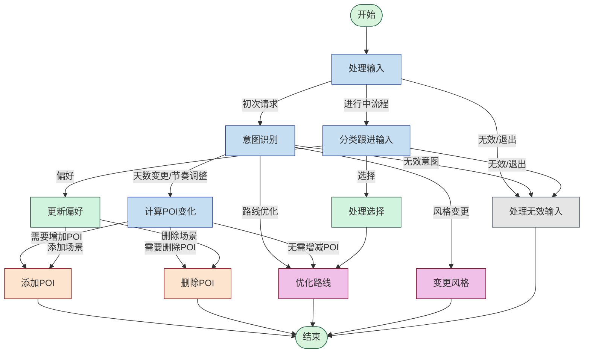

# 旅行规划中的路线优化理论与实现

## 1. 旅行规划问题的理论基础

旅行规划问题本质上是一类复杂的组合优化问题，涉及多个子问题：POI选择问题、POI分配问题以及路线优化问题。理解这些问题的理论基础有助于设计更高效的算法。

### 1.1 问题定义

在旅行规划问题中，我们通常面临以下几个核心子问题：

**1. POI选择问题**：从候选POI集合中选择一个子集，使得总体效用最大化。
- 形式化定义：给定一组POI集合 $P = \{p_1, p_2, ..., p_n\}$，每个POI $p_i$ 具有效用值 $u_i$，选择子集 $S \subseteq P$ 使得 $\sum_{p_i \in S} u_i$ 最大化，同时满足各种约束条件。

**2. POI分配问题**：将选定的POI集合分配到多天的行程中。
- 形式化定义：给定POI集合 $S = \{p_1, p_2, ..., p_m\}$ 和天数 $D$，找到一个划分 $S_1, S_2, ..., S_D$，使得 $\cup_{i=1}^D S_i = S$ 且 $S_i \cap S_j = \emptyset$ （$i \neq j$），同时优化某些目标函数（如每天内POI间的距离最小化）。

**3. 路线优化问题**：确定每天内访问POI的最佳顺序。
- 形式化定义：对于每天的POI集合 $S_i$，找到一个访问顺序 $\pi_i$，使得总行程距离 $\sum_{j=1}^{|S_i|-1} dist(\pi_i(j), \pi_i(j+1))$ 最小化。

### 1.2 相关的经典问题

旅行规划问题与多个经典的计算机科学问题密切相关：

**1. 背包问题(Knapsack Problem)**：
- POI选择问题可以看作是背包问题的变种，其中每个POI具有"价值"（效用）和"重量"（所需时间），我们需要在时间预算的约束下最大化总效用。
- 在旅行规划中，我们通常采用0-1背包的思路，即每个POI要么完全选择，要么完全不选。

**2. 旅行商问题(Traveling Salesman Problem, TSP)**：
- 单日内的路线优化问题本质上是TSP问题，即寻找访问所有节点恰好一次并返回起点的最短路径。
- TSP是一个NP-困难问题，对于大规模实例通常采用启发式或近似算法求解。

**3. 多约束分配问题**：
- POI分配到多天的问题可以视为一种多约束分配问题，需要考虑时间约束、地理位置约束等。
- 这类问题通常使用聚类算法或启发式方法求解。

## 2. 主流旅行规划算法

在旅行规划领域，已有多种算法被应用于解决上述问题。以下是一些主流方法：

### 2.1 POI选择算法

**1. 基于效用的贪心算法**：
- 根据POI的效用值（可能由多个因素综合而成）对POI进行排序，从高到低选择，直到满足约束条件。
- 优点：实现简单，计算效率高；缺点：可能得到次优解。

**2. 动态规划算法**：
- 适用于经典的0-1背包问题，可以得到最优解。
- 当约束条件单一（如总时间限制）时效果最佳。

**3. 基于MCKP（多约束背包问题）的算法**：
- 当考虑多种约束时（如时间、预算、兴趣多样性等），可以使用MCKP模型。
- 通常需要使用线性规划松弛或拉格朗日松弛等技术求解。

**4. 个性化推荐方法**：
- 结合用户历史偏好和上下文信息，使用协同过滤、矩阵分解或深度学习方法计算个性化效用值。
- 在我们的实现中，使用LLM辅助计算POI与用户偏好的匹配度。

### 2.2 POI分配算法

**1. 基于聚类的方法**：
- 使用K-means等聚类算法，基于地理位置将POI分组到不同天。
- 优点：直观且符合自然出行逻辑，减少不必要的来回奔波。

**2. 基于时间窗口的分配**：
- 考虑每个POI的最佳访问时间窗口（如某些景点早上更适合游览），进行约束满足问题求解。

**3. 分层分配方法**：
- 先基于"必访"程度将POI划分为必访和可选，保证每天都有高质量POI，再进行细粒度分配。

**4. 基于图划分的算法**：
- 将POI构建为图，边权表示距离，使用图划分算法（如Kernighan-Lin算法）将图划分为子图。

### 2.3 路线优化算法

**1. 精确TSP算法**：
- 分支定界、动态规划等方法可以得到TSP问题的精确解。
- 仅适用于规模较小的问题（通常小于20个节点）。

**2. 近似TSP算法**：
- 最小生成树近似、Christofides算法等可以得到有理论保证的近似解。
- 对于中等规模问题（20-100个节点）比较适用。

**3. 启发式方法**：
- 贪心算法（如最近邻算法）、2-opt局部搜索、蚁群优化、模拟退火等。
- 对于大规模问题，往往能在可接受的时间内得到较好的解。

**4. 实时路径规划**：
- 结合实时交通信息，使用A*算法或Dijkstra算法进行路径规划。
- 适合考虑真实道路网络和交通状况的场景。

## 3. 我们的路线规划算法实现

在我们的系统中，采用了一种分层的方法来解决旅行规划问题，主要分为三个阶段：POI评分与选择、基于聚类的POI分配、以及单日内的路线优化。

### 3.1 POI评分与选择机制

我们设计了一个多维度的效用评分系统，考虑以下三个关键因素：

**1. 用户偏好匹配度(Preference Match)**：
```python
def evaluate_preference_match(poi_intro, prefer_tags, llm_client=None):
    # 如果没有偏好标签，返回中等匹配度
    if not prefer_tags or len(prefer_tags) == 0:
        return 0.5
    
    # 简单匹配：检查POI类型是否包含任何偏好标签
    poi_intro_lower = str(poi_intro).lower() if poi_intro else ""
    for tag in prefer_tags:
        if tag and str(tag).lower() in poi_intro_lower:
            return 1.0  # 完全匹配
    
    # 如果有LLM客户端，使用LLM进行匹配度评估
    if llm_client and poi_intro:
        try:
            prompt = f"""
            请评估景点"{poi_intro}"与用户偏好标签{prefer_tags}的匹配程度。
            返回一个0到1之间的分数，1表示完全匹配，0表示完全不匹配。
            只需返回一个数字，不要有任何其他文字。
            """
            response = llm_client.predict(prompt).strip()
            try:
                score = float(response)
                return max(0, min(1, score))  # 确保结果在0-1之间
            except ValueError:
                print(f"LLM返回的匹配度无法转换为浮点数: {response}")
        except Exception as e:
            print(f"使用LLM评估匹配度时出错: {e}")
    
    # 默认中等匹配度
    return 0.5
```

**2. 位置兼容性(Location Compatibility)**：
```python
def batch_calculate_compatibility(pois, existing_pois, max_distance=10000):
    # 计算每个候选POI到所有现有POI的平均距离，并将其归一化为兼容性得分
    # 距离越近，兼容性越高
    compatibility_scores = []
    
    # 提取所有现有POI的坐标
    existing_coords = []
    for poi in existing_pois:
        if poi.get("coordinates"):
            existing_coords.append(poi["coordinates"])
    
    if not existing_coords:
        # 如果没有现有POI，所有候选POI的兼容性都是中等
        return [0.5] * len(pois)
    
    # 批量计算距离并转换为兼容性得分
    # ... (具体实现略)
    
    return compatibility_scores
```

**3. 景点评分(Rating Score)**：
```python
def calculate_rating_score(poi):
    rating_score = 0.5  # 默认中等评分
    try:
        if isinstance(poi.get("rating"), (int, float)):
            rating = float(poi["rating"])
            rating_score = normalize_score(rating, 1, 5)  # 假设评分范围为1-5
        elif isinstance(poi.get("rating"), str) and poi["rating"] != "无评分":
            try:
                rating = float(poi["rating"])
                rating_score = normalize_score(rating, 1, 5)
            except ValueError:
                pass  # 使用默认评分
    except (ValueError, TypeError):
        pass  # 使用默认评分
    
    return rating_score
```

**综合效用计算**：
```python
def calculate_utility_score(poi, prefer_tags=None, weights=None, llm_client=None, compatibility_scores=None, poi_index=None):
    if weights is None:
        weights = [0.5, 0.3, 0.2]  # 默认权重
    
    # 1. 偏好匹配度
    preference_match = evaluate_preference_match(
        poi.get("name","")+poi.get("type", ""), 
        prefer_tags, 
        llm_client
    )
    
    # 2. 位置兼容性
    location_compatibility = compatibility_scores[poi_index]
    
    # 3. 评分得分
    rating_score = calculate_rating_score(poi)
    
    # 计算加权得分
    utility_score = (
        weights[0] * preference_match + 
        weights[1] * location_compatibility + 
        weights[2] * rating_score
    )
    
    return utility_score, {
        "preference_match": preference_match,
        "location_compatibility": location_compatibility,
        "rating_score": rating_score,
    }
```

在POI选择阶段，我们根据以上效用分数排序POI，并根据用户需求（如增加或减少景点数量）选择或剔除适当数量的POI。对于添加景点，选择效用分数最高的；对于删除景点，则剔除效用分数最低的。

### 3.2 基于K-Means的POI聚类分配

为了解决POI分配问题，我们使用了K-Means聚类算法，基于地理位置将POI分组到不同的日程中，并通过后处理确保每天的POI数量符合要求：

```python
def cluster_pois_kmeans(pois: List[Dict], n_clusters: int, pois_per_day: float = None) -> List[List[Dict]]:
    """
    使用KMeans对POI进行聚类，并限制每天POI数量
    
    Args:
        pois: POI列表，每个POI包含coordinates键
        n_clusters: 聚类数量（天数）
        pois_per_day: 每天POI数量限制
        
    Returns:
        List[List[Dict]]: 聚类后的POI分组列表
    """
    if not pois:
        return [[] for _ in range(n_clusters)]
    
    # 提取坐标
    coordinates = []
    valid_pois = []
    for poi in pois:
        if poi.get("coordinates"):
            coordinates.append(poi["coordinates"])
            valid_pois.append(poi)
    
    if not coordinates:
        return [[] for _ in range(n_clusters)]
   
    total_pois = len(valid_pois)
    
    # 计算每天实际的POI数量上限
    if pois_per_day is None:
        pois_per_day = math.ceil(total_pois / n_clusters)
    else:
        pois_per_day = float(pois_per_day)  # 确保是浮点数，支持小数值
    
    daily_limit = math.ceil(pois_per_day)
    
    # 转换为numpy数组
    X = np.array(coordinates)
    
    # KMeans聚类
    kmeans = KMeans(n_clusters=n_clusters, random_state=42)
    labels = kmeans.fit_predict(X)
    cluster_centers = kmeans.cluster_centers_
    
    # 计算每个POI到所有聚类中心的距离
    poi_distances = []
    for i, poi_coord in enumerate(coordinates):
        distances = []
        for center in cluster_centers:
            dist = np.sqrt(np.sum((np.array(poi_coord) - center) ** 2))
            distances.append(dist)
        poi_distances.append((i, distances))
    
    # 按照到最近聚类中心的距离排序POI
    poi_distances.sort(key=lambda x: min(x[1]))
    
    # 初始化每天的POI列表
    daily_pois = [[] for _ in range(n_clusters)]
    daily_counts = [0 for _ in range(n_clusters)]
    
    # 分配POI到各天
    for poi_idx, distances in poi_distances:
        # 找出距离最近的聚类（天）
        closest_clusters = sorted(range(n_clusters), key=lambda i: distances[i])
        
        # 尝试分配到最近的聚类，如果已满则尝试次近的
        assigned = False
        for cluster_idx in closest_clusters:
            if daily_counts[cluster_idx] < daily_limit:
                daily_pois[cluster_idx].append(valid_pois[poi_idx])
                daily_counts[cluster_idx] += 1
                assigned = True
                break
        
        # 如果所有聚类都已达到上限，则分配到拥有POI最少的一天
        if not assigned:
            min_count_idx = daily_counts.index(min(daily_counts))
            daily_pois[min_count_idx].append(valid_pois[poi_idx])
            daily_counts[min_count_idx] += 1
    
    return daily_pois
```

这种聚类方法的核心思想是：
1. 使用K-Means算法将所有POI基于地理位置分成K个聚类，其中K等于行程天数
2. 计算每个POI到所有聚类中心的距离
3. 按照POI到最近聚类中心的距离排序
4. 依次分配POI到最近的聚类，如果该聚类已达到上限，则尝试次近的聚类
5. 确保每个聚类（每天）的POI数量不超过上限

这种方法既考虑了地理位置的聚集性（减少跨区域移动），又保证了每天的负载均衡（避免某天POI过多或过少）。

### 3.3 近似TSP单日路线优化

对于每天内的路线优化，我们采用了贪心算法解决TSP问题：

```python
def optimize_daily_route(pois: List[Dict]) -> List[Dict]:
    """
    使用TSP优化单天的POI访问顺序
    
    Args:
        pois: 单天的POI列表
        
    Returns:
        List[Dict]: 优化顺序后的POI列表
    """
    if len(pois) <= 1:
        return pois
    
    n = len(pois)
    # 构建距离矩阵
    distance_matrix = np.zeros((n, n))
    
    # 利用batch_calculate_distances减少API调用次数
    for i in range(n):
        # 当前POI作为终点
        destination_poi = pois[i]["coordinates"]
        
        # 收集除了当前POI外的所有其他POI坐标作为起点
        origin_coords = []
        origin_indices = []
        for j in range(n):
            if i != j:  # 排除自身
                origin_coords.append(pois[j]["coordinates"])
                origin_indices.append(j)
        
        if origin_coords:
            # 批量计算从其他所有POI到当前POI的距离
            batch_results = batch_calculate_distances(origin_coords, destination_poi)
            
            # 填充距离矩阵
            for idx, result in enumerate(batch_results):
                if idx < len(origin_indices):
                    j = origin_indices[idx]
                    dist = int(result.get("distance", 0))
                    distance_matrix[j][i] = dist  # 注意：这里是从j到i的距离
    
    # 贪心算法求解TSP
    current = 0  # 从第一个POI开始
    unvisited = set(range(1, n))
    path = [current]
    
    while unvisited:
        next_point = min(unvisited, key=lambda x: distance_matrix[current][x])
        path.append(next_point)
        unvisited.remove(next_point)
        current = next_point
    
    # 按照优化后的顺序重排POI
    optimized_pois = [pois[i] for i in path]
    return optimized_pois
```

该算法的核心思想是：
1. 构建完整的景点间距离矩阵（使用高德API获取真实路径距离）
2. 从第一个POI开始，每次选择距离当前点最近的未访问点
3. 生成近似最优的游览顺序

这种贪心方法虽然不保证全局最优解，但计算效率高且结果通常接近最优，特别适合每天景点数量不多的情况（通常5-10个景点）。对于景点较多的日程，可以考虑使用更复杂的算法如2-opt局部搜索或模拟退火来进一步优化。

## 4. 高级路线规划技术与未来改进方向

### 4.1 时间窗口约束的路线规划

在实际旅行中，许多POI都有开放时间限制，一些研究已经将TSP扩展为带时间窗口的TSP（TSPTW）：

**实现思路**：
1. 为每个POI添加开放时间和关闭时间属性
2. 修改距离矩阵，增加时间维度，考虑到达时间是否在开放时间内
3. 使用动态规划或约束满足编程（CSP）求解

这将确保生成的路线既考虑了移动距离，又考虑了各景点的时间约束。

### 4.2 考虑实时交通的路线规划

目前的实现主要基于静态距离数据，但实际出行受交通状况影响很大：

**改进方向**：
1. 集成实时交通API，获取不同时段的预期交通状况
2. 使用时变边权图模型，反映一天中不同时段的交通情况
3. 应用A*算法或Dijkstra算法进行实时路径规划

### 4.3 基于强化学习的路线优化

对于大规模路线规划问题，强化学习提供了一种有前景的方法：

**实现思路**：
1. 将路线规划问题建模为马尔可夫决策过程（MDP）
2. 使用Q-learning或Deep Q-Network（DQN）学习最优策略
3. 考虑多种约束条件作为奖励函数的一部分

### 4.4 个性化路线推荐

未来可以引入更复杂的个性化机制：

**改进方向**：
1. 学习用户的移动模式和偏好（如步行距离偏好、参观时长等）
2. 结合协同过滤，利用相似用户的行为数据
3. 使用上下文感知推荐系统，考虑天气、季节、人流量等因素

## 3.4 行程整体修改功能的具体实现

行程整体修改是我们系统中一个核心功能，它允许用户通过自然语言指令调整整个行程的结构和内容。本节详细解析这一功能的实现细节，重点关注POI推荐与选择机制以及路线优化算法的具体步骤。

### 3.4.1 用户意图提取与解析

首先，系统需要准确理解用户的调整需求。我们使用LLM进行意图提取：

```python
def extract_intent_from_user_input(user_input: str, trip_json: dict, app_context: AppContext) -> dict:
```

该函数接收用户输入文本、当前行程数据和应用上下文，通过以下步骤进行处理：

1. **计算当前行程基础数据**：首先分析现有行程，获取原计划天数和每日平均景点数
   ```python
   base_days = trip_json["metadata"]["total_days"]
   daily_pois = get_total_attractions(trip_json) / base_days
   ```

2. **使用LLM提取意图**：构造提示词模板，引导LLM将用户自然语言请求转换为结构化调整指令
   ```python
   intent_prompt = PromptTemplate.from_template("""
   # 角色：智能行程调整解析专家
   ## 背景知识
   当前行程基础数据：
   - 原计划天数：{base_days} 天
   - 原每日平均景点数：{daily_pois} 个/天

   ## 任务
   将用户自然语言请求转换为结构化调整指令...
   """)
   ```

3. **解析结构化意图**：LLM返回的是一个JSON格式的结构化意图，包含以下关键字段：
   - `adjust_type`: 调整类型（"change_days"/"adjust_pace"/"change_style"/"optimize_route"）
   - `target_days`: 目标天数（当需要改变天数时）
   - `daily_limit`: 每日景点上限（当需要调整节奏时）
   - `style_replace`: 风格替换信息（如 {"历史": ["文化", "艺术"]}）
   - `prefer_tags`: 用户偏好标签列表

这种基于LLM的意图解析方式使系统能够理解复杂的自然语言指令，如"把行程延长到5天"、"每天安排少一点景点"或"我想减少历史景点，增加自然景点"等。

### 3.4.2 POI变化计算与景点调整

根据解析出的用户意图，系统决定是否需要添加或删除景点：

```python
def calculate_poi_change(existing_pois, current_days, target_days, max_per_day):
    expected_total = target_days * max_per_day
    diff = expected_total - len(existing_pois)
    return diff
```

这个函数计算理想情况下应该有的景点总数与当前实际景点数的差值：
- 正值表示需要添加景点
- 负值表示需要删除景点
- 零值表示仅需重新分配不需增减

例如，如果用户将3天行程（每天3个景点）改为4天，而当前总共有9个景点，那么：
- 目标总数 = 4天 × 3个/天 = 12个景点
- 差值 = 12 - 9 = 3，表示需要添加3个新景点

### 3.4.3 POI推荐与选择的详细实现

#### 1. 搜索周边景点

当需要添加新景点时，我们使用高德地图API搜索周边景点：

```python
def search_pois_by_center(center_poi, radius=4, limit=20):
```

该函数接收一个中心坐标、搜索半径和返回数量限制，调用高德地图的周边搜索API查询景点信息。实现细节：

1. **构造API请求参数**：将中心POI的经纬度转换为高德API需要的格式（"经度,纬度"）
   ```python
   location = f"{center_poi[1]},{center_poi[0]}"
   ```

2. **设置搜索条件**：指定搜索半径（转换为米），景点类型代码，以及需要的其他参数
   ```python
   params = {
       "key": "d477f25785fee6455f468f4702ff7bd5",
       "location": location,
       "radius": radius * 1000,  # 转换为米
       "keywords": "景点",
       "types": "110000",  # 景点类型代码
       "offset": limit,  # 每页记录数
       "page": 1,
       "extensions": "all",
       "show_fields": "business"
   }
   ```

3. **处理返回结果**：从API响应中提取有用的POI信息，包括ID、名称、评分、坐标等
   ```python
   poi_info = {
       "poi_id": poi.get('id'),
       "name": poi.get('name'),
       "type": poi_type,
       "rating": rating,
       "coordinates": coordinates,
       "address": poi.get('address', '无地址'),
       "distance": poi.get('distance', '未知'),
       "tel": biz_ext.get('tel', '无电话'),
       "opentime_week": biz_ext.get('opentime_week', '无营业时间'),
   }
   ```

4. **处理API请求限制**：添加适当的请求延迟，避免触发API的QPS限制
   ```python
   time.sleep(1.0)  # 每次搜索景点后等待1秒
   ```

#### 2. 构建距离矩阵

为了评估POI之间的地理兼容性，我们需要计算POI之间的实际距离：

```python
def calculate_distances_to_pois(target_poi, existing_pois):
```

该函数计算目标POI到已有POI列表中各个景点的距离。实现过程：

1. **筛选有效POI**：确保所有POI都有有效的坐标信息
   ```python
   valid_pois = []
   for poi in existing_pois:
       if poi.get("coordinates"):
           valid_pois.append(poi)
   ```

2. **单个请求与批量请求的选择**：根据POI数量选择不同的请求策略
   ```python
   if len(valid_pois) <= 1:
       # 使用单个请求
       for poi in valid_pois:
           distance_info = calculate_distance(target_coordinates, poi["coordinates"])
   else:
       # 使用批量请求
       origin_coords = [poi["coordinates"] for poi in valid_pois]
       batch_results = batch_calculate_distances(origin_coords, target_coordinates)
   ```

3. **批量计算距离**：使用高德地图的批量距离计算API，一次请求获取多个距离
   ```python
   def batch_calculate_distances(origin_pois, destination_poi, type=1, batch_size=50):
   ```
   
   关键实现细节：
   - 将坐标转换为高德API需要的格式（"经度,纬度"，用"|"分隔多个坐标）
   - 按批次处理，每批最多50个起点，降低请求失败风险
   - 添加错误重试逻辑，使用指数退避策略（exponential backoff）
   - 每次批量请求后添加足够的延迟，避免触发API限制

4. **结果处理与排序**：将距离信息与POI信息组合，并按距离升序排序
   ```python
   results.sort(key=lambda x: x["distance"])
   ```

#### 3. POI效用评分系统

我们设计了一个多维度的效用评分系统，用于POI选择和排序：

```python
def calculate_utility_score(poi, prefer_tags=None, weights=None, llm_client=None, compatibility_scores=None, poi_index=None):
```

该函数综合考虑三个因素，计算POI的综合效用：

1. **偏好匹配度计算**：评估POI与用户偏好标签的匹配程度

   ```python
   preference_match = evaluate_preference_match(poi.get("name","")+poi.get("type", ""), prefer_tags, llm_client)
   ```
   
   具体实现有三个层次：
   - 简单文本匹配：检查POI名称和类型是否包含用户偏好标签
   - LLM评估（可选）：使用LLM进行更深层次的语义匹配
   - 默认值回退：当无法确定时使用中等匹配度（0.5）

2. **位置兼容性计算**：评估POI与现有行程中其他POI的地理兼容性

   ```python
   def batch_calculate_compatibility(pois, existing_pois, max_distance=10000):
   ```
   
   该函数计算每个候选POI到所有现有POI的平均距离，并将其归一化为兼容性得分：
   - 首先提取所有POI的坐标信息
   - 使用批量距离计算API获取距离数据
   - 计算每个候选POI到所有现有POI的平均距离
   - 将平均距离归一化到0-1区间，距离越近，得分越高

   核心归一化逻辑：
   ```python
   if max_avg == min_avg:
       normalized = 1.0  # 所有距离相同的情况
   else:
       normalized = (max_avg - d) / (max_avg - min_avg)
   ```

3. **景点评分转换**：将原始评分数据归一化处理

   ```python
   rating_score = calculate_rating_score(poi)
   ```
   
   该函数处理不同格式的评分数据，将其统一归一化到0-1区间：
   - 处理数值型评分
   - 处理字符串格式的评分（转换为浮点数）
   - 处理缺失评分（使用默认中等评分0.5）

4. **加权计算最终效用分数**：

   ```python
   utility_score = (
       weights[0] * preference_match + 
       weights[1] * location_compatibility + 
       weights[2] * rating_score
   )
   ```
   
   默认权重为[0.5, 0.3, 0.2]，分别对应偏好匹配、位置兼容性和评分。此权重可根据实际场景调整。

#### 4. POI选择与排序

基于上述效用评分系统，我们实现了POI排序与选择功能：

```python
def rank_pois_by_utility(pois, existing_pois, prefer_tags=None, weights=None, llm_client=None, is_reversed=False, exclude_self=False):
```

这个函数根据POI的效用评分进行排序，主要实现：

1. **预计算位置兼容性**：批量计算所有POI的地理兼容性得分
   ```python
   compatibility_scores = batch_calculate_compatibility(pois, existing_pois)
   ```

2. **计算每个POI的效用评分**：
   ```python
   for i, poi in enumerate(pois):
       utility_score, score_details = calculate_utility_score(
           poi, prefer_tags, weights, llm_client,
           compatibility_scores, i
       )
       
       # 添加评分到POI字典
       poi_with_score = poi.copy()
       poi_with_score["utility_score"] = utility_score
       poi_with_score["score_details"] = score_details
       
       ranked_pois.append(poi_with_score)
   ```

3. **排序POI**：根据场景需要选择排序方向
   ```python
   # 按效用评分排序：默认降序（最高分在前），删除场景用升序（最低分在前）
   ranked_pois.sort(key=lambda x: x["utility_score"], reverse=not is_reversed)
   ```

4. **特殊处理删除场景**：当需要从现有行程中删除POI时，计算方式略有不同
   ```python
   if exclude_self and pois == existing_pois:
       # 计算所有POI的平均距离
       avg_distances = calculate_all_pois_avg_distances(pois)
       # 归一化平均距离
       compatibility_scores = normalize_distances_to_scores(avg_distances)
       # ... 计算每个POI的效用分数，排序等
   ```

5. **生成推荐理由**：为每个POI生成个性化的推荐或删除理由
   ```python
   def generate_recommendation_reason(poi_intro, score_details, prefer_tags, llm_client=None, is_removal=False):
   ```
   
   该函数使用LLM生成简短理由，解释为什么推荐或建议删除某个POI：
   - 对于推荐理由：强调POI的优势，如与用户偏好匹配、地理位置优越、评分高等
   - 对于删除理由：解释删除的原因，如评分较低、位置偏远、不符合用户偏好等

### 3.4.4 多天行程的POI分配与聚类

当确定了要保留的POI集合后，我们需要将它们分配到多天的行程中。为此，我们使用K-Means聚类算法基于地理位置进行分组：

```python
def cluster_pois_kmeans(pois: List[Dict], n_clusters: int, pois_per_day: float = None) -> List[List[Dict]]:
```

该函数实现了基于地理位置的POI聚类，并确保每天分配的POI数量不超过限制。实现细节：

1. **提取有效坐标**：筛选出具有有效坐标信息的POI
   ```python
   coordinates = []
   valid_pois = []
   for poi in pois:
       if poi.get("coordinates"):
           coordinates.append(poi["coordinates"])
           valid_pois.append(poi)
   ```

2. **计算每天POI数量上限**：
   ```python
   if pois_per_day is None:
       pois_per_day = math.ceil(total_pois / n_clusters)
   else:
       pois_per_day = float(pois_per_day)  # 确保是浮点数，支持小数值
   
   daily_limit = math.ceil(pois_per_day)
   ```

3. **执行K-Means聚类**：
   ```python
   X = np.array(coordinates)
   kmeans = KMeans(n_clusters=n_clusters, random_state=42)
   labels = kmeans.fit_predict(X)
   cluster_centers = kmeans.cluster_centers_
   ```

4. **计算POI到聚类中心的距离**：
   ```python
   poi_distances = []
   for i, poi_coord in enumerate(coordinates):
       distances = []
       for center in cluster_centers:
           dist = np.sqrt(np.sum((np.array(poi_coord) - center) ** 2))
           distances.append(dist)
       poi_distances.append((i, distances))
   ```

5. **基于距离排序POI**：按到最近聚类中心的距离排序所有POI
   ```python
   poi_distances.sort(key=lambda x: min(x[1]))
   ```

6. **贪婪分配POI到各天**：
   ```python
   for poi_idx, distances in poi_distances:
       # 找出距离最近的聚类（天）
       closest_clusters = sorted(range(n_clusters), key=lambda i: distances[i])
       
       # 尝试分配到最近的聚类，如果已满则尝试次近的
       assigned = False
       for cluster_idx in closest_clusters:
           if daily_counts[cluster_idx] < daily_limit:
               daily_pois[cluster_idx].append(valid_pois[poi_idx])
               daily_counts[cluster_idx] += 1
               assigned = True
               break
       
       # 如果所有聚类都已达到上限，则分配到拥有POI最少的一天
       if not assigned:
           min_count_idx = daily_counts.index(min(daily_counts))
           daily_pois[min_count_idx].append(valid_pois[poi_idx])
           daily_counts[min_count_idx] += 1
   ```

这种聚类方法确保了地理上相近的POI被分配到同一天，同时通过后处理保证了每天的POI数量不会超过限制，达到了地理优化和负载均衡的双重目标。

### 3.4.5 单日路线优化算法

为每一天的POI集合确定最佳的访问顺序，我们使用近似算法解决旅行商问题(TSP)：

```python
def optimize_daily_route(pois: List[Dict]) -> List[Dict]:
```

该函数通过以下步骤优化单天内POI的访问顺序：

1. **构建距离矩阵**：使用高德地图API获取POI之间的真实路径距离
   ```python
   distance_matrix = np.zeros((n, n))
   
   for i in range(n):
       # 当前POI作为终点
       destination_poi = pois[i]["coordinates"]
       
       # 收集除了当前POI外的所有其他POI坐标作为起点
       origin_coords = []
       origin_indices = []
       for j in range(n):
           if i != j:  # 排除自身
               origin_coords.append(pois[j]["coordinates"])
               origin_indices.append(j)
       
       if origin_coords:
           # 批量计算从其他所有POI到当前POI的距离
           batch_results = batch_calculate_distances(origin_coords, destination_poi)
           
           # 填充距离矩阵
           for idx, result in enumerate(batch_results):
               if idx < len(origin_indices):
                   j = origin_indices[idx]
                   dist = int(result.get("distance", 0))
                   distance_matrix[j][i] = dist  # 注意：这里是从j到i的距离
   ```

   这里采用了批量计算API来提高效率，一次性获取多个POI之间的距离。

2. **贪心算法求解TSP**：从第一个POI开始，每次选择距离当前点最近的未访问点
   ```python
   current = 0  # 从第一个POI开始
   unvisited = set(range(1, n))
   path = [current]
   
   while unvisited:
       next_point = min(unvisited, key=lambda x: distance_matrix[current][x])
       path.append(next_point)
       unvisited.remove(next_point)
       current = next_point
   ```

   这种贪心方法（也称为"最近邻算法"）虽然不保证全局最优解，但计算效率高，且在POI数量不多的情况下（通常每天5-10个景点）结果通常接近最优。

3. **重排POI列表**：根据优化后的路径重新排序POI
   ```python
   optimized_pois = [pois[i] for i in path]
   ```

值得注意的是，这种实现考虑了真实世界的约束：
- 使用实际路径距离而非直线距离
- 通过批量API请求减少网络调用
- 处理可能的API限制和错误情况

### 3.4.6 行程整体优化流程

综合上述所有组件，完整的行程整体修改流程如下：

1. **解析用户意图**：使用LLM将自然语言指令转换为结构化调整指令
2. **计算POI变化**：确定是否需要添加或删除景点
3. **POI选择**：
   - 如需添加：搜索周边景点，计算效用评分，选择评分最高的POI
   - 如需删除：计算现有POI的效用评分，建议删除评分最低的POI
4. **POI分配**：使用K-Means聚类将POI分配到多天行程
5. **路线优化**：使用近似TSP算法优化每天内POI的访问顺序
6. **生成新行程**：组装优化后的信息，生成新的行程结构

这种分层设计使系统能够处理从"将4天行程缩短为3天"到"每天不超过3个景点"等多种复杂的行程调整需求，既考虑了用户偏好和景点评分，又优化了地理位置和访问顺序，从而生成高质量的个性化旅行路线。

## 5. 总结

路线规划是旅行规划系统中至关重要的一环，它直接影响用户的旅行体验。我们的实现采用了三层结构：多维度的POI效用评分与选择、基于K-Means的POI天数分配、以及贪心算法的单日路线优化。这种设计既考虑了用户偏好，又优化了地理上的合理性，能够生成高质量的旅行路线。

未来，我们将进一步优化算法，引入时间窗口约束、实时交通数据和更复杂的个性化机制，以提供更加智能和个性化的旅行规划服务。

## 3.5 行程调整子流程的设计思路与工作流程

### 3.5.1 子流程设计思路

行程调整子流程是整个系统中最复杂的子模块之一，需要处理从"将行程天数调整为不同天数"到"优化路线安排"等多种用户需求。在设计这个子流程时，我们采用了基于LangGraph的状态图（StateGraph）模式，将复杂任务拆分为一系列职责明确的节点，并通过条件边连接它们。这种设计思路主要基于以下几个关键考量：

**1. 模块化与职责分离**：
每个节点专注于完成一个特定任务，比如意图识别、POI变化计算、添加POI、删除POI等。这种模块化设计使得每个功能点都可以独立开发、测试和优化，同时提高了代码的可维护性和可扩展性。例如，如果未来需要改进POI推荐算法，只需修改`add_poi_node`节点，而不会影响整体流程。

**2. 状态驱动的流程控制**：
使用`TripState`类型的状态对象来存储和传递整个流程中的信息，如用户输入、推荐列表、选择结果等。这种状态驱动的方式使得节点之间可以高效地共享信息，而不必重复计算或查询。例如，当用户选择了某些推荐景点后，这些选择会保存在状态中，供后续的优化节点使用。

**3. 条件路由与灵活跳转**：
基于状态内容的条件路由机制使得流程可以根据不同场景灵活地在节点间跳转。例如：
- 当识别出"change_days"意图时，先计算POI变化数量，然后根据需要增加还是减少POI跳转到不同节点
- 当用户对推荐结果做出反馈时，根据反馈类型（选择、新偏好、退出）跳转到不同的处理节点

**4. 多轮交互支持**：
设计中特别考虑了与用户的多轮交互，通过`on_progress`状态标志来追踪流程是处于初始阶段还是后续交互阶段。这使得系统能够连贯地处理用户在景点推荐、删除建议等环节的后续输入和选择，提供更自然的对话体验。

**5. 错误处理与优雅降级**：
每个节点都考虑了可能的异常情况，比如API调用失败、数据缺失等，并提供了合理的错误处理机制和用户友好的错误消息。此外，还设计了`invalid_node`来处理无法理解的用户请求，确保系统即使在异常情况下也能保持稳定运行。

### 3.5.2 节点设计与功能职责

行程调整子流程包含多个功能节点，每个节点承担特定的职责：

**1. 入口与路由节点 (process_input, routing_function)**：
- `process_input`：验证用户输入的有效性，并初始化状态
- `routing_function`：根据当前状态（是否有进行中的推荐流程、用户是否要求退出等）决定下一步应该进入哪个节点

**2. 意图理解节点 (intent_recognition_function)**：
- 使用LLM解析用户的自然语言请求
- 提取核心意图（天数变更、节奏调整、风格变更、路线优化）
- 识别关键参数（目标天数、每日景点限制、风格替换、偏好标签等）

**3. 计算与分析节点 (calculate_poi_change_node)**：
- 分析当前行程状态（天数、景点分布）
- 根据用户意图计算需要增减的景点数量
- 为后续操作提供决策依据（增加、删除还是仅优化）

**4. POI操作节点 (add_poi_node, remove_poi_node)**：
- `add_poi_node`：搜索、评分并推荐新景点
- `remove_poi_node`：评估现有景点，推荐删除效用最低的景点
- 两者都生成个性化推荐理由，并等待用户选择

**5. 用户反馈处理节点 (classify_followup_node, handle_selection_node, update_preferences_node)**：
- `classify_followup_node`：分析用户的后续输入，判断是选择、提供新偏好还是退出
- `handle_selection_node`：解析用户选择的具体景点，更新POI列表
- `update_preferences_node`：提取用户表达的新偏好，用于重新推荐

**6. 优化执行节点 (optimize_route_node, change_style_node)**：
- `optimize_route_node`：使用聚类和TSP算法优化景点分配和访问顺序
- `change_style_node`：执行风格替换操作

**7. 异常处理节点 (invalid_node)**：
- 处理无法识别的请求或流程中断的情况
- 提供友好的错误提示和后续操作建议

### 3.5.3 状态流转与条件路由

节点之间的连接和条件路由是子流程设计的核心。主要的状态流转路径包括：

1. **初始请求处理路径**：
   ```
   process_input → intent_recognition → calculate_poi_change → add_poi/remove_poi/optimize_route
   ```

2. **用户选择路径**：
   ```
   process_input → classify_followup → handle_selection → optimize_route
   ```

3. **用户偏好更新路径**：
   ```
   process_input → classify_followup → update_preferences → add_poi/remove_poi
   ```

条件路由主要基于以下几个状态变量：
- `flow_state.on_progress`：标识是否有进行中的推荐流程
- `flow_state.adjustment_type`：用户的意图类型
- `flow_state.poi_change`：需要增减的POI数量
- `flow_state.followup_action`：用户后续输入的分类
- `flow_state.action_type`：当前执行的操作类型（添加或删除）

### 3.5.4 行程调整子流程工作流程图



### 3.5.5 子流程的实际运行示例

为了更好地理解行程调整子流程的工作方式，以下是一个典型场景的运行示例：

**场景：用户请求将4天行程缩短为3天**

1. **用户输入**：
   ```
   "把行程从4天缩短为3天"
   ```

2. **process_input节点**：
   - 验证输入有效性
   - 设置`should_continue = True`

3. **routing_function**：
   - 检查`on_progress`为False
   - 路由到`intent_recognition`

4. **intent_recognition_function**：
   - 使用LLM提取意图
   - 识别为`adjustment_type = "change_days"`
   - 设置`target_days = 3`（从原来的4天）

5. **calculate_poi_change_node**：
   - 获取当前行程有12个POI
   - 计算目标天数3天、每天4个POI的情况下，总共需要12个POI
   - 得到`poi_change = 0`（无需增减POI，仅需重新分配）

6. **optimize_route_node**：
   - 使用K-Means聚类将12个POI重新分配到3天
   - 为每天的POI使用近似TSP算法优化访问顺序
   - 生成优化后的行程数据和响应

7. **结束流程**：
   - 返回优化后的行程给用户
   - 设置`on_progress = False`表示流程结束

这个示例展示了系统如何通过多个专业节点的协作，将复杂的行程调整任务分解为清晰的步骤，并根据不同情况动态决定执行路径。

### 3.5.6 设计优势与创新点

行程调整子流程的设计具有以下几个优势和创新点：

**1. 高度智能化的意图理解**：
使用LLM解析复杂的自然语言指令，能够处理各种模糊和隐含的用户需求，如"行程太紧了，放松一点"、"把行程压缩一天"、"我更喜欢历史类景点"等。

**2. 动态多轮推荐机制**：
不同于静态的一次性推荐，系统支持基于用户反馈的动态多轮推荐，用户可以在初步推荐后进一步表达偏好、筛选或拒绝，系统能够持续优化推荐结果。

**3. 综合优化算法**：
结合了多种算法来解决行程规划的不同方面：效用评分系统用于景点选择，K-Means聚类用于天数分配，TSP近似算法用于单日路线优化，这种组合方法能够在景点选择与路线优化之间取得平衡。

**4. 状态连贯性保证**：
通过精心设计的状态管理，确保在多轮对话过程中保持上下文连贯，系统"记得"先前的推荐、用户选择和偏好，避免重复询问或前后矛盾。

**5. 优雅的降级策略**：
针对各种异常情况（如API失败、数据缺失、用户意图不明确等）设计了合理的降级策略，确保系统即使在不理想条件下也能提供有用的响应，而不是完全失败。

这种设计不仅提高了系统的功能完备性和用户体验，也增强了系统的鲁棒性和可维护性，为进一步扩展和优化提供了良好的基础架构。 